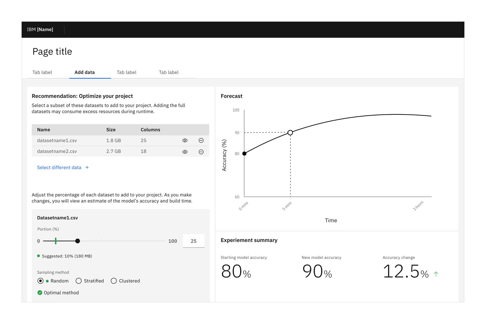

<PageDescription>

Helping users understand and trust artificial intelligence in order to do better work together.

</PageDescription>

<AnchorLinks>
   <AnchorLink>Overview</AnchorLink>
   <AnchorLink>Roadmap</AnchorLink>
   <AnchorLink>When to use</AnchorLink>
   <AnchorLink>When not to use</AnchorLink>
   <AnchorLink>General vs. specific explainability</AnchorLink>
   <AnchorLink>Limitations of the data</AnchorLink>
   <AnchorLink>Maximum confidence</AnchorLink>
   <AnchorLink>Empty states and low confidence</AnchorLink>
   <AnchorLink>Maximum confidence</AnchorLink>
   <AnchorLink>Mixed and weighted confidence</AnchorLink>
   <AnchorLink>Trade-offs</AnchorLink>
   <AnchorLink>User comparisons</AnchorLink>
   <AnchorLink>Rejected hypotheses and cognitive ranking</AnchorLink>
</AnchorLinks>

## Overview

Our philosophy at IBM is that artificial intelligence is an innovation that can improve outcomes and processes by augmenting human decision-making. However for this to prove true, it's crucial we design explainability into our AI features. 

At its core, AI explainability is about helping humans understand how artificial intelligence came to a particular conclusion. This is important because:  

1. With the assistance of AI tools, our users may need to make decisions that have far-reaching consequences. We want to help them make the best decisions possible. 
2. Broad adoption of AI can only happen if end users trust the technology enough to use it.
3. We have ethical and regulatory responsibilities to ensure we are transparent about how our AI technology works, and the way in which data is used. 

Good explainability means users can clearly understand what the AI is doing and why. This includes: providing clear explanations of how the AI works; how an insight was determined; the data in use; and the IBM data, security, privacy and ethical policies it embodies. 

## Roadmap

AI explainability is a complex topic and cracking open the black box of AI to surface the contents to users in a product interface is no simple task. There are several reasons for this. Firstly, end users may not have the subject matter expertise or desire to interpret all the evidence we present to them. Secondly, this is a new and evolving domain which means many design patterns are experimental in nature. And finally, the technical foundations and tools needed to extract explainability are still being fine-tuned by AI experts. As the AI interpretability technology matures, so too will our AI explainability design patterns. 

#### Levels of maturity

Consider the case of self-driving vehicles which have various “levels” to describe the degree of autonomy the car has. At level 1, the car takes over in very specific situations such as adaptive cruise control, while at level 5 the car is fully autonomous with no driver input needed. Level 5 is the vision for the future — but most automakers are still working to get there.  Similarly, these AI explainability patterns are at level 1 with higher level patterns to come in the future.  

Level 1 AI explainability means letting our users know the product or feature is using AI, and providing confidence and reasoning behind the suggestions. It is aimed at end users with a beginner to intermediate level end understanding of AI. Higher levels of AI explainability will cater to expert end users who wish to dig deep into the data and models driving the AI insights. 

#### We need you

We anticipate that product teams will run into exceptions or different use cases that these patterns don’t yet address. Using the following guidelines as a foundation, we’ll continue to adopt new patterns on a case by case basis. 

The following IBM Research tools are an excellent starting point if you need to provide a higher degree of explainability than what we are outlining here.

- [AI Fairness](https://aif360.mybluemix.net/)
- [AI Factsheets 360](https://aifs360.mybluemix.net/) 
- [AI Explainability 360](http://aix360.mybluemix.net/)

## When to use  

If an AI feature is predicting, suggesting, or recommending something that requires the user to take an action, we should provide explainability to help them make that decision. The type and robustness of the supporting evidence will vary from situation to situation. In general, the higher the stakes, the more explainability we should offer our users. Examples of high-stakes situations include: 

- A physician gets AI-based recommendations for patient treatment. 
- A data scientist sees an AI suggestion for how to tweak a machine learning model. 
- A security analyst receives a potentially catastrophic cybersecurity threat alert. 

All of these scenarios require a human end user to make decisions that could have significant consequences, including financial loss or even death. Explainability plays a critical role in mitigating risk and putting users at ease. 

## When not to use 

In certain low-stakes scenarios, you may not need to provide AI explainability, and doing so might actually detract from the user experience. For example, if a music app intelligently discovers songs for you, you generally don’t need or even want an explanation for why each and every song was selected (although you may want settings that let you optimize the recommendations). The same goes for streaming movie recommendations or e-commerce shopping suggestions. Personalization use cases like these can be a powerful way to leverage AI to surprise and delight users — drawing attention to the mechanics of it would only shatter the magic. 

Similarly at IBM, there may be instances where you are personalizing a dashboard or homepage experience for the user, or providing shortcuts to features the user frequently accesses. These types of AI features could be considered self-explanatory, and don't necessarily need to be backed with evidence. 

## General vs. specific explainability

There are two main categories of explainability:
- General: pertains to the AI feature’s overall capabilities
- Specific: pertains to a recommendation, prediction, or insight

#### General explainability

Describes an AI feature and provides an overview of how the feature works. It uses clear, simple language to describe Watson’s process, and avoids naming specific technologies unless relevant to the user’s understanding. This type of explainability might appear in Walk Me tours or in tooltips. 

#### Specific explainability

Describes why the AI is making a particular recommendation or surfacing an insight. It uses plain English to verbalize the evidence backing up the AI's claims. Aim to structure the explanation by leading with an action followed by the reason for taking that action, (e.g., "_Recommendation: join these two columns because the values are identical_"). The idea is to be as immediate as possible regarding the end value to the user of accepting the AI recommendation. This type of explainability typically appears at the top of an AI insight or recommendation. 

## Limitations of the data

Ideally, we will have a system in place to monitor and maintain the models that power AI features within our products. However, there may sometimes be issues related to the model or the data that may impact the accuracy of the output. We should always aim to flag information that may impact the user's decision to accept the AI insight. While not an exhaustive list, this could be related to the integrity, completeness, recency, and scope of the data. 

Consider the following examples: 
- How frequently is data updated? If the AI feature uses live data (e.g. weather or traffic) to make the recommendation or prediction, we should make users aware of the refresh rate since relevant data may have changed since the last update. 
- How recently was the algorithm updated? The AI may have generated a highly confident recommendation based on a model that has not been updated in many months. It’s possible the model has drifted and users should be made aware of any potential biases.
- Is any data incomplete or missing? Users need to know they are missing some pieces of the puzzle when making decisions.  

As a rule of thumb, it's best to use a **low contrast informational notification** when flagging data limitations. Although it's important to bring the issue to the user's attention, we also want to avoid breaking the visual hierarchy of the AI feature by using an alert or warning notification that would place undue emphasis on this element. 

Note: Informational notifications like the ones used in the examples above aren't limited to instances when there is a problem with the data. They may be used in other AI features when you wish to draw the user's attention to an important piece of information that may affect their decision to accept the recommendation using the default settings. See the **Trade-offs** section below for such an example. 

## Maximum confidence

As a general guideline, it's best to **avoid revealing confidence scores greater than 95%** to end users of an AI feature. AI is about probabilities - not certainties - so it's important that users are not influenced to blindly trust AI. Even though a model might generate a recommendation with 98% confidence, we suggest describing the confidence as ">95%". Downgrading the confidence score in this way is about making sure we set the right expectations with the user that there is always some degree of uncertainty and they should use their best judgement. 

A caveat: this guideline may not be applicable to all AI features, especially if the AI is generating multiple recommendations with a high degree of confidence. In such situations, consider your end user — highly technical personas may need to see the exact confidence score (and will likely have the domain expertise to understand AI's limitations). Average citizen users may need more help choosing the most relevant action, in which case it could be beneficial to rank the options, or provide further explanation. 

#### A note on confidence scores

As you will see throughout these guidelines, confidence scores can appear in multiple places within an AI insight or recommendation. This is because confidence scores can relate to the insight (how confident the system is in the actual problem or discovery) or the action (how confident the system is that taking that action will resolve the issue). 

## Empty states and low confidence

There are many AI features that routinely assist the user in performing a task, for instance, mapping data, simulating a scenario, or classifying documents. This means there will occasionally be times when the AI feature comes up empty handed or produces an output that has a very low confidence score. We never want users to hit a dead end in their workflow or lose faith in the AI feature because of poor suggestions. 

There are several ways to design for situations when an AI feature doesn't know the best possible course of action. These include: narrowing the range of options for the user to choose from; allowing the user to view metadata and take action based on their own expertise; and specifying ways the user can improve the recommendations by providing additional data or context.  

### Request additional user input

In the following example, the user expects the AI's assistance with a task but the AI feature doesn't have enough information to go on. The empty state tells the user exactly how they can improve the recommendation. In this case, they can provide the AI with additional context by specifying their intent (e.g. what they're trying to predict or what they're trying to optimize for). They also have the option of uploading additional data that the AI can use as a basis for recommending similar data. Depending on how critical the step is in the user's workflow, you may wish to provide a "primary action" and a "next best action" so users have troubleshooting options and don't hit a wall. 

### Narrow the range of options

In this example, the AI is unsure of the best answer but has identified some possibilities based on the metadata available. It is presenting a narrowed down list of options for the user to choose from. A critical element here is the explainability — the AI describes the available and missing metadata and provides a document preview so the user can take the reins and make a decision based on their own knowledge.  

## Mixed and weighted confidence

The most valuable AI uses cases tend not to be based on a single variable. Instead, they draw on many different variables or disparate elements in order to identify an impactful insight. When an AI insight's confidence score is formed by a blending of multiple data points, consider breaking this down into individual components when presenting explainability evidence to the user. 

This is helpful for two reasons. Firstly, there may be situations in which the machine learning model is highly confident in one data point but not very confident in another, thus impacting the overall score by pulling down the average. Secondly, the final confidence score may represent a weighted average in which some data points contribute more than others. It can be very helpful to the end user to see how these variables are influencing the AI's recommendations.

### Mixed confidence 

In the example below, multiple data points are contributing to the AI-powered recommendation. Users can see the confidence scores related to each individual data point or variable, as well as the overall confidence score. In this case, even though the total confidence score is quite low, the system recognizes that the user might want to act based on the high confidence score for data point A. 

### Weighted components 

In the following example, users are presented with an AI recommendation based on weighted variables. They not only see an overall confidence score (or "threat score" in this case), but also the breakdown of components that make up that score. Users can also see the weighting of components (possibly set by users) that show the features' contribution to the final score. In this particular scenario, the threat severity is very high, so even though the likelihood of the threat is determined to be low, the user wants to take evasive action. 

Presenting AI explainability in such a manner helps the user understand the basis for the recommendation or prediction in a more nuanced, granular way. 

An easy way to think about mixed and weighted confidence scores is to imagine you have to take three tests that will contribute to a final grade. Let's say you scored 90% on test 1, 80% on test 2, and 70% on test 3. In the "mixed confidence" scenario, your report card would simply list out each of those test scores, with the final grade coming in at 80% (a straight average of the three scores). However, in the "weighted confidence" example, imagine that test 1 was a quiz worth 10% of your final grade, test 2 was an exam worth 30% of your grade, and test 3 was a paper worth 60% of your grade. Now your final grade is 75%, because you didn't do so well on the paper which counted for a significant portion of the class grade. 

## Trade-offs 

Decisions aren’t always clear-cut. The “best” decision might differ depending on what outcome you want to optimize for, e.g., do you want to do something as quickly as possible, or as accurately as possible? There’s no right answer for all situations as it depends very much on the user and their context. 

Whenever possible, we should present options that allow users to make the best decision for their circumstances. However, even if you can only present one recommended action, make it clear to the user if there are any trade-offs they should be aware of when proceeding with that course of action. Let's take a look at a few different ways we can present trade-offs in AI recommendations. 

### Optimize for one thing vs another

In the following example, users are presented with two possible selections. One action will allow the user to optimize for accuracy while the other optimizes for speed. Users can see a confidence score or metric related to each action, so they can understand the trade-offs associated with each selection. 

### Choose the degree of optimization

In this example, the AI is recommending that users add only a portion of the selected datasets to their project in order to save on resources. Users are given several options to choose from and can clearly see how that choice will impact speed and accuracy — so they can choose what matters most to them. In order to provide further guidance, the system's "top choice" is flagged. 

Note that in this particular use case, the AI recommendation features a low contrast notification that explains how the subset of data will be drawn from the full dataset. This is important because simply taking the first 10% of a dataset may result in an imbalanced dataset and/or biased outcome. Consider the type of data that your AI feature is working with and whether random sampling, stratified sampling, or some other method is best suited. In some cases, you may wish to state the sampling technique being used and give the user flexibility to change it.  

### An experimentation tool

This next example is similar to the previous one except that users have the flexibility to experiment with the trade-off options. Users can select different quantities of data to add to their project and see dynamic changes that reveal how that selection will affect speed and accuracy. A recommended number is provided as a baseline, so users always have a guidepost in case they wish to return to the system recommendation after experimenting with other options. For additional explainability, consider adding a visualization that changes dynamically as the user makes modifications. Note that this kind of experimentation tool can apply to many kinds of AI use cases, not simply data selection or machine learning model manipulation.

## User comparisons

AI explainability may take into account human behavior based on implicit feedback loops. This means that in cases where multiple users of a system are responding to similar insights or recommendations, users can benefit from the expertise of others - in addition to the AI - leading to a more robust decision-making approach. 

As an example, the AI feature may uncover several possible courses of action to resolve an issue. Rather than simply presenting one of these actions, the AI would instead allow the user to choose from multiple options based on data related to peer group behavior that might influence their decision. For instance, the system might flag an action with a label that explains, “most expert users typically do X” or “most common action”. This kind of explainability can be helpful for new or non-expert users of a product when choosing whether to accept the AI recommendation, or when selecting from multiple possible actions. 

### Best practices

When using a recommendation technique like this, be sure to include an option that is marked as the system's suggestion, or “top choice”. Failing to do so could result in these recommendations becoming biased (due to users always selecting the “most common action” or “expert action” without realizing that it may not be the optimal choice). If there are only two available actions, an action may have multiple accompanying labels. Display the actions in order of confidence from highest to lowest. 

How you define an “expert” in this scenario may depend on the product or feature. Consider whether “expert” is defined as a domain expert or as a technical expert (e.g., data scientist or ML engineer). Depending on the AI feature, expertise may need to be defined at the data level, as some individuals may possess specialization in certain types of data but not others. 

## Rejected hypotheses and cognitive ranking

People may be skeptical of AI suggestions because they’re unsure if the system has really considered all the possibilities. By showing “rejected” actions, we can give the user greater confidence in the suggested action. 

When human beings make decisions, we think about the problem from different angles and contemplate different solutions before making a decision. AI models also consider different potential solutions but the problem is that end users don’t typically see these alternatives. Users who interact with the AI-generated suggestion are expected to make a decision based on the evidence presented, but typically this information is very one sided — only presenting the evidence in favor of the suggestion. The user doesn't know what other options the AI model considered and rejected before coming to this conclusion (which could lead a user to think they know better than the AI and reject the suggestion). 

Ideally, an AI feature should provide guidance holistically, the same way a [human] financial advisor or fitness instructor would do for us. When designing AI explainability, don't simply consider the AI thought process, but also the human thought process. Think about what factors the end user consider if they were doing this task themselves or in conjunction with a human expert and include that detail. 

#### Example

A data scientist receives an AI-generated recommendation which claims that adding dataset B to her project will improve model accuracy. The data scientist wonders why the AI didn't suggest adding dataset H to the project — she's worked with dataset H before and knows it well, and it seems like it would be the perfect addition to her project. Fortunately, the AI recommendation includes a cognitive ranking. Here, dataset H is listed with a weak confidence score and an explanation of why it was not recommended. As a result, the data scientist can confidently accept the AI's recommendation to add dataset B to her project. 

### Best practices

Although the example above uses teal tags, the use of color is flexible. Ideally, you should use colors within your product's color palette. In general, we recommend avoiding the use of purple as a way to indicate the presence of AI, however exceptions may be made if purple is a part of the product's color palette. 