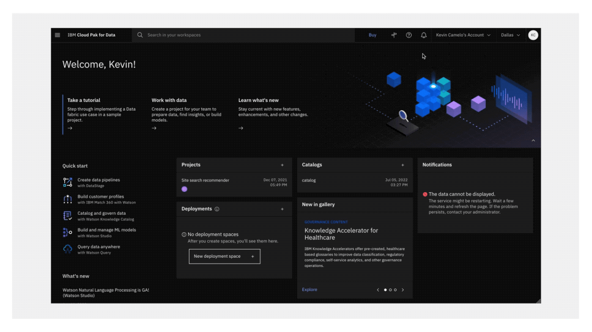
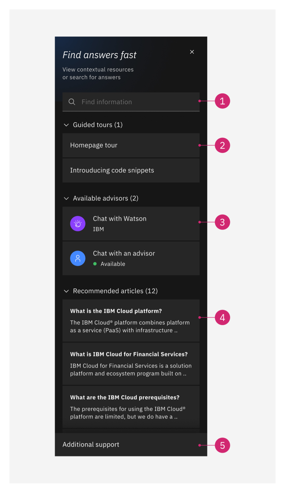
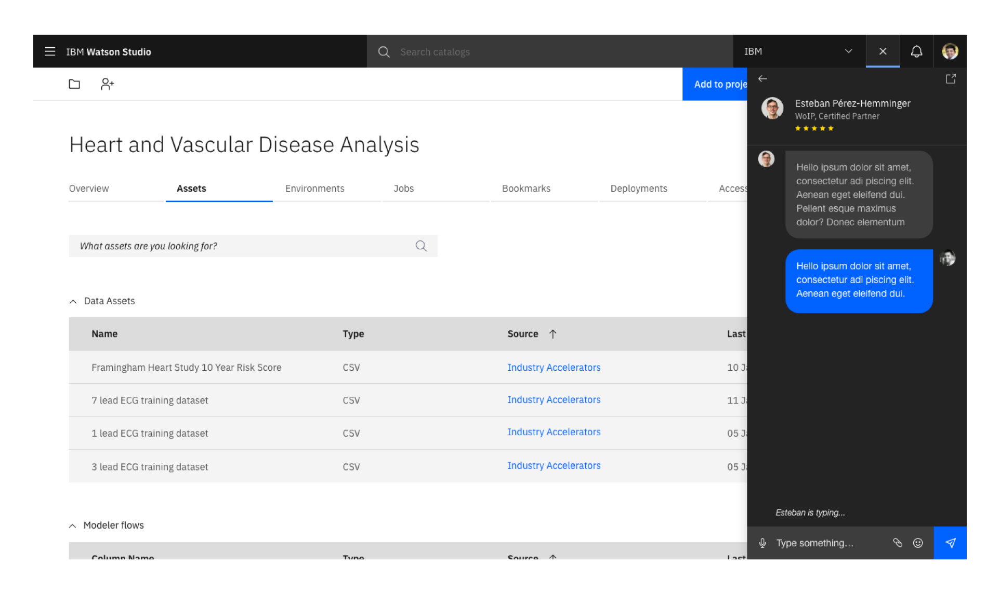
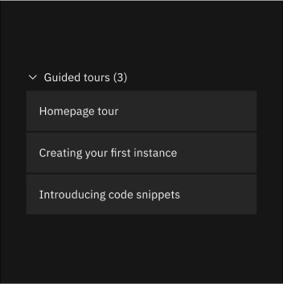
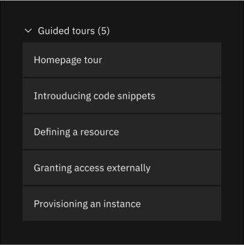
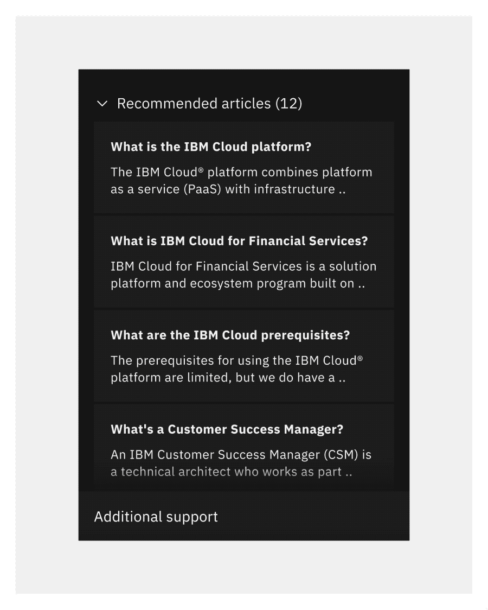
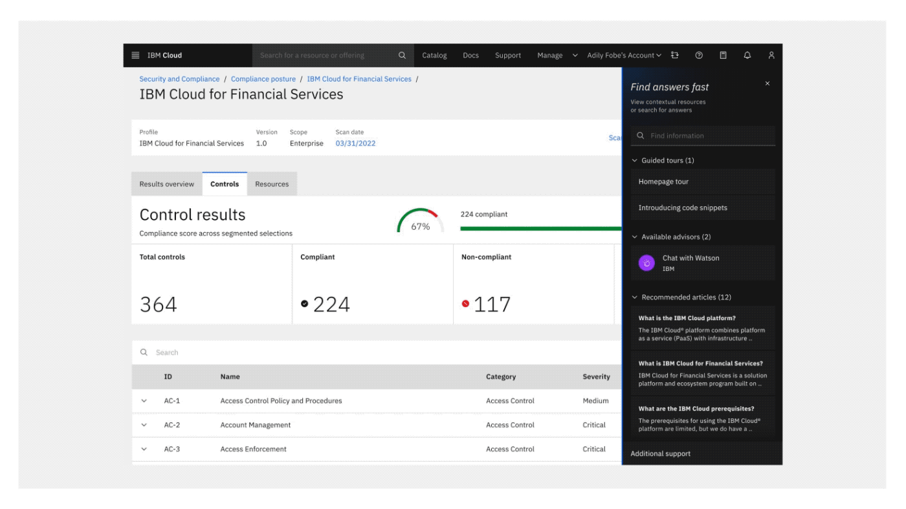

<PageDescription>

Contextual user assistance that can be integrated into any IBM Product experience.

</PageDescription>

<AnchorLinks>
    <AnchorLink>Overview</AnchorLink>
    <AnchorLink>Anatomy</AnchorLink>
    <AnchorLink>Usage</AnchorLink>
    <AnchorLink>Installation</AnchorLink>
    <AnchorLink>Planned functionality</AnchorLink>
    <AnchorLink>Related articles</AnchorLink>
</AnchorLinks>

## Overview
IBM Assist Me is an easy to integrate conceirge support experience for users of IBM Products.

The experience surfaces contextual links and resources to specific questions, step-by-step instructions, on-call agents/SME's, interaction with AI powered chatbots, and tailored search responses— all without interrupting the user's workflow. 

Once launched from the global header, users are served product team-curated content that leverages IBM documentation and WalkMe functionality. [Click here](https://ibm-assist-me1.fyre.ibm.com/) to view a demo of the IBM Assist Me panel. 

<Row>
  <Column colLg={12}>

<Caption>The IBM Assist Me experience in Cloud Pak for Data.</Caption>

  </Column>
</Row>

## Anatomy

<Row>
  <Column colLg={8}>

  </Column>
</Row>

IBM Assist Me consolidates IBM’s in-app widgets, such as WalkMe, into one module that encompasses multiple aspects of contextual in-app user assistance. It is launched from a [common support icon](https://carbondesignsystem.com/a5319309-aa8d-4c37-9ef0-6bfada150e37) in the UI Shell Header. Once opened, the panel allows users to initiate a search, launch a WalkMe tour, start a chat with an advisor, view recommended articles, or explore additional support options.

| Type | Description |
| -------------------- | ------ |
| **1. Unified Smart Search (Required)**  | Search across multiple support domains scoped to the relevant release. Supported search results include IBM Docs, IBM Cloud Docs, and IBM Cloud Pak Docs.|
| **2. WalkMe Tours (Optional)** | Access to relevant tours for users to launch based on context.|
| **3. Contextual AI & Agent Chat (Optional)** | Gives users immediate answers or access to on-call agents, asynchronous chat support, or scheduled consults. Currently supports any CMAAS based bot.|
| **4. Contextual Articles & Guidance (Optional)** | Immediate access to contextual articles and step-by-step instructions.|
| **5. Additional Support (Required)** | Provide access to other support links such as the ability to submit a ticket or provide feedback.|

**Note:** While all of these features are embedded in the assistance panel, teams can pick and choose the relevant methods of support to display. Everything, besides unified smart search, can be toggled on or off. 

## Usage
While the IBM Assist Me experience can easily be integrated into any product — teams that choose to adopt the experience must follow specific guidelines to ensure a consistent experience across IBM products.

**Note:** Each of panel’s features, besides search, can be toggled off. Only turn on the support options that make apply to your product’s users.

### Primary and secondary launch points
Product teams must embed the IBM Assist Me [common help icon](blob:https://carbondesignsystem.com/e71a0be6-6d05-4fc0-8535-0a7fe165acf7) in the product’s [UI Shell Header](https://carbondesignsystem.com/components/UI-shell-header/usage/) within the utilties section. This icon will serve as the primary launch point for the panel **and is required by all products that use the panel.**

In addition to the primary launch point, product teams may decide on a secondary input to open the panel.

Secondary launch points should not act as primary ways to open the panel. **They should act as a way to conduct a background article search on a custom input.**

For instance, a learn more link could open the assistance panel and preload a specifc search result.

<Row>
  <Column colLg={8}>

<Caption>The two types of launch points for IBM Assist Me.</Caption>

  </Column>
</Row>

### Unified smart search
When the assistance panel is opened, it will attempt to perform an appropriate contextual search for articles.

Before deploying, teams should setup contextual search terms for the panel to display upon launching the panel. By default, the panel uses the term **“overview”**. So, if no contextual terms have been provided, the search results for that term will be displayed.

For details on how a target product can supply contextual search terms, view the [IBM Assist Me wiki](https://github.ibm.com/PrivateCloud-analytics/ibm-assist-me/wiki/02.-How-to-embed-search-context).

For quick validation of embedded contextual search terms, scan the articles available when the assistance panel is opened. Occurrences of the embedded terms should be observable in the results.

### Contextual AI and agent chat
The IBM Assist Me panel can surface the Watson Assistant and agent chat options.

Before embedding AI or agent chat, consider the different account types and support availability for your product. For some products, agent based support is a paid option. **Only display the available support options valid for the user’s account type.**

<Row>
  <Column colLg={8}>

<Caption>An example of agent chat in the IBM Assist Me panel.</Caption>

  </Column>
</Row>

### WalkMe tours
The IBM Assist Me panel can display the associated [WalkMe guided tours](https://pages.github.ibm.com/cdai-design/pal/walkme-guide/main/overview/) for an IBM product. It can uniquely provide a standard location for relaunching tours once they have been closed.

Product teams should display **no more than 4 WalkMe tours** on any given page. Displaying additional WalkMe tours may bury additional features provided by the panel.

<Row>
  <Column colMd={4} colLg={6}>
  <DoDontExample type="do" caption="Show 4 or less guided tours in the panel.">

  </DoDontExample>
  </Column>
  <Column colMd={4} colLg={6}>
  <DoDontExample type="dont" caption="Show 5 or more guided tours in the panel.">

  </DoDontExample>
  </Column>
</Row>

### Additional support links

IBM Assist Me can surface static support links in the within the “Additional support” link found in the footer of the panel. For static support links in the table below, supplying 3 to 5 links is recommended. Do not add more than 6 links.

<Row>
  <Column colLg={8}>

<Caption>Example of opening the additional support button.</Caption>

  </Column>
</Row>

## Installation

At minimum, the IBM Assist Me panel uses the [WalkMe search application](https://pages.github.ibm.com/cdai-design/pal/walkme-guide/main/overview#walkme-implementations) to find applicable documents for a particular context or user search. It is expected that the target application will have [WalkMe configured](https://pages.github.ibm.com/cdai-design/pal/walkme-guide/main/overview) and loaded into the particular view where the panel will be surfaced. The assistance panel may be surfaced on a view that does not have WalkMe loaded if this value is provided. In this case, the panel will load the WalkMe snippet in order to perform searches and (optionally) display tours.

To integrate the IBM assistance panel into a target product, a product must:

1. **Go through the onboarding process:** Visit the [Assist Me development wiki](https://github.ibm.com/PrivateCloud-analytics/ibm-assist-me/wiki) to begin.
2. **Load the assistance panel JavaScript controller file in the target product** 
3. **Surface an assistance panel launch point within the nav bar in the target product.:** 
4. **Initialize an assistance panel controller and connect its functions to the launch point:** Immediate access to contextual articles and step-by-step instructions.
5. **Optionally, consider using custom events to, for example, launch article searches.**

Please visit the [IBM Assist Me panel development wiki](https://github.ibm.com/PrivateCloud-analytics/ibm-assist-me/wiki) for the complete installation process to get started.

## Planned functionality
Below are the planned feature enhancements to IBM Assist Me.

**Article launch out**
Currently, clicking on an article surfaces a launch-out link. The launch-out link will serve the article within a new tab in the user’s browser. 

The assistance panel team plans to release an update that will serve documentation within the panel itself.

**Panel resize**
The assistance panel currently does not resize from it’s 320px width. 

The assistance panel team plans to release an update that will allow the panel to resize up to 544px in width.

<Row>
  <Column colLg={8}>

  </Column>
</Row>

### Related articles

1. [WalkMe](https://pages.github.ibm.com/cdai-design/pal/walkme-guide/main/overview)
2. [IBM Assist Me Development Wiki](https://github.ibm.com/PrivateCloud-analytics/ibm-assist-me/wiki)
3. [IBM Assist Me Demo](https://ibm-assist-me1.fyre.ibm.com/)

**Relevant contacts:**
- Carmen Darlach: Executive Sponsor
- Jim Tsimis: Lead Architect
- Jalend Dinwiddie: Development Lead
- Kevin Camelo: Design Lead

**Edited by:**
- Kevin Camelo
- Jim Tsimis
- Carmen Darlach
