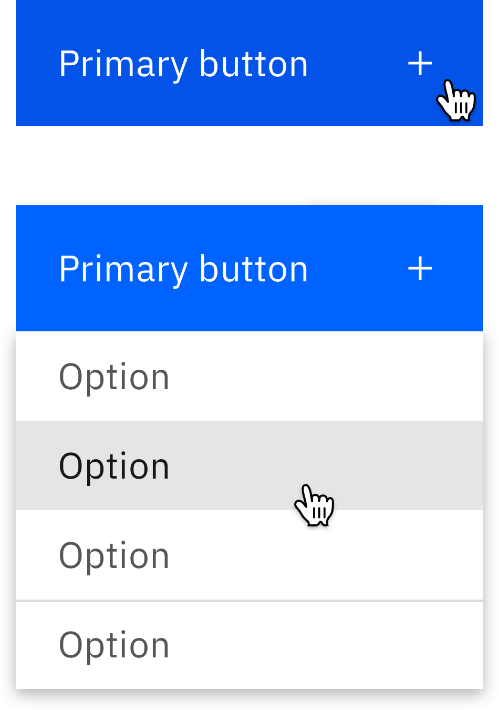

   &nbsp;&nbsp;&nbsp;Please note this pattern is still under review.

### Combining a standard button with an overflow menu

<Row>
  <Column colLg={8}>

  </Column>
</Row>

## Extension

Component created to allow the selection of a button to display a menu of
available options.

  
<Row>
  <Column colLg={4}>

  </Column>
</Row>

## Linked to

[Downloading](../../patterns/downloading)
