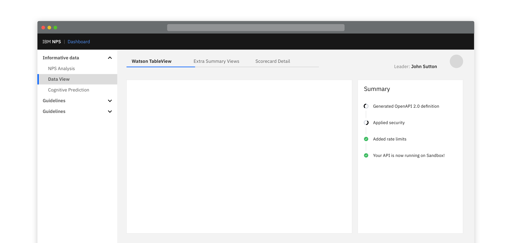

   &nbsp;&nbsp;&nbsp;Please note this pattern is still under review.

<Row>
  <Column colLg={8}>

  </Column>
</Row>

## Component Details

Component created that allows users to know exactly which operations are being taken as a result of an action
or set of actions that they have completed.  It can have any number of defined items, and each one can be in one of
three states - in progress, successfully completed or failed.

<Row>
  <Column colMd={6} colLg={6}>

  </Column>
</Row>
