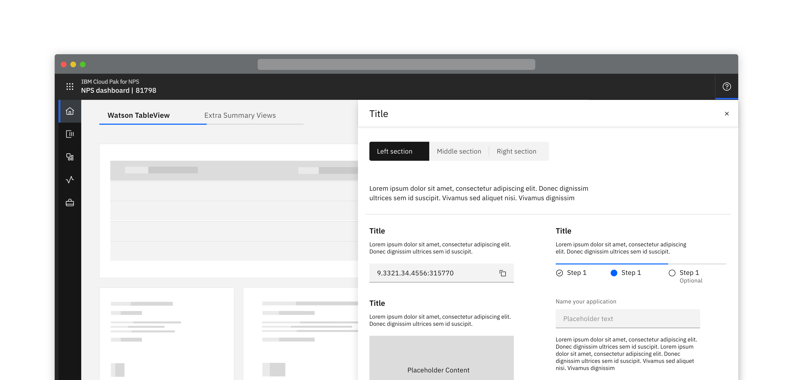
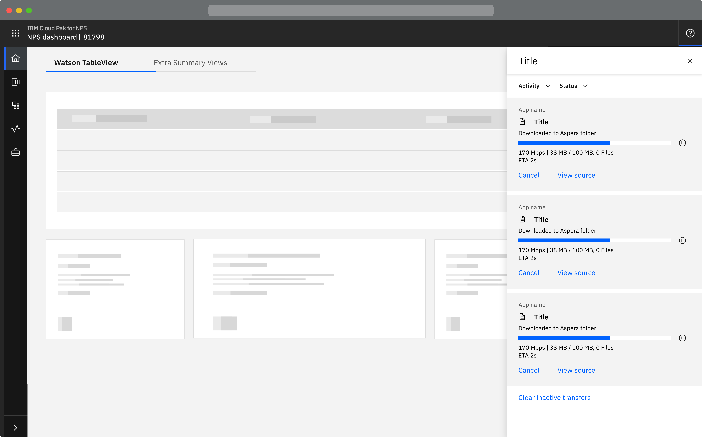
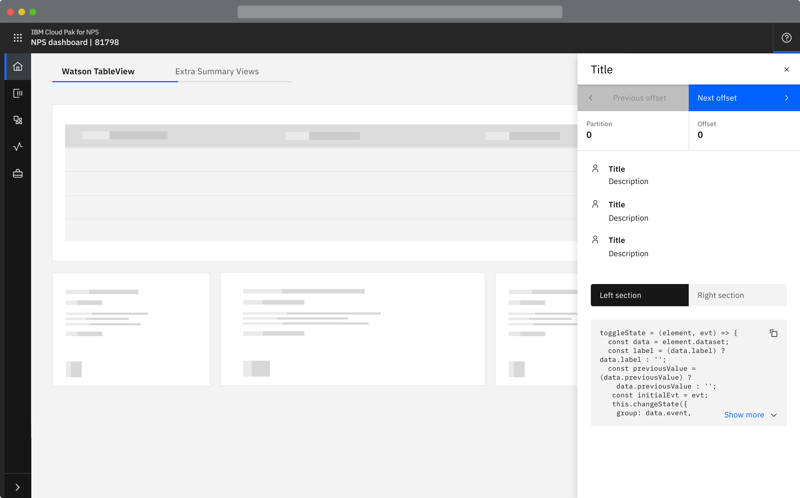
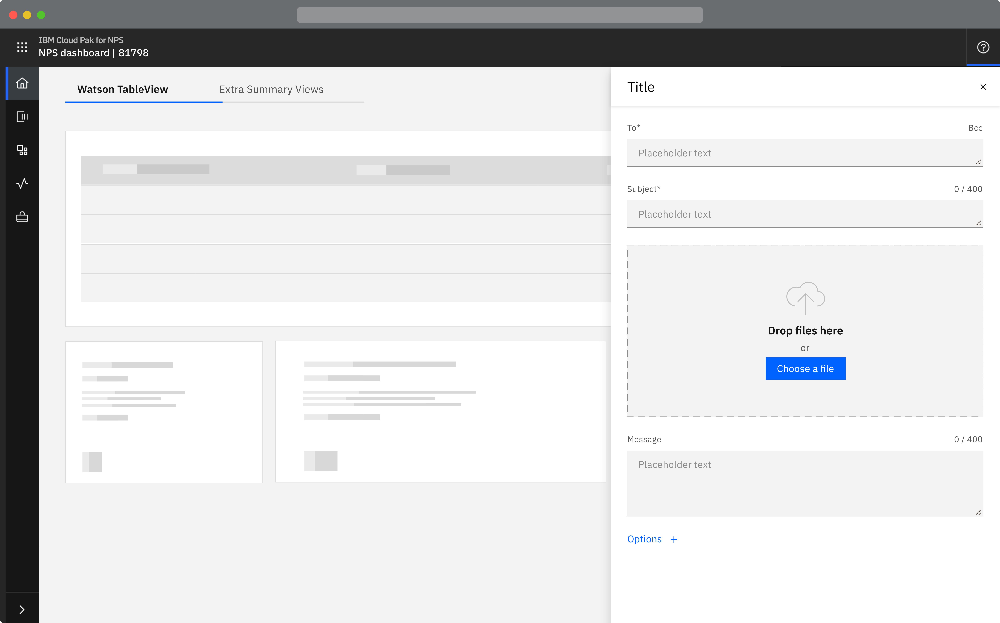
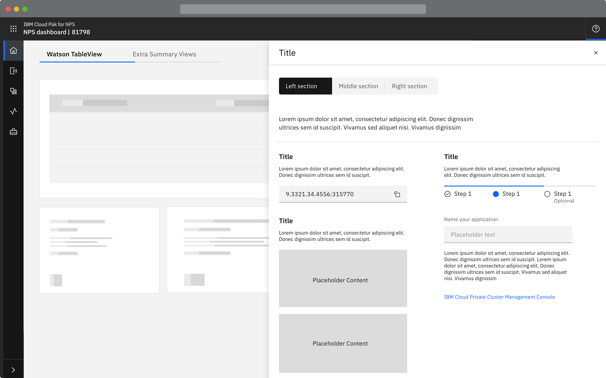

<Row>
  <Column colLg={8}>

  </Column>
</Row>

## Things to consider
- This component will overlay on top of the main page content beneath it
- How much content will be contained inside the panel
- Is dark or light theme more appropriate? 

#### Options

<AnchorLinks>
  <AnchorLink>Overview</AnchorLink>
  <AnchorLink>Sizes</AnchorLink>
  <AnchorLink>Themes</AnchorLink>
</AnchorLinks>

## Overview

Component created for a slide over panel, which opens as the result of a user
action and can be opened from anywhere in the product UI and will overlay the
main page content. 

This component is an empty framework that can have product defined, context
relevant, content.

## Sizes

There are three fixed sizes (small, medium and large), products should decide
which size is appropriate depending on the content required within the side
panel. 

<AnchorLinks small>
  <AnchorLink>Small</AnchorLink>
  <AnchorLink>Medium</AnchorLink>
  <AnchorLink to="#large--large--draggable">Large / Large & draggable</AnchorLink>
</AnchorLinks>

### Small

<Row>
  <Column colLg={10}>

  </Column>
</Row>
<Row>
  <Column colLg={10}>

  </Column>
</Row>

### Medium

<Row>
  <Column colLg={10}>

  </Column>
</Row>

### Large / Large & draggable

<Row>
  <Column colLg={10}>

  </Column>
</Row>
<Row>
  <Column colLg={10}>

  </Column>
</Row>

## Themes

The component will be available in the light and dark themes. The
recommendation is for products to use the light theme and Paks to use the
dark theme.

<Row>
 <Column colLg={8}>

   
   <strong>In progress: </strong>This section is still under progress and will be updated accordingly.

 </Column>
</Row>

## Linked to

[Downloading](../../common-patterns/downloading)
