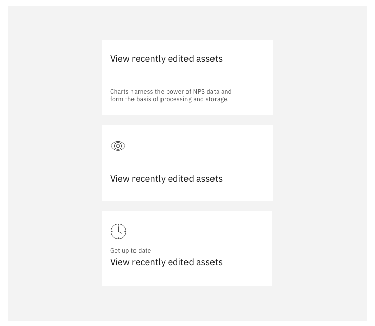
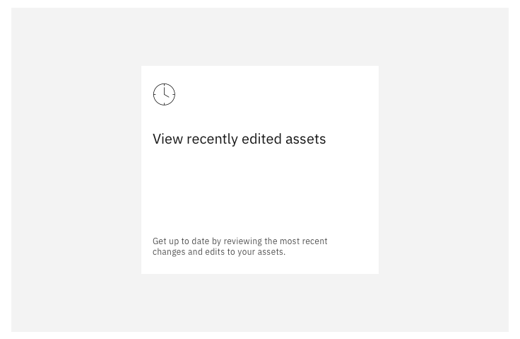
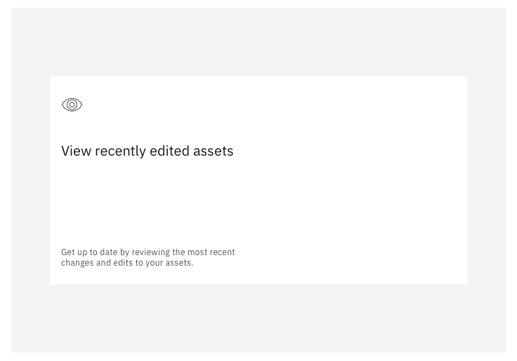

<PageDescription>

  The first experience when entering a product

</PageDescription>

<Row>
  <Column colLg={8}>

  </Column>
</Row>

<AnchorLinks>
  <AnchorLink>Home</AnchorLink>
  <AnchorLink>Landing page options</AnchorLink>
  <AnchorLink>Tile options</AnchorLink>
</AnchorLinks>

## Home

To ensure a consistent experience across the portfolio all products should
provide users with a similar experience upon entering the product.  This should welcome the users to the product  using a tiled structure containing task based activities to help the user get started in the context of the product they are in.  This page will always be accessible to the user throughout their use of the product and should be the top item in the products side-nav. 

<InlineNotification>

  **Note:** The page will be provided as a shareable, reusable component used
  by all products in the portfolio, however the content of the tiles should
  be determined by each product, with consideration to ensure these are
  restricted to useful accelerators, not only for first time use but also for
  every day use.  This content is not a design once and remain forever
  situation, it should be reviewed and evolve as appropriate with every
  release of a product.

</InlineNotification>

## Landing page options

#### Welcome text and illustration

Every product should provide welcome text to be displayed in the top left and
a contextual product illustration to be displayed in the top right.

There is a user action that can be performed to collapse away the welcome text
and illustration.

<Row>
 <Column colLg={8}>

 </Column>
</Row>

#### Tiles

The Home page should contain accelerators to help users get started using
products quickly and efficiently.  It is up to the products to determine
what tasks or actions would be useful to their users when getting started. 
Examples include building starter applications, stepping through tasks,
launching into key actions, providing guided / educational actions.

While getting started accelerators are useful to get users going you may
want to consider providing additional every day use accelorator tiles
dynamically to the page once users have got up and running and have active
resources.

<Row>
 <Column colLg={8}>

 </Column>
</Row>
<Row>
 <Column colLg={8}>

 </Column>
</Row>

## Tile options

<InlineNotification>

  **Note:** There should be a minimum of 2 large tiles on the page, preventing
  the page from looking too empty if there is only minimal content.

</InlineNotification>

There should never be more than a maximum of 6 large tiles (or an equivalent
total of 12 smaller tiles), this avoids the temptation to put shortcuts to
everything, ensuring only key tasks are included.  It should also prevent
content being missed due to the need for scrolling.  

<AnchorLinks small>
  <AnchorLink>Learning tiles</AnchorLink>
  <AnchorLink>Accelerator tiles</AnchorLink>
  <AnchorLink>Recently edited assets</AnchorLink>
  <AnchorLink>State of resources</AnchorLink>
</AnchorLinks>

#### Learning tiles

There should never be more than a maximum of 6 large tiles (or an equivalent
total of 12 smaller tiles), this avoids the temptation to put shortcuts to
everything, ensuring only key tasks are included.  It should also prevent
content being missed due to the need for scrolling. 

<Row>
 <Column colLg={8}>

 </Column>
</Row>
<Row>
 <Column colLg={8}>

 </Column>
</Row>
<Row>
 <Column colLg={8}>

 </Column>
</Row>

#### Accelerator tiles

This tile can be used to show a user’s recent work, and give them an
accelerated way of returning to recent tasks to continue working.

When the tile is clicked, the user is taken to where their assets are,
with most recently edited assets shown first.

The user can also navigate directly to a recently edited asset, by clicking
the link displayed on the tile.

<Row>
 <Column colLg={8}>

 </Column>
</Row>
<Row>
 <Column colLg={8}>

 </Column>
</Row>
<Row>
 <Column colLg={8}>

 </Column>
</Row>

#### Recently edited assets

This tile can be used to show a user’s recent work, and give them an
accelerated way of returning to recent tasks to continue working.

When the tile is clicked, the user is taken to where their assets are,
with most recently edited assets shown first.

The user can also navigate directly to a recently edited asset, by
clicking the link displayed on the tile.

<Row>
 <Column colLg={8}>

 </Column>
</Row>
<Row>
 <Column colLg={8}>

 </Column>
</Row>
<Row>
 <Column colLg={8}>

 </Column>
</Row>

#### State of resources

This tile can be used to show a user’s recent work, and give them an
accelerated way of returning to recent tasks to continue working.

When the tile is clicked, the user is taken to where their assets are,
with most recently edited assets shown first.

The user can also navigate directly to a recently edited asset, by
clicking the link displayed on the tile.

<Row>
 <Column colLg={8}>

 </Column>
</Row>
<Row>
 <Column colLg={8}>

 </Column>
</Row>
<Row>
 <Column colLg={8}>

 </Column>
</Row>

#### Custom tiles [to be added]

Purpose

- Allows products to populate the tile with customised content to suit
their needs. These can be populated based on activity that has taken
place in the products.

Examples to be added e.g. summary tile, monitor tile, count tile etc…

## Linked to

[Editing & Updating](../common-patterns/editing)
