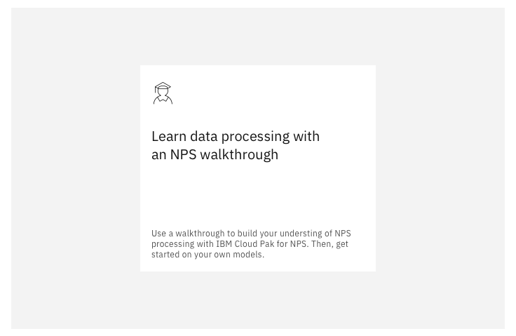
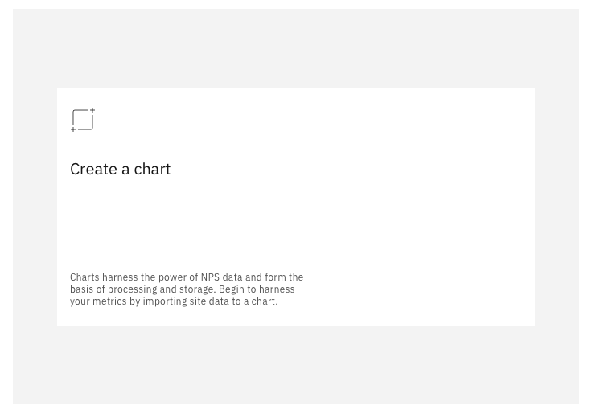
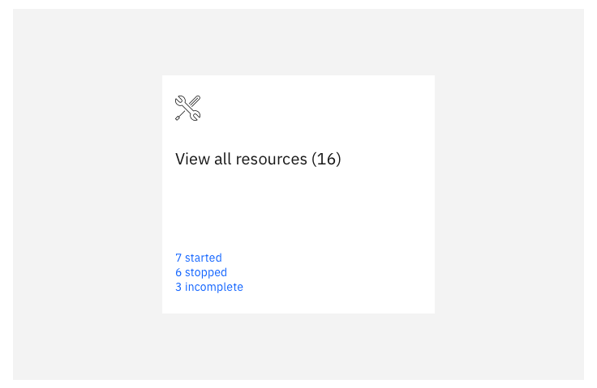
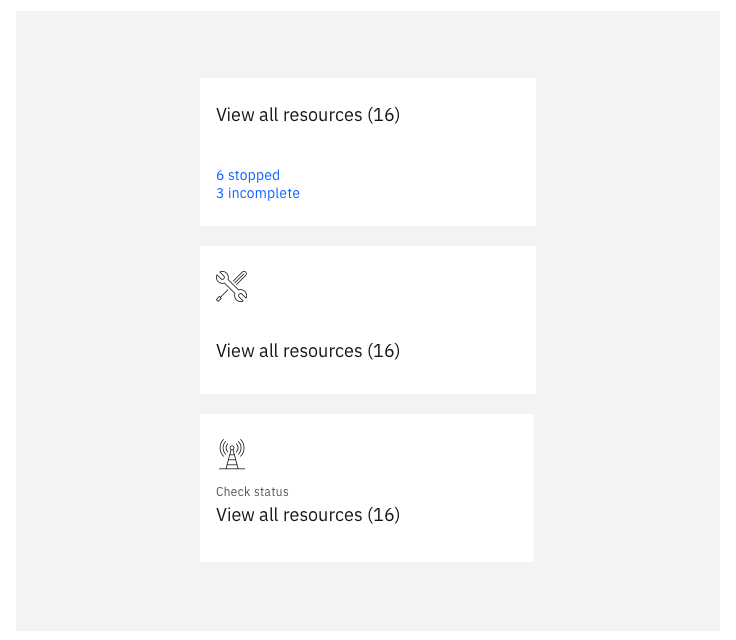

<PageDescription>

  The landing page is the first experience when entering a product.

</PageDescription>

<AnchorLinks>
  <AnchorLink>Home</AnchorLink>
  <AnchorLink>Landing page options</AnchorLink>
  <AnchorLink>Tile options</AnchorLink>
</AnchorLinks>

## Home

To ensure a consistent experience across the portfolio all products should
provide users with a similar experience upon entering the product.  This should welcome the users to the product  using a tiled structure containing task based activities to help the user get started in the context of the product they are in.  This page will always be accessible to the user throughout their use of the product and should be the top item in the products side-nav. 

<InlineNotification>

  **Note:** The page will be provided as a shareable, reusable component used
  by all products in the portfolio, however the content of the tiles should
  be determined by each product, with consideration to ensure these are
  restricted to useful accelerators, not only for first time use but also for
  every day use.  This content is not a design once and remain forever
  situation, it should be reviewed and evolve as appropriate with every
  release of a product.

</InlineNotification>

## Landing page options

### Welcome text and illustration

Every product should provide welcome text to be displayed in the top left and
a contextual product illustration to be displayed in the top right.

There is a user action that can be performed to collapse away the welcome text
and illustration.

<Row>
 <Column colLg={8}>

<Caption>The Show more / Show less option minimises the headline text, image and product description.</Caption>
 </Column>
</Row>

### Tiles

The Home page should contain accelerators to help users get started using
products quickly and efficiently.  It is up to the products to determine
what tasks or actions would be useful to their users when getting started. 
Examples include building starter applications, stepping through tasks,
launching into key actions, providing guided / educational actions.

While getting started accelerators are useful to get users going you may
want to consider providing additional every day use accelerator tiles
dynamically to the page once users have got up and running and have active
resources.

<Row>
 <Column colLg={8}>

<Caption>The experience of a new user should get them using products quickly and efficiently.</Caption>
 </Column>
</Row>
<Row>
 <Column colLg={8}>

<Caption>In every day use, accelerators and monitoring tiles become more useful.</Caption>
 </Column>
</Row>

## Tile options

<InlineNotification>

  **Note:** There should be a minimum of 2 large tiles on the page, preventing
  the page from looking too empty if there is only minimal content.

</InlineNotification>

There should never be more than a maximum of 6 large tiles (or an equivalent
total of 12 smaller tiles), this avoids the temptation to put shortcuts to
everything, ensuring only key tasks are included.  It should also prevent
content being missed due to the need for scrolling.  

<AnchorLinks small>
  <AnchorLink>Learning tiles</AnchorLink>
  <AnchorLink>Accelerator tiles</AnchorLink>
  <AnchorLink>Recently edited assets</AnchorLink>
  <AnchorLink>State of resources</AnchorLink>
</AnchorLinks>

### Learning tiles

Learning tiles provide users with education that can be located in-product, in documentation or even elsewhere. Activity that leads to productive use of the product, such as guided experiences or sample application guidance, should be prioritised over long-format text articles. 
<Row>
 <Column colLg={8}>

<Caption>Example of a large learning tile</Caption>
 </Column>
</Row>
<Row>
 <Column colLg={8}>

<Caption>Examples of small learning tiles</Caption>
 </Column>
</Row>
<Row>
 <Column colLg={8}>

<Caption>Example of an extra-large learning tile</Caption>
 </Column>
</Row>

### Accelerator tiles

These tiles are used in both early and everyday use to take the user where they can perform a key action. The action can also be performed directly on the click of the tile. 

<Row>
 <Column colLg={8}>

<Caption>Example of a large accelerator tile</Caption>
 </Column>
</Row>
<Row>
 <Column colLg={8}>

<Caption>Examples of small accelerator tiles</Caption>
 </Column>
</Row>
<Row>
 <Column colLg={8}>

<Caption>Example of an extra-large accelerator tile</Caption>
 </Column>
</Row>

### Recently edited assets

This tile can be used to show a user’s recent work, and give them an
accelerated way of returning to recent tasks to continue working.

When the tile is clicked, the user is taken to where their assets are,
with most recently edited assets shown first.

The user can also navigate directly to a recently edited asset, by
clicking the link displayed on the tile.

<Row>
 <Column colLg={8}>

<Caption>Example of a large recently edited assets tile</Caption>
 </Column>
</Row>
<Row>
 <Column colLg={8}>

<Caption>Examples of small recently edited assets tiles</Caption>
 </Column>
</Row>
<Row>
 <Column colLg={8}>

<Caption>Example of an extra-large recently edited assets tile</Caption>
 </Column>
</Row>

### State of resources

This tile shows the state of key resources.

When the user clicks the tile, they are taken to the primary view of their resources. 
If the user clicks the links on a tile, they are taken to the view of those resources, filtered by the state they selected. 

<Row>
 <Column colLg={8}>

<Caption>Example of a large state of resources tile</Caption>
 </Column>
</Row>
<Row>
 <Column colLg={8}>

<Caption>Examples of small state of resources tiles</Caption>
 </Column>
</Row>
<Row>
 <Column colLg={8}>

<Caption>Example of an extra-large state of resources tile</Caption>
 </Column>
</Row>

### Custom tiles [to be added]

Purpose

- Allows products to populate the tile with customised content to suit
their needs. These can be populated based on activity that has taken
place in the products.

Examples to be added e.g. summary tile, monitor tile, count tile etc…

## Linked to

[Editing & Updating](../common-patterns/editing)
