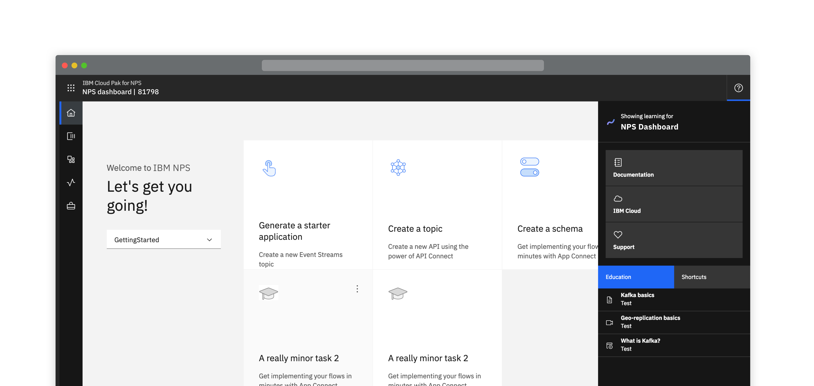
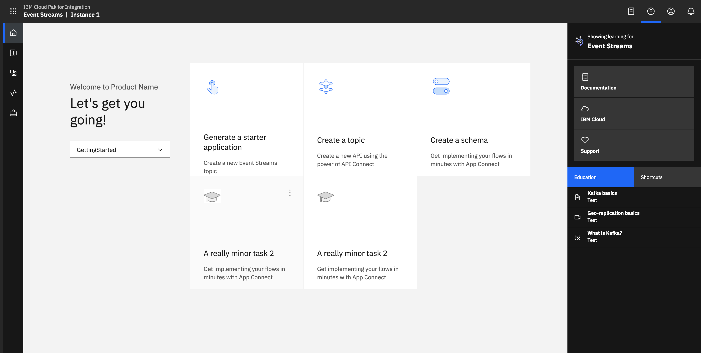
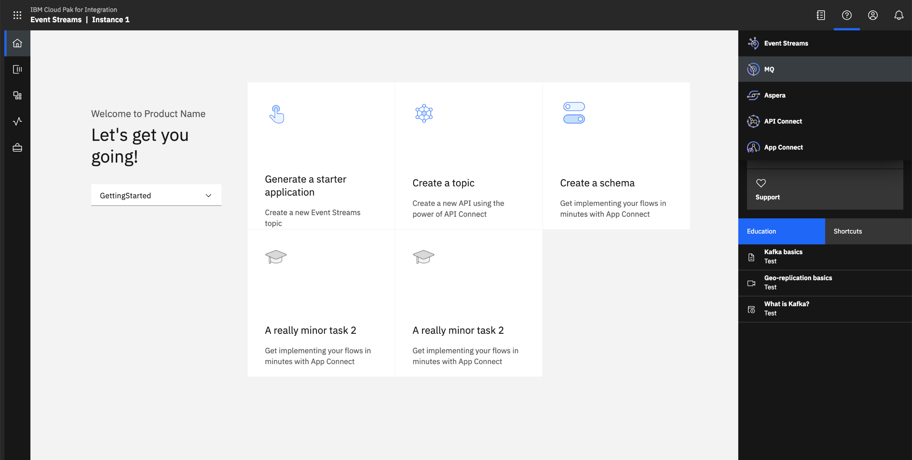

<InlineNotification kind="warning">

  Please note this pattern is still under review.

</InlineNotification>

<PageDescription>

  Universal access to educational documentation

</PageDescription>

<Row>
  <Column colLg={8}>

  </Column>
</Row>

## Overview

To provide a consistent learning experience users should be able to access
learning, support, education and documentation from the same place in all
products.   All these artefacts, or links to them, will be contained within a
side panel accessed via an icon in the top right of the product header.

<InlineNotification>

  **Note:** This panel can always be accessed by the user at any point a
  product without removing them from the context of what they are doing.

</InlineNotification>

It must contain a link to product documentation, aside from that the content
of this panel is decided on a per product basis.  It could contain a variety
of different types of resources e.g. link to demo videos, tutorials, in
product education.

In standalone products this panel will contain only items that are specific
to that particular product.  When in Cloud Pak for Integration there will be
the ability for users to not only see Cloud Pak items but also switch between
the different products (of which they have included in the Pak).

<Row>
 <Column colLg={10}>

 </Column>
</Row>
<Row>
 <Column colLg={10}>

 </Column>
</Row>

## Linked to

[Landing page](landing-page)

[Navigation](navigation)
