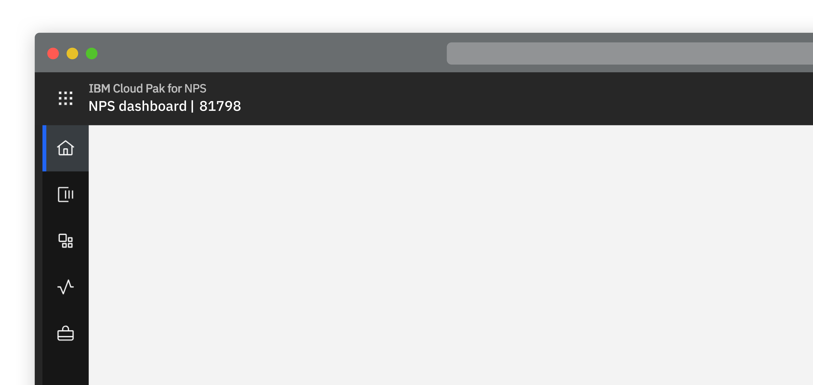
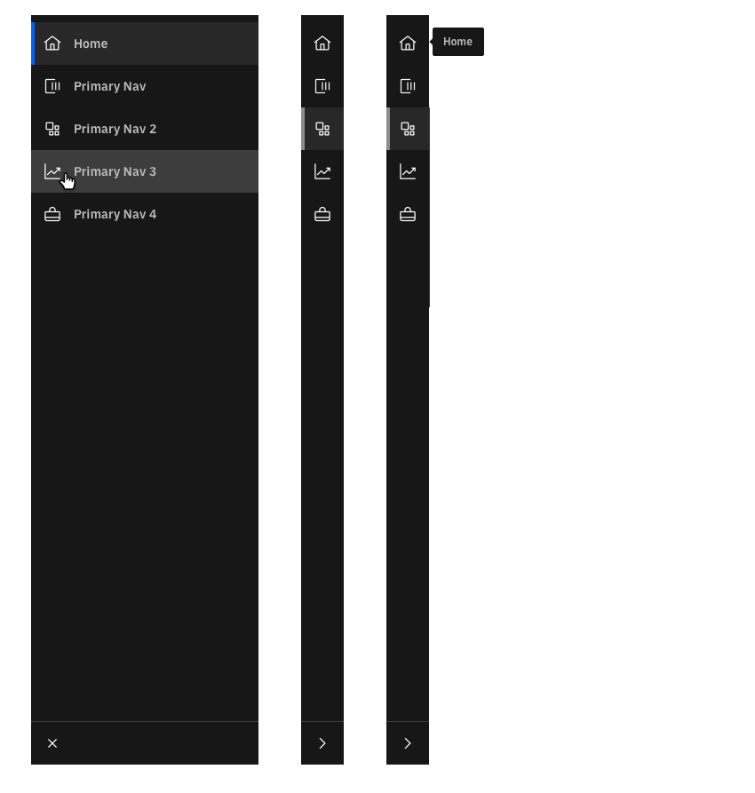
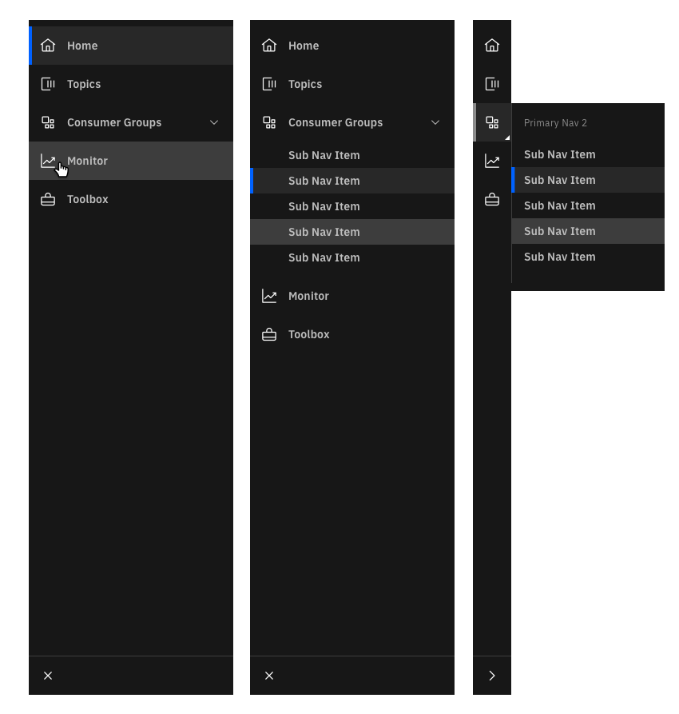
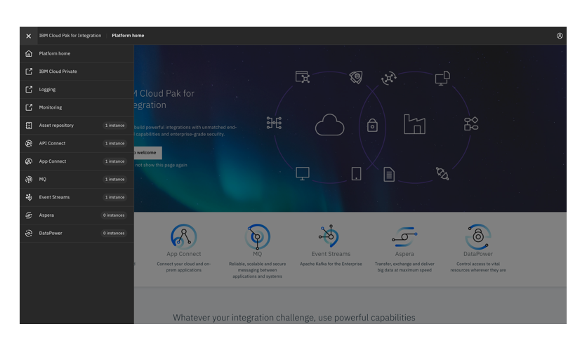
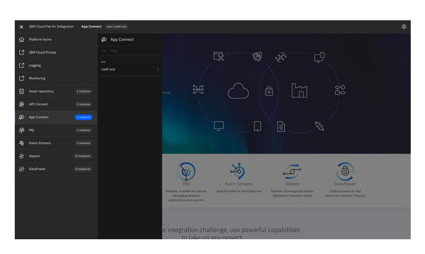

import { Launch16 } from '@carbon/icons-react';

<PageDescription>

  To ensure a consistent experience all products should have the same method of primary navigation. 

</PageDescription>

<Row>
  <Column colLg={8}>

  </Column>
</Row>

#### Status:
Experimental
#### Maintainers:
Vikki Patterson, Arnaud Gillard

<AnchorLinks>
  <AnchorLink>Header navigation</AnchorLink>
  <AnchorLink>Product navigation</AnchorLink>
  <AnchorLink>Pak level navigation</AnchorLink>
</AnchorLinks>

## Header navigation

<Row>
 <Column colLg={8}>
  

   <strong>Note:</strong> Products should not use the header space for any product specific
   navigation as when they are used in the Cloud Integration Platform the
   header is provided by the platform.
  

 </Column>
</Row>
 

All navigation for the IBM Cloud Pak for Integration is located within the top header. This includes the ability to navigate between products in the pak as well as accessing Pak features such as the asset reposory, tracing monitoring and managing  their instances.

Access to product items such as user profile, alerts / notifications and learning should be consistent within both Pak and product headers.  

<Row>
 <Column colLg={8}>

 </Column>
</Row>
<Row>
 <Column colLg={8}>

 </Column>
</Row>

## Product navigation

Primary product-level navigation should make use of the Carbon 10 flexible side-nav.

* The side-nav can be set to ‘expanded’ or ‘collapsed’ by default.

* Nested options should be avoided in the left hand nav. Each icon in the side-nav should allow the user to navigate directly to a product page.
* The button at the base of the left-nav allows the user to toggle between ‘expanded’ and ‘collapsed’ state.
* Nested options should be avoided in the left hand nav. Each icon in the side-nav should allow the user to navigate directly to a product page.

<Row>
 <Column colLg={8}>
  

   <strong>Note:</strong> Where products share similar primary navigation items the same
   terminology and icons should be used across the products.
  

 </Column>
</Row>

#### Primary navigation only (recommended)

Three states - expanded (pinned), collapsed, and collapsed on hover

<Row>
 <Column colLg={8}>

 </Column>
</Row>

#### Nested navigation (not recommended)

Three states - expanded (pinned), collapsed, and collapsed on hover

<Row>
 <Column colLg={8}>

 </Column>
</Row>

## Pak level navigation

Navigation at the Pak level is accessed from the application switch icon in
the top left of the header.  This opens the Pak navigation which displays over
the top of the currently active content.

The platform navigation displays Pak specific areas in the top (Home, Asset
Repo, Monitoring, Admin). Selecting these will take the user to the relevant
area of the Pak.

Below the Pak specific items are the capabilities, and
instances of these, available to the user inside the platform.  This allows
the user to see at a glance how many instances they have of each capability,
search for and navigate to, a specific instance.

<Row>
 <Column colLg={8}>

 </Column>
</Row>
<Row>
 <Column colLg={8}>

 </Column>
</Row>
