## Cloud Pak for Integration

Our “integrating integration” mission is to improve the experience for users who use a combination of our existing integration products. Try out Cloud Integration here: https://console.bluemix.net/integrate/overview

<ImageComponent cols="8" zoom className="ide-image--white-border">

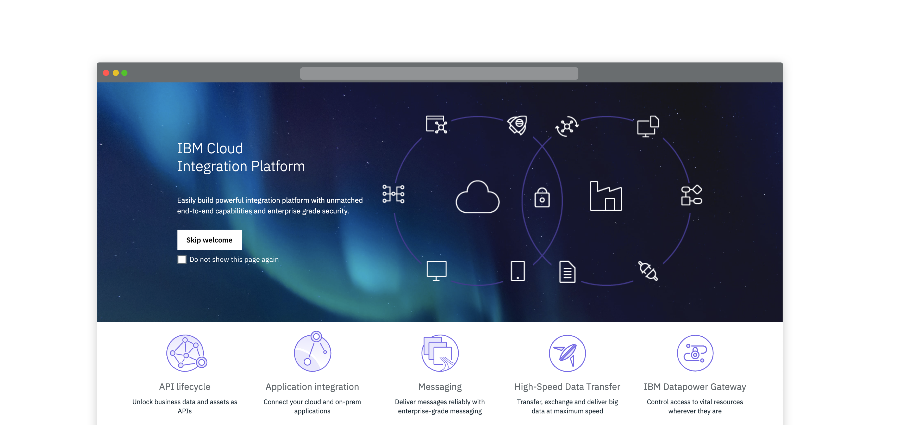

</ImageComponent>
 

| Designer      | Role            | Profile                                                                 |
| ------------- | --------------- | ----------------------------------------------------------------------- |
| Brian Peaston | Design Manager  | [View profile](https://w3.ibm.com/bluepages/profile.html?uid=030058866) |
| John Morgan   | Design Lead     | [View profile](https://w3.ibm.com/bluepages/profile.html?uid=111797866) |
| Tom Solomon   | UX Designer     | [View profile](https://w3.ibm.com/bluepages/profile.html?uid=123750866) |
| Gregor Cowie  | Visual Designer | [View profile](https://w3.ibm.com/bluepages/profile.html?uid=125293866) |

**Pictogram and Icon**

Refer here for more guidance: https://ibmcloudtool.mybluemix.net/pictograms/

<ImageComponent cols="8" zoom="false">

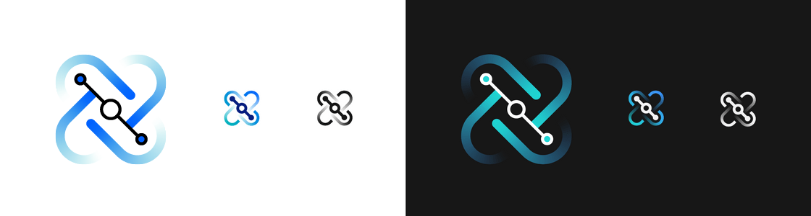

</ImageComponent>

<a href="https://pages.github.ibm.com/ide-design-guidelines/ide-design-guidelines-v2/resources/cloud-pak-for-integration.zip" download>Download</a>

<AnchorLinks>

- [Event Streams](#event-streams)
- [Aspera](#aspera)
- [API Connect](#api-connect)
- [DataPower Gateway](#datapower-gateway)
- [App Connect](#app-connect)
- [Cloud Integration Platform](#cloud-integration-platform)
- [MQ](#mq)

</AnchorLinks>

## Event Streams

Add text here pitching the concept of the cloud integration platform. This text should also emphasise the importance of unifying the experience of all integration products and how this website will be used to enable this. Keep it short and simple.

<ImageComponent cols="8" zoom className="ide-image--white-border">

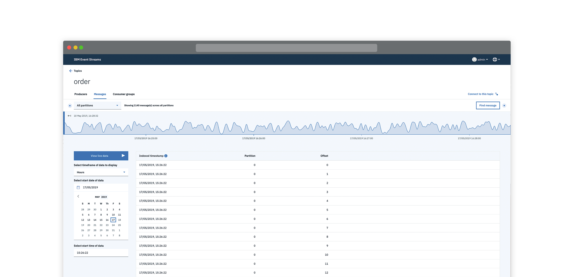

</ImageComponent>
 

| Designer       | Role            | Profile                                                                 |
| -------------- | --------------- | ----------------------------------------------------------------------- |
| Andy Gatford   | Design Manager  | [View profile](https://w3.ibm.com/bluepages/profile.html?uid=017452866) |
| Vikki Paterson | Design Lead     | [View profile](https://w3.ibm.com/bluepages/profile.html?uid=100079866) |
| Chloe Poulter  | UX Designer     | [View profile](https://w3.ibm.com/bluepages/profile.html?uid=118468866) |
| Peter Loveland | Visual Designer | [View profile](https://w3.ibm.com/bluepages/profile.html?uid=115714866) |
| Susie Wright   | User Researcher | [View profile](https://w3.ibm.com/bluepages/profile.html?uid=043195866) |

**Pictogram and Icon**

Refer here for more guidance: https://ibmcloudtool.mybluemix.net/pictograms/

<ImageComponent cols="8" zoom="false">

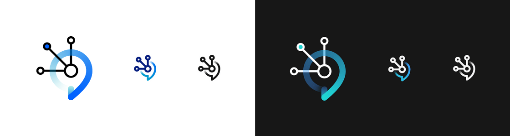

</ImageComponent>

<a href="https://pages.github.ibm.com/ide-design-guidelines/ide-design-guidelines-v2/resources/event-streams.zip" download>Download</a>

## Aspera

**Moving the world's data at maximum speed**

Aspera on Cloud provides a simple unified user experience,for all Aspera capabilities, such as sending, sharing, collaborating, streaming, automating and reporting to accomplish their data transfer and management needs.

<ImageComponent cols="8" zoom className="ide-image--white-border">

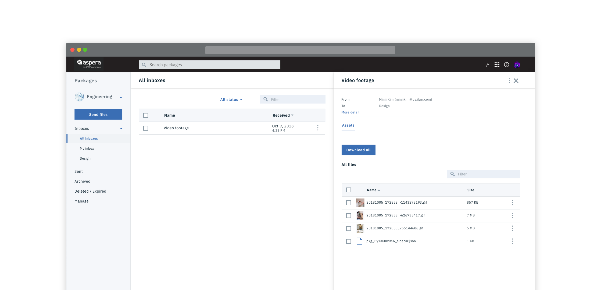

</ImageComponent>
 

| Designer         | Role             | Profile                                                                             |
| ---------------- | ---------------- | ----------------------------------------------------------------------------------- |
| Scott Robinson   | Design Manager   | [View profile](https://w3.ibm.com/bluepages/profile.html?uid=2J4151897)             |
| Marcela Cabrera  | UX Designer      | [View profile](https://w3.ibm.com/bluepages/profile.html?uid=4G6063897)             |
| Minji Kim        | UX Designer      | [View profile](https://w3.ibm.com/bluepages/profile.html?uid=4G4561897)             |
| Charles Mitchell | User Researcher  | [View profile](https://w3.ibm.com/bluepages/profile.html?email=mitchelc@us.ibm.com) |
| Nehal Molasaria  | UX Designer      | [View profile](https://w3.ibm.com/bluepages/profile.html?uid=4G4493897)             |
| John Sun         | UX Design Intern | [View profile](https://w3.ibm.com/bluepages/profile.html?uid=1J7155897)             |
| Boney Yeldho     | UX Designer      | [View profile](https://w3.ibm.com/bluepages/profile.html?uid=1J1030897)             |

**Pictogram and Icon**

Refer here for more guidance: https://ibmcloudtool.mybluemix.net/pictograms/

<ImageComponent cols="8" zoom="false">

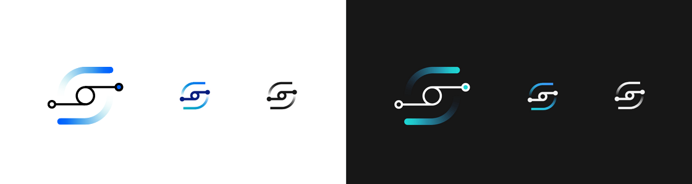

</ImageComponent>

<a href="https://pages.github.ibm.com/ide-design-guidelines/ide-design-guidelines-v2/resources/aspera.zip" download>Download</a>

## API Connect

**Create & Run APIs with full Lifecycle Management**

Create and secure APIs and microservices based on Node.js and Java runtimes—all managed from a single unified console. Take advantage of the rich lifecycle management capabilities.

<ImageComponent cols="8" zoom className="ide-image--white-border">

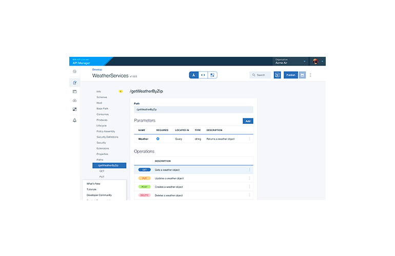

</ImageComponent>
 

| Designer        | Role             | Profile                                                                 |
| --------------- | ---------------- | ----------------------------------------------------------------------- |
| Sichao Wu       | Design Lead      | [View profile](https://w3.ibm.com/bluepages/profile.html?uid=2G0333897) |
| Wayne Chou      | Product Designer | [View profile](https://w3.ibm.com/bluepages/profile.html?uid=3G4535897) |
| Roger Davenport | UX Designer      | [View profile](https://w3.ibm.com/bluepages/profile.html?uid=675881897) |
| Jill Lin        | Product Designer | [View profile](https://w3.ibm.com/bluepages/profile.html?uid=0J1665897) |
| Keesa Robinson  | Product Designer | [View profile](https://w3.ibm.com/bluepages/profile.html?uid=2G0096897) |

**Pictogram and Icon**

Refer here for more guidance: https://ibmcloudtool.mybluemix.net/pictograms/

<ImageComponent cols="8" zoom="false">

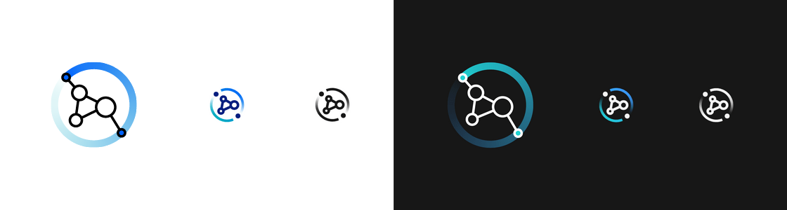

</ImageComponent>

<a href="https://pages.github.ibm.com/ide-design-guidelines/ide-design-guidelines-v2/resources/api-connect.zip" download>Download</a>

## DataPower Gateway

**Content to follow...**

**Pictogram and Icon**

Refer here for more guidance: https://ibmcloudtool.mybluemix.net/pictograms/

<ImageComponent cols="8" zoom="false">

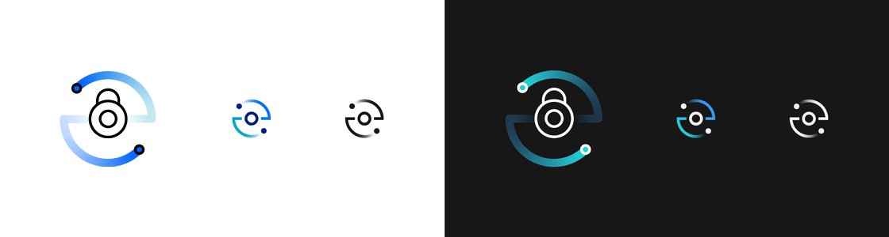

</ImageComponent>

<a href="https://pages.github.ibm.com/ide-design-guidelines/ide-design-guidelines-v2/resources/datapower-grid.zip" download>Download</a>

## App Connect

**Connect your business applications, no matter where they are.**

From simple, guided app-to-app connections to highly flexible integration solutions, IBM® App Connect has it covered. Try out App Connect here: https://console.bluemix.net/catalog/services/app-connect

<ImageComponent cols="8" zoom className="ide-image--white-border">

</ImageComponent>
 

| Designer         | Role                | Profile                                                                 |
| ---------------- | ------------------- | ----------------------------------------------------------------------- |
| Brian Peaston    | Design Manager      | [View profile](https://w3.ibm.com/bluepages/profile.html?uid=030058866) |
| Sarah Burwood    | Design Lead         | [View profile](https://w3.ibm.com/bluepages/profile.html?uid=102541866) |
| Lee Chase        | Front-end Developer | [View profile](https://w3.ibm.com/bluepages/profile.html?uid=079440866) |
| Eva Dage         | Visual Designer     | [View profile](https://w3.ibm.com/bluepages/profile.html?uid=119040866) |
| Sebastian Howard | Intern              | [View profile](https://w3.ibm.com/bluepages/profile.html?uid=125036866) |
| James King       | User Researcher     | [View profile](https://w3.ibm.com/bluepages/profile.html?uid=123123866) |
| Gary Thornton    | UX Designer         | [View profile](https://w3.ibm.com/bluepages/profile.html?uid=017557866) |
| Tobi Oyadiran    | UX Designer         | [View profile](https://w3.ibm.com/bluepages/profile.html?uid=118223866) |

**Pictogram and Icon**

Refer here for more guidance: https://ibmcloudtool.mybluemix.net/pictograms/

<ImageComponent cols="8" zoom="false">

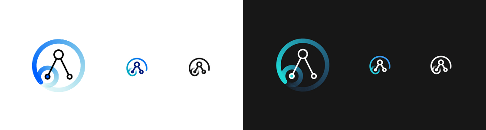

</ImageComponent>

<a href="https://pages.github.ibm.com/ide-design-guidelines/ide-design-guidelines-v2/resources/app-connect.zip" download>Download</a>

## MQ

**Messaging**

Our Mission is to improve the experience of existing messaging products and create experiences for new products.

<ImageComponent cols="8" zoom className="ide-image--white-border">

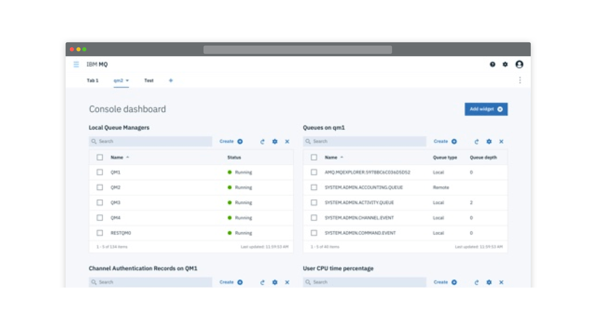

</ImageComponent>
 

| Designer          | Role                | Profile                                                                 |
| ----------------- | ------------------- | ----------------------------------------------------------------------- |
| Andy Gatford      | Design Manager      | [View profile](https://w3.ibm.com/bluepages/profile.html?uid=017452866) |
| Steve Haskey      | Design Lead         | [View profile](https://w3.ibm.com/bluepages/profile.html?uid=023416866) |
| Laura Marshall    | Visual Designer     | [View profile](https://w3.ibm.com/bluepages/profile.html?uid=125355866) |
| Sophie Rogers     | UX Designer         | [View profile](https://w3.ibm.com/bluepages/profile.html?uid=116279866) |
| Lawrence Berry    | UX Designer         | [View profile](https://w3.ibm.com/bluepages/profile.html?uid=123150866) |
| Simon Moore       | Front-end Developer | [View profile](https://w3.ibm.com/bluepages/profile.html?uid=061233866) |

**Pictogram and Icon**

Refer here for more guidance: https://ibmcloudtool.mybluemix.net/pictograms/

<ImageComponent cols="8" zoom="false">

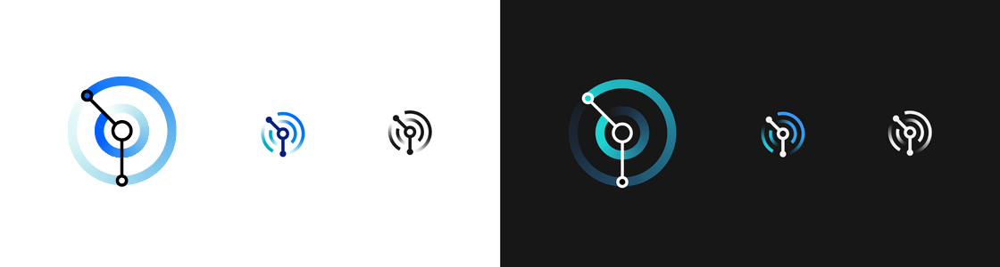

</ImageComponent>

<a href="https://pages.github.ibm.com/ide-design-guidelines/ide-design-guidelines-v2/resources/mq.zip" download>Download</a>

## Linked to

[Carbon Components](../carbon-components)
