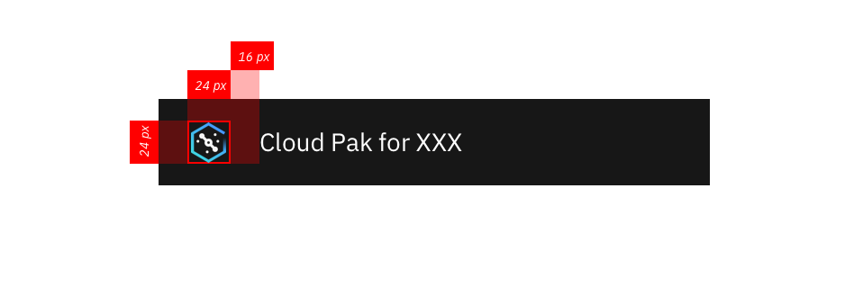

<PageDescription>

The Cloud Pak switcher is located at the top right corner of the Cloud Pak header and  helps users switch from one Pak interface to another without the need to sign on again.

</PageDescription>

<AnchorLinks>
  <AnchorLink>Overview</AnchorLink>
  <AnchorLink>The solution</AnchorLink>
  <AnchorLink>Accessibility</AnchorLink>
  <AnchorLink>Design resources</AnchorLink>
</AnchorLinks>

## Overview

Based on Cloud Pak vision and strategy, multiple Cloud Paks can be installed within one OCP cluster when clients decide to do so to meet their business needs. As a result, there will be users, most likely admins, who will need an easy way to access different interface from one Cloud Pak to another.

The Cross Pak switcher is located at the top right corner of the header of each Cloud Pak. It helps users who have access to multiple Cloud Paks within one cluster to switch from one Pak interface to another without the needs to sign on again.

### Anatomy

The Cloud Pak switcher consists of the following elements:

- Nine-dot icon for default state
- A drop down full browser-height menu to show available Cloud Paks when open
- Each Cloud Pak is represented  by a product icon and its name
- A close icon to exit the switcher when open

### When to use

The Pak switcher and the drop down menu is dynamic. Users will only see it when multiple Cloud Paks are installed and when they have access to those Paks. 

**For example:**

Todd, the admin, has access to both Cloud Pak for Data and Cloud Pak for Automation. When he's using either one of the Cloud Paks, he will see the Pak Switcher located at the top right corner of the product header. Todd can then click on the switcher to get to the interface of the other Cloud Pak when needed.

### When not to use 

If only one Cloud Pak or entity is registered, the switcher won’t be displayed. It only shows up for users with multiple Paks.

## The solution

The Pak switcher is always located at the top right corner of the Cloud Pak header. It uses the nine dots icon for its representation.

### Behaviors, structure, and functionality

When users click on the icon, a full browser height vertical panel dropdown will appear with available Cloud Paks listed.

- The list only reflects Cloud Paks that are installed and what users have access to.
- Each Cloud Pak is represented by one product icon, along with the full name for the Pak.

- The Pak names are displayed in alphabetical order.
- If the Pak is the current one that the user stays on, it will be highlighted in a selected state.
- When hover on any Cloud Paks on the menu, the item will be highlighted in the hover state.

### Implementation 

Please refer to this feature spec for details.

### Best practices

Use the Pak switcher only for Cloud Paks that are at the same Pak Level. Don't use the Pak Switcher for other affiliated third party product launching.

### Other use cases

There has also been consideration for incorporating the centralized Cloud Pak administration hub on the switcher menu to enable switch from the admin hub to a specific Cloud Pak UI.

## Accessibility

Beyond clicking, Users should be able to TAB through different header sections to access the switcher icon to open the Cloud Pak switcher menu. And then further TAB through different Cloud Pak options.

## Design and implementation resources

- [Sketch file with red lines](https://ibm.box.com/s/dfop51k9efvfnhtxg248jxibqufc62tc)

