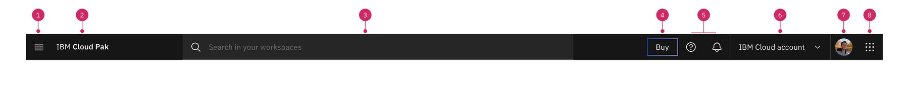
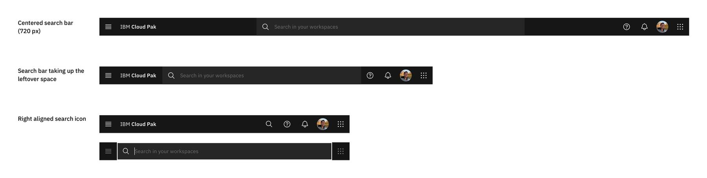

<PageDescription>

Users rely on the global header to navigate and orient themselves in the UI. This documentation outlines some of the qualities that make the global header consistent, familiar, and usable.

</PageDescription>

<AnchorLinks>
  <AnchorLink>Overview</AnchorLink>
  <AnchorLink>Anatomy</AnchorLink>
  <AnchorLink>Styling</AnchorLink>
  <AnchorLink>Behaviors</AnchorLink>
  <AnchorLink>Accessibility</AnchorLink>
</AnchorLinks>

## Overview

The global header is essential to the product’s UI. It is a consistently available user interface element that contains functionality for the current product as well as for the entire system. The global header provides consistent locations to invoke the product’s local navigation as well as pervasive access to system-wide functions and tools such as search, Assist Me, notifications, profile and settings, and navigating between products.

## Anatomy

### On-premise

1. **Main menu:** To ensure a consistent experience, all Cloud Pak products should have the same pattern and interaction for their primary navigation. Reference the <a href="https://pages.github.ibm.com/cdai-design/pal/cloud-paks/navigation/usage/">Cloud Pak navigation guidelines</a>.
2. **Product name:** This will clarify where the user is and minimize the learning curves for our users who may need to navigate from one product to another. This should always and only link the user to the domain’s home page.
3. **Search bar:** A way to find existing work and resources that can be leverage in the user's work and a way to get an overview of existing information around a particular keyword. Reference the [Global search guidelines](https://pages.github.ibm.com/cdai-design/pal/cloud-paks/global-search/usage/).

4. **Utilities:** 
   1. Assist Me: Provides access to contextual support, smart search, WalkMe guided tours, and chat services.
   2. [Notifications](https://pages.github.ibm.com/cdai-design/pal/patterns/notifications/#notification-panel)

5. **Profile:** Users rely on the profile menu to find information related to their account, the product they are using and their active session. Reference the [Profile header menu guidelines](https://pages.github.ibm.com/cdai-design/pal/patterns/profile-header-menu/).
6. **Cloud pak switcher:** Helps users switch from one Pak interface to another without the need to sign on again. Reference the [Cloud Pak switcher guidelines](https://pages.github.ibm.com/cdai-design/pal/cloud-paks/cross-pak-switcher/usage/).

### SaaS

1. **Main menu**
2. **Product name**
3. **Search bar**
4. **Plan details**
5. **Utilities:** 
   1. Assist Me
   2. Notifications
6. **Account dropdown**
7. **Profile**
8. **Cloud pak switcher**

## Styling

## Behaviors

#### Icon States    

The icons in the header have three different states: enabled, hover, and focus.  

  

#### Search Behavior    

The search bar renders differently in response to the browser screen size to maximize the space and magnify the search experience. 

The search bar has a width of 720px and lives in the center of the items on the left and right side of the header. As the screen gets smaller and is no longer able to contain a 720px search bar, the search bar will be the length of the leftover space between the items on the left and right of the header. 

When the screen size is 768px or smaller, the search bar turns into an icon, which will be located on the right side of the header. When a user clicks on the search icon, the search bar will appear across the header, leaving 48px on each side revealing first and last icon on the header.

 

#### Search Bar States    

The search bar has four states: default/hover, hover, clicked in, focus/typing, and finished typing.

## Accessibility

#### Keyboard Navigation    
Tapping the `tab` key will navigate the focus to a container on the screen. The sequential order of tab stops is shown below. When the section of interest is within the user's focus, they can use arrow keys to navigate within the container.

    

**Contributors** 
- [Rami Alayan](https://w3.ibm.com/#/people/5G8306897)   
- [Gentry Baird](https://w3.ibm.com/#/people/1J5123897)
- [Mary Kim](https://w3.ibm.com/#/people/2J0712897)

**Edited by** 
- [Lydia Samuel](https://w3.ibm.com/#/people/4J6877897)

**Last updated**  
Feb 28, 2022
