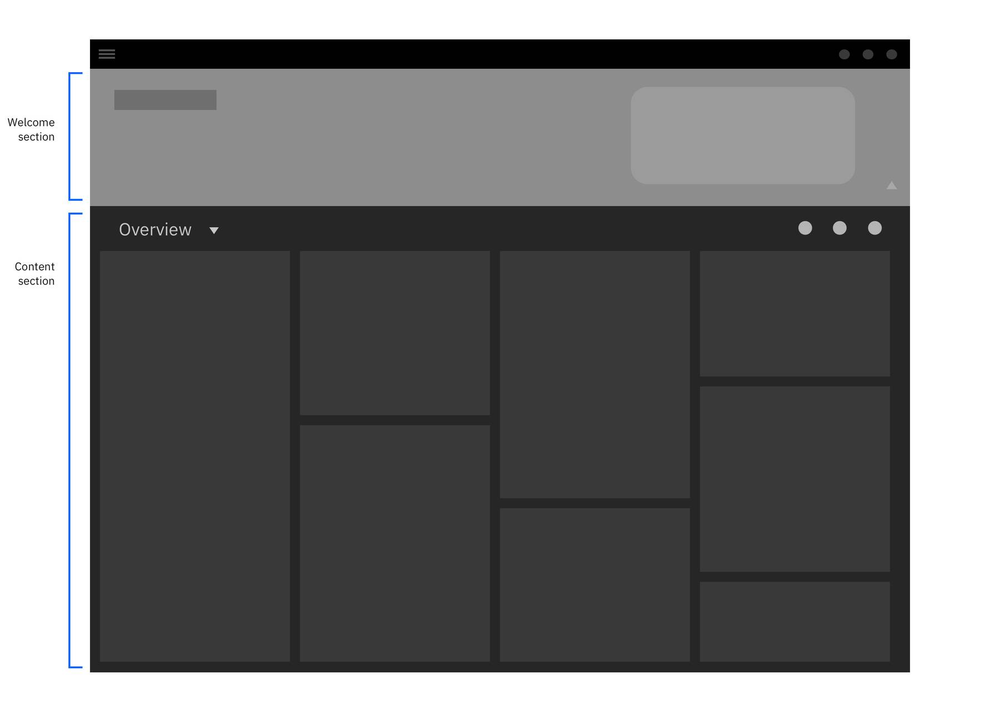
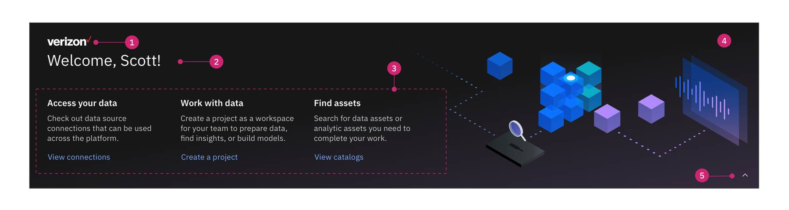
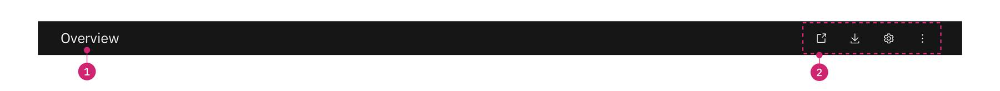
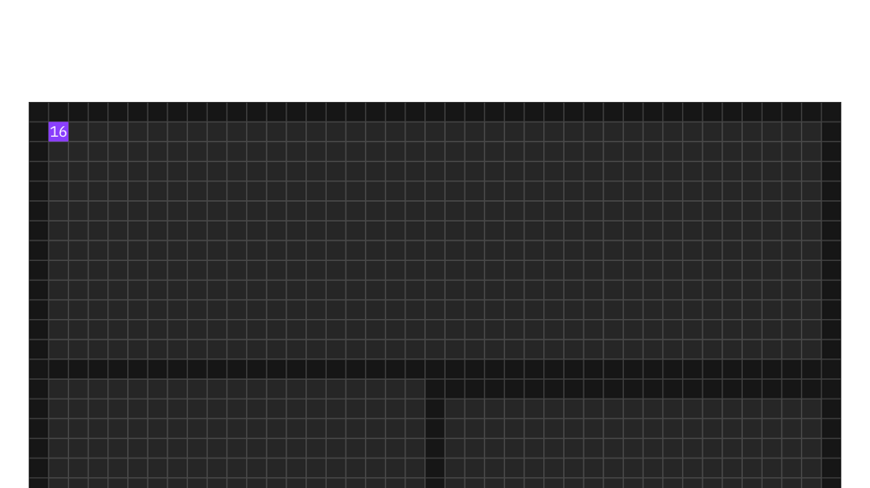

<PageDescription>

The homepage is the main landing page for a product. It serves as a starting point and first impression for our users. Cloud Pak homepages must adhere to the guidelines below to ensure a consistent experience across the Paks and lower the learning curve for cross-Pak users.

</PageDescription>

<AnchorLinks>
  <AnchorLink>Overview</AnchorLink>
  <AnchorLink>Anatomy</AnchorLink>
  <AnchorLink>Welcome section</AnchorLink>
  <AnchorLink>Content section</AnchorLink>
  <AnchorLink>Theme</AnchorLink>
  <AnchorLink>Personalization</AnchorLink>
  <AnchorLink>Customization</AnchorLink>
  <AnchorLink>Implementation</AnchorLink>
</AnchorLinks>

## Resources

<Row className="resource-card-group">
  <Column colMd={4} colLg={4} noGutterSm>
    <ResourceCard
      subTitle="Cross-Pak homepage"
      actionIcon="download"
      aspectRatio="2:1"
      href="https://ibm.box.com/shared/static/0jysp76vh2uvvgqs214blbtjiov9wm4r.sketch">

  </ResourceCard>
  </Column>
</Row>

## Overview

#### Intent

The homepage serves the following purposes:

- Get started: First time users can get started through suggested actions and provided resources.
- Jumping board: Users are able to quickly navigate to their recent work or frequently visited pages.
- Metric/dashboard: Users can see an overview of alerts or critical information and drill down to the respective pages.

#### Role-based framework

Cloud Pak home pages must operate as a framework that dynamically displays content based on user roles, permissions, and installed services or cartridges. Each user should be presented with relevant content, enriched by user permissions and services they have access to. Out of the box content must be assigned with specific permissions to be displayed to the right user roles.

#### Homepage is NOT

NOT a page for a deep-dive analysis.
NOT a page to perform specific actions, complete tasks, or trouble shoot problems.
Instead, the homepage directs the user to the appropriate pages where they can perform the actions above.

## Anatomy

The homepage is comprised of 2 primary zones.

1. **Welcome section:** Greets the user with an inviting tone. The main intent of this section is to help the first time user get started. This section is collapsable.
2. **Content section:** Provides a holistic view of users’ recent work, product updates, and key metrics. This section is composed of useful links and cards.

### Layout grid

- The homepage uses the Carbon [2x Grid](https://www.carbondesignsystem.com/guidelines/2x-grid/overview), [narrow grid](https://www.carbondesignsystem.com/guidelines/2x-grid/implementation) mode as the base layout grid. The page adheres to the Carbon responsive screen guidelines.
- The content section is divided into 4 main columns, evenly distributed across the 16-column [2x Grid](https://www.carbondesignsystem.com/guidelines/2x-grid/overview).

## Welcome section

<Row>
 <Column colLg={12}>

<Caption>Collapsed state</Caption>

 </Column>
</Row>

<Row>
 <Column colLg={12}>

<Caption>Expanded state</Caption>

 </Column>
</Row>

1. **Custom logo (optional):** The admin can upload a custom logo through the brand customization page.
2. **Welcome text:** Greet the user with a welcome. `Welcome, <username>!` is the only format supported.
3. **Getting started links:** Links inform key actions users can get started with. Content, however, may be flexible per Pak and user need. For example, key apps/cartridges promotion. Up to 3 links should be displayed. Each link must consist of a label, a description and a link.
4. **Hero image:** The hero image differentiates the homepage from other pages. The illustration should tell a meaningful story or explain the functionality of the Pak. The hero image should not interfere with the links. Max width spans to 562px on a 1312px width screen. Reference the [isometric illustration guidelines](https://www.ibm.com/design/language/illustration/isometric-style/design).
5. **Accordion button:** The accordion button collapses and opens the welcome section. The collapse state displays the Welcome text, custom logo (if there is one), and accordion button. The last state is persistent even after the page refreshes. The state only changes when the user interacts with the accordion button.

### Best practices

<Row>
 <Column colLg={6}>

<DoDontExample type="dont" captionTitle="Data" caption="Don’t place metrics or visualizations within the welcome section.">

</DoDontExample>

 </Column>

 <Column colLg={6}>

<DoDontExample type="dont" captionTitle="Links" caption="Don’t display more than 3 link sections.">

</DoDontExample>

 </Column>
</Row>

## Content section

- Users can see an overview of their work or quickly navigate to service/cartridge pages through this section.
- Content examples can be a list of recent work, a summary of a service dashboard, notifications, and high-level alerts.

### Header

1. **Title:** The title must always be ‘Overview’.
1. **Action bar (optional):** A set of actions users can perform on the view. If the homepage supports personalization, the settings icon should be accessible here.

### Body

The body section primarily uses a masonry layout based on 4 columns.

1. **Column 1:** The first column is composed of links only. Navigational links and support links are suggested content. Each category of links should have no more than 3~5 out of the box links. Users can add up to 10 links through personalization.
1. **Column 2-4:** The 2nd to 4th columns are composed of cards. The Carbon [narrow grid](https://www.carbondesignsystem.com/guidelines/2x-grid/implementation) creates a 16px gutter in between the cards.

### Masonry card order

- The cards stack in a horizontal order from left column to right.
- Each out-of-the-box cards must be assigned with a specific order number.

### Masonry card size

- **Width:** The width is based on 4 columns of the [2x Grid](https://www.carbondesignsystem.com/guidelines/2x-grid/overview). The card is responsive according to the overall stage width.
- **Height:** The height is flexible based on the content of the card.

<InlineNotification>

**Note:** Card structures are subject to change based on the Card component alignment effort.

</InlineNotification>

#### Card templates

Cloud Pak teams can reference these [card templates](https://ibm.box.com/s/zbiivh0r9mux7asw7htimvgeuf9vjbz1) for use in their homepage when applicable.

#### Best practices

- Each card must have one or more links to navigate to the relevant page.
- Each user role should have at least one card available on their homepage. Avoid displaying an empty page with no cards.
- 5~10 is an ideal number of cards per role based view. Too many cards may overwhelm the user. Admins can add more cards based on their user needs.

## Optional views

<InlineNotification>

**Note:** Common code development does not support the Optional views yet. Until this is supported, product teams must custom build the pages to implement this experience.

</InlineNotification>

The content section may consist of multiple views accessible via a view switcher.

- **Overview:** The first view for all homepages. This view must use the masonry layout.
- **Optional views:** Can be added to the homepage to display specific contexts, for example, role based dashboards. You may select either the masonry or collage layout for these views.

### View switcher

- Use a dropdown next to header title to allow users to switch from one view to another.
- The title of the first view must always be ‘Overview’.
- The titles for optional views are free-form, for example, a name of a dashboard.
- Out of the box, limit to no more than 8 available views.

### Layout options

There are 2 layout options for the optional views, [masonry](/cloud-paks/home-page/usage#body) and [collage](/cloud-paks/home-page/usage#collage-layout). The ‘Overview’ must use the masonry layout. A homepage with multiple views may contain a mix of both layouts.

### Collage layout

Use this layout when the view consists of information related to each other and tells a holistic story/theme. It can also be used when the user needs to monitor and gather insights through comparison of metrics.

### Collage card size

Cards can be flexibly laid out on the canvas. Use the [narrow grid](https://www.carbondesignsystem.com/guidelines/2x-grid/implementation) to create 16px gutters between cards. Cards should rest 16px below the card immediately above it unless it is obstructed from doing so.

<Row>
 <Column colLg={6}>

<DoDontExample type="do">

</DoDontExample>

 </Column>

 <Column colLg={6}>

<DoDontExample type="dont">

</DoDontExample>

 </Column>
</Row>

### Collage card positioning

Cards horizontally align to columns using the 16 column grid. At max width, a single card can span across 16 columns. The minimum card width is 4 columns.

<Caption>
  *Exception: Card displaying an ICA (big number values) can scale down to a
  minimum width of 2 columns.
</Caption>

<Row>
 <Column colLg={6}>

<DoDontExample type="do">

</DoDontExample>

 </Column>

 <Column colLg={6}>

<DoDontExample type="dont">

</DoDontExample>

 </Column>
</Row>

#### Responsive behavior at breakpoints:

- Cards larger than 8 columns adjust to equal the total number of columns available
- Cards maintain their order and stack from left to right

Cards heights leverage the mini unit (8px)\*2 measurement to equal height increments of 16px. The minimum card height is 128px.

<Row>
 <Column colLg={6}>

<DoDontExample type="do">

</DoDontExample>

 </Column>

 <Column colLg={6}>

<DoDontExample type="dont">

</DoDontExample>

 </Column>
</Row>

## Theme

The homepage must always be **gray 100** even if a Pak only supports a single theme. This includes Paks that are using **gray 10 as a default theme.** The homepage will support both light and dark theme when Paks support a full product theme switcher.

## Personalization

Homepage personalization patterns are work in progress along with the efforts on Card component alignment. The end user will be able to personalize their views by:

- Hiding and showing cards & optional views
- Reordering cards & optional views
- Resizing cards
- Editing or filtering card content

## Customization

Homepage customization patterns are work in progress. The administrator will be able to customize their end user view by:

- Creating custom cards using their own data
- Creating new optional views
- Extending out-of-the-box cards and views
- Enabling or disabling cards and views

## Implementation

The team is currently working on building a common code base that can be used across all Pak homepages.

The ‘Overview’ using the masonry layout framework is ready for production. For questions, contact:

- **Design:** Carmen Darlach / Carmen.Darlach@ibm.com

- **Dev:** Sneha Gaikwad / Sneha.Gaikwad@ibm.com

The ‘Optional views’ and the collage layout framework is work in progress. For questions, contact:

- **Design:** Cameron Calder / cecalder@us.ibm.com

For other ZenRock related questions, contact:

- **Design:** Shell Zhu /shell.zhu@ibm.com

- **Dev:** Mike Kaczmarski / kacz@us.ibm.com
