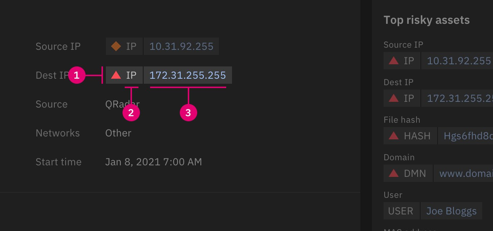
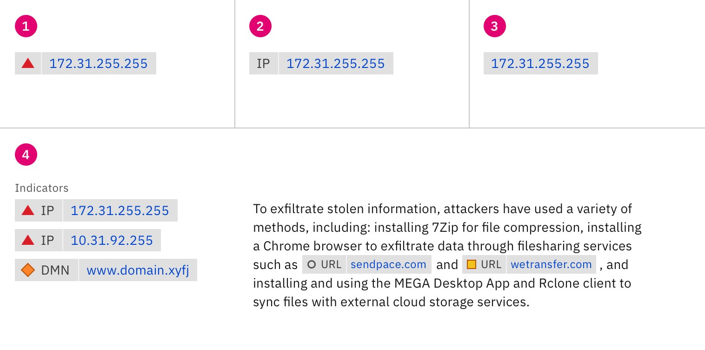
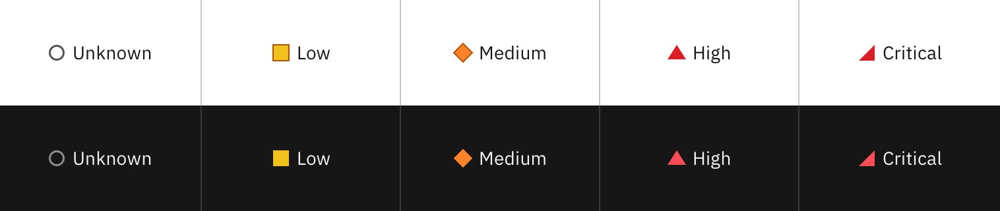
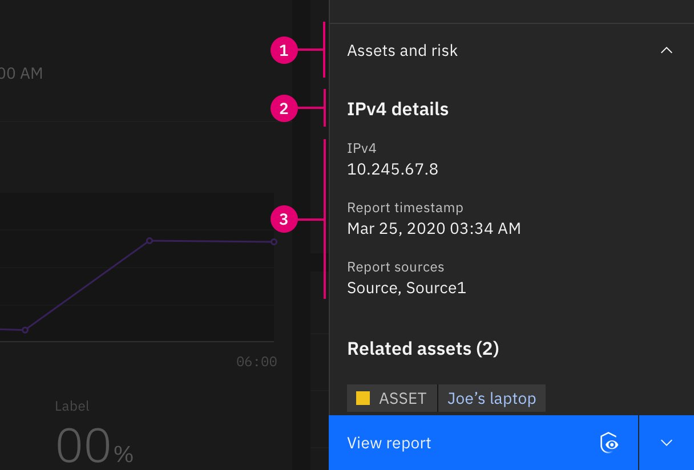
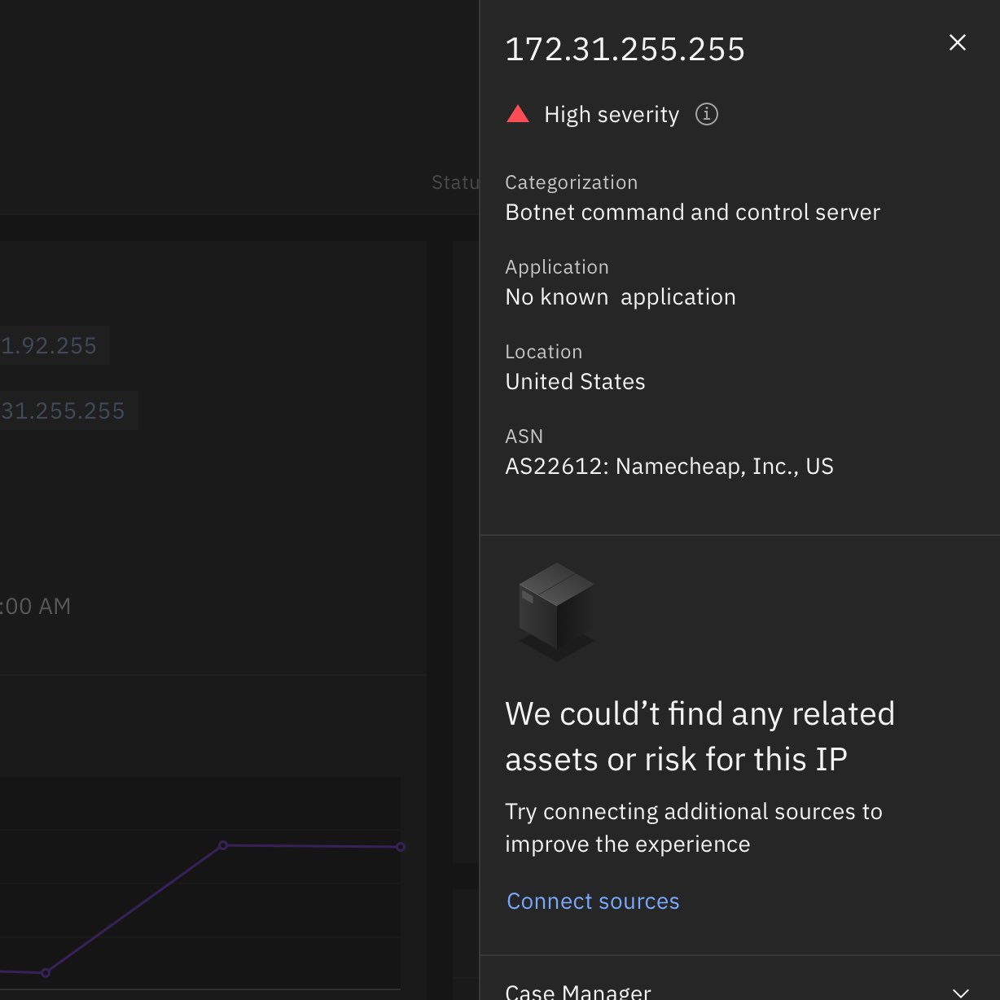
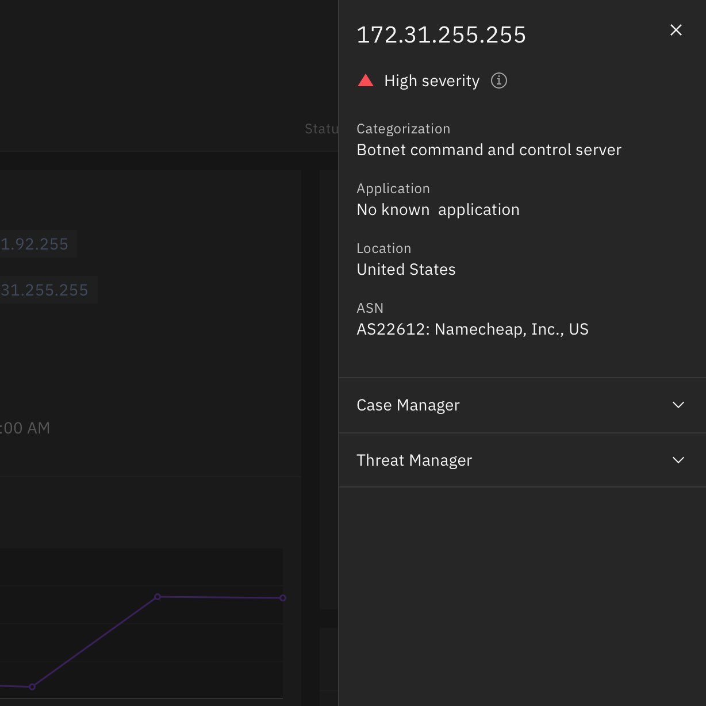
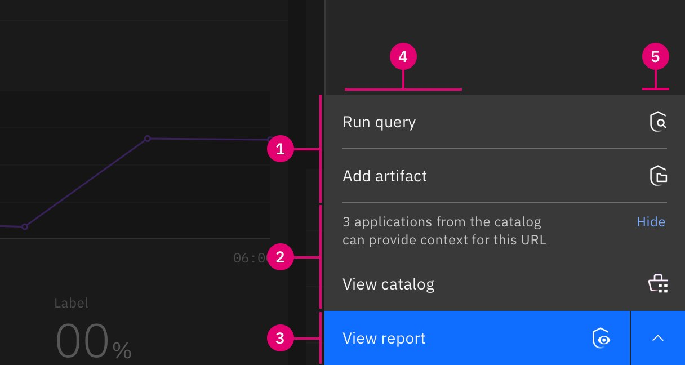
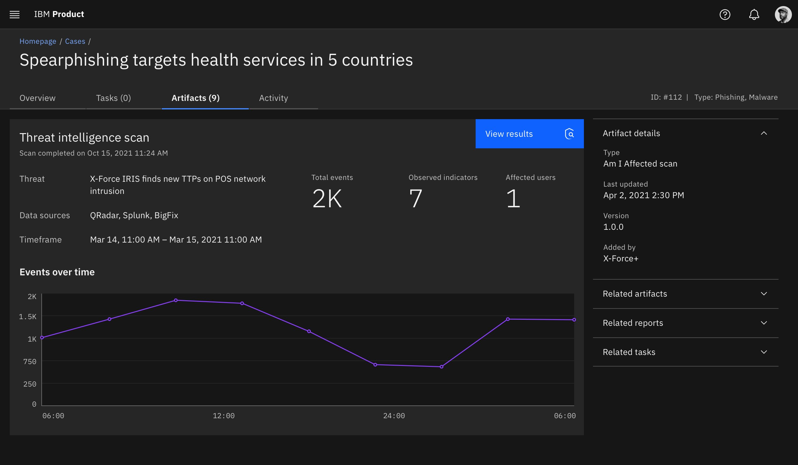
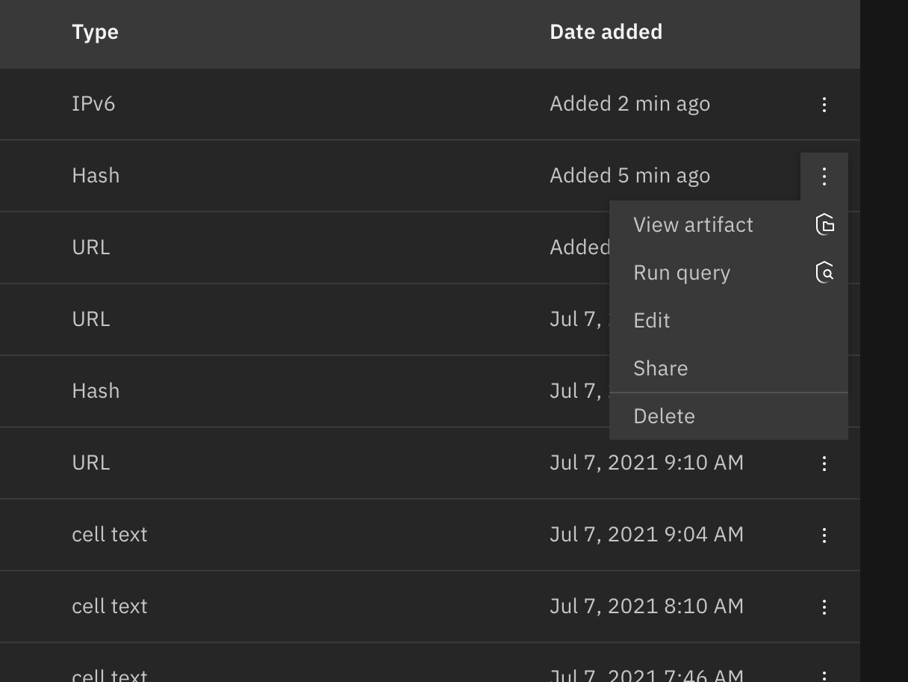
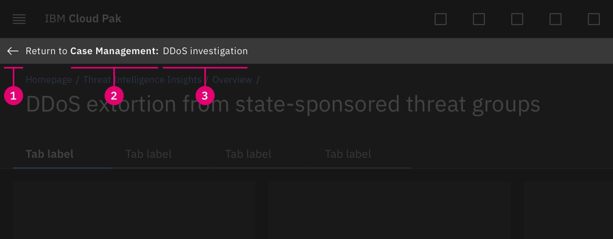

<PageDescription>

The following components can be used to created integrated interactions across the Pak.

</PageDescription>

<AnchorLinks>
  <AnchorLink>Data decorators</AnchorLink>
  <AnchorLink>Data fragments</AnchorLink>
  <AnchorLink>Page integrations</AnchorLink>
  <AnchorLink>Pivot buttons</AnchorLink>
  <AnchorLink>Modals</AnchorLink>
  <AnchorLink>ReturnTo banner</AnchorLink>
  <AnchorLink>Tearsheets</AnchorLink>
</AnchorLinks>

## Resources

<Row className="resource-card-group">
  <Column colMd={4} colLg={4} noGutterSm>
    <ResourceCard
      subTitle="Integrated interaction components"
      actionIcon="download"
      aspectRatio="2:1"
      href="">

  </ResourceCard>
  </Column>
</Row>

## Data decorators

Data decorators distinguishes important data points from less important content. Data decorators allows users to see which data entities are enriched with information from other sources by differentiating them from non-enriched data.

### Anatomy

A decorator is composed of a severity icon, an object type, and a value. Everything but the value is optional. There is a spacer line used only when the icon and/or the type is displayed to separate the value. 

<Row>
 <Column colLg={8}>

 </Column>
</Row>

1. **Indicator icon (optional):** The severity of the object. (Ex: critical, high, medium, low)
2. **Object type (optional):** Lets the user know what type of object this is. (Ex: IP, URL, USER, VUL, HASH, DMN, MAC)
3. **Object value:** The name of the object. The “data” part of the decorator.

### Variants

<Row>
 <Column colLg={8}>

 </Column>
</Row>

1. **Icon + value:** Use this variant when the type is a label or when it is used within a table column and the column header is the object type
2. **Type + value:** Use this variant when there is no severity or risk score
3. **Value only:** Use this variant when there is no severity or risk and the type is defined otherwise
4. **Sizes:** There are two decorator sizes: `default` and `inline` (small). Choose a size that works best for the context of the data. Decorators within a standard table (48px) should use a default decorator; for smaller formats, such as use within body text, the inline size will be more accommodating.

### Indicator icons

Data decorators are designed to display the objects severity or risk. The indicators above can be used within data decorators. More info can be found under [status indicators](https://www.carbondesignsystem.com/patterns/status-indicator-pattern/)

<Row>
 <Column colLg={8}>

 </Column>
</Row>

### Text truncation

When the value of a decorator is more than 20 characters, truncate to 16 characters. Truncation happens between the first 12 characters and the last 4 characters. If the value is less than or equal to 20 characters then show the entire value. If the data decorator resides within a table, the truncation is determined by the width of the containing column.

<Row>
 <Column colLg={8}>

 </Column>
</Row>

### Interaction

The distinct data decorator design is a cue to inform users that more information about the object can be progressively discovered. The most typical follow through action is to initiate a side panel to display additional information, data fragments, available actions, and platform pivot options.

<Row>
 <Column colLg={8}>

<Video src="images/data-decorators-interactions.mov">
  <track kind="captions" src="images/data-decorators-interactions.mov" />
</Video>

 </Column>
</Row>

### When to use

- Data decorators can be used anywhere enriched data is presented. They mostly occur in tabular format, but there is an inline version for displaying with other text. The inline version could also be used where the space is limited (ex. side panels). 
- Data decorators should only apply to data objects that are enriched or could potentially be enriched
- Data decorators define/contain data as objects to the user

### When not to use

- 🚫 Data decorators should not be used to contain simple text
- 🚫 Data decorators should not be used to emphasize/stylize text in a paragraph 
- 🚫 Data decorators should not be used as titles or headlines

## Data fragments

Data fragments are structured information sourced from elsewhere across the Pak to augment the contextual understanding of a specific subject without needing to observe the information from multiple page destinations and sources. Data fragments can be sourced from applications, connected data sources, and informational API feeds.

### Anatomy

Data fragments are designed for universal consistency and common data formatting, primarily using the `DescriptionListModule`. `DescriptionModule` can be used as an alternative for long form content.

<Row>
 <Column colLg={8}>

 </Column>
</Row>

1. **Accordion item:** Title identifying the source of the data fragment. 
2. **Sub-section title:** Sub-section title used to identify information at a glance.
2. **Fragment content:** Information related to the subject, sourced from another application(s) or connected data source(s).

### Placement

Data fragments can be used within a page UI but are typically observed within panels as accordions placed directly below in-application information about the subject.

<Row>
 <Column colLg={8}>

 </Column>
</Row>

1. **In-application details:** Information sourced directly from the application that the user is within.
2. **Data fragment:** Additional information sourced from other sources and formatted as accordions.

### When to use

- Consider a data fragment if your application can help augment the understanding of common data objects (Ex: IP, URL, USER, VUL, HASH, DMN, MAC)
- Data fragments should be dynamically referenced and made available universally across the Pak in relation to their associated subject.

<DoDontRow>

<DoDont caption="Display an empty state if a data fragment is needed to provide critical subject matter context but the expected configuration is not met.">

</DoDont>

<DoDont caption="If a data fragment is supplemental and not expected based on the configuration for the user or organization, hide the section and do not display an empty state.">

</DoDont>

</DoDontRow>

## Modals

<Row>
 <Column colLg={8}>

 </Column>
</Row>

## Page integrations

<Row>
 <Column colLg={8}>

 </Column>
</Row>

## Pivot buttons

Pivot buttons provide the ease and means to contextually work from one application to another application, keeping the user in a fluid workflow. Pivot buttons can be used as a [single button](https://www.carbondesignsystem.com/components/button/usage/) action or presented as a [split button](https://pages.github.ibm.com/ai-applications/design/components/buttons/usage#split-button) when multiple options are available.

### Anatomy

Pivot buttons leverage Carbon buttons. Pivot buttons augment Carbon buttons with the use of application icons to set destination expectations.  This anatomy example uses a [split button](https://pages.github.ibm.com/ai-applications/design/components/buttons/usage#split-button).

<Row>
 <Column colLg={8}>

 </Column>
</Row>

1. **Available actions:** Supplementary apps that perform an action or take the user further obtain information about the subject.
2. **Upsell nudge (optional):** Apps that are not available to the user but can perform an action or provide a point of view about the subject.
3. **Default action:** Primary app action for the subject.
4. **Text label:** Indicates what action will occur. The application name should not be included in the text label.
5. **App icon:** Indicates the app where the action will take place or where the user will be taken.  The solid color icon is predominantly used within buttons unless a ghost button is used. In this case, the gradient icon should be used. For better legibility, icons are size 20.

### When to use

- When indicating an action facilitated by another application outside of the current one.
- When indicating a pivot that can be taken to another application to continue fluid workflow.

<DoDontRow>

<DoDont caption="Pivot buttons can be placed where normal Carbon buttons reside in the UI. Follow hierarchical guidance for button choice.">

</DoDont>

<DoDont caption="In addition to standard buttons and split buttons, pivot buttons can be included within overflow menus.">

</DoDont>

</DoDontRow>

### When not to use
- 🚫 Do not use if the button does not perform an action facilitated by another application.
- 🚫 Do not use if the button does not pivot to another application.

## ReturnTo banner

The ReturnTo banner is a platform navigation component that displays when a pivot happens from one application page to another application page. The ReturnTo banner can also be used when pivoting from an application page to a platform page (ex: pivoting from an application to connect a data source). It is not a replacement for breadcrumbs but rather it serves to inform when cross-navigating applications occurs with a visible beacon to return to the previous application experience.

### Anatomy

<Row>
 <Column colLg={8}>

 </Column>
</Row>

1. **Back arrow:** Indicates backward navigation directly to the previous application page.
2. **Application name:** The name of the application that the pivot was made from.
3. **Page title:** The title of the exact page that the pivot was made from.

### Cross platform transition

The transition serves to distinguish against conventional navigation within an application. The transition is a usability accompaniment to the ReturnTo banner, unequivocally informing the user when they are pivoting across applications.

<Row>
 <Column colLg={8}>

<Video src="images/returnto-banner-example.mov">
  <track kind="captions" src="images/returnto-banner-example.mov" />
</Video>

 </Column>
</Row>

### Usage
- The banner displays the name of the application and the page that was pivoted away from.
- Pressing on the ReturnTo banner will take you back to the page within the original app.
- There should only be one ReturnTo path tracked at a time.
- The banner is only displayed if moving from a pivot point from within the page of an application to another application.
- It is dismissed when navigating back to the platform homepage or using the navigation panel menu to move to another destination.
- The banner is not shown when navigating within the same app.
- Using the global navigation should not reveal the ReturnTo banner.

### When not to use
- 🚫 Not displayed if navigating using the launchbar, global navigation, or platform homepage.
- 🚫 Not displayed if using the breadcrumbs to navigate backwards.
- 🚫 Not displayed if making lateral jumps from platform-level pages.
- 🚫 Not displayed if navigating around within the same application.

## Tearsheets

<Row>
 <Column colLg={8}>

 </Column>
</Row>