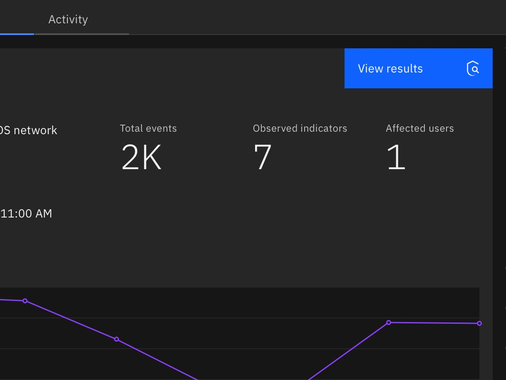
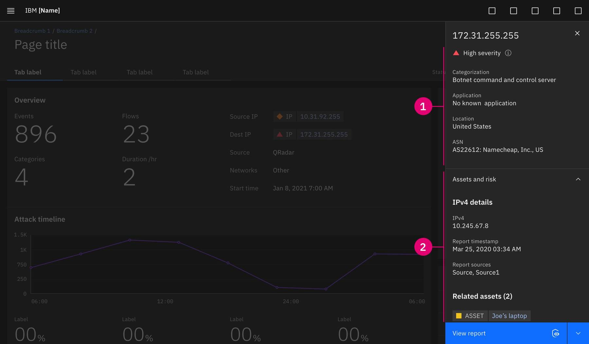
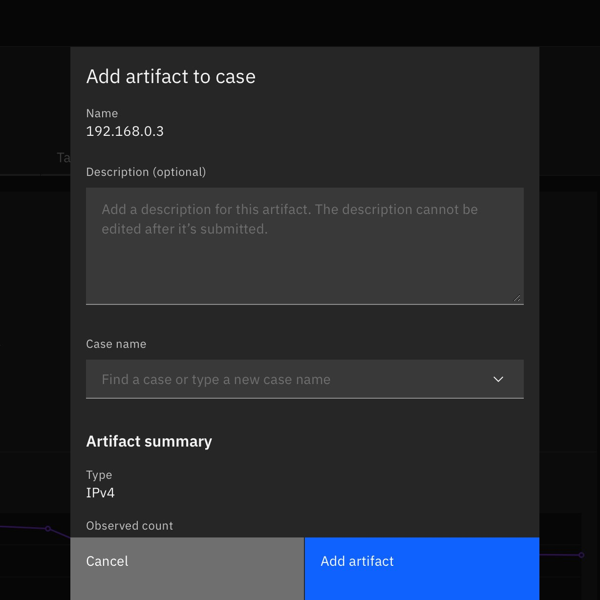
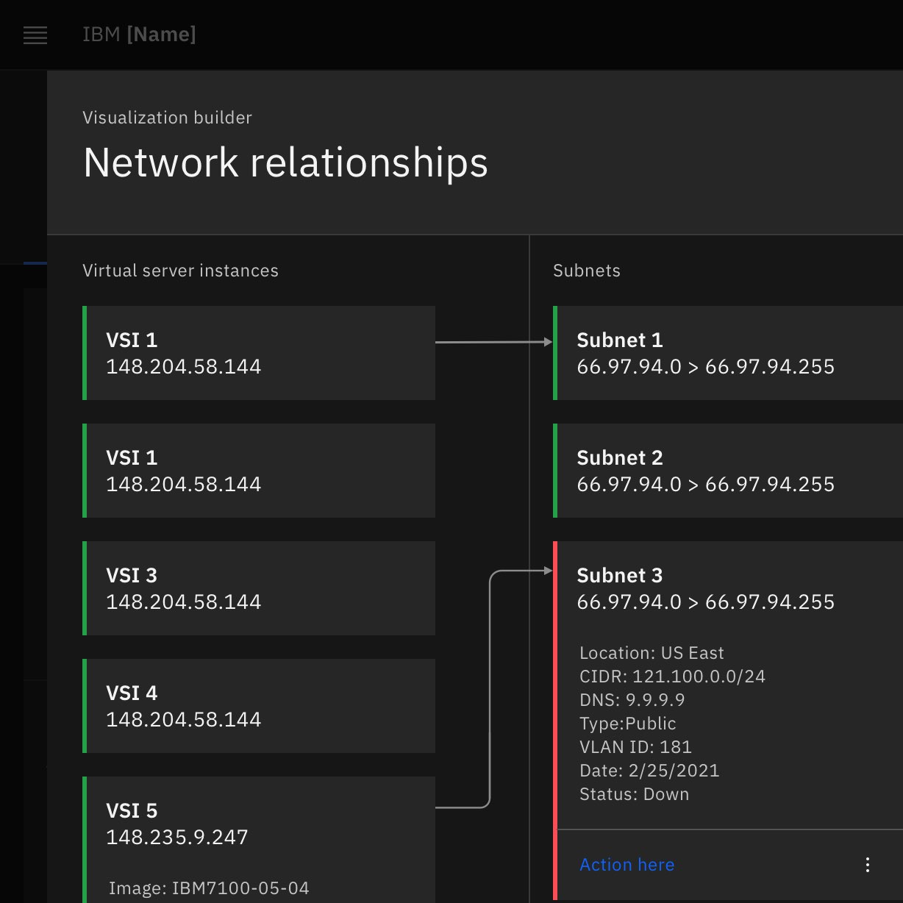
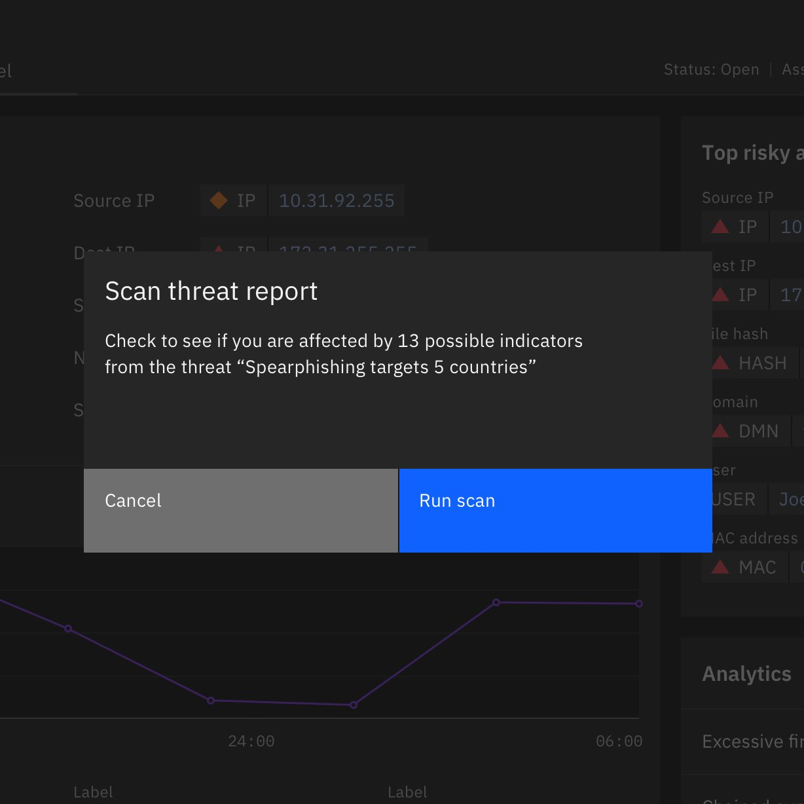
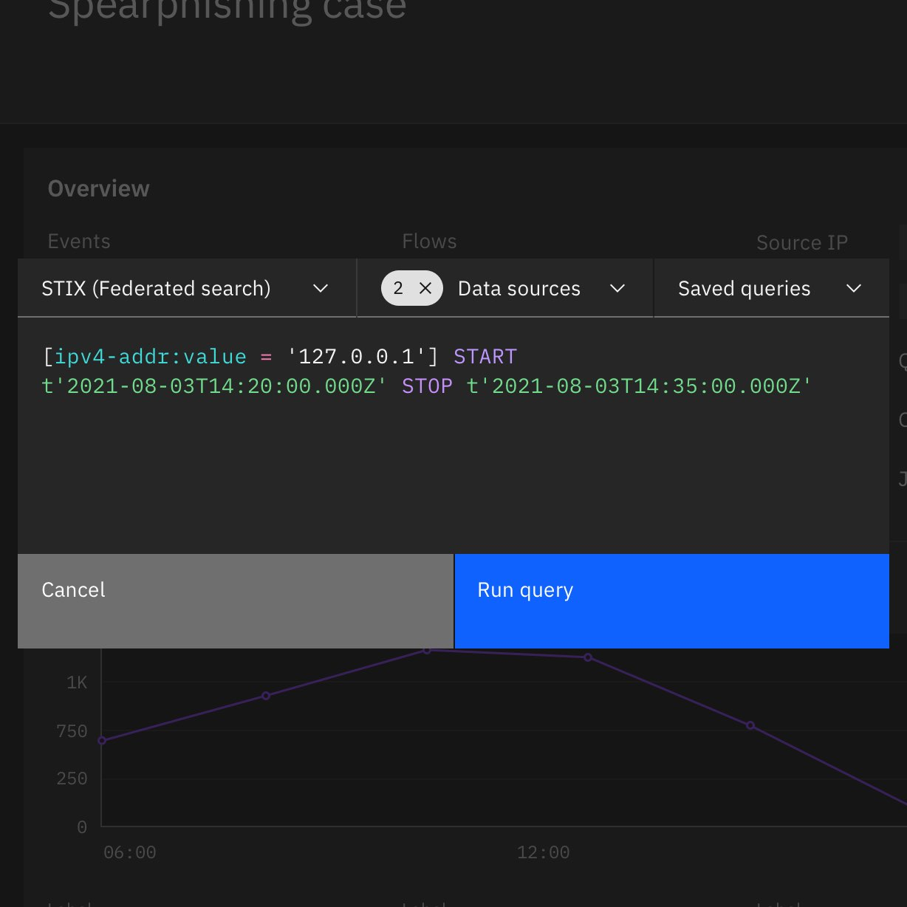

<PageDescription>

The following components can be used to created integrated interactions across the Pak.

</PageDescription>

<AnchorLinks>
  <AnchorLink>Pivot buttons</AnchorLink>
  <AnchorLink>ReturnTo banner</AnchorLink>
  <AnchorLink>Data decorators</AnchorLink>
  <AnchorLink>Data fragments</AnchorLink>
  <AnchorLink>Tearsheets</AnchorLink>
  <AnchorLink>Modals</AnchorLink>
  <AnchorLink>Custom integrations</AnchorLink>
</AnchorLinks>

## Resources

<Row className="resource-card-group">
  <Column colMd={4} colLg={4} noGutterSm>
    <ResourceCard
      subTitle="Integrated interaction components"
      actionIcon="download"
      aspectRatio="2:1"
      href="https://ibm.box.com/s/pop95z30sbjvhi7v9oqegcxmrcu24hxl">

  </ResourceCard>
  </Column>
</Row>

## Pivot buttons

Pivot buttons provide the ease and means to contextually work from one application to another application, keeping the user in a fluid workflow. Pivot buttons can be used as a [single button](https://www.carbondesignsystem.com/components/button/usage/) action or presented as a [split button](https://pages.github.ibm.com/ai-applications/design/components/buttons/usage#split-button) when multiple options are available.

### Anatomy

Pivot buttons leverage Carbon buttons. Pivot buttons augment Carbon buttons with the use of application icons to set destination expectations.  This anatomy example uses a [split button](https://pages.github.ibm.com/ai-applications/design/components/buttons/usage#split-button).

<Row>
 <Column colLg={8}>

 </Column>
</Row>

1. **Available actions:** Supplementary apps that perform an action or take the user further obtain information about the subject.
2. **Upsell nudge (optional):** Apps that are not available to the user but can perform an action or provide a point of view about the subject.
3. **Default action:** Primary app action for the subject.
4. **Text label:** Indicates what action will occur. The application name should not be included in the text label.
5. **App icon:** Indicates the app where the action will take place or where the user will be taken.  The solid color icon is predominantly used within buttons unless a ghost button is used. For better legibility, icons are size 20.

### When to use

- When indicating an action facilitated by another application outside of the current one.
- When indicating a pivot that can be taken to another application to continue fluid workflow.

<DoDontRow>

<DoDont caption="Pivot buttons can be placed where any Carbon button resides in the UI. Follow hierarchical guidance for button choice.">

</DoDont>

<DoDont caption="In addition to standard buttons and split buttons, pivot buttons can be included within overflow menus.">

</DoDont>

</DoDontRow>

### When not to use
- 🚫 Do not use if the button does not perform an action facilitated by another application.
- 🚫 Do not use if the button does not pivot to another application.

## ReturnTo banner

The ReturnTo banner is a platform navigation component that displays when a pivot happens from one application page to another application page. The ReturnTo banner can also be used when pivoting from an application page to a platform page (ex: pivoting from an application to settings). It is not a replacement for breadcrumbs but rather it serves to inform when cross-navigating applications occurs with a visible beacon to return to the previous application experience.

### Anatomy

<Row>
 <Column colLg={8}>

 </Column>
</Row>

1. **Back arrow:** Indicates backward navigation directly to the previous application page.
2. **Application name:** The name of the application that the pivot was made from.
3. **Page title:** The title of the exact page that the pivot was made from.

### Cross platform transition

The transition serves to distinguish against conventional navigation within an application. The transition is a usability accompaniment to the ReturnTo banner, unequivocally informing the user when they are pivoting across applications.

<Row>
 <Column colLg={8}>

<Video src="images/returnto-banner-example.mov">
  <track kind="captions" src="images/returnto-banner-example.mov" />
</Video>

 </Column>
</Row>

### When to use
- The returnTo banner displays the name of the application and the page that was pivoted away from.
- Pressing on the returnTo banner will take you back to the page within the original app.
- There should only be one returnTo path tracked at a time.
- The returnTo banner is only displayed if moving from a pivot point from within the page of an application to another application.
- The returnTo banner automatically dismisses when navigating back to the platform homepage or when the navigation panel menu is used to move to another destination.
- The returnTo banner is not shown when navigating within the same app.
- Using the global navigation should not reveal the returnTo banner.

### When not to use
- 🚫 Not displayed if navigating using the launchbar, global navigation, or platform homepage.
- 🚫 Not displayed if using the breadcrumbs to navigate backwards.
- 🚫 Not displayed if making lateral jumps from platform-level pages.
- 🚫 Not displayed if navigating around within the same application.

## Data decorators

Data decorators distinguishes important data points from less important content. Data decorators allows users to see which data entities are enriched with information from other sources by differentiating them from non-enriched data.

### Anatomy

A decorator is composed of a severity icon, an object type, and a value. Everything but the value is optional. There is a spacer line used only when the icon and/or the type is displayed to separate the value. 

<Row>
 <Column colLg={8}>

 </Column>
</Row>

1. **Indicator icon (optional):** The severity of the object. (Ex: critical, high, medium, low)
2. **Object type (optional):** Lets the user know what type of object this is. (Ex: IP, URL, USER, VUL, HASH, DMN, MAC)
3. **Object value:** The name of the object. The “data” part of the decorator.

### Variants

<Row>
 <Column colLg={8}>

 </Column>
</Row>

1. **Icon + value:** Use this variant when the type is a label or when it is used within a table column and the column header is the object type.
2. **Type + value:** Use this variant when there is no severity or risk score.
3. **Value only:** Use this variant when there is no severity or risk and the type is defined otherwise.
4. **Sizes:** There are two decorator sizes: `default` and `inline` (small). Choose a size that works best for the context of the data. Decorators within a standard table (48px) should use a default decorator; for smaller formats, such as use within body text, the inline size will be more accommodating.

### Shape indicators

Data decorators are designed to display the objects severity or risk. The indicators above can be used within data decorators. More info can be found under [status indicators](https://www.carbondesignsystem.com/patterns/status-indicator-pattern/#shape-indicators).

<Row>
 <Column colLg={8}>

 </Column>
</Row>

### Text truncation

When the value of a decorator is more than 20 characters, truncate to 16. Truncation happens between the first 12 characters and the last 4. If the value is less than or equal to 20 characters then show the entire value. If the data decorator resides within a table, the truncation is determined by the width of the column. More info about truncation can be found under [Overflow content](https://www.carbondesignsystem.com/patterns/overflow-content/).

<Row>
 <Column colLg={8}>

 </Column>
</Row>

### Interaction

The distinct data decorator design is a cue to inform users that more information about the object can be progressively discovered. The most typical follow through action is to initiate a side panel to display additional information, data fragments, available actions, and platform pivot options.

<Row>
 <Column colLg={8}>

<Video src="images/data-decorators-interactions.mov">
  <track kind="captions" src="images/data-decorators-interactions.mov" />
</Video>

 </Column>
</Row>

### When to use

- Data decorators can be used anywhere enriched data is presented. They mostly occur in tabular format, but there is an inline version for displaying with other text. The inline version could also be used where the space is limited (ex. side panels). 
- Data decorators should only apply to data objects that are enriched or could potentially be enriched
- Data decorators define/contain data as objects to the user

### When not to use

- 🚫 Data decorators should not be used to contain simple text
- 🚫 Data decorators should not be used to emphasize/stylize text in a paragraph 
- 🚫 Data decorators should not be used as titles or headlines

## Data fragments

Data fragments are structured information sourced from elsewhere across the Pak to augment the contextual understanding of a specific subject without needing to observe the information from multiple page destinations and sources. Data fragments can be sourced from applications, connected data sources, and informational API feeds.

### Anatomy

Data fragments are designed for universal consistency and common data formatting, primarily using the `DescriptionListModule`. `DescriptionModule` can be used as an alternative for long form content. If necessary for the experience, data fragments can take the shape of a custom design. 

<Row>
 <Column colLg={8}>

 </Column>
</Row>

1. **Accordion item:** Title identifying the source of the data fragment. 
2. **Sub-section title:** Sub-section title used to identify information at a glance.
2. **Fragment content:** Information related to the subject, sourced from another application(s) or connected data source(s).

### Placement

Data fragments can be used within a page UI but are typically observed within panels as accordions placed directly below in-application information about the subject.

<Row>
 <Column colLg={8}>

 </Column>
</Row>

1. **In-application details:** Information sourced directly from the application that the user is within.
2. **Data fragment:** Additional information sourced from other sources and formatted within accordions.

### When to use

- Consider a data fragment if your application can help augment the understanding of common data objects (Ex: IP, URL, USER, VUL, HASH, DMN, MAC)
- Data fragments should be dynamically referenced from the hosting service and made available universally across the Pak in relation to their associated subject.

<DoDontRow>

<DoDont caption="Display an empty state if a data fragment is needed to provide critical subject matter context but the expected configuration is not met.">

</DoDont>

<DoDont caption="If a data fragment is supplemental, does not return any information, or is not mandatory based on the configuration for the user or organization, hide the section and do not display an empty state.">

</DoDont>

</DoDontRow>

## Tearsheets

Tearsheets, as part of the IIF, are used to bring correlated information from other sources (applications & services) to the user, avoiding unneccesary navigation elsewhere across the platform.

Tearsheets choreograph with other IIF components, like pivot buttons, to initiate the passing of information or to contextually bring experiences in to the current view.

### Anatomy

<Row>
 <Column colLg={8}>

 </Column>
</Row>

1. **Tearsheet:** The tearsheet is hosted by the platform. The Tearsheet is an ideal component because of it’s ability to retain context above the user’s current page.
2. **Content:** The content within the tearsheet is owned by an application. Through the tearsheet, content is surfaced within any app, anywhere on the platform to capture information and pass it back.

### When to use
- Narrow tearsheets can be used to pass information to another place or service on the Pak.
- Wide tearsheets can be used to shift focus to a related experience while keeping the context to the originating page.
 

<DoDontRow>

<DoDont caption="This use case demostrates that an “investigation artifact” can be captured from any app and the platform facilitates the use of the “Case Management” app to save the artifact back to a case.">

</DoDont>

<DoDont caption="In the wide tearsheet, you can place a visualization, a table, or a full experience from another application.">

</DoDont>

</DoDontRow>

## Modals

Modals, as part of the IIF, are used to provide context when confirming actions or to request necessary user input in order to continue initiating integration actions.

### Anatomy

<Row>
 <Column colLg={8}>

 </Column>
</Row>

1. **Modal:** The modal can utilize default Carbon components or use a custom modal if the experience dictates it.
2. **Content:** The content within the modal is owned by an application or service. It can host simple inputs and/or confirmations that trigger an action elsewhere on the platform.

### When to use

<DoDontRow>

<DoDont caption="This use case demostrates an “Am I affected” threat scan from the Threat Intelligence Insights app initiated through a modal from any application across the platform.">

</DoDont>

<DoDont caption="This use case demostrates a federated query from the Data Explorer app initiated through a custom modal from any application across the platform.">

</DoDont>

</DoDontRow>

## Custom integrations

On occasion, to meet customer experience needs, a custom integration component is required. Custom integrations can be created to contextually enrich a current page through a reference from another application source, it can be used as a means to pass information elsewhere, or it can be used to thread app to app experiences together across the platform. The IIF doesn’t dictate the experience structure but the custom integration should utilize common elements, like pivot buttons, where applicable to craft the experience.

### Example use-cases

#### Application to service integration

In this example, there is a custom integration within the application “Threat Intelligence Insights” that connects to the customer’s data sources via the platform. The customer can contextually initiate a scan across their connected data sources to locate any indicators listed in the threat report. Details of the scan and results are provided in the same view.

<Row>
 <Column colLg={8}>

<Video src="images/custom-integration-example-1.mov">
  <track kind="captions" src="images/custom-integration-example-1.mov" />
</Video>

 </Column>
</Row>

#### Application to application integration

In this example, there is a custom integration between the applications “Threat Intelligence Insights” and “Case Management”. If indicators from the scan are found (from the above referenced example), then a case is automatically created in “Case Management”. The custom integration within the “Threat Intelligence Insights” page shows case details and provides a direct link to the newly created case.

<Row>
 <Column colLg={8}>

<Video src="images/custom-integration-example-2.mov">
  <track kind="captions" src="images/custom-integration-example-2.mov" />
</Video>

 </Column>
</Row>