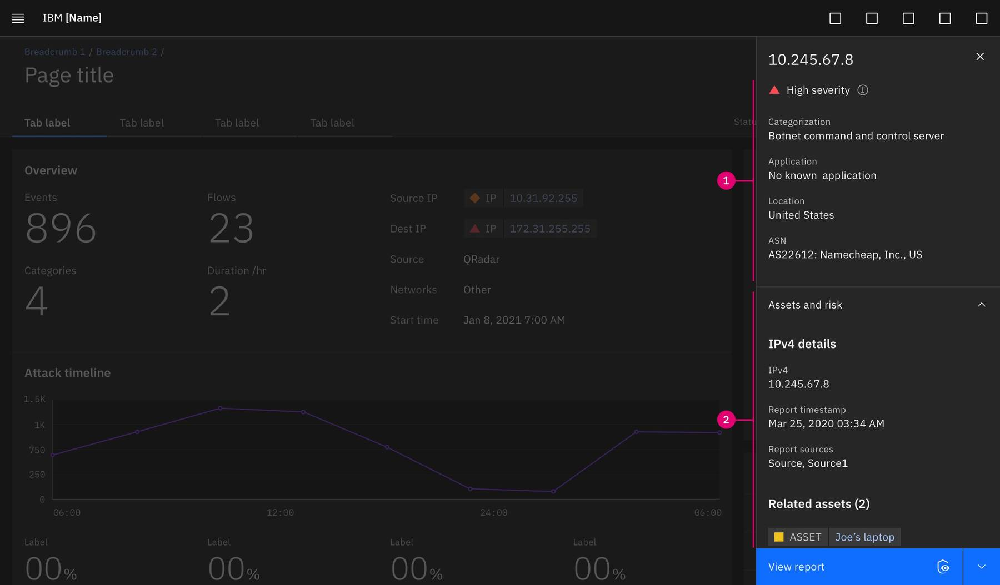

<PageDescription>

The integrated interaction framework enables teams to build seamless workflows across composable solutions, staying connected within the platform.

</PageDescription>

<AnchorLinks>
  <AnchorLink>Overview</AnchorLink>
  <AnchorLink>In-context enrichment</AnchorLink>
  <AnchorLink>Passing information</AnchorLink>
  <AnchorLink>Seamless navigation</AnchorLink>
</AnchorLinks>

## Resources

<Row className="resource-card-group">
  <Column colMd={4} colLg={4} noGutterSm>
    <ResourceCard
      subTitle="Integrated interaction components"
      actionIcon="download"
      aspectRatio="2:1"
      href="">

  </ResourceCard>
  </Column>
</Row>

## Overview

## In-context enrichment

Bringing relevant information forward through in-context data enrichment

### Data fragments

<Row>
 <Column colLg={8}>

 </Column>
</Row>

1. **In-app details:** Information sourced directly from the app the user is within.
2. **Integrated data fragment (optional):** Information related to the subject, sourced from another app(s) or connected data source(s).

## Passing information

Share information, from application to application, across the platform.

### Components

## Seamless navigation

Contextually navigating from one application to another, providing a seamless way-finding experience

### Pivot button

<Row>
 <Column colLg={8}>

 </Column>
</Row>

1. **Available actions:** Supplementary apps that perform an action or take the user further obtain information about the subject.
2. **Upsell nudge (optional):** Apps that are not available to the user but can perform an action or provide a point of view about the subject.
3. **Default action:** Primary app action for the subject.
4. **Text label:** Indicates what action will occur. The app title should not be included in the text label.
5. **App icon:** Indicates the app where the action will take place or where the user will be taken.

<Row>
 <Column colLg={8}>

 </Column>
</Row>

The pivot button can also be placed within the page UI as well. The same behavior and attributes apply as stated in the anatomy.

### ReturnTo banner

The ReturnTo banner is a platform navigation component that displays when a pivot happens from one application page to another application page. The ReturnTo banner can also be used when pivoting from an application page to a platform page (ex: pivoting from an application to connect a data source). It is not a replacement for breadcrumbs but rather it serves to inform when cross-navigating applications occurs with a visible beacon to return to the previous application experience.

<Row>
 <Column colLg={8}>

 </Column>
</Row>

1. **Back arrow:** Indicates backward navigation directly to the previous application page.
2. **Application name:** The name of the application that the pivot was made from.
3. **Page title:** The title of the exact page that the pivot was made from.

#### Cross platform transition

The transition serves to distinguish against conventional navigation within an application. The transition is a usability accompaniment to the ReturnTo banner, unequivocally informing the user when they are pivoting across applications.

<Row>
 <Column colLg={8}>

<Video src="images/returnto-banner-example.mov">
  <track kind="captions" src="images/returnto-banner-example.mov" />
</Video>

 </Column>
</Row>

#### Usage
- The banner displays the name of the application and the page that was pivoted away from.
- Pressing on the ReturnTo banner will take you back to the page within the original app.
- There should only be one ReturnTo path tracked at a time.
- The banner is only displayed if moving from a pivot point from within the page of an application to another application.
- It is dismissed when navigating back to the platform homepage or using the navigation panel menu to move to another destination.
- The banner is not shown when navigating within the same app.
- Using the global navigation should not reveal the ReturnTo banner.

#### When not to use the banner:
- 🚫 Not displayed if navigating using the launchbar, global navigation, or platform homepage
- 🚫 Not displayed if using the breadcrumbs to navigate backwards
- 🚫 Not displayed if making lateral jumps from platform-level pages
- 🚫 Not displayed if navigating around within the same application