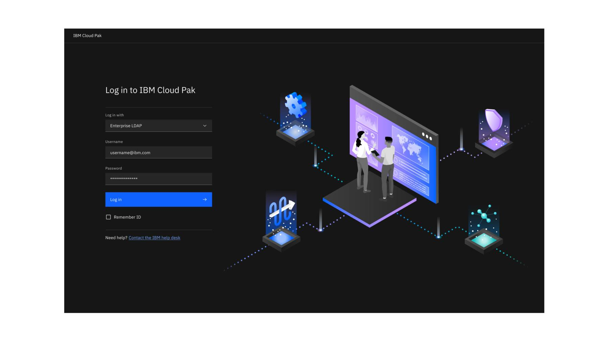
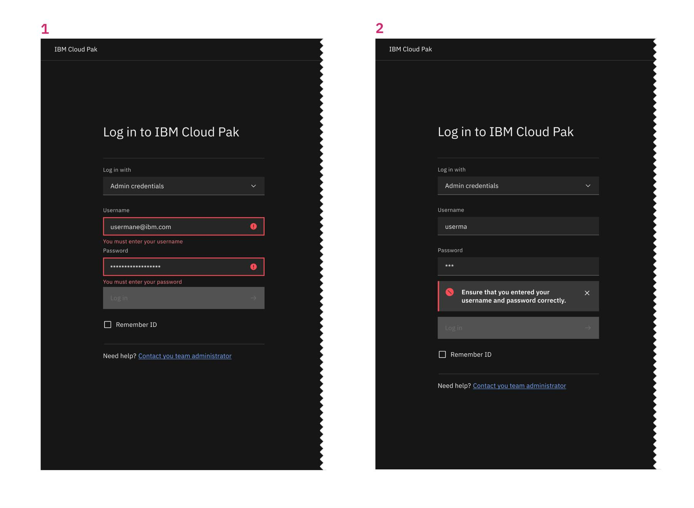

<PageDescription>

The login page allows a user to gain access to an application by entering their user ID and password for the authentication method configured in the IBM product, or by directing to a third party.

</PageDescription>

<AnchorLinks>
<AnchorLink>Overview</AnchorLink>
<AnchorLink>On-prem</AnchorLink>
<AnchorLink>Authentication types</AnchorLink>
<AnchorLink>States</AnchorLink>
<AnchorLink>Accessibility</AnchorLink>
</AnchorLinks>

## Overview

This pattern describes the log in experience for IBM Cloud Pak. It describes the design and recommended behaviors that enable a user to provide a username and password as credentials for authentication against one of multiple methods configured in the IBM Cloud Pak. In addition, it describes the design and recommended behaviors when the user needs to be redirected to a third party for authentication.

### Anatomy

1. **Page title:** Indicates logging in to IBM Cloud Pak.
2. **Authetication type _(see below)_:** Specifies which authentication the user will use. (LDAP, 3rd party, IBM-provided admin credentials).
3. **Login credentials:** Varies depending on authentication type. 
    1. **IBM provided credentials:** Username and password provided by IBM for initial admin use.
    2. **Third-party authentication:** A primary button that redirects to the third party login experience.
    3. **LDAP:** Username and password associated with the user.
4. **Login button**
5. **Remember ID:** Allows the browser to remember the login credentials.
6. **Help text:** Recommending to reach out to admin for log in assistance.
7. **Illustration:** This illustration is used by all paks. _See layout guidance_ _[here.](https://carbondesignsystem.com/patterns/login-pattern/#design-and-layout)_ 

## Authentication types
When more than one authentication option is available for users to use, they are presented with a dropdown menu to select the method they would like to use. The user’s choice is remembered by the system and selected as a default the next time they attempt to log in. Available authentication types are configured by the admin. Here are a few examples of the types of log in methods we support today.
 

#### A. IBM-provided admin credentials
This method of logging in is linked to an admin username and password provided by IBM to the IBM Cloud Pak customer out-of-the-box for initial admin access. After logging in, the admin has the option to configure the identity providers of their choice to enable other types of user authentication.

#### B. Third-party authentication
If a third party is chosen, only the primary button will show redirecting to the associated third party log in experience. 

#### C. LDAP
Users will enter their username and password associated with the LDAP that is configured. 

## States

<Title>Error states</Title>

<Caption>
<strong>1.</strong> Log in attemp failed 
<strong>2.</strong> Add incomplete credentials
</Caption>

<Title>Log out</Title>

<Caption>This screen appears after logging out and users can log back in selecting the button.</Caption>

## Accessibility

<Row>
<Column colMd={4} colLg={8}>

</Column>
</Row>

- Login dropdown is the first highlighted area for keyboard navigation.
- Users should be able to **TAB** into the username field to type it in then they can **TAB** to move the focus to the password field to enter it.
- The user can click **ENTER** any time to submit the log in credentials and attempt log in. 
- If an error is encountered always set the focus to the first field pertaining to the error.

#### Resources

- [Figma file](https://pages.github.ibm.com/cdai-design/pal/)

#### Contributors

- [Chriscel Halili](https://w3.ibm.com/#/people/3J3194897)
- [Gentry Baird](https://w3.ibm.com/#/people/1J5123897)
- [Rami Alayan](https://w3.ibm.com/#/people/1J5123897)

#### Last updated
June 20, 2022