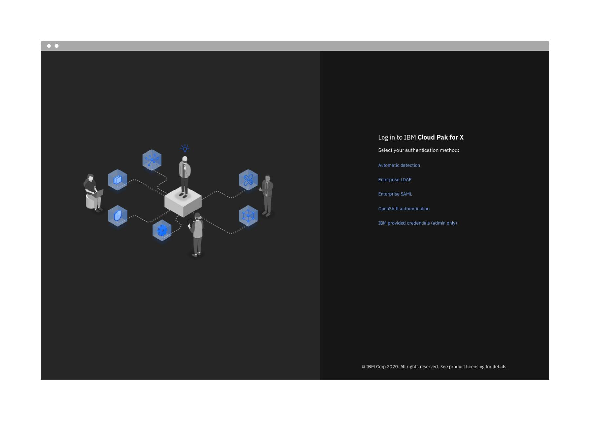
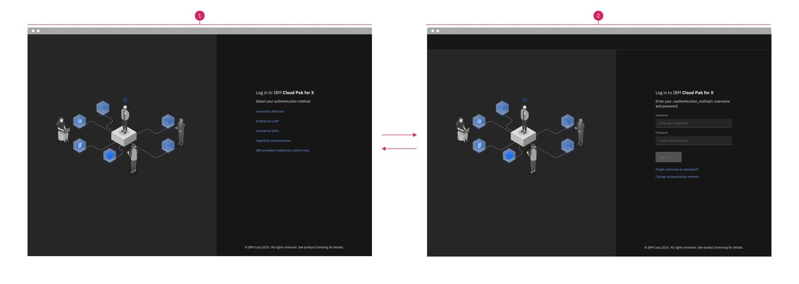
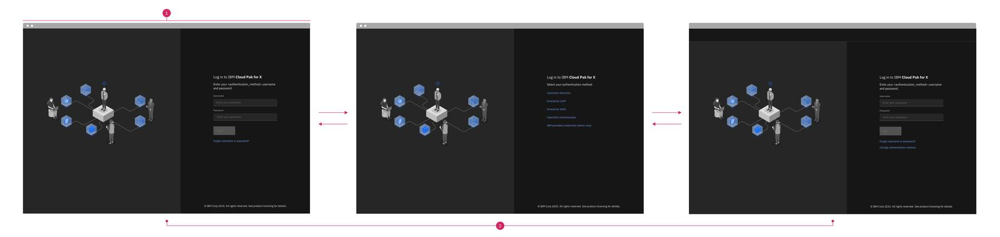
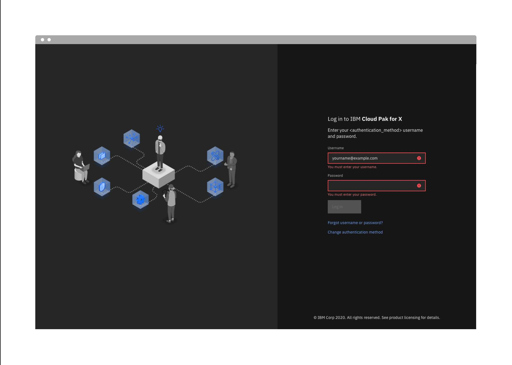
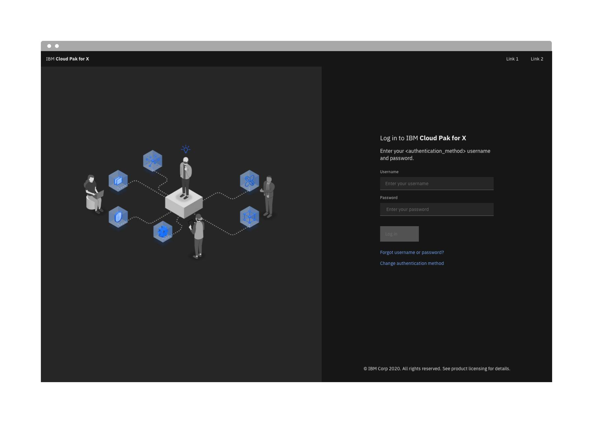

<PageDescription>

The login page allows a user to gain access to an application by entering their user ID and password, or by using another method of authentication.

</PageDescription>

<AnchorLinks>
<AnchorLink>Overview</AnchorLink>
<AnchorLink>Authentication types</AnchorLink>
<AnchorLink>Accessibility</AnchorLink>
<AnchorLink>Related</AnchorLink>
<AnchorLink>References</AnchorLink>
<AnchorLink>Feedback</AnchorLink>
</AnchorLinks>

## Overview

This pattern describes the essential login experience where a user provides their username and password as credentials for authentication against one or multiple authentication methods. It describes the design and recommended behaviors that enable a user to login using a single, default or automatically detected authentication method or by specifying the authentication method of choice. 

### Anatomy

1. Page title capturing the branding of product the user is logging into. 
2. Image reflecting the branding of the product the user is logging into. 
3. Instruction text specifying the authentication method the user should use to login. 
4. Form for entering login credentials. 
5. Login button. 
6. The "Forgot username or password?" link? points users to the self-service location where they can go to reset their passwords or retrieve their username. 
7. The “Change authentication method” link is displayed only when there are other methods that the user can use to authenticate. 
8. Both a light and a dark theme are supported. However, dark should be the default theme for all IBM Cloud Paks. 

## When to use

This pattern can be used to enable users to log in, in the following situations:

- There is a single log in option or a single set of credentials that a user would use to login. 

- There are multiple log in options or multiple sets of credentials that a user can use to login. In this case, there are two general possibilities for how this can be implemented: 
    - Manual selection: the user specifies the log in option they would like to use before entering their credentials.
    - Automatic detection (preferred): the credentials the user enters are automatically checked against all log in options. 

## Authentication types

### A. Single Authentication Method

When only one authentication method is configured and enabled, then when the user logs in, the user is presented the login screen without the “Change authentication method” link. 

- The login page title should be customized to the specific branding of the product the user is logging into. 
- The image on the left should be customized to the relevant branding of the product the user is logging into. 
- The instruction text should indicate the name of the _authentication_method_ being used. A customer admin should be able to customize the authentication method name to use any string that their users may be more familiar with. For example, instead of Enterprise SAML, an admin at IBM may use W3 ID, which is a more familiar name of the authentication method among IBM employees. 
- The Login button is disabled until both the username and password fields have been filled. 
- The "Forgot username or password?" link points users to the self-service location where they can go to reset their passwords or retrieve their usernames. This link is defined by the customer admin and is specific to the authentication method used on the login screen. This link is only displayed if it is set by the admin. Otherwise, it is hidden.  
- The “Change authentication method” link is not displayed. 

### b. Multiple Authentication Methods

#### Manual Selection

When more than one authentication option is available for users to use but there is no support for automatic detection of the authentication method based on the credentials provided by users, then the first time users attempt to log in, they are presented the Select authentication method page and invited to select the method they would like to use. When they click on an authentication method, they are taken to a login screen specific to the login method they selected. Subsequently, the user’s choice is remembered and the next time the they attempt to log in, they are taken directly to the log in screen for the authentication method they last used.

The names and order of the authentication methods provided out of the box are as follows:  
- Enterprise LDAP 
- Enterprise SAML
- OpenShift authentication
- IBM provided credentials (admin only) 

Each option is displayed when the respective authentication method is configured. Otherwise, it is hidden. 

The "IBM provided credentials (admin only)" option pertains to a special admin username and password provided by IBM allowing admins to log in after deployment to complete the setup of the system and configure enterprise directory. Ideally, after the setup is complete, this option is hidden. If there are no out of the box admin credentials provided, this option is not displayed. 

The names of individual authentication methods can be changed by a customer admin in favor of custom names that are more recognizable by their users. The customization to the method names is reflected in the list of methods here as well as in the instruction text on the respective login screens for each of the authentication methods. 

Each of the authentication method links direct the user to the respective login page for that authentication method. The design of each of these login pages is the same as the login page when a single authentication method is available but with the “Change authentication method” link displayed. 

- The “Change authentication method” link returns the user to the select authentication method screen. 
- A customer admin can set one of the authentication methods as a default for their users in which case users arrive directly at the corresponding login screen for the default authentication method skipping the select screen. 
- As mentioned earlier, the method the user selects is remembered and on subsequent log in attempts, the user is sent directly to the login page for the method they last selected. The user can click the "Change authentication method" to select a different method. 

**Manual selection flow illustrated**

1. First login
2. Subsequent login

#### Automatic Detection (Preferred) 

When more than one authentication option is available for users to use and automatic detection is supported, the user is presented a login screen that verifies the user's credentials against all authentication options automatically. If the credentials are validated by any of the authentication methods, the user is authenticated.   

- The instruction text is neutral to the authentication method and simply asks the user to provide their credentials.
- Since the "Forgot username or password?" is specific to each of the authentication methods, the link is not displayed on this screen. 
- The “Change authentication method” link is displayed allowing the user to view all available authentication options. Clicking this link points the user to the Select authentication method page but with one additional option, "Automatic detection", added to the list of authentication methods. Clicking this option returns the user to the automatic detection login screen above. 

- The behavior of the select screen is the same as described in the manual selection scenario earlier. The method the user selects is subsequently remembered the next time they need to log in and are taken there by default. 

**Automatic detection flow illustrated**

1. First login
2. Subsequent login

### Behaviors, structure, and functionality

**Filled State**

- The Log in button is enabled when both the username and password fields have been filled. 

**Error state, incomplete credentials**

- When the focus is brought to a field (e.g. user clicks into a field) but the focus is then taken away without filling in the field (e.g. user clicks outside the field), a field error message is displayed indicating that the field is required. 

**Error state, invalid credentials**

- When a login attempt fails, an error message is displayed. 

**Notifications**

- General notifications appear in banners at the top of the right hand section of the IAM page. 
- Some notifications can be dismissed such as a notification about successful logout. Others may need to persist, such as an informational notification about an ongoing outage. 

**Toolbar (optional, only when needed)**

If exposing certain resources pre-login is necessary (such as links to documentation or other resources), then a toolbar can be exposed on the login screen to provide access to this content. 

- The toolbar header reflects the specific brand name of the product the user is logging into.  
- On the right hand side links to any pre-login resources are displayed. 

## Best practices

### Do's:
**Use a product branding that matches what the user is logging into.**
- Always brand the login screen as relevant as possible to what the user is logging into. Make sure the branding shown on the login screen does not confuse users into thinking they are logging into or being directed to a different destination because the product name or branding does not match what they clicked to log in into. 

**Allow customization of the names of authentication methods**
- Make sure to always allow customer admins to customize the names of the individual authentication options as their users may know these options by names specific to their company. 

**Provide links to where users can retrieve or reset their login credentials**
- Ensure that users know how to reset their passwords, look up their usernames or get help when they run into other login issues. Always allow the admin to set the "Forgot username or password link?" and specify a target URL for each authentication method where the end users can go for assistance.  

**Always allow users to switch authentication methods when supported**
- When implementing multiple authentication options, ensure that users always have a way to change their selection. Ensure every login screen in a multi-authentication option scenario provides a link to change the authentication method. 
- For third party login screens, it is always preferred to use this pattern for the UI and rely on APIs to connect to the third party authentication service.  This keeps all authentication options consistent in experience and branding and avoids user confusion. Moreover, in a multi-authentication method scenario, this ensures that users have all the features provided by this pattern that allow them to switch between authentication options. 
- If it is not possible to customize or replace the UI of third party authentication methods, then there would be no Change authentication method link for users to rely on when needing to switch authentication methods. Therefore, when third party authentication methods are used and their UI is not customizable it is important to provide alternate ways for users to switch authentication methods. For example, the browser back button can be used to allow the user to navigate back to the select screen where they made the authentication method selection. In addition, when the third party session expires, users can be returned to the select authentication method screen to enable them to make a choice again. Do not send them to the last selected method directly as then they would not have a way to view all options and the browser back button would not be pointing to the selection screen. 
- To avoid confusion and ease the transition to a third party login screen that could not be customized, it is recommended to inform the user that they will be directed elsewhere to complete the login. For example, upon clicking the non-customized third party option, the user can be presented a modal dialog informing them that they will be redirected. The user can click continue to proceed or cancel to select a different authentication option. The user can select the do not show me this again checkbox to skip the modal dialog going forward. 

### Don'ts: 

**Do not expose multiple authentication methods when they are not needed**
- Implementing multiple authentication options can significantly complicate the login experience. It should only be considered when multiple options are indeed required. Often times an admin may have reasons to access the system using more than one authentication method while for end users it is not necessary. If that’s the case make sure that end users are not exposed to this complexity unnecessarily. If end users only need one authentication method while the admin requires multiple, then consider segmenting the login experience to route each set of users differently. Alternatively, set the authentication method end users need as the default as described earlier. 

**Do not expose the entries in the password field**
- Always ensure the password field does not display the password but uses stars (*) in place of each character in the password. 

## Accessibility

- Users should be able to TAB into the username field to type it in. They then can TAB to move the focus to the password field to enter it. 
- The user can click ENTER any time to submit the login credentials and attempt login. 
- If an error is encountered always set the focus to the first field pertaining to the error. 

## Related

The following Carbon 10 components were used: 
- [Icon — user](https://www.carbondesignsystem.com/components/text-input/usage)
- [Button](https://www.carbondesignsystem.com/components/button/usage)
- [Link](https://www.carbondesignsystem.com/components/link/usage)
- [Form](https://www.carbondesignsystem.com/components/form/usage)
- [Unordered List / List item](https://www.carbondesignsystem.com/components/list/usage)
- [Inline notifications](https://www.carbondesignsystem.com/components/notification/usage)

In addition, the following components can be used to support some of the special cases discussed in the pattern: 
- [Modal](https://www.carbondesignsystem.com/components/modal/usage)
- [UI Shell header](https://www.carbondesignsystem.com/components/UI-shell-header/usage)

## References

This pattern is the outcome of many iterations working with the Bedrock team to implement a login experience featuring multiple authentication methods including LDAP, SAML and others with support for OpenShift authentication. 

Over the course of a year the login experience evolved to address various scenarios and a range of technical challenges. This pattern documents a consistent way of providing all the essential elements of a login experience while supporting a single authentication method or a mix of methods.

## Feedback

Help us improve this pattern by providing feedback, asking questions, and leaving any other comments on
[GitHub](https://github.com/carbon-design-system/carbon-website/issues/new?assignees=&labels=feedback&template=feedback.md)