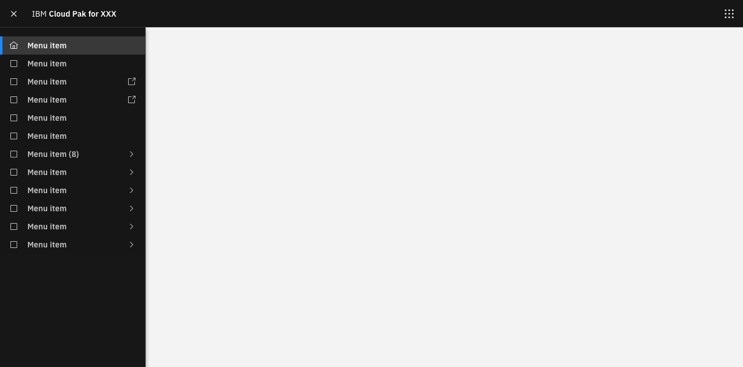
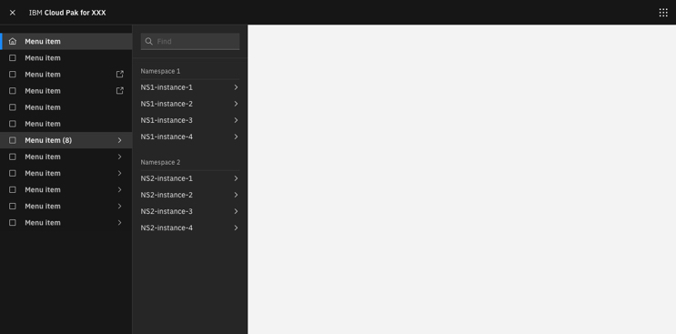
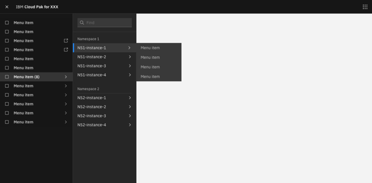
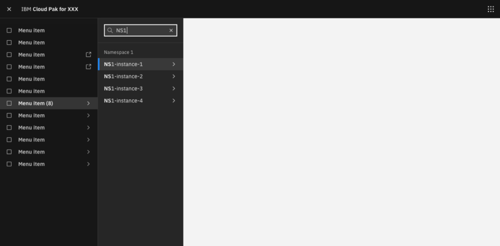
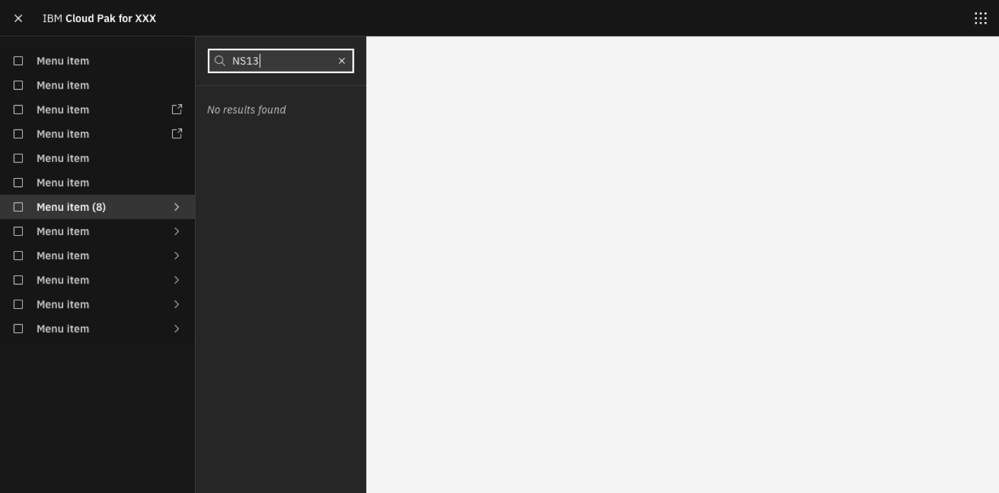
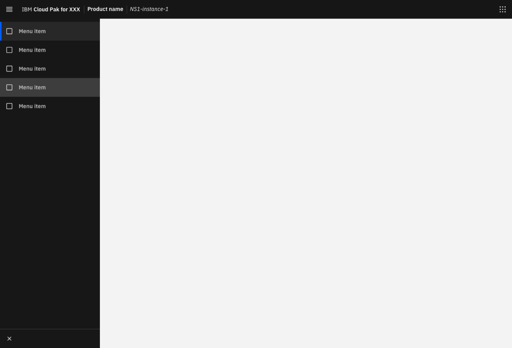
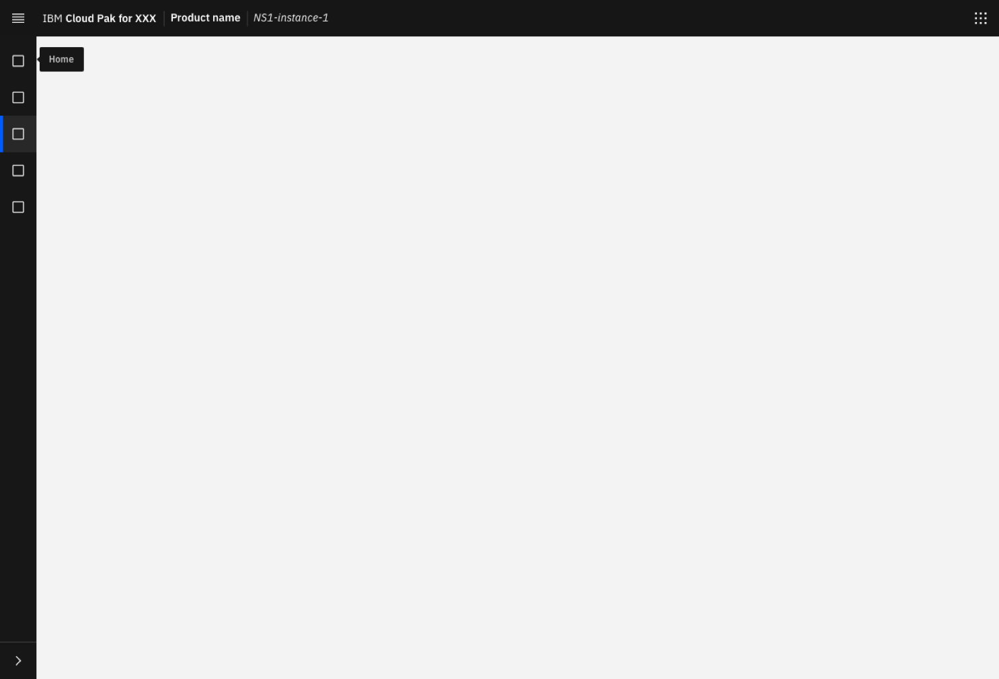
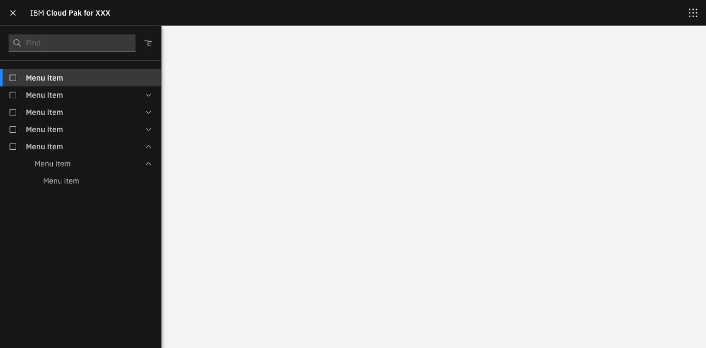
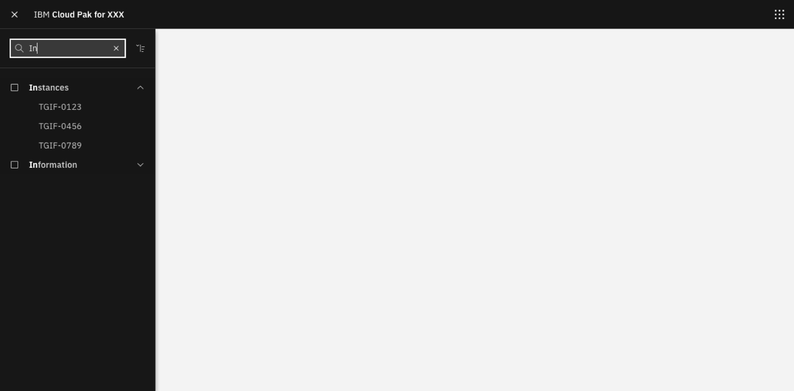

<PageDescription>

To ensure a consistent experience, all Cloud Pak products should have the same pattern and interaction for their primary navigation. 

</PageDescription>

This will also create a consistent pathway and minimize the learning curves for our users who may need to navigate from one product to another.

<AnchorLinks>
  <AnchorLink>Anatomy</AnchorLink>
  <AnchorLink>The solution</AnchorLink>
  <AnchorLink>Accessibility</AnchorLink>
  <AnchorLink>Design resources</AnchorLink>
</AnchorLinks>

## Anatomy

There are two navigation patterns each Cloud Pak can choose to use. Both of them are triggered by the hamburger menu that are located at the top left corner of the product header.

The horizontal navigation consists of two separate panels for the first level and second level menu. When there are multiple menu items nested within a first level category,  hover over the category name will open up the second level menu with a panel slide from the left side to right. The horizontal navigation also comes with an option for a separate navigation system for the in-product level. (For example, A separate in-product navigation for API connect as part of Cloud Pak for Integration.) 

The vertical navigation only contains one panel with all menu items listed within it. Sub-items will directly nest under the first level categories.  Click on the first level menu item will  open up all the sub-levels.

Both Navigation patterns also come with the optional **Find** function for users to type in keywords to quickly narrow down to the menu items that they are looking for.

#### When to use

It's recommended to use the vertical navigation pattern when the product has limited menu items. When the product menu is comprehensive across different use cases and with many options, it's recommended to choose the horizontal pattern to make the menu less overwhelming for the users.

#### When not to use

The vertical and horizontal navigation pattern is not intended to mix and match or to be combined. For example, When the in product level navigation is needed, the Cloud Pak should choose the horizontal template. The vertical pattern doesn't come with the in-product navigation.

## The solution

This section explains the pattern and interaction of both horizontal and vertical navigation in detail.

### Horizontal Navigation

- Horizontal navigation has menu items with corresponding icons on the left
- "Destination" icons live on the right for menu items that launch out or have a secondary menu
- Menu will not use dividers
- Blue bar selected state indicates which page you are on 
- Height of each menu items is 32px

#### Primary Navigation
- Hovering over a menu item in the primary menu will automatically expand the secondary menu after 0.3  seconds (note that **there will be a very brief delay** to avoid accidentally open or lose the second pane )
- Clicking on a primary nav menu item will activate the active state and keep the secondary menu open  (or when user anchors down to the find section). Click outside the first and second panel will exit.

#### Secondary Navigation

- _(Optional) Find feature:_ The ability to find menu items by typing is optional. It's encouraged to use it for menus that have an overwhelming amount of items to look through. Determining whether or not a find feature is needed will be up to the pak design leads. 
- _(Optional) Section title:_  Sections will include a title and be separated from each other with a space. Section dividers should not be included in the secondary nav except for below the title and around the optional find feature
- _(Optional) Third level:_ If needed there is an small third level menu to handle additional sub items from the second level menu, indicated with a chevron icon
- Blue bar selected state indicates which page the user is on 
- Menu items that are long will have an allowance of 2 lines with truncation if needed. 

#### Third level menu (Optional)

- Third level menu available upon hover of the chevron icon in the secondary nav- 
- Instead of a full browser height panel, the third level menu height is determined by the number of items needed on the menu

#### Find

- Find capability is optional in the secondary navigation
- As users type, results matching typed characters are highlighted in #FFFFFF and semi-bold 
- Corresponding section titles remain as long as there is at least one matching search item
- As users type, items that no longer match will disappear

- For long menu items, use formula of [First 18 characters][...][Last 3 characters] to truncate
- Empty state message: No results found
- Follow carbon guidelines for the [find bar](https://www.carbondesignsystem.com/components/search/codeg)

### In-Product Navigation

- Default state for in-product navigation is an expanded menu bar with a collapse icon at the bottom
- Once in a specific product within a Cloud Pak, such as API connect, the in-product menu will be expanded by default and can be collapsed to only show icon if user chose to
- Collapsing a menu pushes menu to the left with only icons while expanding the main page to full width
- In-product navigation menu item height is 48px and is **intentionally taller than the primary** Pak navigation to avoid user confusion

#### Collapsed state

- Collapsed/expanded state should be remembered from session to session. i.e. if a user closes the nav it should be closed the next time they log in.
- In the collapsed view, hovering over a menu item will evoke an [icon tooltip](https://www.carbondesignsystem.com/components/tooltip/code) _(Gray 90, small)_

### Vertical Navigation

- Vertical navigation has an optional find feature, along with an icon to "expand/collapse all" menu items
- Menu items are collapsed by default. Menu items with nested items are indicated by a chevron

- Nested menus are expanded on click for all second and third level items within the menu
- Once expanded, menus will remain open until the user specifically closes one category themselves (within on session)
- “Expand all” icon will change to “Collapse all” as soon as user starts to open one or multiple first level items

- For navigation that needs three nested levels, there is a 300px wide menu option (See image above)

#### Find 
- Find capability is optional. (Expand and collapse all feature comes with Find module. It's highly recommended to use "Find" when there's nested layers in the menu.)
- Empty state yields a message "No results found" same as horizontal navigation

- When users start typing, categories matching the characters typed will appear
- Highlighted characters are changed to bold and #FFFFFF
- [Search bar behavior](https://www.carbondesignsystem.com/patterns/search-pattern/) _Gray 90 theme_
- Some items in a menu are a parent to children categories and do not navigate to a new page upon click. Users may be searching for a parent to find the children underneath (i.e. searching for "instances" to find the instances within it). In this case, the matching category will be returned and the parent category can be expanded upon click with the children nested inside (see below). 

- Children items will be available if a user has matched a search to a parent category
- Upon expansion, the "expand all" icon should change to a "collapse all" icon 
- Children items will not have any highlights unless characters within match the searched characters

- If a search query returns children to parent categories, parent categories will appear with children shown beneath. 
- In this case, no part of a parent should be highlighted unless characters match the search query
- Matching characters of children categories will be highlighted as semibold and #FFFFFF
- Collapse all icon should be active if children items are visible

## Accessibility

For both navigation patterns, users should be able to TAB through any menu items.  Users can TAB into the find field of the search box to begin typing and press ENTER to run the find query to narrow down to the desired menu items.

## Design and implementation resources
- <a href="images/SketchFile.sketch" download>Sketch file</a> 
- <a href="/Redlines.pdf" download>Red line</a> 
- [Storybook (horizontal)](https://pages.github.ibm.com/IBMPrivateCloud/icp-ui-components/?path=/story/horizontal-nav--horizontal-nav-with-searchable-subitems)
- [Storybook (Horizontal in product)](https://pages.github.ibm.com/IBMPrivateCloud/icp-ui-components/?path=/story/inproductleftnav--in-product-left-navigation)
- [Storybook (Vertical)](https://pages.github.ibm.com/IBMPrivateCloud/icp-ui-components/?path=/story/vertical-nav--vertical-nav-with-nested-subitems-and-search)
