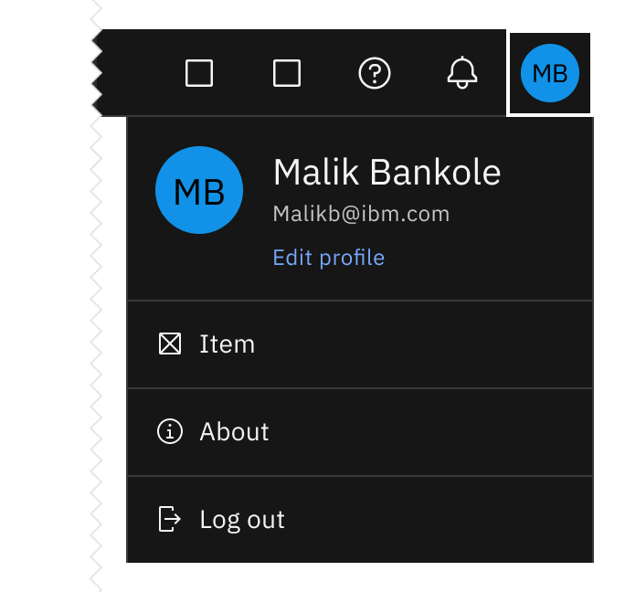
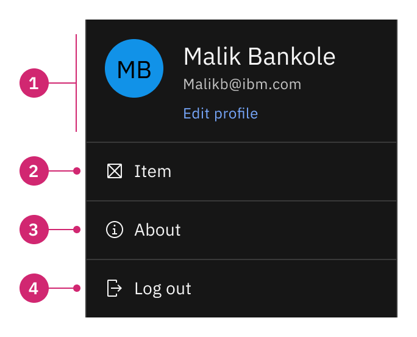
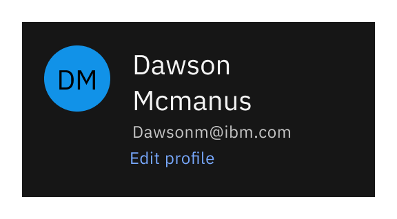
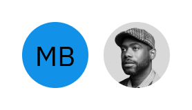
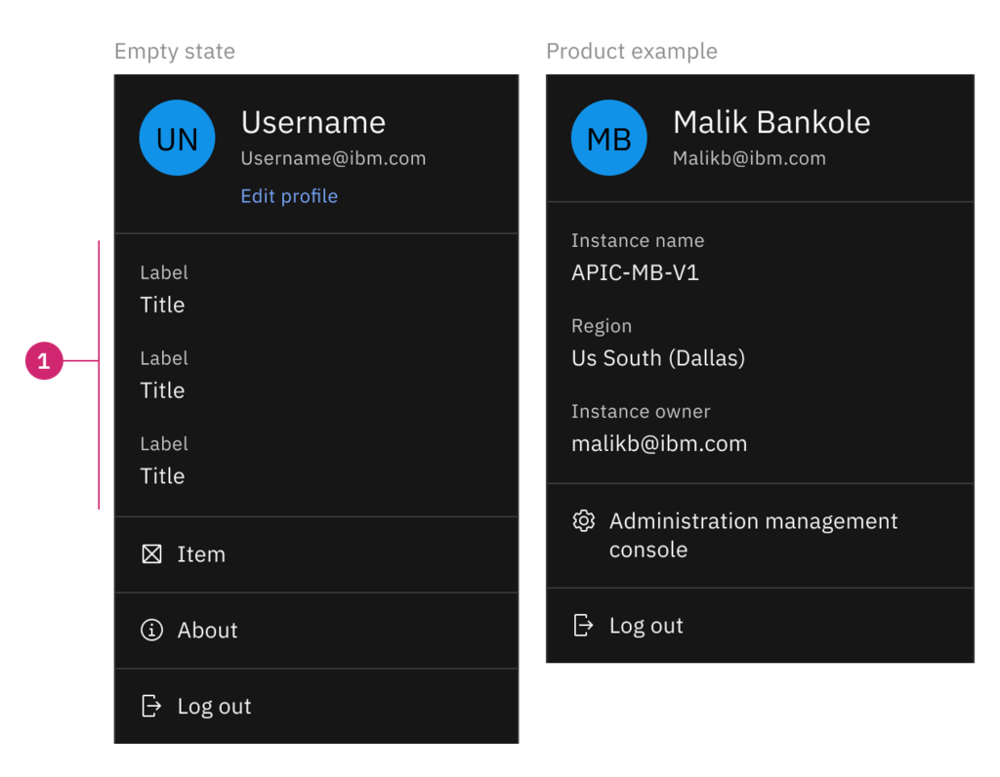
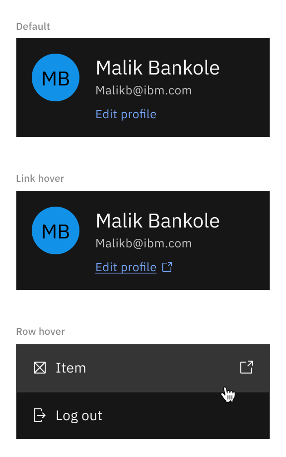
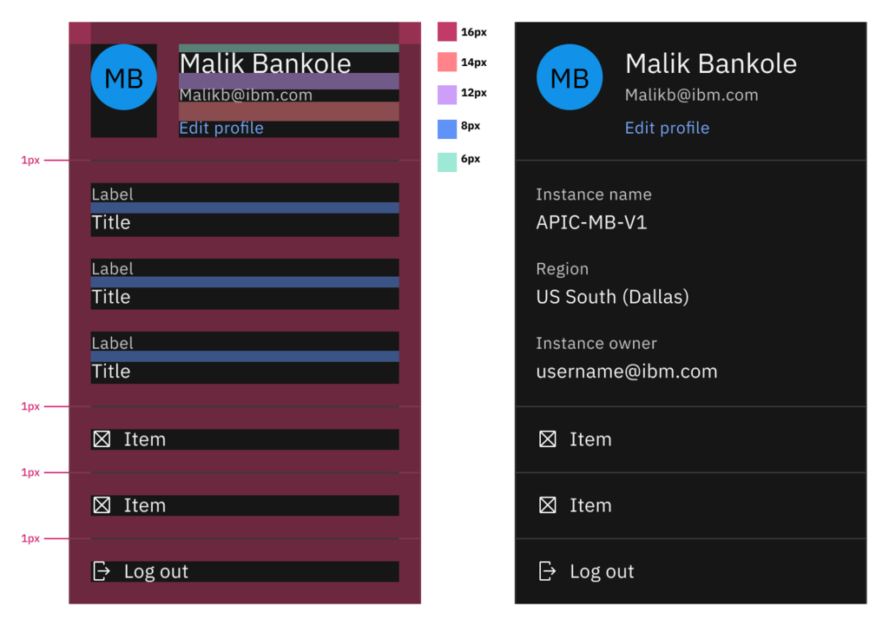

import { Breadcrumb, BreadcrumbItem } from "carbon-components-react";
import { Link } from "gatsby";

<Breadcrumb>
  <BreadcrumbItem href="https://pages.github.ibm.com/cdai-design/pal/patterns/global-header/usage/#header-patterns">
    Global header
  </BreadcrumbItem>

  <BreadcrumbItem isCurrentPage href="https://pages.github.ibm.com/cdai-design/pal/cloud-paks/profile-menu/usage">
    Profile menu
  </BreadcrumbItem>
</Breadcrumb>

<AnchorLinks>
 <AnchorLink>Overview</AnchorLink>
 <AnchorLink>Anatomy</AnchorLink>
 <AnchorLink>States</AnchorLink>
 <AnchorLink>Styling</AnchorLink>
 </AnchorLinks>

## Overview

The profile menu is a consistently available user interface element that contains an essential account, product and active session information. It is only available in the logged in state.

## Anatomy

1. **Header (required)** - This section displays necessary details about the user.
    1. **User profile image** - See full guidance [here](https://pages.github.ibm.com/cdai-design/pal/patterns/user-profile-images/usage/)
        1. **Image** - Images are used only when the user uploads their own.
        2. **Initials** - This is the default until the user uploads their own image.
    2. **User name** - The user's name is located on the right side of the user profile icon which will wrap depending on the length and should never truncate.
    3. **User email** - The email address attached to the account being used will be displayed below the username and will wrap depending on the length.
    4. **Edit profile** - This is utilized when the user needs to update their profile information.
2. **Row** - Each row contains a UI icon on the left side of the link name. (required icon)
3. **About** - Only required for on prem.
4. **Log out (required)** - The last row of the dropdown should be reserved for "log out" only.

<Title>
Profile menu name
</Title>

<Caption>
Long user name will wrap to second line.
</Caption>

<Title>
Profile menu images
</Title>

<Caption>
Initials or image.
</Caption>

### Ready only

<Caption>
1. <strong>Read only (optional)</strong> - This section of the profile menu is not meant to be interacted with but instead give the user a summary of all the required details they might need. This information will also depend based on product needs and should always sit on top of the profile menu.
</Caption>

## States

1. The "edit profile" link can also change to profile settings.
2. On row hover, if an item opens a new page the launch icon appears.

#### Accessibility

Use arrow key to move the focus down.

#### When to use

This pattern can be used with any product that has a global header and users log in to their accounts to access capabilities. 

#### When not to use

Do not use this pattern when the user is not logged in.

## Styling

<Caption>
The profile menu is a fixed width of 256px.
</Caption>

#### Resources
- [Figma file](https://www.figma.com/file/7htmsCZvTI8ZO6baZZ1sZY/Global-header-031422?node-id=429%3A2275)

#### Contributors
- [Chriscel Halili](https://w3.ibm.com/#/people/3J3194897)
- [Gentry Baird](https://w3.ibm.com/#/people/1J5123897)

#### Reviewed by
- [Lydia Samuel](https://w3.ibm.com/#/people/4J6877897)

#### Last updated
Apr 05, 2022