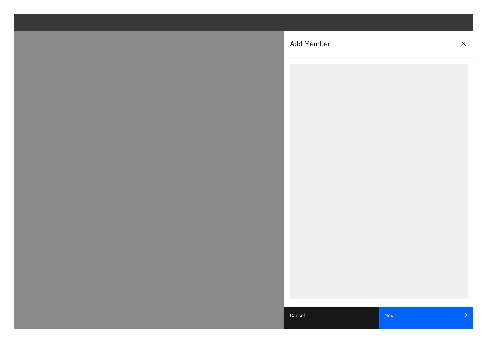
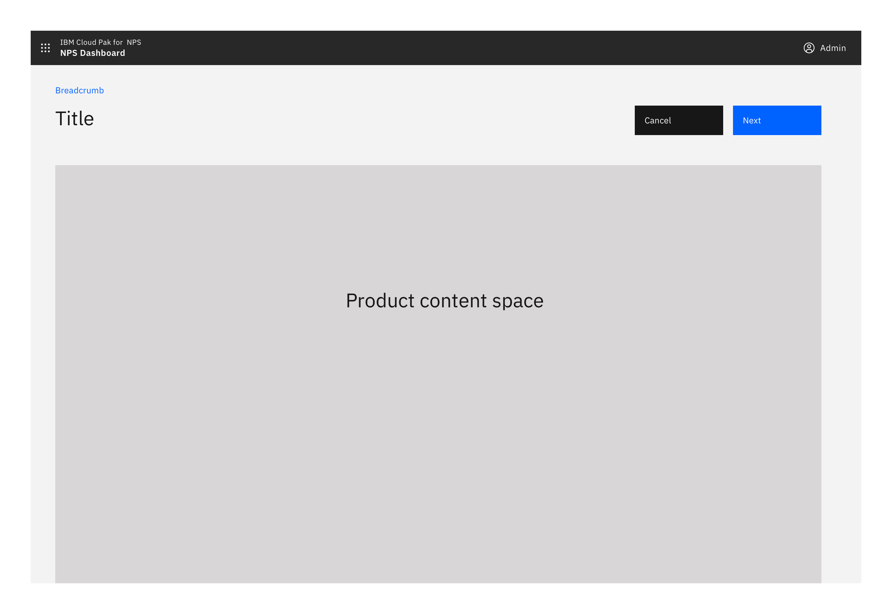
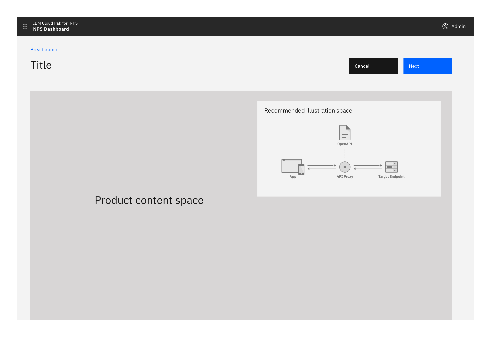
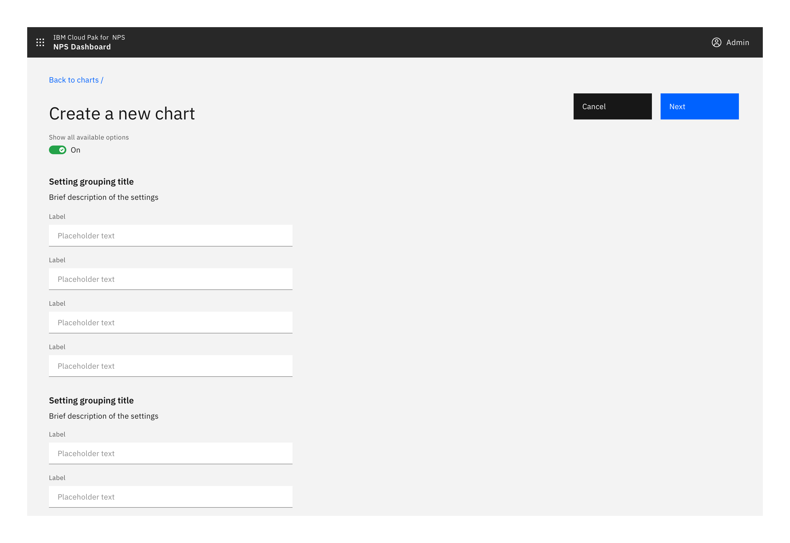
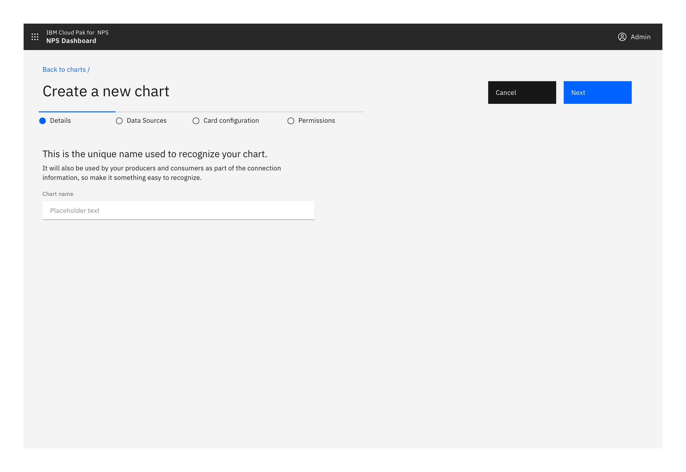
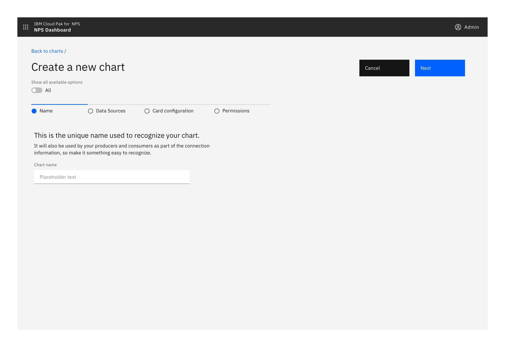

import { Launch16 } from '@carbon/icons-react';

<Row>
  <Column colLg={8}>

  </Column>
</Row>

**Status:** Experimental

#### Options

<AnchorLinks>
  <AnchorLink>Standard creation</AnchorLink>
  <AnchorLink>Multistep creation</AnchorLink>
  <AnchorLink>Confirmation</AnchorLink>
</AnchorLinks>

## Standard creation

Used in simple creation tasks when no stepped guidance is needed and the input
fields are directly related to each other.

<AnchorLinks>
  <AnchorLink>Modal</AnchorLink>
  <AnchorLink>Side panel</AnchorLink>
  <AnchorLink>Full screen</AnchorLink>
  <AnchorLink>Show all available options toggle</AnchorLink>
</AnchorLinks>

### Modal

If there are only 1 or 2 options involved in the creation then use a small,
standard modal, overlaying the content where the creation was initiated.
Scrolling inside a small modal should be avoided.

<Row>
  <Column colMd={6} colLg={6}>

  </Column>
</Row>

### Side panel

Consider using a side panel to take advantage of the added real-estate and
keep the user in context of where they were working. You may choose to use
either the slide in or slide over panels.

<Row>
  <Column colLg={8}>

  </Column>
</Row>

### Full screen

If your creation flow consists of multiple fields and/or supporting imagery,
consider the full page option to take full advantage of the screen’s available
real estate.

<Row>
  <Column colLg={8}>

  </Column>
</Row>
<Row>
  <Column colLg={8}>

  </Column>
</Row>

<AnchorLinks small>
  <AnchorLink>Button position</AnchorLink>
  <AnchorLink>Illustration / Image</AnchorLink>
</AnchorLinks>

#### Button position

On a larger screen it is recommended that buttons always remain visible to the user.

Buttons should be located in the top right and should stick upon scrolling.

<Row>
  <Column colLg={8}>

  </Column>
</Row>
<Row>
  <Column colLg={8}>

  </Column>
</Row>
<Row>
  <Column colLg={8}>

  </Column>
</Row>

When the full page dialog is viewed in mobile, the buttons are positioned at
the bottom of the screen.

<Row>
  <Column colMd={6} colLg={6}>

  </Column>
</Row>

#### Illustration / Image

If including a supporting image or illustration, the recommended place is on the right hand side.

<Row>
  <Column colLg={8}>

  </Column>
</Row>

### Show all available options toggle

The toggle should be used to avoid overwhelming users, whilst still allowing
users the ability to access everything. It can be applied to the [side panel](#side-panel)
and the [full screen](#full-screen) dialog.

Consider by default having a minimal set of options visible, with the ability
for the user to chose if they want to expose more (optional) options.

If the user switches to this mode, ideally remember this for when they next
perform the same task.

<Row>
  <Column colMd={4} colLg={4}>

  </Column>
  <Column colMd={4} colLg={4}>

  </Column>
</Row>

Show all options off

<Row>
  <Column colLg={8}>

  </Column>
</Row>

Show all options on

<Row>
  <Column colLg={8}>

  </Column>
</Row>

Show all options on and grouped

<Row>
  <Column colLg={8}>

  </Column>
</Row>

## Multistep creation

If the creation task is complex, consider whether breaking the process up into
steps could help the user. Consider displaying related or dependant options together.

Multistep creation follows the same principles as
[Standard creation](#standard-creation), with the addition of multisteps.

<AnchorLinks>
  <AnchorLink to="#side-panel-2">Side panel</AnchorLink>
  <AnchorLink to="#full-page-2">Full page</AnchorLink>
</AnchorLinks>

### Side panel

Consider using a side panel to take advantage of the added real-estate and
keep the user in context of where they were working. You may choose to use
either the slide in or slide over panels.

<Row>
  <Column colLg={8}>

  </Column>
</Row>

### Full page

Start of multistep creation flow.

<Row>
  <Column colLg={8}>

  </Column>
</Row>

Multistep creation flow with view all options toggle

<Row>
  <Column colLg={8}>

  </Column>
</Row>

## Confirmation

When any create action is a success, a notification banner can be presented to visually confirm this.

<Row>
  <Column colLg={8}>

  </Column>
</Row>

## Linked to

[Editing & Updating](../editing)

 <a href="https://www.carbondesignsystem.com/patterns/common-actions#add">
  Creating in Carbon <Launch16 fill="currentColor" style="vertical-align:middle"/>
 </a>

   

** Maintainers:** 
[Vikki Paterson](https://w3.ibm.com/bluepages/profile.html?uid=100079866),
[Arnaud Gillard](https://w3.ibm.com/bluepages/profile.html?uid=122936866)
