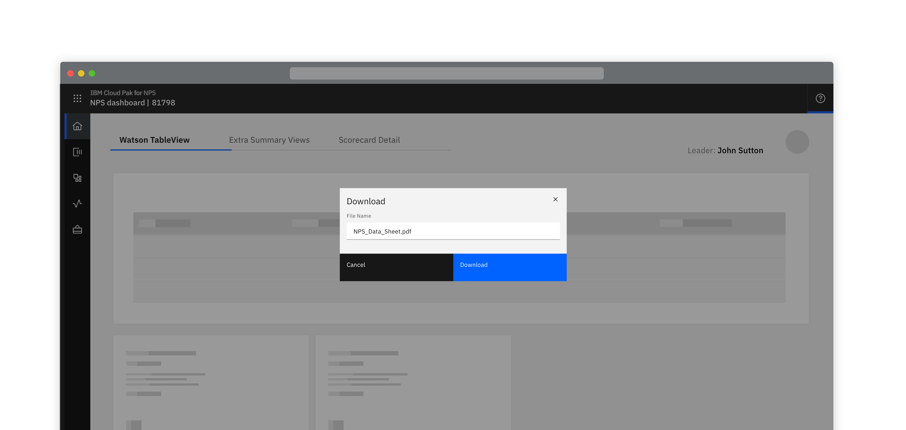
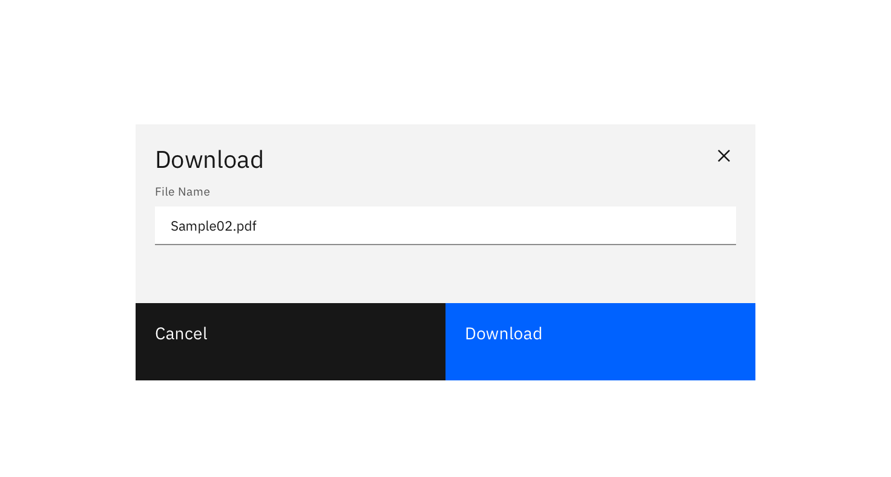
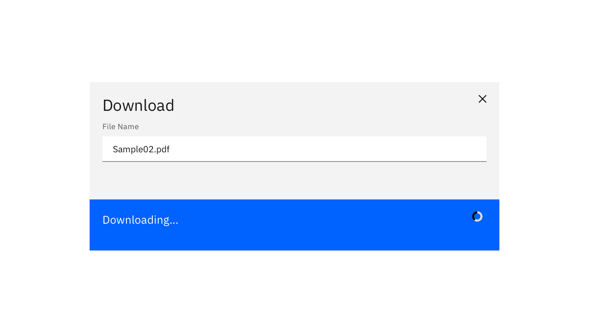

<PageDescription>

Transferring a resource from a remote system to a local system.

</PageDescription>

<Row>
  <Column colLg={8}>

  </Column>
</Row>

#### Options

<AnchorLinks>
  <AnchorLink>Intuitive default name</AnchorLink>
  <AnchorLink>Editable name</AnchorLink>
  <AnchorLink>Specify download location</AnchorLink>
</AnchorLinks>

## Intuitive default name

When the resource is given an intuitive name by default - download occurs on
the click of the button and nothing additional is displayed.

<Row>
 <Column colLg={8}>

 </Column>
</Row>

## Editable name

When downloading with an editable name, a dialog should be presented to the user displaying:
- An editable textbox pre-populated with the default name for the file.
- Optionally, when the download button is selected it changes to show ‘Downloading’.

<Row>
 <Column colLg={8}>

 </Column>
</Row>
<Row>
 <Column colLg={8}>

 </Column>
</Row>

## Specify download location

To specify the download location of a resource, the primary “download” button
is pressed and activates the browsers default location panel. The file is
automatically downloaded once a location is selected.

## Linked to

[Exporting](exporting)
