import { Launch16 } from '@carbon/icons-react';

<InlineNotification kind="warning">

  Please note this pattern is still under review.
  
</InlineNotification>

<PageDescription>

_Editing_ is making changes to a resource that already exists in the system.

</PageDescription>

<Row>
  <Column colLg={8}>

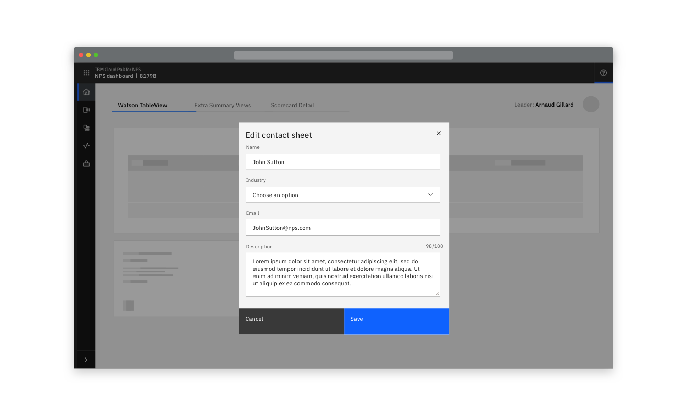

  </Column>
</Row>

## Options

Updating and editing should use the same behaviour as when the resource is created. This should only be varied in situations where the number of editable fields is significantly smaller or larger than during creation, or the context of current settings is required.

Additionally, consider the consequences of editing before allowing it:

#### Options

<AnchorLinks>
  <AnchorLink>Low impact consequences</AnchorLink>
  <AnchorLink>High impact consequences</AnchorLink>
  <AnchorLink>Optional extras</AnchorLink>
</AnchorLinks>

## Low impact consequences

Allow editing with no warning. Typically used when editing doesn’t have a wider impact.

<Row>
 <Column colLg={8}>

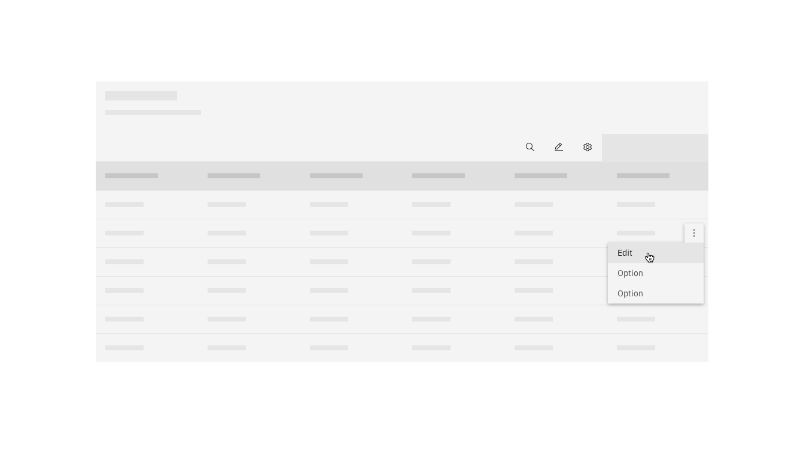

 </Column>
</Row>

### Low impact consequences - Modal

If an object was created in a modal, its editable fields can be made available in a modal. A modal can also be used where a small subset of fields are editable. 
If enough fields are editable to require scrolling, use a side-panel or full-page edit dialog instead.

<Row>
 <Column colLg={8}>

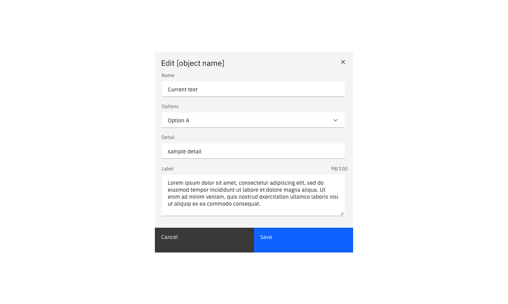

</Column>
</Row>

### Low impact consequences - Side-panel

If an object was created in a side panel, its editable fields can be made available in a side-panel. A side-panel can also be used where context in the main view of the screen is useful in the editing flow. 

<Row>
 <Column colLg={8}>

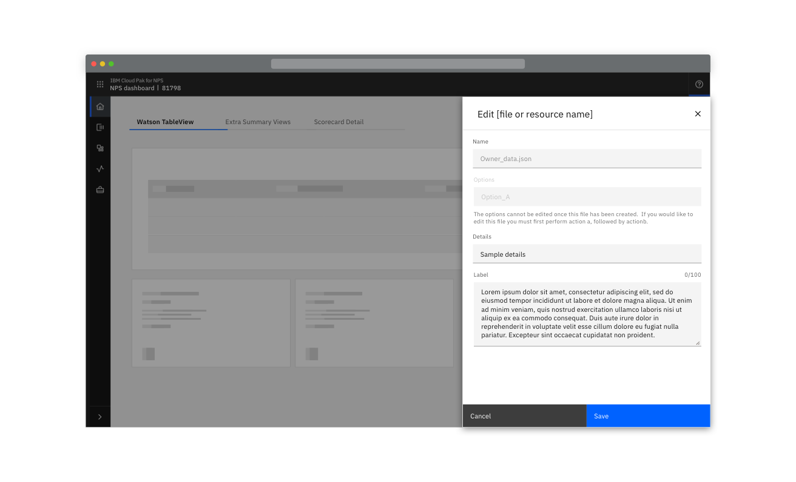

</Column>
</Row>

## High impact consequences

Warn the user of the consequences of editing. Typically used when editing has a wider impact.
Inform users of the likely consequences of the edit to their system, and inform them that editing cannot be undone. Include a warning stage. 

### High impact consequences - Modal

A high impact edit action of only a few fields can use a Danger modal. A second confirm edit modal should also be inserted before the changes are saved. If desired, the confirmation modal can include a [summary of changes](#summary-of-changes).  

<Row>
 <Column colLg={8}>

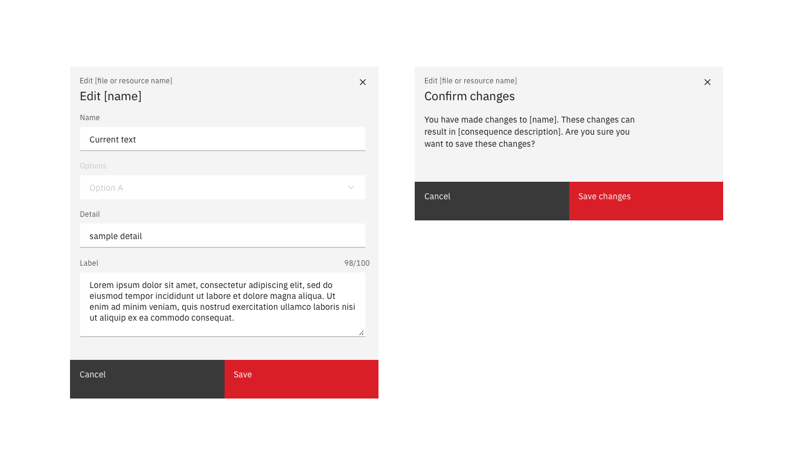

 </Column>
</Row>

### High impact consequences - Side-panel

If an object was created in a side panel, or there are too many editable fields for a modal, a slide-over panel can be used. 

<Row>
 <Column colLg={8}>

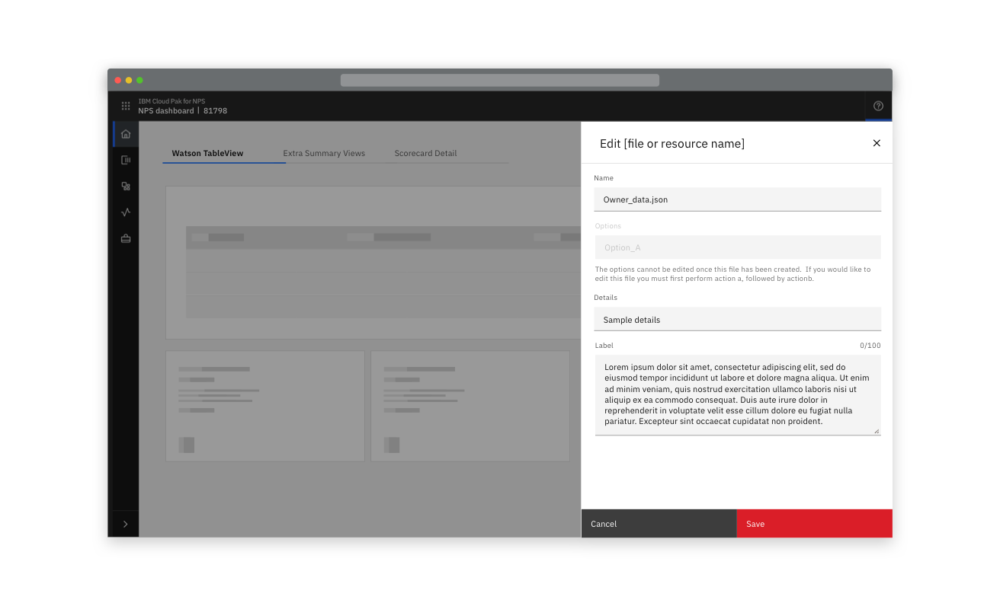

 </Column>
</Row>

High impact side panel edits should also warn the user of destructive edits with a warning before changes are saved. 

<Row>
 <Column colLg={8}>

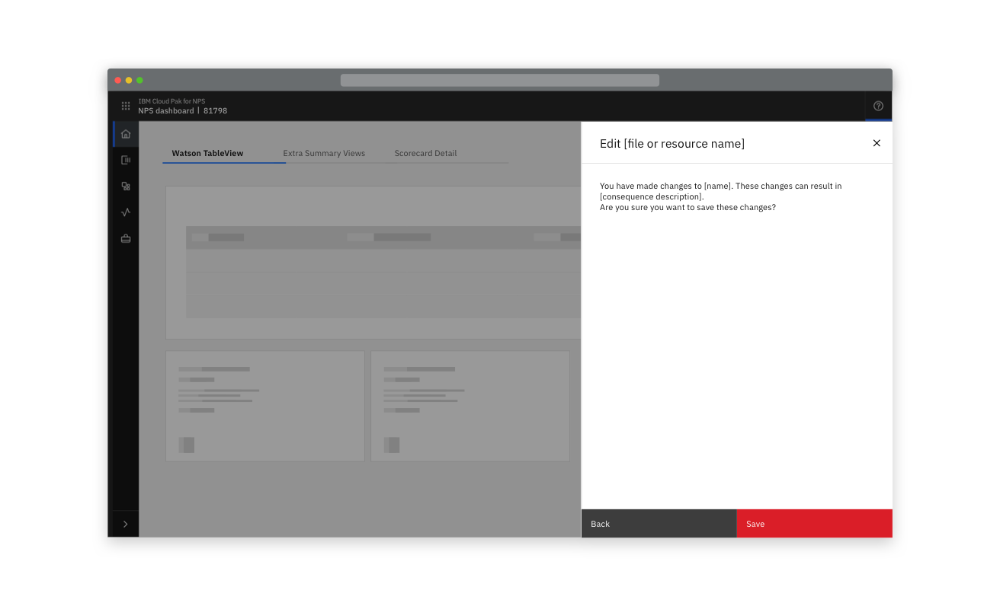

 </Column>
</Row>

### High impact consequences - Full-page

When an object was created in a full-page flow, or the volume of editable fields is high, use a full-page edit dialog.

<Row>
 <Column colLg={8}>

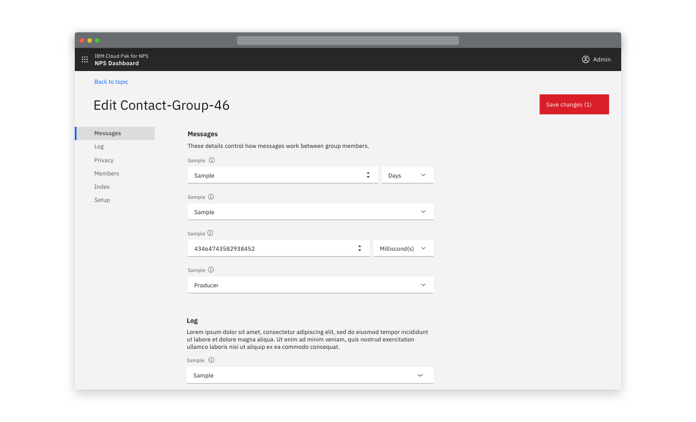

 </Column>
</Row>
<Row>
 <Column colLg={8}>

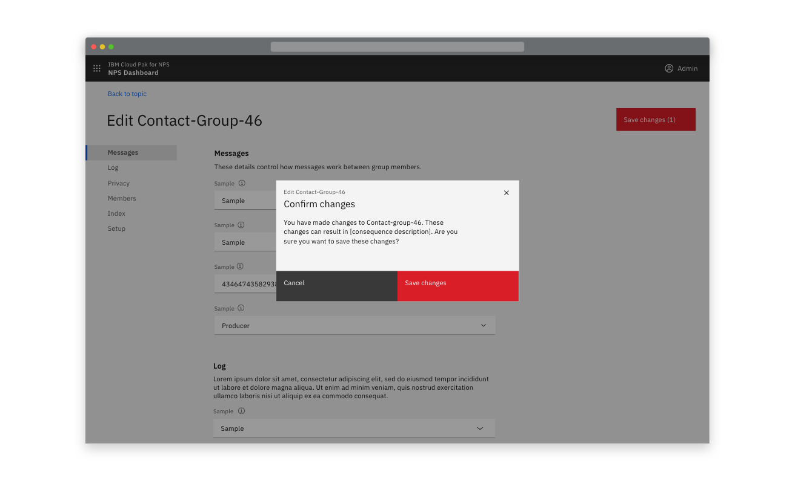

 </Column>
</Row>

## Optional extras

### Summary of changes

Adding a summary of changes to the warning stage of a High-impact flow can help the user manage and understand all of the changes they have made. 

<Row>
 <Column colLg={8}>

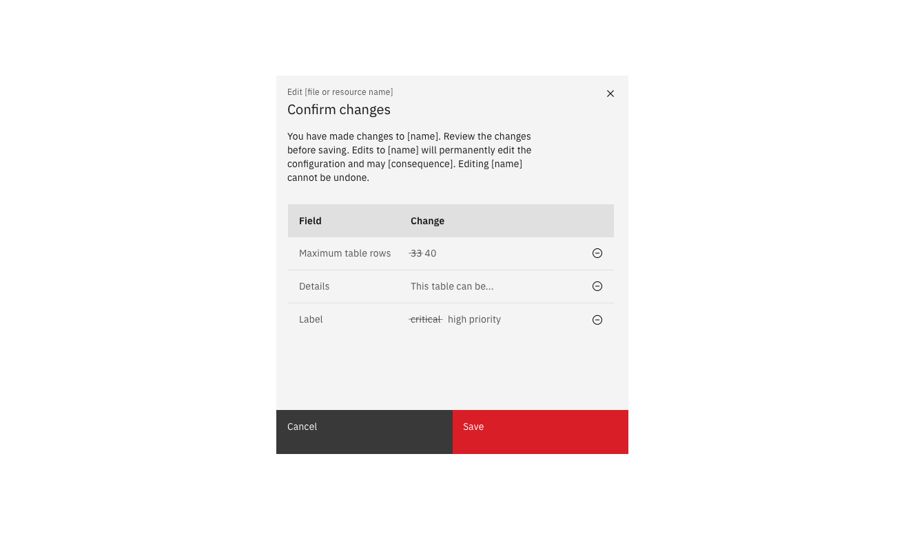

 </Column>
</Row>

### Non-editable fields

When a small number of fields are not editable, display their set value in a disabled field. 

<Row>
 <Column colLg={8}>

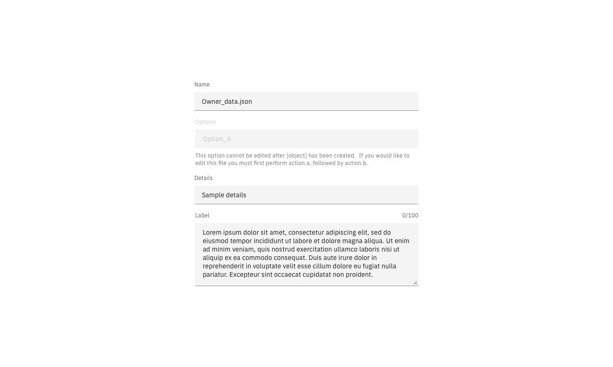

 </Column>
</Row>

Where a majority of variables are not editable, consider using an option that will display only editable fields. In a small number of cases, make individual variables editable in modals. 

### Success notifications

An optional success notification can be used to confirm that the users' changes have been saved.

<Row>
 <Column colLg={8}>

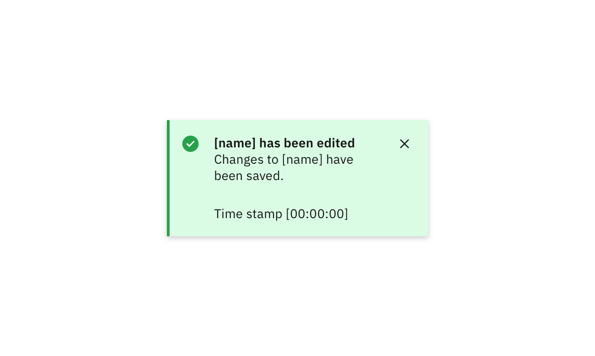

 </Column>
</Row>

## Linked to

[Exporting](exporting)

 <a href="https://www.carbondesignsystem.com/patterns/common-actions#edit">
  Edit in Carbon <Launch16 fill="currentColor" style="vertical-align:middle"/>
 </a>

