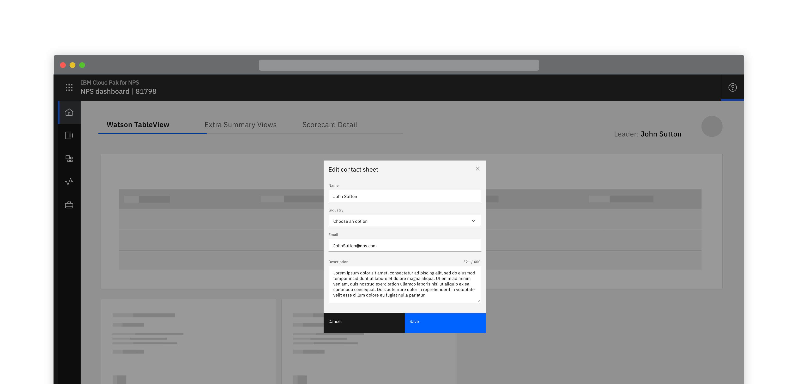
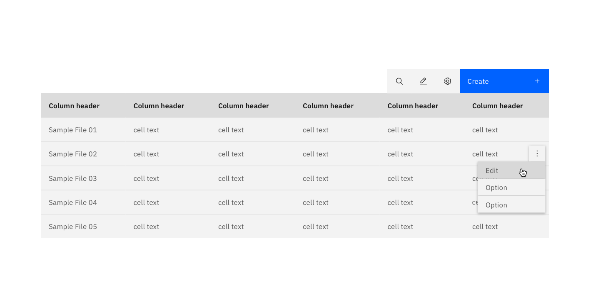
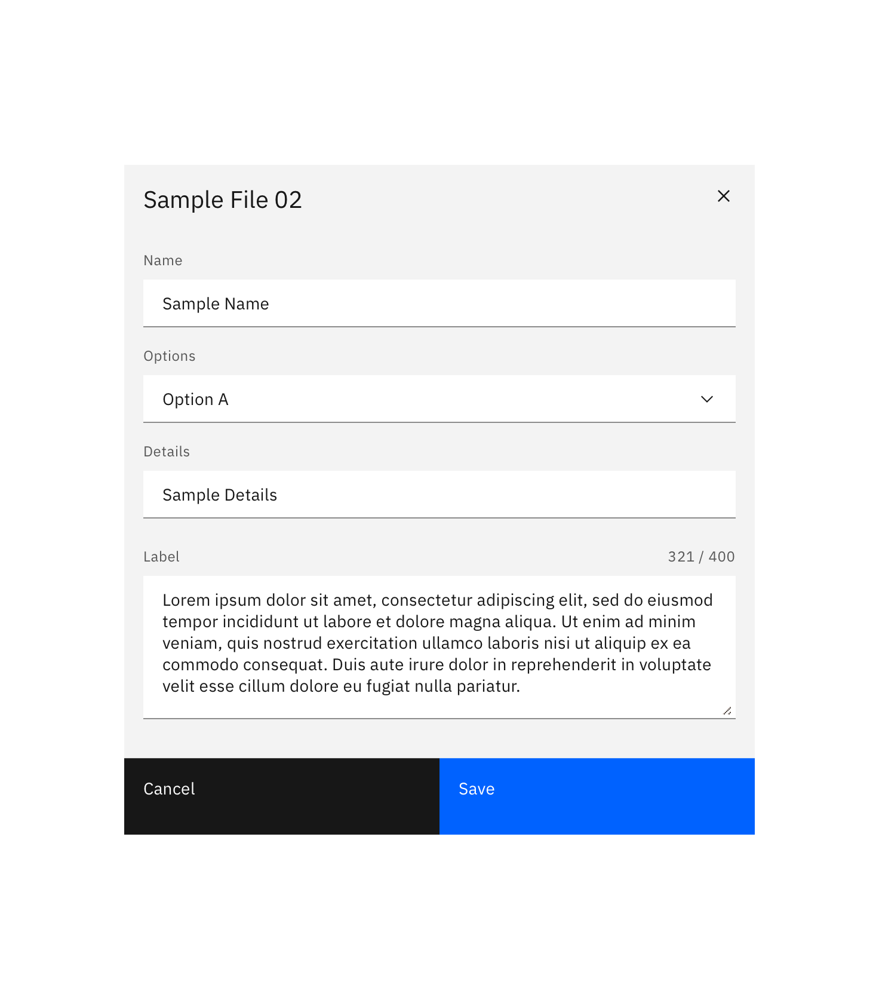
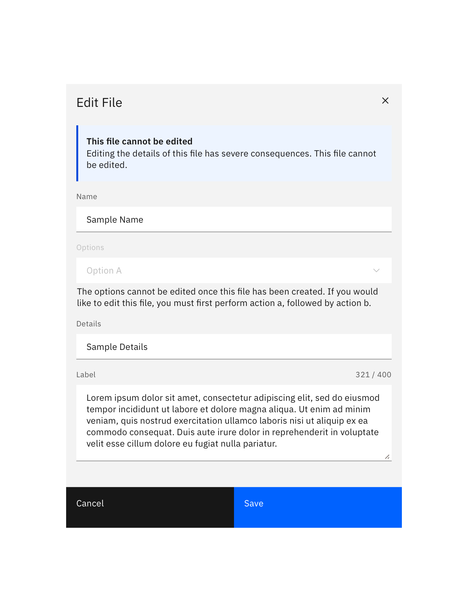

import { Launch16 } from '@carbon/icons-react';

<InlineNotification kind="warning">

  Please note this pattern is still under review.
  
</InlineNotification>

<PageDescription>

Making changes to a resource that already exists in the system.

</PageDescription>

<Row>
  <Column colLg={8}>

  </Column>
</Row>

## Options

Updating and editing should use the same behaviour as when the resource is
created. This should only be varied in situations where what is available
for editing is significantly smaller or larger than during the original
creation.

Additionally, consider the consequences of editing before allowing it:

#### Options

<AnchorLinks>
  <AnchorLink>Low impact consequences</AnchorLink>
  <AnchorLink>High impact consequences</AnchorLink>
</AnchorLinks>

## Low impact consequences

Allow editing with no warning. Typically used when editing doesn’t have a wider impact.

<Row>
 <Column colLg={8}>

 </Column>
</Row>
<Row>
 <Column colLg={8}>

 </Column>
</Row>

## High impact consequences

Warn the user of the consequences of editing. Typically used when editing has a wider impact.

<Row>
 <Column colLg={8}>

 </Column>
</Row>

## Linked to

[Exporting](../exporting)

 <a href="https://www.carbondesignsystem.com/patterns/common-actions#edit">
  Edit in Carbon <Launch16 fill="currentColor" style="vertical-align:middle"/>
 </a>

