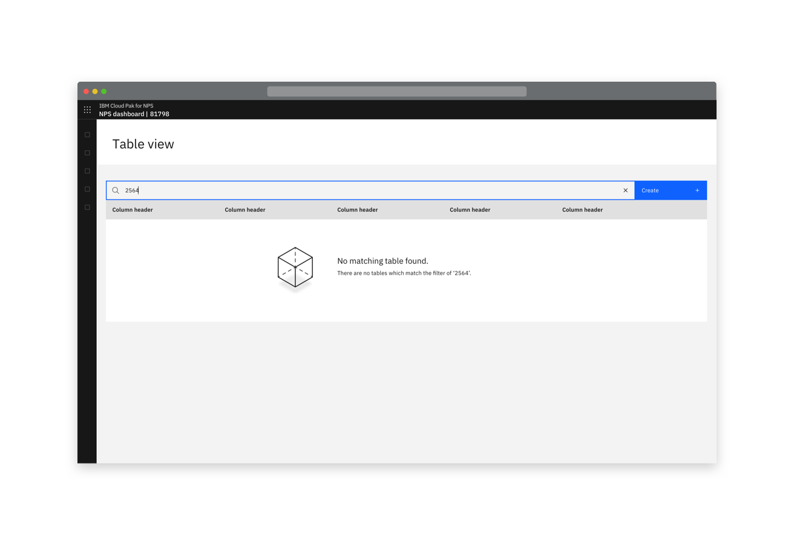
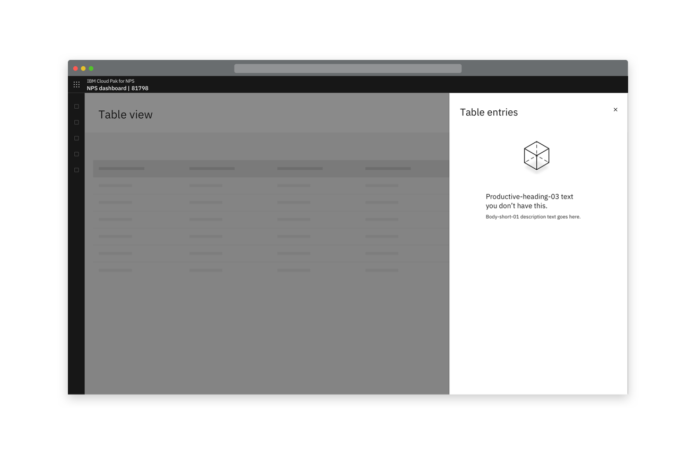

<PageDescription>

A situation where something is yet to be populated e.g. a table.

</PageDescription>

<Row>
  <Column colLg={8}>

  </Column>
</Row>

## Consists of
- An illustration that can be relevant to the context, the product or be generic
- Headline text that explains why the state is empty
- A description of the resource contained in there 

It is recommended to not include the primary CTA in the empty state, this
allows the user to learn where to perform the action from their first time
and doesn't move it around. 

- When there is a user action required to populate the table the primary CTA to
  populate the table is not included in the empty state. It is in the location
  that it will always be in, usually top right above the table. 

<Row>
 <Column colLg={8}>

 </Column>
</Row>
<Row>
 <Column colMd={6} colLg={6}>

 </Column>
</Row>
<Row>
 <Column colMd={4} colLg={4}>

 </Column>
</Row>
