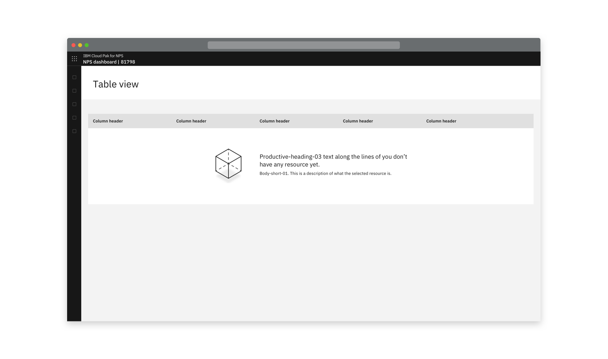
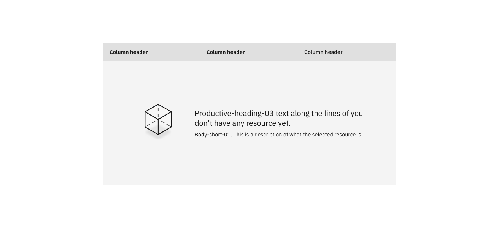

<PageDescription>

A situation where something is yet to be populated e.g. a table.

</PageDescription>

<Row>
  <Column colLg={8}>

  </Column>
</Row>

## Consists of
- An illustration that is relevant to the context, the product or generic
- Headline text that explains why the state is empty
- A description of the resource contained there

It is not recommended to include the primary CTA in the empty state, to prevent the CTA location changing as users learn the system. 

- When there is a user action required to populate the table, the CTA is in the location
  that it will always be in, usually top right above the table. 

<Row>
 <Column colLg={8}>

 </Column>
</Row>
<Row>
 <Column colLg={8}>

 </Column>
</Row>
<Row>
 <Column colLg={8}>

 </Column>
</Row>
