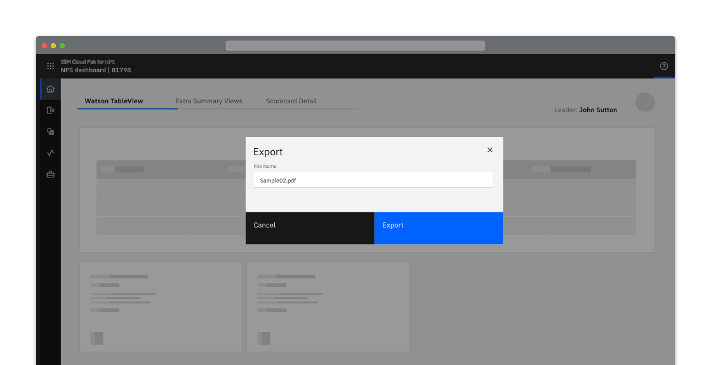
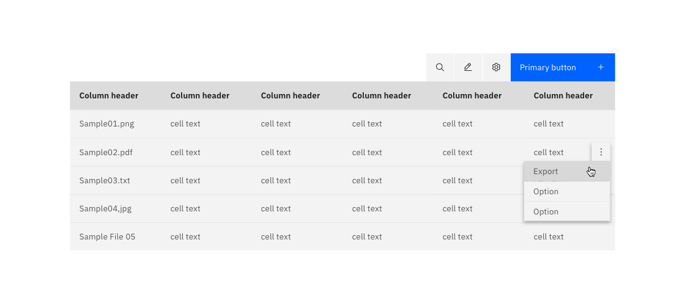
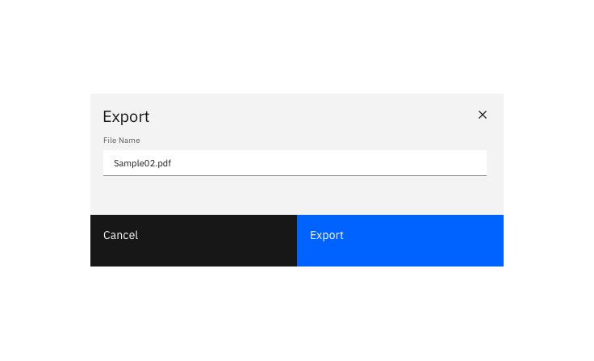
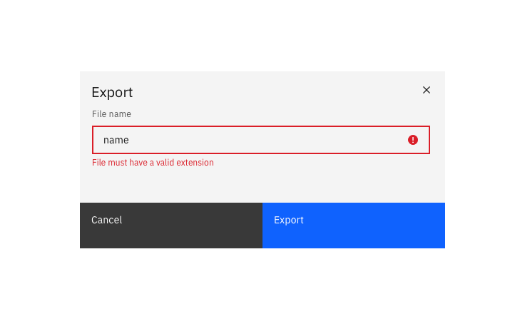
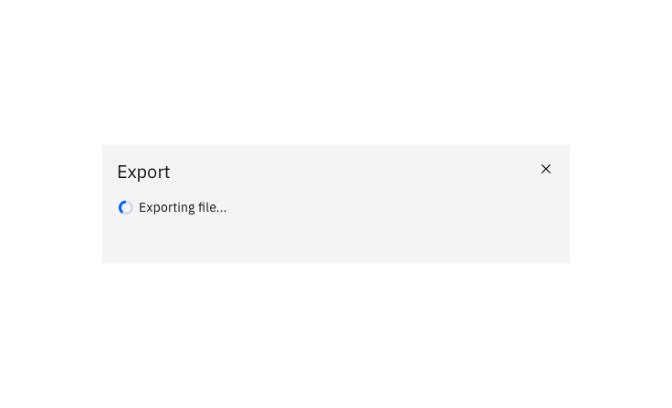
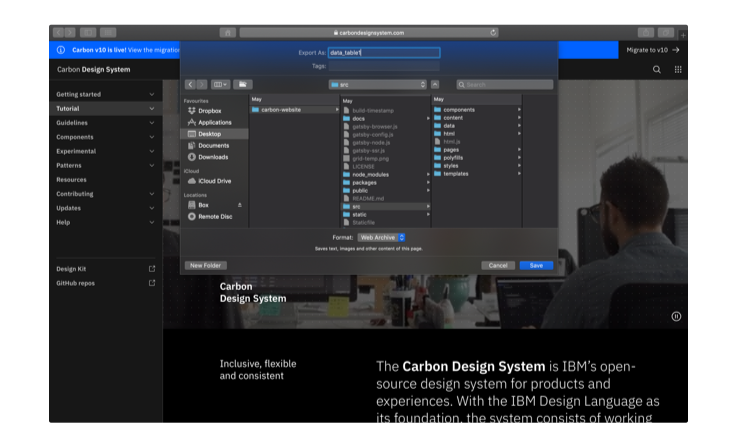
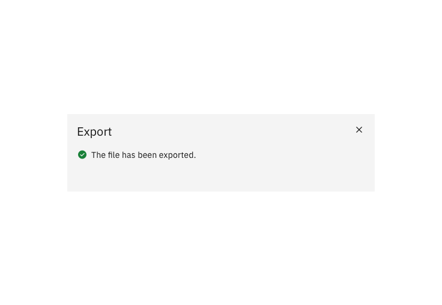
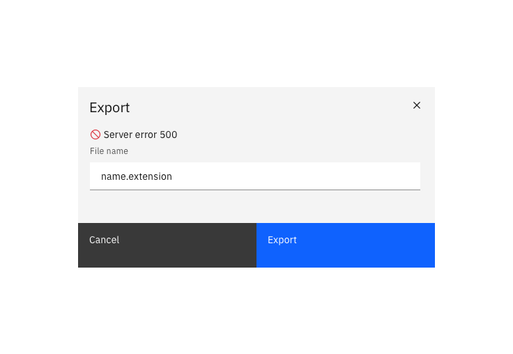

import { Launch16 } from '@carbon/icons-react';

<InlineNotification kind="warning">

  Please note this pattern is still under review.
  
</InlineNotification>
<PageDescription>

Exporting a resource saves data in a different format, external to the system.

</PageDescription>

#### Status:

Experimental

#### Maintainers:

[Vikki Paterson](https://github.com/vikkipaterson), [Chloe Poulter](https://github.com/chloepoulterdesign)

<AnchorLinks>

<AnchorLink>Export with an intuitive default name</AnchorLink>
<AnchorLink>Export with an editable name</AnchorLink>
<AnchorLink small>Optional extras</AnchorLink>

</AnchorLinks>

<Caption>Example of a export pattern using a modal</Caption>

## Export with an intuitive default name

When the resource is given an intuitive name by default and there is no choice of export location, the export occurs on the click of the Export button and nothing additional is displayed.

<Row>
<Column colLg={8}>

</Column>
</Row>

## Export with an editable name

When exporting with an editable name, a dialog should be presented to the user displaying an editable textbox that is pre-populated with the default name for the file.

<Row>
<Column colLg={8}>

<Caption>Validate the edited name's extension.</Caption>

<Caption>Example of an export modal in its "Exporting" state</Caption>

</Column>
</Row>

## Optional extras

### Specify export location

When specifying the download location of a resource, clicking the primary “download” button activates the browser's default location panel. The file is downloaded once a location is selected and the user clicks Save.

<Row>
<Column colLg={8}>

</Column>
</Row>

### Passive success modal

You can choose to show a passive modal when an export has succeeded. 

<Row>
<Column colLg={8}>

</Column>
</Row>

### Errors and failures

In the event of an error, display the error in the modal. 

<Row>
<Column colLg={8}>

</Column>
</Row>