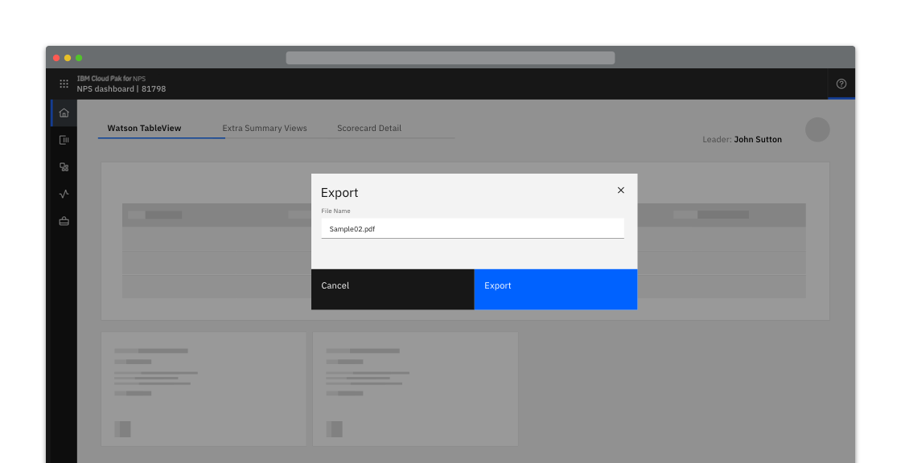
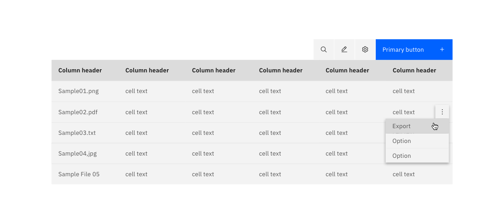
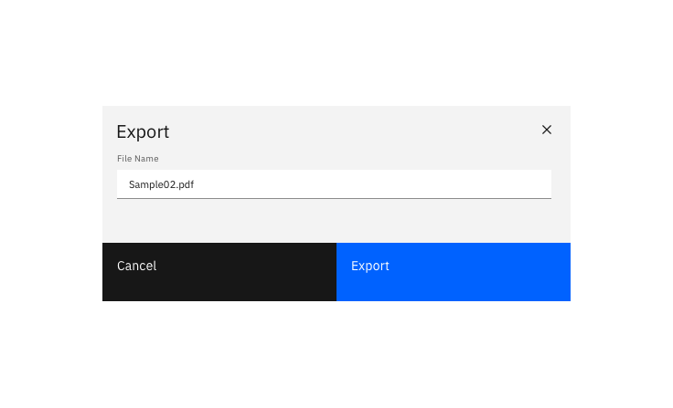
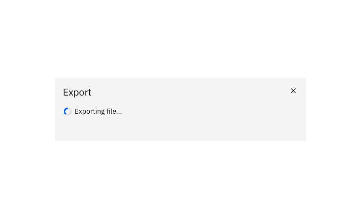

<PageDescription>

  Exporting a resource saves data out in a different format, external to the system.
  
</PageDescription>

<Row>
  <Column colLg={8}>

  </Column>
</Row>

#### Options

<AnchorLinks>
  <AnchorLink>Intuitive default name</AnchorLink>
  <AnchorLink>Editable name</AnchorLink>
  <AnchorLink>Specify export location</AnchorLink>
</AnchorLinks>

## Intuitive default name

When the resource is given an intuitive name by default and there is no choice
of export location - export occurs on the click of the Export button and
nothing additional is displayed.

<Row>
 <Column colLg={8}>

 </Column>
</Row>

## Editable name

When exporting with an editable name, a dialog should be presented to the user displaying:
- An editable textbox pre-populated with the default name for the file.
- Optionally, when the “Export” button is selected it changes to show ‘Exporting…’.

<Row>
 <Column colLg={8}>

 </Column>
</Row>
<Row>
 <Column colLg={8}>

 </Column>
</Row>

## Specify export location

To specify the download location of a resource, the primary “download” button
is pressed and activates the browsers default location panel. The file is
automatically downloaded once a location is selected.

## Linked to

[Downloading](../downloading)
