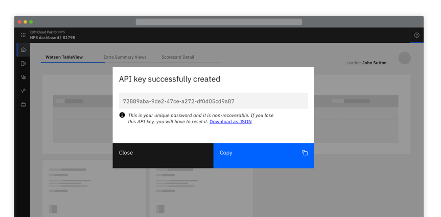
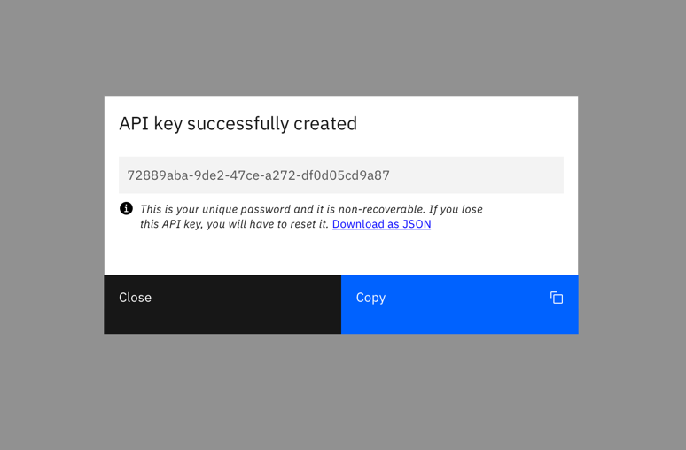
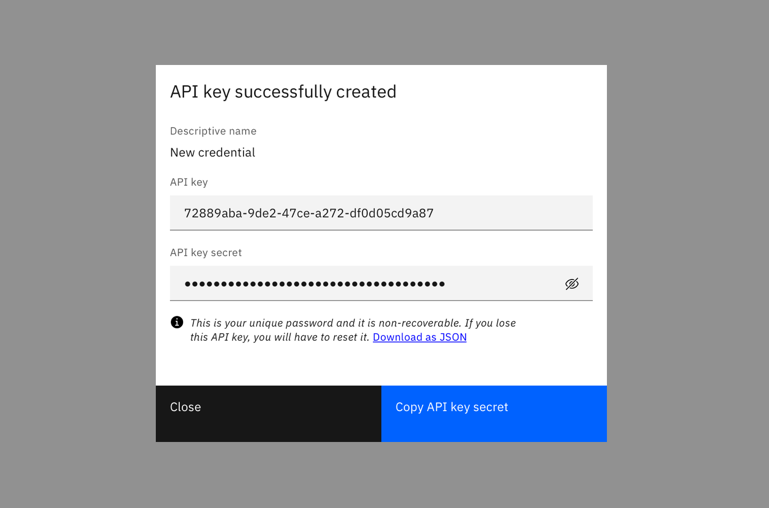
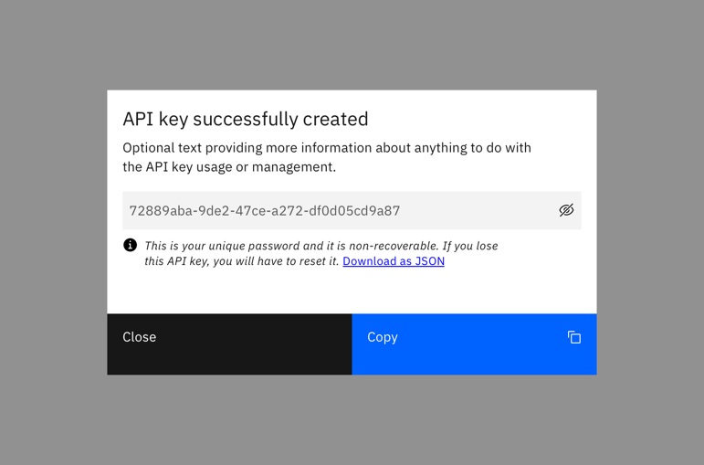
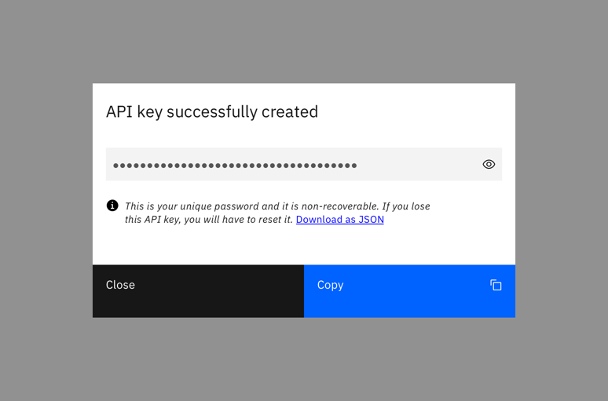
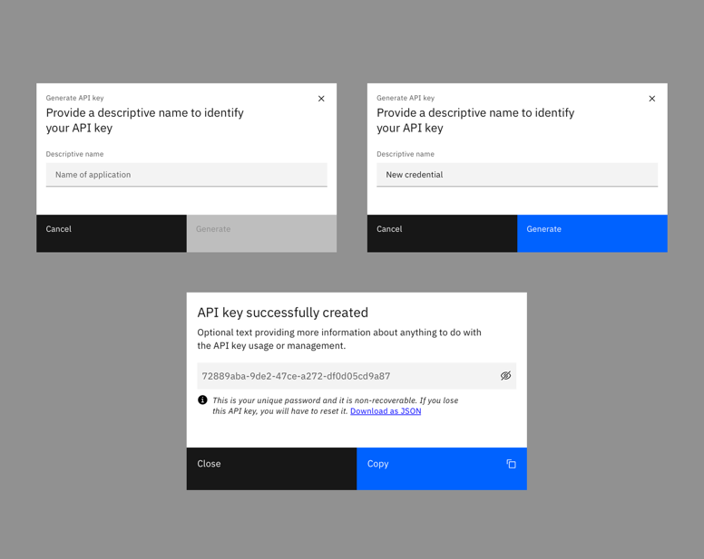
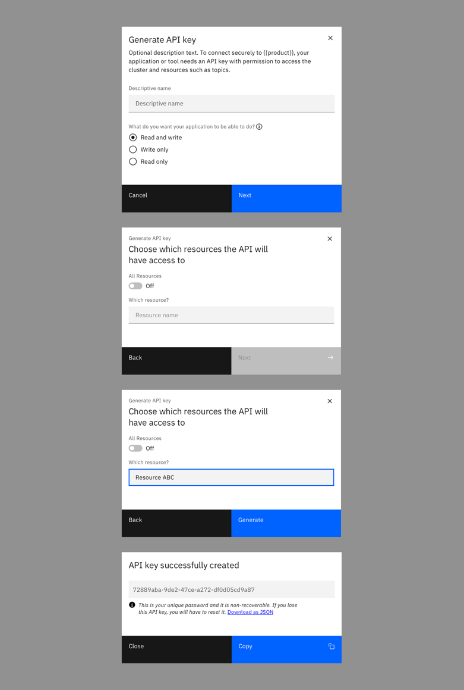

<Row>
  <Column colLg={8}>

  </Column>
</Row>

#### Options

<AnchorLinks>
  <AnchorLink>Generic access</AnchorLink>
  <AnchorLink>Restricted access and control permissions</AnchorLink>
</AnchorLinks>

## Generic access

<AnchorLinks small>
  <AnchorLink>Instant generation</AnchorLink>
  <AnchorLink>Providing a descriptive name</AnchorLink>
</AnchorLinks>

### Instant generation

Users click a primary ‘Generate’ button. Consider displaying a ‘Generating’ state if the API key takes time to generate.

<Row>
  <Column colLg={8}>

  </Column>
</Row>

Once the API key is generated it displays in a modal.

<Row>
  <Column colLg={8}>

  </Column>
</Row>

Optionally:
* Display two parts to the API key where required
* Provide information text about the API key
* Allow users to toggle the visibility of the key
* Provide a secondary link to download the key

<Row>
  <Column colLg={8}>

  </Column>
</Row>
<Row>
  <Column colLg={8}>

  </Column>
</Row>
<Row>
  <Column colLg={8}>

  </Column>
</Row>

### Providing a descriptive name

This follows the same principles as [Instant generation](#instant-generation),
with the addition of a pre-step for the user to provide a descriptive name
before the key is generated.

<Row>
  <Column colLg={8}>

  </Column>
</Row>

## Restricted access and control permissions

This follows the same principles as [Generic access](#generic-access),
with the addition of one or more steps for the user to assign specific access
control and permissions, before the API key is generated.

<Row>
  <Column colLg={8}>

  </Column>
</Row>

## Linked to

[Exporting](exporting)
