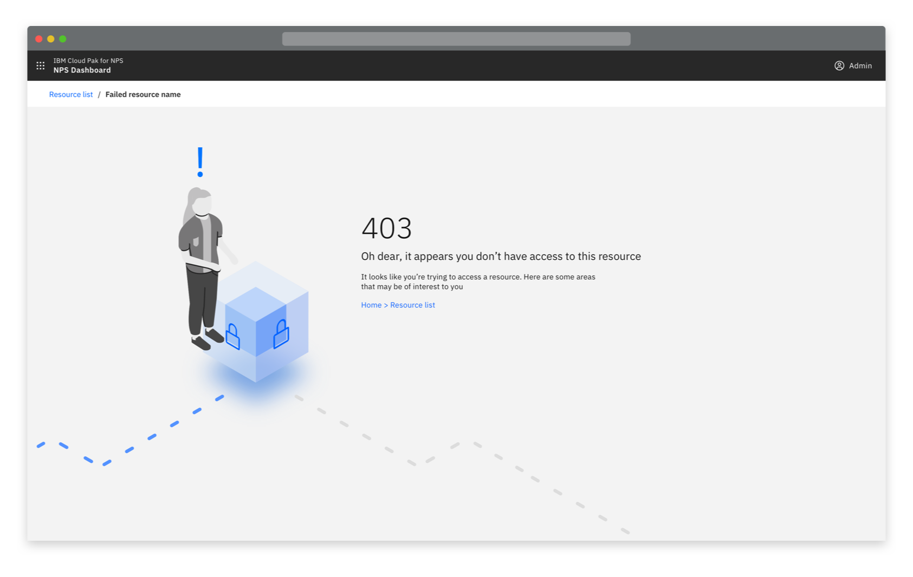
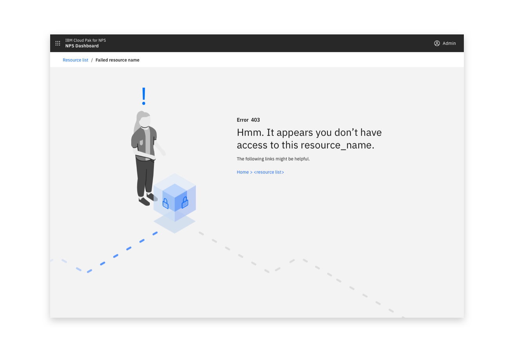
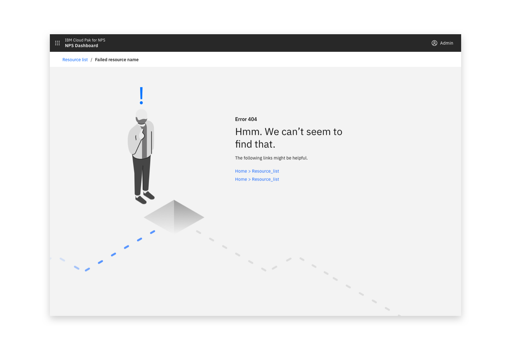
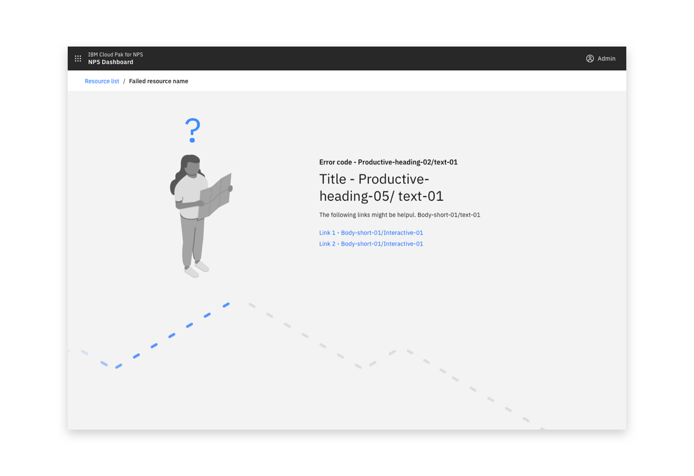

<PageDescription>

  Access something that isn’t available or they don’t have permission for.

</PageDescription>

<Row>
  <Column colLg={8}>

  </Column>
</Row>

## Consist of

- An illustration (optionally including animation) that can be relevant to the context, the product or be generic.
- The error number
- Maintain an informal tone
- Headline text explaining the cause of the error
- Description text with more details  
  - Optional - if you can give contextual details and suggestions in addition to the generic text

#### Options

<AnchorLinks>
  <AnchorLink>403 Error</AnchorLink>
  <AnchorLink>404 Error</AnchorLink>
</AnchorLinks>

## 403 Error

- Headline text - It appears you don't have access
- Description text - It appears you don't have access to this resource. 

<Row>
 <Column colLg={8}>

 </Column>
</Row>

## 404 Error

- Headline text - Something is missing
- Description text - Something is missing, you appear to be trying to access a resource that doesn’t exist yet

<Row>
 <Column colLg={8}>

 </Column>
</Row>
<Row>
 <Column colLg={8}>

 </Column>
</Row>

## Linked to

[Downloading](../downloading)
