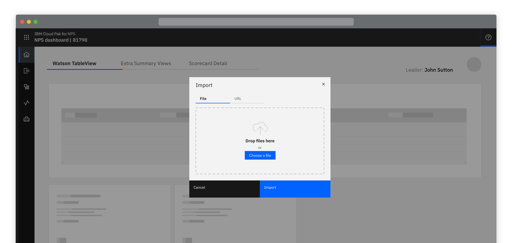
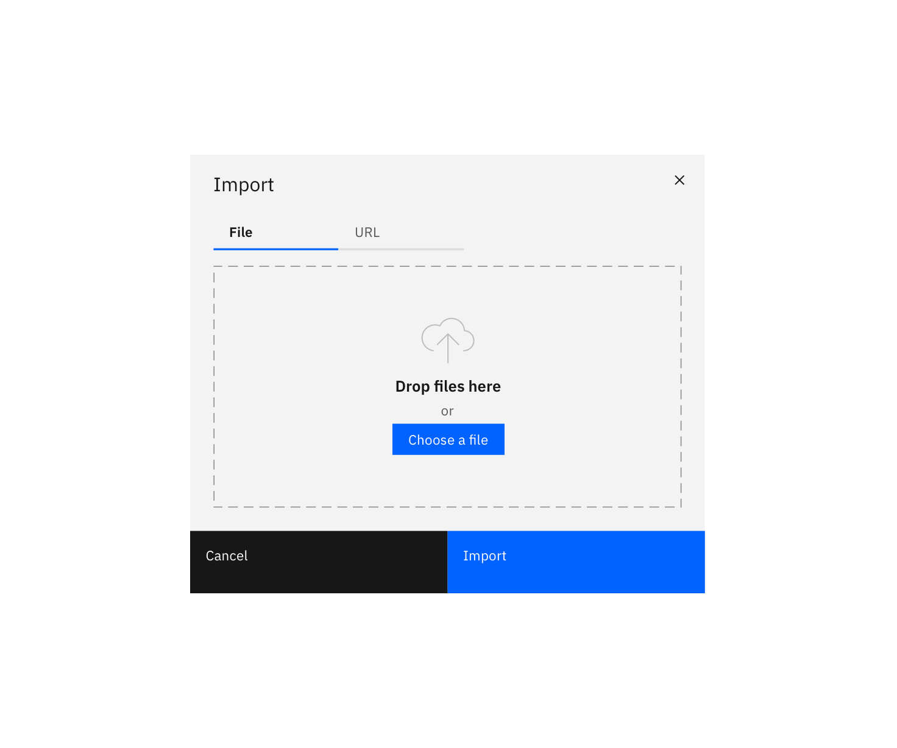
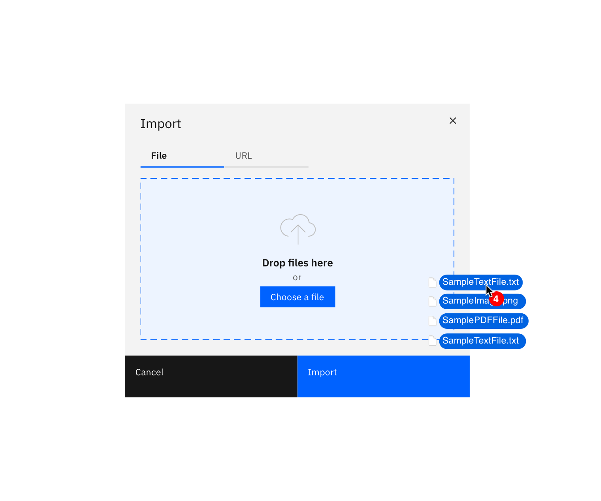
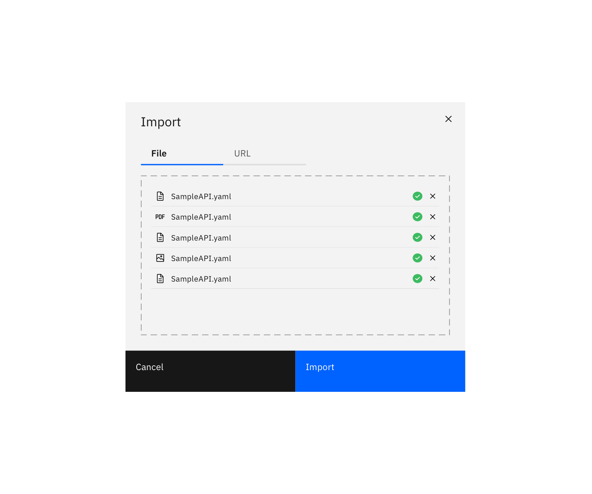
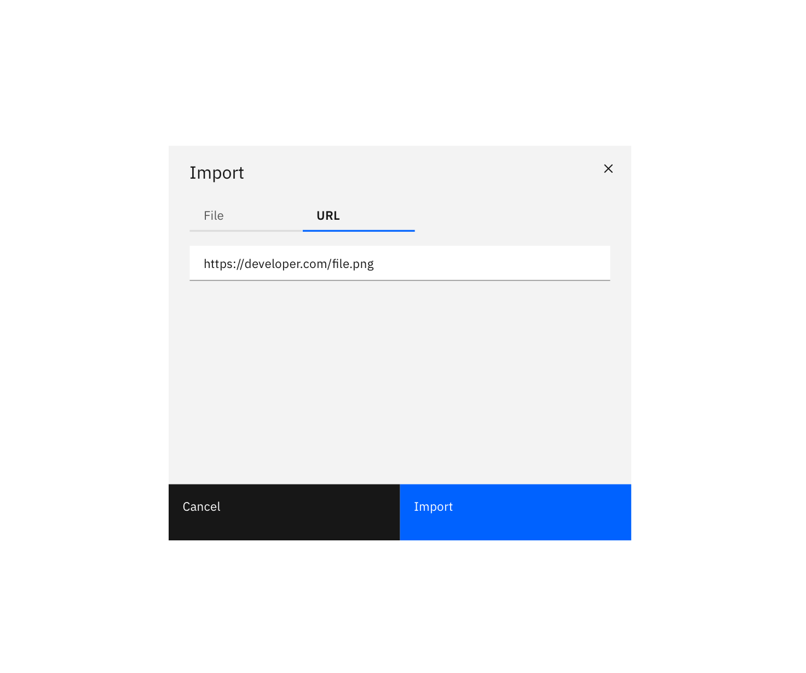

<PageDescription>

  Importing a resource transforms data or objects into a system from an external source.
  
</PageDescription>

<Row>
  <Column colLg={8}>

  </Column>
</Row>

The action of importing could be done by selecting an Import button and
opening a modal or inline in a full page form or slide in / over panel.

## Import methods

All or a combination of import methods should be available depending on the context.

#### Options

<AnchorLinks>
  <AnchorLink>Choose a file</AnchorLink>
  <AnchorLink>Enter a URL</AnchorLink>
  <AnchorLink>Import from Asset Repo</AnchorLink>
</AnchorLinks>

<Row>
 <Column colLg={8}>

 </Column>
</Row>

## Choose a file

Wherever possible there should always be a drag and drop zone, using the file
drop component, as well as the ability to browse locally and select a file.
Note that file selection should be restricted to only allowed file types.

<Row>
 <Column colLg={8}>

 </Column>
</Row>
<Row>
 <Column colLg={8}>

 </Column>
</Row>
<Row>
 <Column colLg={8}>

 </Column>
</Row>

## Enter a URL

Importing from a URL is appropriate this should be displayed as a textbox
with validation that what is entered is valid URL.

<Row>
 <Column colLg={8}>

 </Column>
</Row>

## Import from Asset Repo

Work in progress.

## Linked to

[Downloading](downloading)
