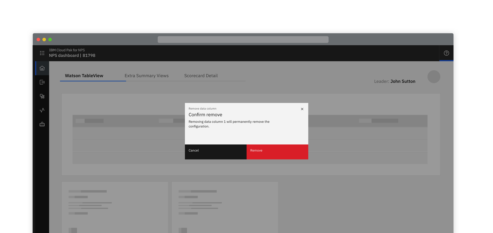
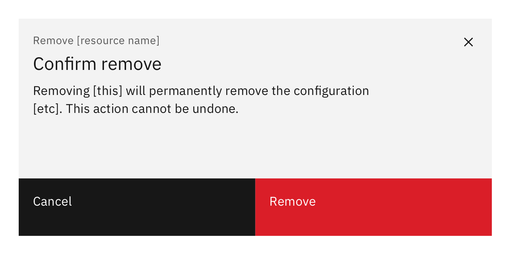
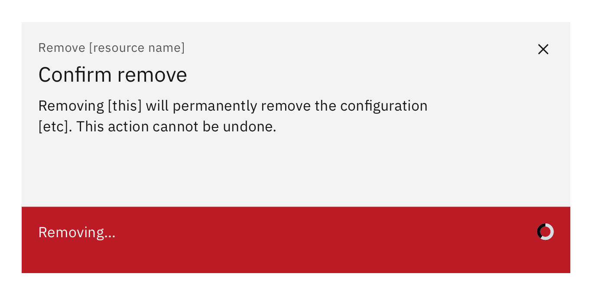

<PageDescription>

  When a resource or asset is removed from a particular instance / situation / location
  
</PageDescription>

<Row>
  <Column colLg={8}>

  </Column>
</Row>

This action removes an object from a list or item; however, the object is not destroyed as a result of the action. Multiple objects can be removed at once.

#### Options

<AnchorLinks>
  <AnchorLink>Low impact</AnchorLink>
  <AnchorLink>High impact</AnchorLink>
</AnchorLinks>

## Low impact

As removing does not destroy an asset, typically user confirmation is not required.

## High impact

When removing has a high impact:
- Require user confirmation
- Text should tell the user the consequences of the removal and that the action cannot be undone.
- Optionally, when the remove button is selected it changes to show ‘Removing’.

<Row>
 <Column colMd={6} colLg={8}>

 </Column>
</Row>
<Row>
 <Column colMd={6} colLg={8}>

 </Column>
</Row>
