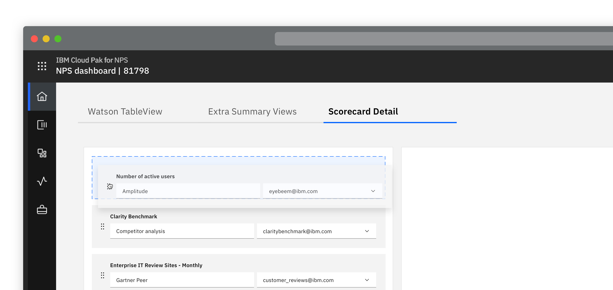
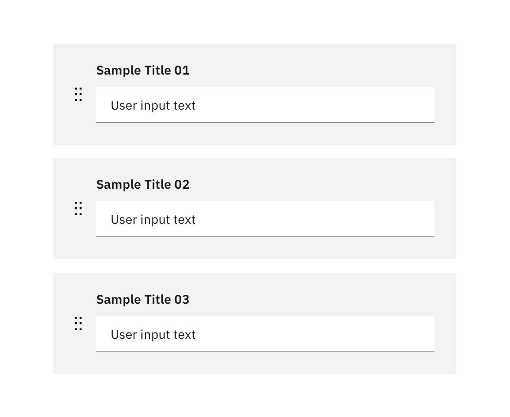
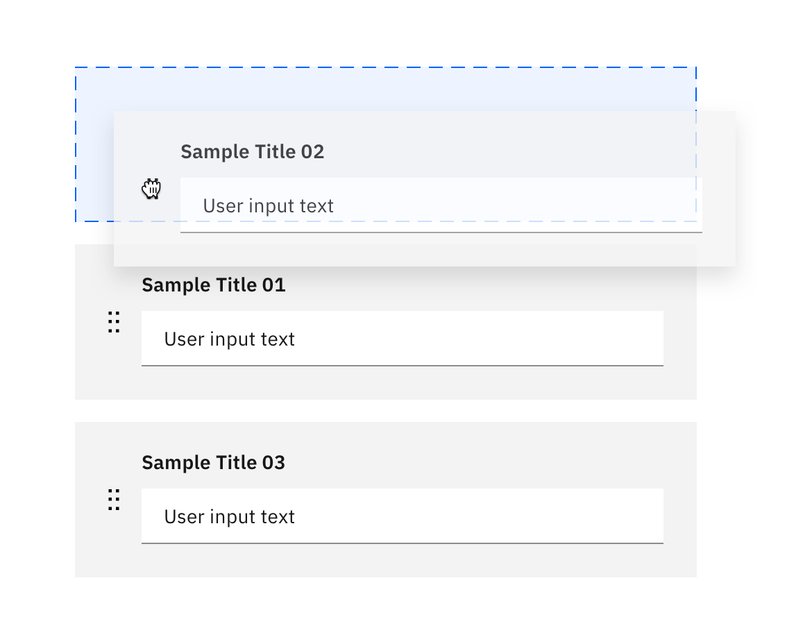
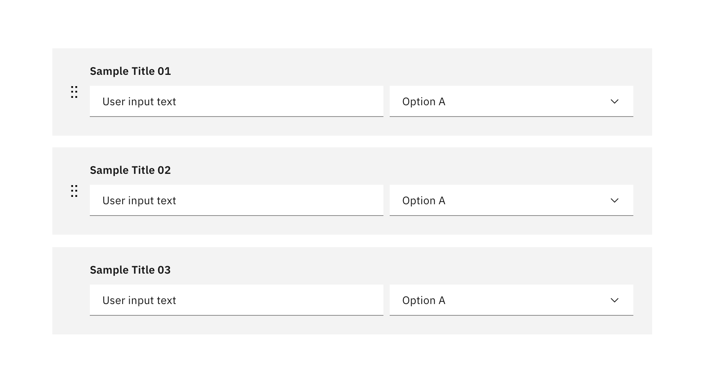
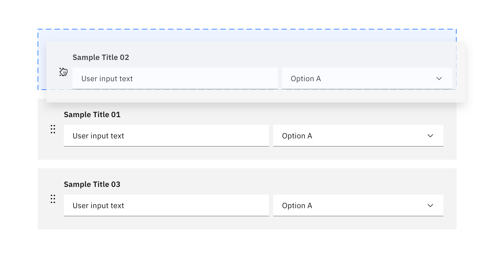

   &nbsp;&nbsp;&nbsp;Please note this pattern is still under review.

<Row>
  <Column colLg={8}>

  </Column>
</Row>

Ability to change an item's location in an ordered list

#### Options

<AnchorLinks>
  <AnchorLink>Drag and drop</AnchorLink>
  <AnchorLink>One at a time</AnchorLink>
</AnchorLinks>

## Overview

Allow users to change an item's location in an ordered list as desired without
having to delete or re-create the item.

This is only applicable to a list of items with the same or similar attributes
and when there is more than one item to move.

## Drag and drop

- On hover of the draggable icon, the mouse cursor changes to the grab icon
- While holding left click of the draggable icon, the user can move the selected item
- While dragging, user can see drop zones of eligible areas

<Row>
 <Column colMd={6} colLg={6}>

 </Column>
</Row>
<Row>
 <Column colMd={6} colLg={6}>

 </Column>
</Row>
<Row>
 <Column colMd={6} colLg={6}>

 </Column>
</Row>
<Row>
 <Column colMd={6} colLg={6}>

 </Column>
</Row>

## One at a time

Move up and down action can be used instead of drag and drop reordering.
The item will move one order at a time.

