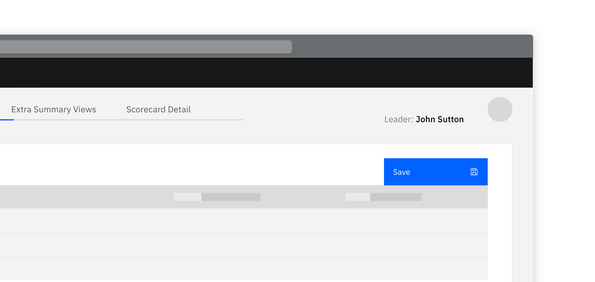
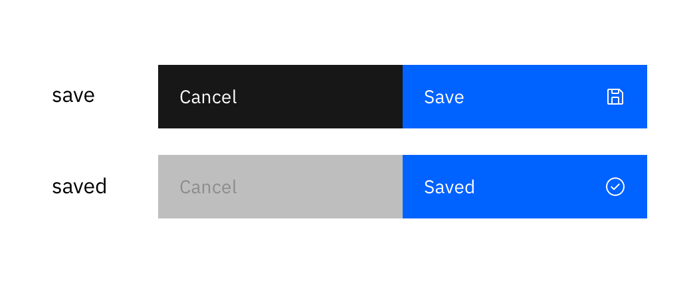

<PageDescription>

  Preventing the loss of activity.

</PageDescription>

<Row>
  <Column colLg={8}>

  </Column>
</Row>

Saving can be automatic or manual

## Options
Auto-save and manual save will be in button format.

#### Options

<AnchorLinks>
  <AnchorLink to="#auto-saving-all-modifications-are-instantly-saved">Auto saving (All modifications are instantly saved)</AnchorLink>
  <AnchorLink to="#manual-saving-when-auto-saving-isnt-appropriate-or-may-not-be-necessary">Manual saving (When auto saving isn’t appropriate or may not be necessary)</AnchorLink>
</AnchorLinks>

## Auto saving (All modifications are instantly saved)

This should be considered in situations where the task in hand is complex or
time consuming to complete. Most useful when there is the concept of a ‘draft’
or ‘incomplete’ state.

When auto saving there should be a visible indication to the user so they are
aware of the saving.

<Row>
 <Column colMd={6} colLg={6}>

 </Column>
</Row>

## Manual saving (When auto saving isn’t appropriate or may not be necessary)

An explicit user action which overrides something with the last set of
changes. In this situation if you don’t save it, you lose it!

If the user attempts to navigate in a way that would result in unsaved
changes being lost they should be warned.

<Row>
 <Column colMd={6} colLg={6}>

 </Column>
</Row>

## Linked to

[Editing & Updating](editing)
