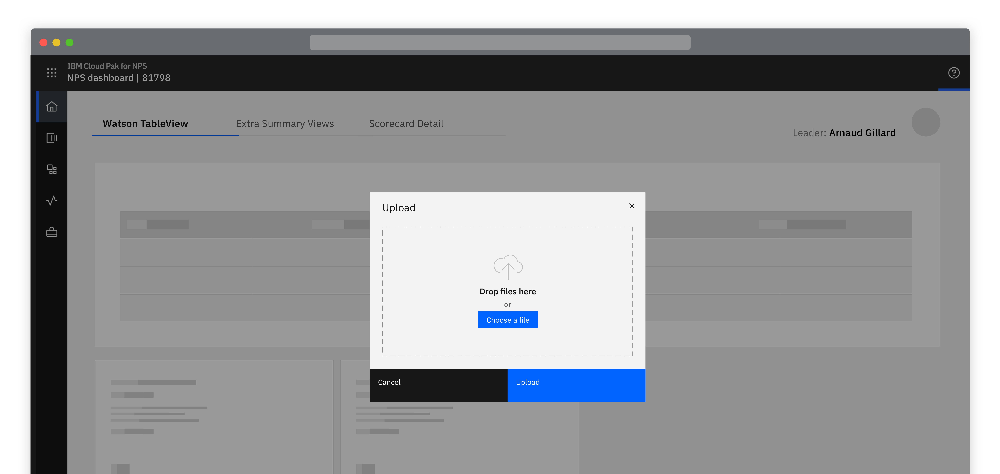
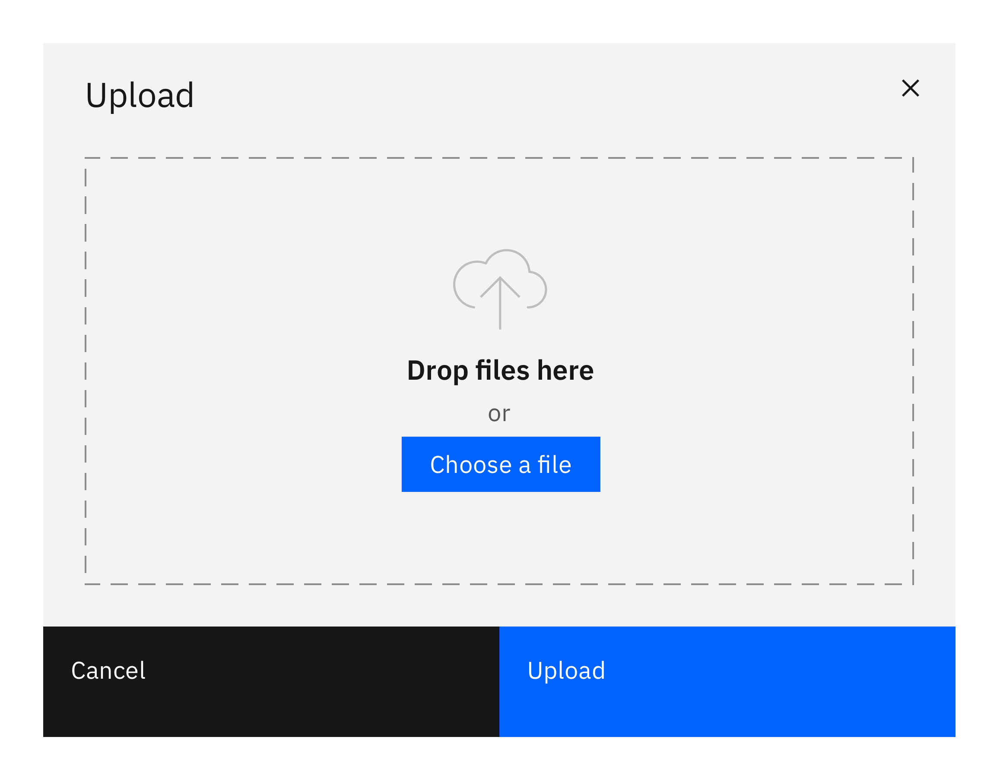
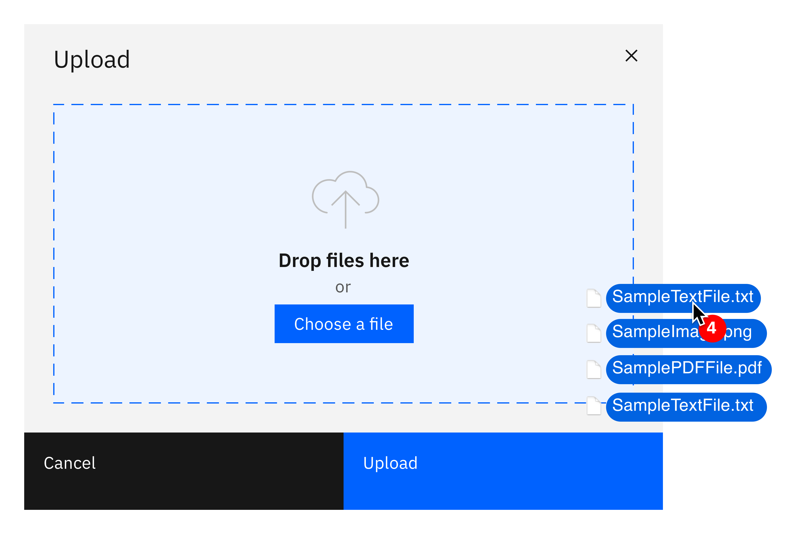

<PageDescription>

  Transferring a resource from a local system to a remote system.

</PageDescription>

<Row>
  <Column colLg={8}>

  </Column>
</Row>

## Things to consider

- Is the action uploading or is it importing?
- Where is the upload action performed?

#### Options

<AnchorLinks>
  <AnchorLink>Overview</AnchorLink>
  <AnchorLink>Upload methods</AnchorLink>
</AnchorLinks>

## Overview

The action of uploading should always be the result of a user action.
The action of uploading a file could be done by selecting an action button
to open a modal or it may be done inline in a full page form or slide in or
over panel.

<Row>
 <Column colLg={8}>
  

  

 </Column>
</Row>
<Row>
 <Column colMd={6} colLg={6}>

 </Column>
</Row>

## Upload methods

- Drag and Drop
- Choose a file

Wherever possible there should always be a drag and drop zone, using the file
drop component, as well as the ability to browse locally and select a file.
Note that file selection should be restricted to only allowed file types.

<Row>
 <Column colMd={6} colLg={6}>

 </Column>
</Row>

## Linked to

[Downloading](downloading)
