<- [Back to button guidance overview](https://pages.github.ibm.com/cdai-design/pal/components/button-guidance/overview) 

<PageDescription>

Icons can be placed next to labels to both clarify an action and call attention to a specific button.

</PageDescription>

<AnchorLinks>
  <AnchorLink>Overview</AnchorLink>
  <AnchorLink>Text and icon buttons</AnchorLink>
  <AnchorLink>Best practices for icon use</AnchorLink>
  <AnchorLink>Text-only buttons</AnchorLink>
  <AnchorLink>Icon-only buttons</AnchorLink>
  <AnchorLink>References</AnchorLink>
  <AnchorLink>Related</AnchorLink>
</AnchorLinks>

## Overview 
Icons are optional additions to all button types, which can add additional emphasis and recognizability to a button. However, icons should be used sparingly as overuse can lead to visual noise which can make an experience less usable. If you use a button with an icon in one part of your UI it does not mean that you need to add icons to the other buttons.

## Text and icon buttons
When deciding whether to add an icon to a button, it's important to consider how recognizable the icon is, and whether in other contexts, a similar icon may be used for a different meaning. We want to avoid the same icon being used for completely different actions. 

For this reason, we have defined a set of universal actions that are suitable for the addition of an icon alongside the button text. These have clearly defined and widely recognized icons within IBM Software and beyond.

### Universal actions with well-established icons

| Name of action    | Associated icon   | Name in icon library |
| ------- | ------ | ---------- |
| Create/Add |              | Add           |
| Edit       |               | Edit          |
| Copy       |               | Copy          |
| Delete     |        | Trash can     |
| Remove     |     | Subtract alt  |
| Export     |           | Export        |
| Upload     |           | Upload        |
| Download   |       | Download      |
| Play/Start |               | Play          |
| Pause      |             | Pause         |
| Stop       |               | Stop          |
| Refresh    |         | Restart       |

_Think there's a universal action with a clearly defined icon that's missing? Let us know [here](https://github.ibm.com/CDAI-design/pal)._

Icons that are not on this list still can be used on buttons, as long as the icon is clearly tied to the intended action. To determine the expected use of an icon, check its name in the Carbon library.

### Launch icon
The launch icon (also known as the launch out icon) should be used on any call to action that launches the user into another tab (whether the content of the new tab is part of the same product or an entirely separate web resource). Buttons and links requiring the launch icon are often found in the UI left navigation area, in side panels, on cards and in modals. The target destination of the launch action should be made clear to the user through the button or link label and the surrounding context. For more guidance, see [this section](https://pages.github.ibm.com/cdai-design/pal/content/navigation-labels/#match-link-text-to-page-heading) of our content guide.

<Row>
  <Column colLg={8}>

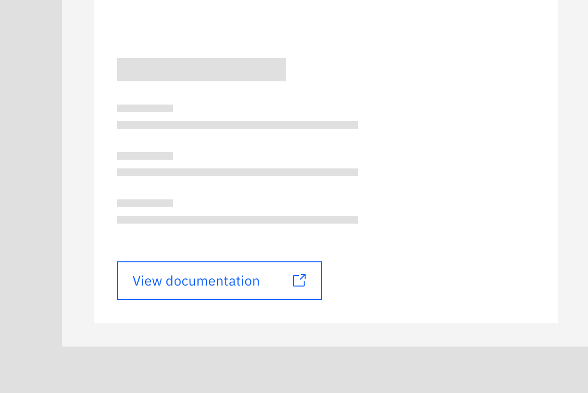

  </Column>
</Row>

## Best practices for icon use

#### For universal actions, always use the defined icon
For cross-product consistency, use universal icons alongside the button text when using these actions.

<Row>
  <Column colLg={4}>

<DoDontExample type="do">

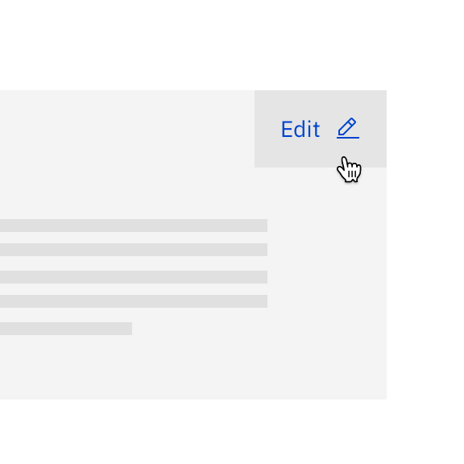

</DoDontExample>
  </Column>

  <Column colLg={4}>

<DoDontExample type="dont">

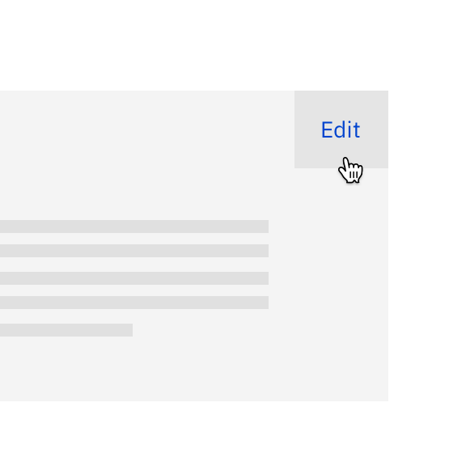

</DoDontExample>
  </Column>
</Row>

_In the don't example, the edit action lacks prominence. Using the text label and the icon improves the button's prominence and recognizability._

An exception to this rule is universal actions using either XL (64px) or 2XL (80px) buttons (for example, in tearsheets and modals), as buttons of this size do not support the use of icons.

#### Don't use an icon in the universal list for another action
Using icons in the above list for other actions can confuse the expected outcome/experience.

<Row>
  <Column colLg={4}>

<DoDontExample type="do">

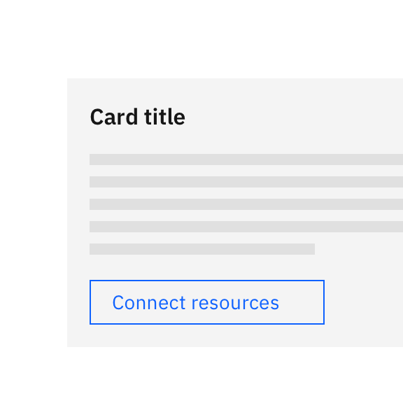

</DoDontExample>
  </Column>

  <Column colLg={4}>

<DoDontExample type="dont">

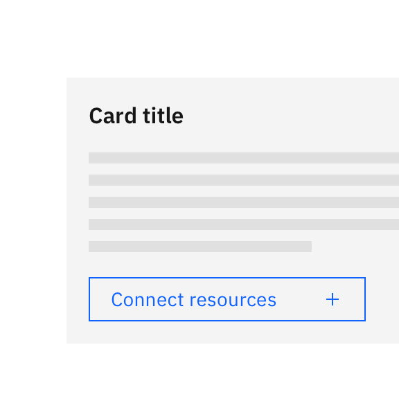

</DoDontExample>
  </Column>
</Row>

_The connect action doesn't have a universally recognized icon so it is better not to add an icon at all._

#### If one or more buttons in a group have an icon, it doesn't mean they all need to have an icon
Not every button in a button group needs an icon. Only use icons for the universal actions listed above or for other actions where a particular icon is very commonly paired and associated with that action.

<Row>
  <Column colLg={4}>

<DoDontExample type="do">

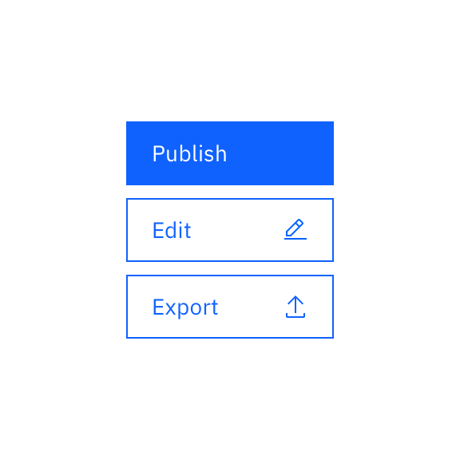

</DoDontExample>
  </Column>

  <Column colLg={4}>

<DoDontExample type="dont">

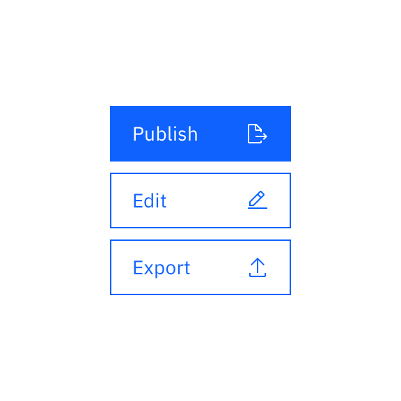

</DoDontExample>
  </Column>
</Row>

_The don't example uses the icon 'document export' for the publish action, which isn't suitable. As publish doesn't have a well-defined icon, it's most appropriate to use a text-only button._

When possible, group buttons with icons together. This is only appropriate when all icons have a shared hierarchy, and the order can be changed without impacting the user experience. 

<Row>
  <Column colLg={4}>

<DoDontExample type="do">

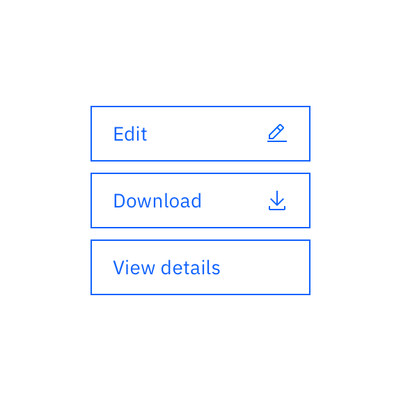

</DoDontExample>
  </Column>

  <Column colLg={4}>

<DoDontExample type="dont">

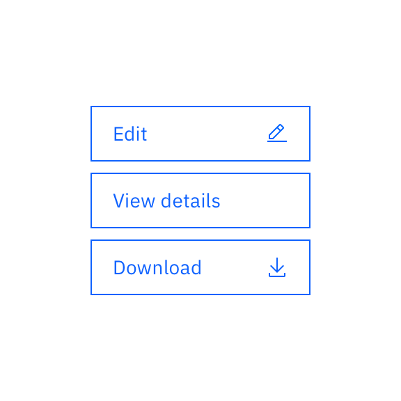

</DoDontExample>
  </Column>
</Row>

#### Use the default variation for all icons
Some icons in the Carbon library have different variations, such as alt, filled and outlined. As not all icons have variations, we should be using the "default" option for all icons (the only exception is status icons, which have their own defined icon to use). Default icons are simply named after their action.

Different variations of the same icon should not be used interchangeably in the same product.

<Row>
  <Column colLg={4}>

<DoDontExample type="do">

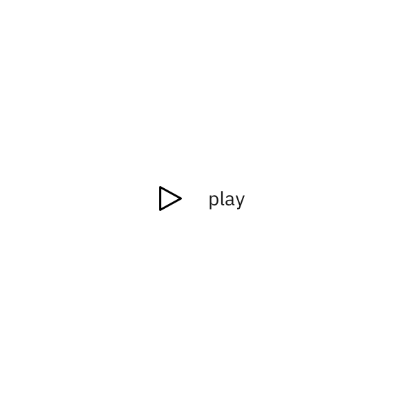

</DoDontExample>
  </Column>

  <Column colLg={4}>

<DoDontExample type="dont">

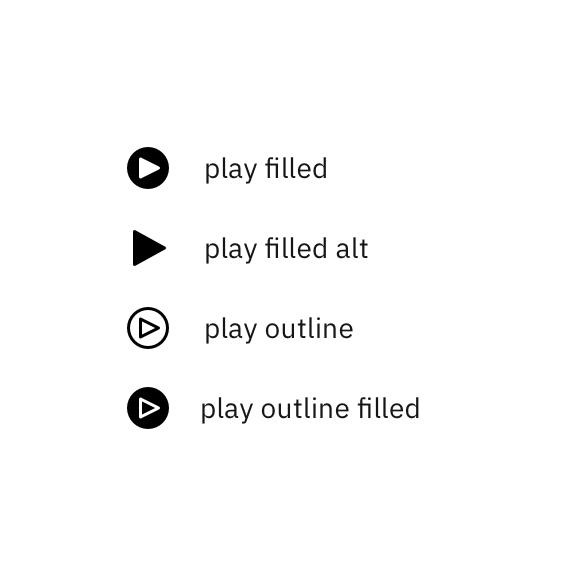

</DoDontExample>
  </Column>
</Row>

_For the play icon, there are 5 possible choices. The 'play' icon would be the default and recommended choice, as it is most consistent with the other icons in the library in terms of its styling._

## Text-only buttons
Call to actions that are not part of the universal actions list, or do not have an obvious icon, should not have an icon. The label text should clearly define the action, so an icon is not required.

## Icon-only buttons
Icon-only buttons should be used sparingly. "For most situations, users learn correct interpretations better with text alone than with icons alone." — Wiedenbeck, S (1999). For this reason, using icon-only buttons is only recommended in two use cases.

1. The icon must be standardized and recognizable without text or represent an action with a strong visual attribute – such as a printer icon to represent a print action.
2. There is insufficient space and multiple actions, therefore a toolbar using icon buttons is required.

Regardless of how recognizable an icon may or may not be, or whether that action lies within the universal actions list, a tooltip is always required with text explaining what the icon button would do if clicked. 

<Row>
  <Column colLg={8}>

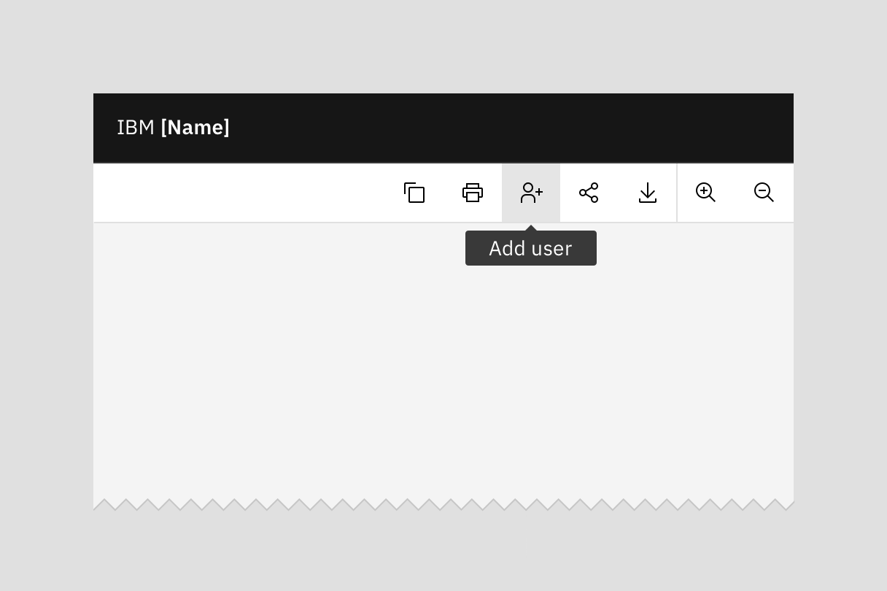

  </Column>
</Row>

_Icon tooltips should contain succinct text that clearly explains what the outcome of clicking on that button would be._ 

## References
Wiedenbeck, S (1999). The use of icons and labels in an end-user application program: An empirical study of learning and retention. Behavior & Information Technology, 18(2), p68–82

## Related
- [Buttons](https://www.carbondesignsystem.com/components/button/usage/)
- [Icons](https://www.carbondesignsystem.com/guidelines/icons/library/)
- Content guidance > [Button labels](https://pages.github.ibm.com/cdai-design/pal/content/button-labels)

