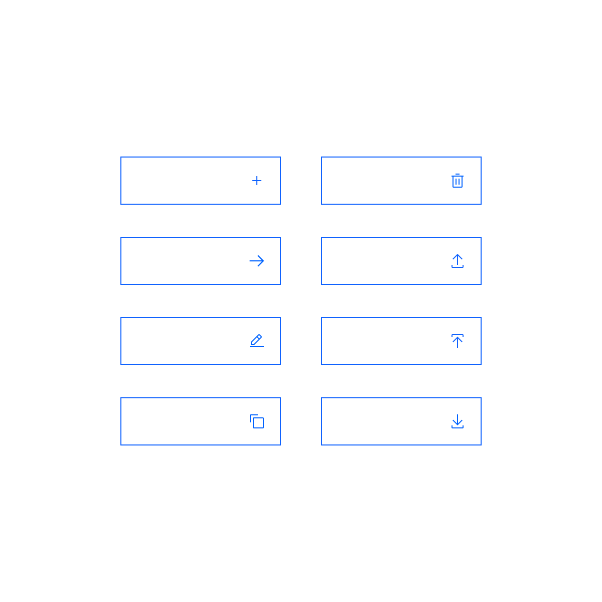

<PageDescription>

Buttons are used to initialize an action. Button guidance adds further clarity to Carbon on consistent use, placement and alignment of buttons.

</PageDescription>

## Overview

The button is one of the most fundamental components in the Carbon library. With the large portfolio of products using this component, small inconsistencies in use are almost inevitable.

This documentation is a set of guidelines on how to use, style and implement buttons to ensure a consistent experience across our portfolio and provide users with a similar, uniform experience. 

**Note**: _These pages are not intended to replace the Carbon documentation. These are meant to provide guidance, structure and consistency for all our products under the Carbon for IBM Products portfolio._

<Row className="image-card-group">

<Column colMd={3} colLg={3} noGutterSm>

<ImageCard 
sub-title="Using primary buttons"
sub-titleColor="dark"
hoverColor="dark"
href="/components/button-guidance/primary-buttons">

</ImageCard>

<ImageCard
sub-title="Menu and combo buttons"
sub-titleColor="dark"
hoverColor="dark"
href="/components/button-guidance/menu-and-combo-buttons">

</ImageCard>

</Column>

<Column colMd={3} colLg={3} noGutterSm>

<ImageCard 
sub-title="Using tertiary and ghost buttons"
sub-titleColor="dark"
hoverColor="dark"
href="/components/button-guidance/tertiary-and-ghost">

</ImageCard>

<ImageCard
sub-title="Button groups"
sub-titleColor="dark"
hoverColor="dark"
disabled
href="/components/button-guidance/button-groups">

</ImageCard>

</Column>

<Column colMd={3} colLg={3} noGutterSm>

<ImageCard 
sub-title="Using icons on buttons"
sub-titleColor="dark"
hoverColor="dark"
href="/components/button-guidance/icons-on-buttons">

</ImageCard>

<ImageCard 
sub-title="Button placement and alignment"
sub-titleColor="dark"
hoverColor="dark"
disabled
href="/components/button-guidance/button-placement-and-alignment">

</ImageCard>

</Column>

</Row>
