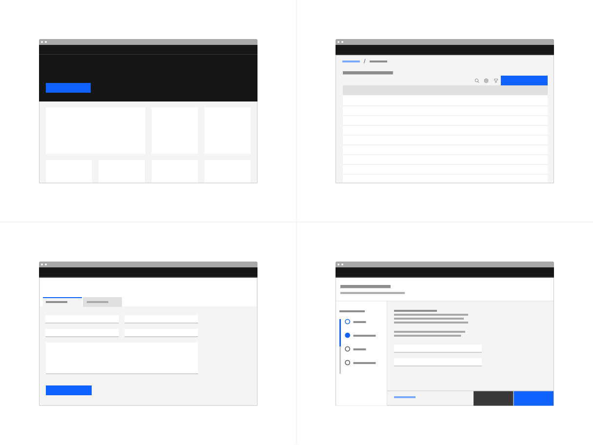
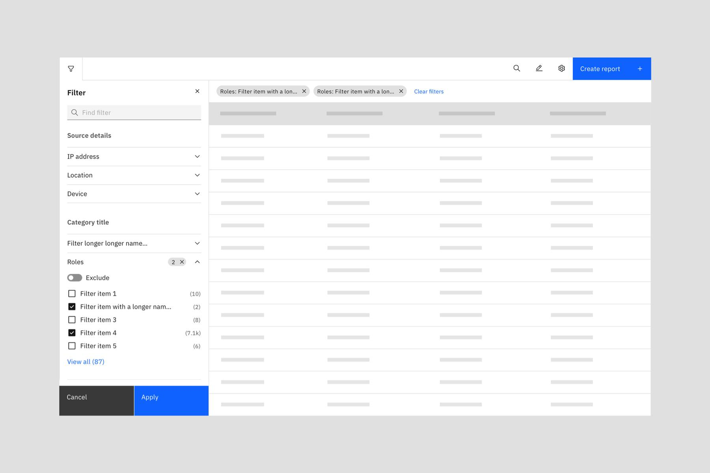
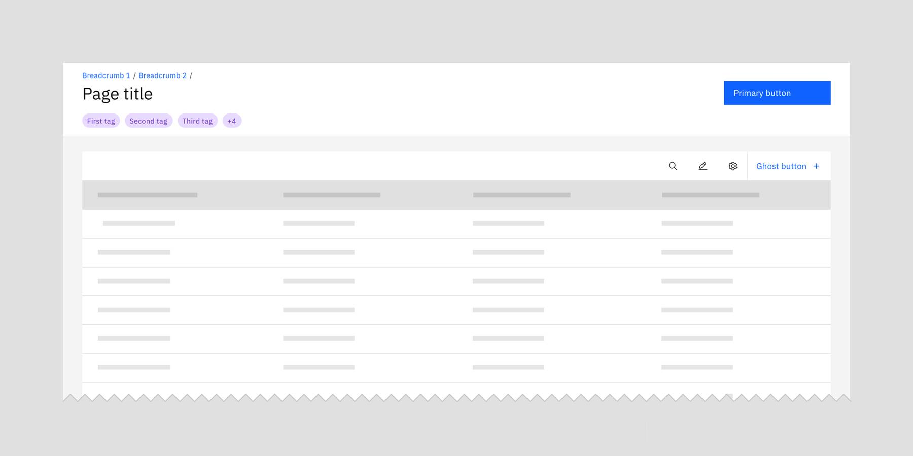
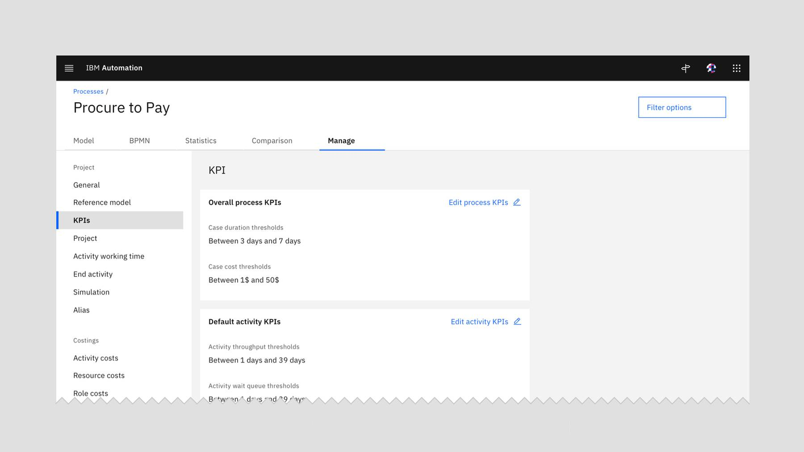

<- [Back to button guidance overview](https://pages.github.ibm.com/cdai-design/pal/components/button-guidance/overview) 

<PageDescription>

Primary buttons are used for the principal call to action on the page.

</PageDescription>

<AnchorLinks>
  <AnchorLink>Overview</AnchorLink>
  <AnchorLink>Identifying the primary action</AnchorLink>
  <AnchorLink>Temporary primary flows</AnchorLink>
  <AnchorLink>Best practices</AnchorLink>
  <AnchorLink>Related</AnchorLink>
</AnchorLinks>

## Overview 
Primary buttons should only appear once per screen (the only exception are temporary primary flows). This helps give the user focus and give them context behind the expected next step.

<Row>
  <Column colLg={8}>

  </Column>
</Row>

## Identifying the primary action
To identify the primary action on a page with multiple actions, ask yourself: "Which action would a user most likely need to do on this page?" The primary action often aligns to a common action, such as Create or Add. 

Sometimes, when answering this question, it feels like there is still more than primary button needed. This might indicate you need to use a temporary primary flow in your design. 

## Temporary primary flows
There may be times where there is a primary button on a page, but through interaction with the page content, another flow may be launched that has its own primary button. Temporarily, there may be two primary buttons on a page. 

In this case, a user has triggered something with an intention to focus on another flow, therefore temporarily having two primary buttons on a page is acceptable. This is the only case where having two primary actions on a page is advised.

There are two types of temporary primary flow; low and high impact.

### Low impact flows
Low impact flows are quick to update and change, therefore if a user navigates away before applying those updates, the loss is minimal. Filtering is an example of a low impact temporary primary flow.

<Row>
  <Column colLg={12}>

  </Column>
</Row>

_In this experience, the user is filtering the table using the batch filters in the left panel. If they navigate away by clicking create report before clicking the apply button, the loss of change has a low impact._

### High impact flows
High impact flows are typically longer and more complex. An edit flow is a great example of this.

<Row>
  <Column colLg={12}>

  </Column>
</Row>

_For this example, the user has selected to edit data refresh. During this time, saving their changes is the primary action._

As high impact temporary primary flows take longer to carry out, losing changes is more severe. For this reason, high impact flows require a warning modal if the user clicks something that would navigate them away from this experience and result in loss of data.

<Row>
  <Column colLg={12}>

  </Column>
</Row>

For both types of temporary primary flows, make sure to disable the new primary button until changes have been made. 

## Best practices

### Use tertiary buttons for page headers (especially for ones with tabs)
Using a primary button in a page header is problematic as it's likely that the content below the header may contain a primary action, or may do in a future release. The hierarchical positioning of the button in the page header already gives this button a lot of prominence, even if not styled as a primary button. If it is determined that the button in the page header, across all tabs, should be primary, ensure none of the pages below the header contain another primary action.

<Row>
  <Column colLg={4}>

<DoDontExample type="do">

</DoDontExample>
  </Column>

  <Column colLg={4}>

<DoDontExample type="dont">

</DoDontExample>
  </Column>
</Row>

_This is a common issue in products, where using the primary button in the header conflicts with the primary button in the page content._

### Use ghost buttons for table actions that are not the primary action of the page
Buttons in the table toolbar are often depicted as a primary button, but this might not always be the case. Use a ghost button instead if there is another button on the page that requires primary styling.

<Row>
  <Column colLg={12}>

  </Column>
</Row>

### Not every page needs a primary button
Sometimes the primary purpose of the page is to interact with a data table row or read over content, rather than to trigger an action. In this case, use tertiary and ghost buttons for these supporting actions or experiences. 

<Row>
  <Column colLg={12}>

  </Column>
</Row>

_On this page, the users' main action is to read and check over the KPI settings of their process. The actions present on the page: filtering and editing are supporting flows, so are more suitably shown as tertiary and ghost buttons._

## Related
- [Buttons](https://www.carbondesignsystem.com/components/button/usage/)
- [Using tertiary and ghost buttons](https://www.carbondesignsystem.com/components/button-guidance/tertiary-and-ghost)

