<- [Back to button guidance overview](https://pages.github.ibm.com/cdai-design/pal/components/button-guidance/overview) 

<PageDescription>

Tertiary and ghost buttons are both used for less prominent actions. However, there are cases where one button is more suitable to use than the other.

</PageDescription>

<AnchorLinks>
  <AnchorLink>Overview</AnchorLink>
  <AnchorLink>Aligning ghost buttons vertically</AnchorLink>
  <AnchorLink>Common uses for tertiary buttons</AnchorLink>
  <AnchorLink>Common uses for ghost buttons</AnchorLink>
  <AnchorLink>Related</AnchorLink>
</AnchorLinks>

## Overview 

### Tertiary buttons
Tertiary buttons have slightly more prominence than a ghost button and work well on their own or as part of a button group. Tertiary buttons should not be used in fluid arrangements.
<Row>
  <Column colLg={4}>

<DoDontExample type="do">

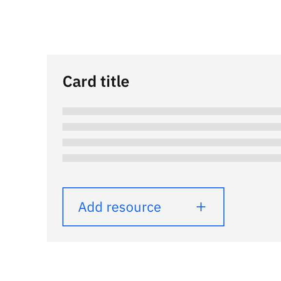

</DoDontExample>
  </Column>

  <Column colLg={4}>

<DoDontExample type="dont">

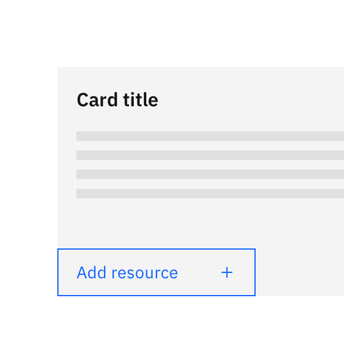

</DoDontExample>
  </Column>
</Row>

_In fluid arrangements (those where a button bleeds to the edges of a container, shown in the don't example), do not use a tertiary button. Instead, make sure the tertiary button has adequate padding on all sides._

### Ghost buttons
Ghost buttons are more subtle, so are ideal for supplementary actions. They work best when they are flush against a container or horizontally grouped with other elements. 
<Row>
  <Column colLg={4}>

<DoDontExample type="do">

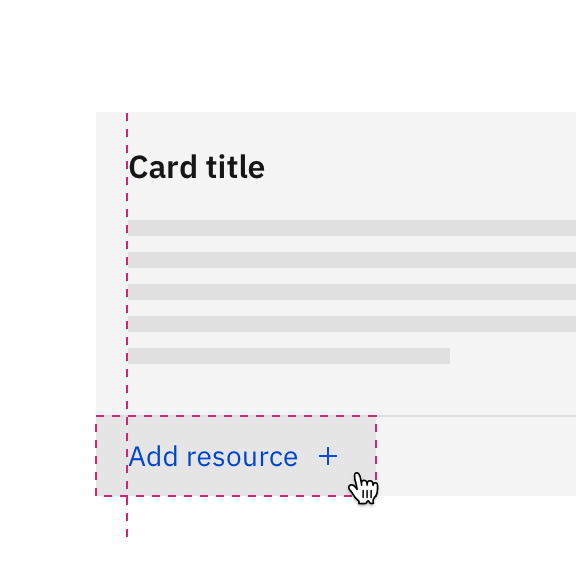

</DoDontExample>
  </Column>

  <Column colLg={4}>

<DoDontExample type="dont">

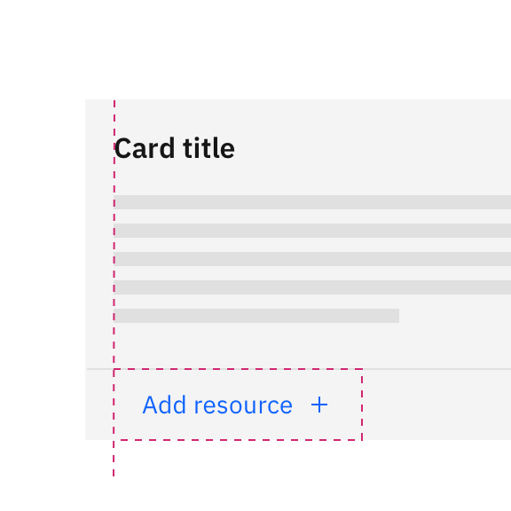

</DoDontExample>
  </Column>
</Row>

_Aligning the bounding box of the ghost button with the content (i.e. the typical way to align buttons), leads to the ghost button appearing as if it's misaligned. Instead, hang the ghost button so that the text label aligns with other text elements on the page._

## Aligning ghost buttons vertically
The general rule for vertically aligning a ghost button with other content is to ensure the text label of the button aligns with text elsewhere on the page.

For a ghost button to appear aligned in vertical arrangements, it needs to be touching at least two edges of a container. When only one side of a ghost button touches a container's edge, it can look like a mistake. Use the methods below to ensure ghost buttons appear purposefully placed in designs.

### Aligning to a corner of a container
Ghost buttons work well when aligned to a corner of a container. An example is within a card, where an action would either be aligned to the top right or bottom left corner.
<Row>
  <Column colLg={4}>

<DoDontExample type="do">

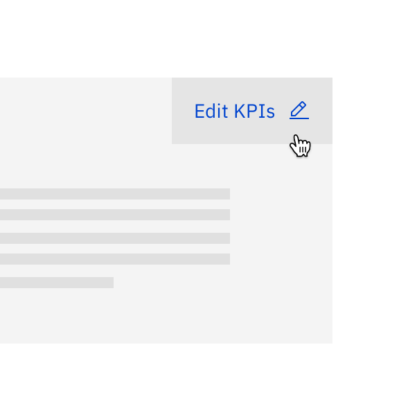

</DoDontExample>
  </Column>

  <Column colLg={4}>

<DoDontExample type="dont">

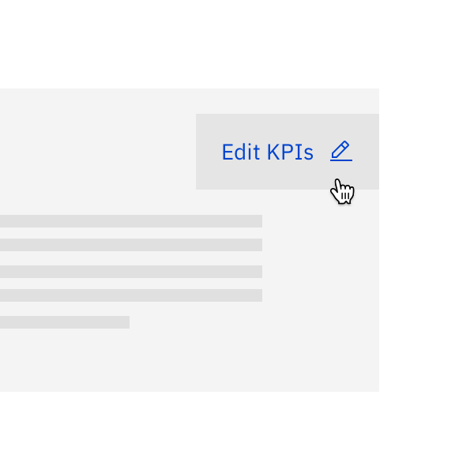

</DoDontExample>
  </Column>
</Row>

### Aligning to the full width of a container
In side panels, ghost buttons can be helpful for small supplementary actions, that need less prominence than a tertiary button provides. In this context, extending the width of the ghost button to the full width of the container makes this treatment seem intentional. 
<Row>
  <Column colLg={4}>

<DoDontExample type="do">

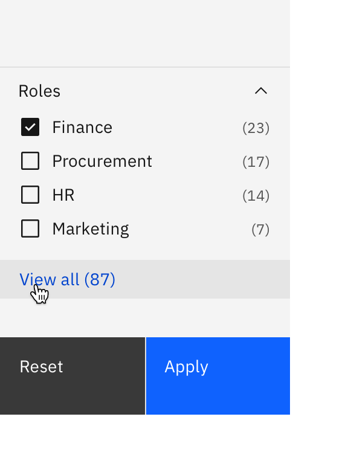

</DoDontExample>
  </Column>

  <Column colLg={4}>

<DoDontExample type="dont">

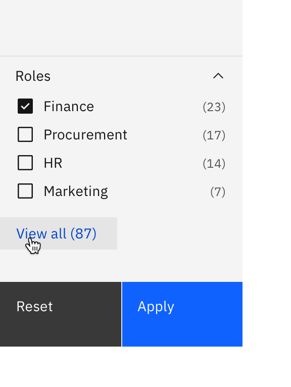

</DoDontExample>
  </Column>
</Row>

Aligning to the full width of a container is only recommended when the containers are smaller in size. In side panels, aligning ghost buttons in this way is only suitable for side panels 480px (medium) and below. 

### Using alternative button types
If positioning the ghost button in the methods above is not achievable, it might be best to consider alternative approaches.

#### Use tertiary buttons instead
Tertiary buttons are much easier to align, so may be more suitable than using a ghost button in some use cases.

<Row>
  <Column colLg={8}>

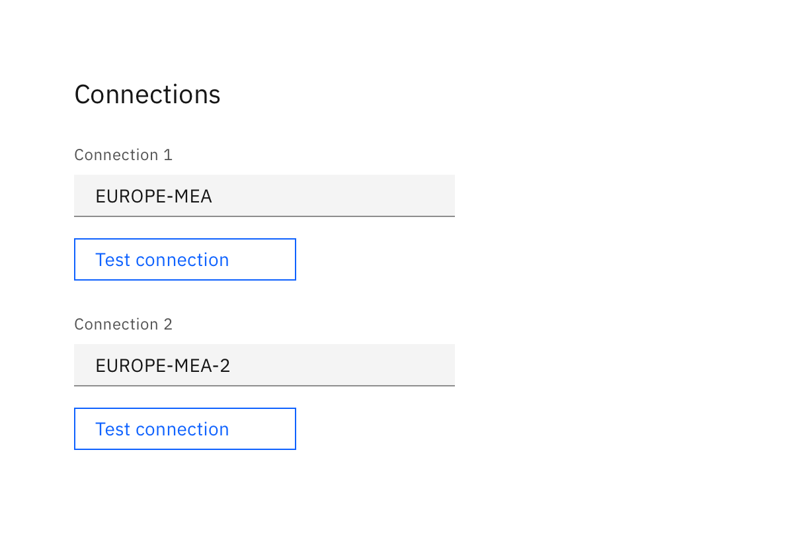

  </Column>
</Row>

#### Use links instead
When appropriate (if the action sends the user to another page), a link could be a good solution.

<Row>
  <Column colLg={8}>

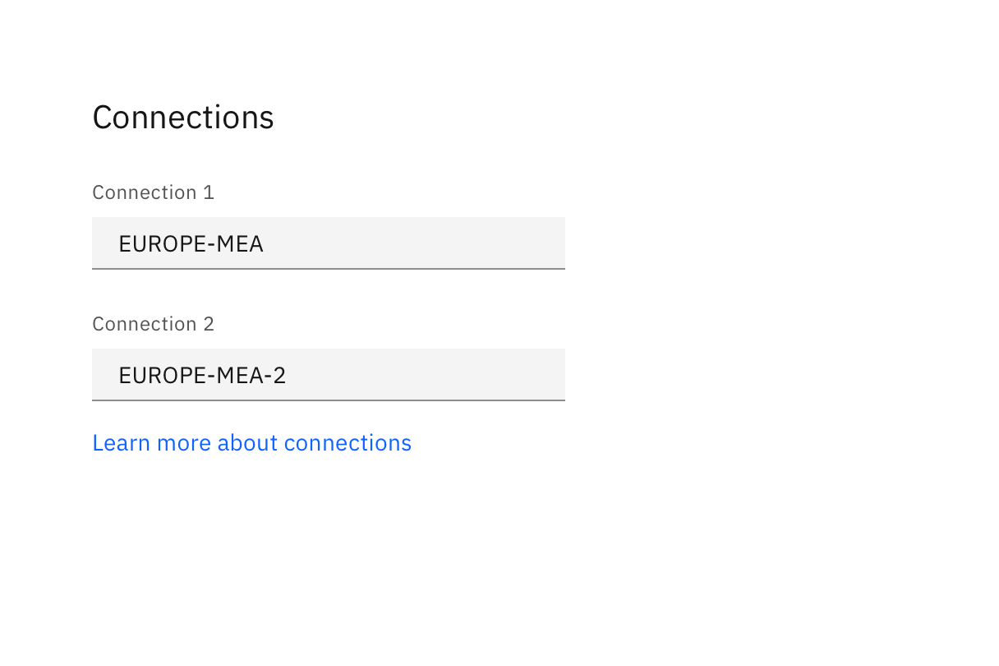

  </Column>
</Row>

#### Align the ghost button horizontally
Aligning ghost buttons horizontally is a lot more straightforward than vertically, so could be an option if there is room to do so.

<Row>
  <Column colLg={8}>

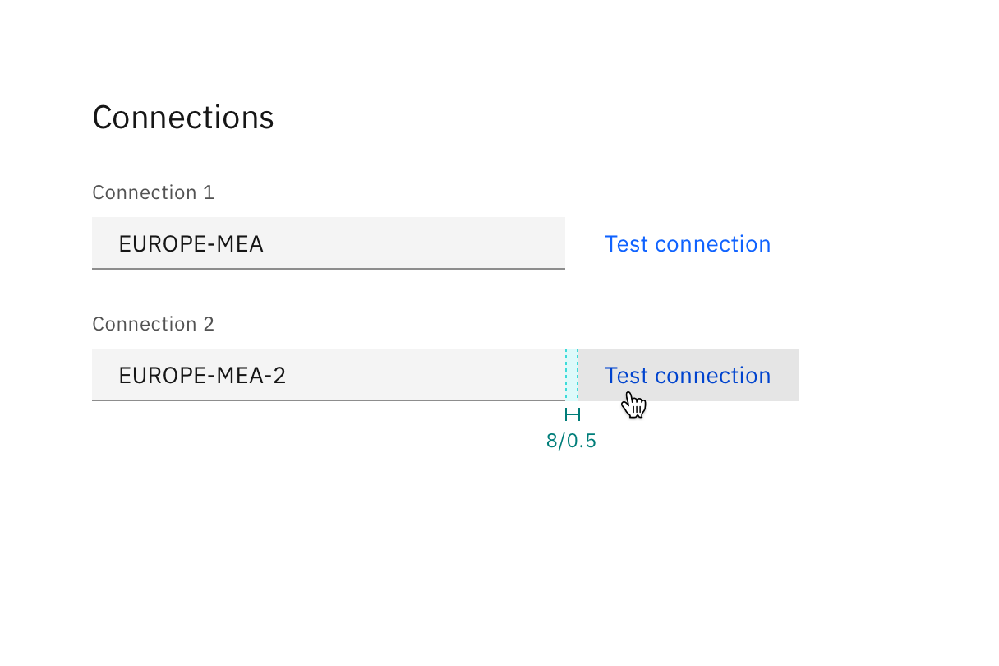

  </Column>
</Row>

## Common uses for tertiary buttons

### In page headers
For page headers needing a call to action button, a tertiary button is recommended as there is often another primary task on the page (See [using primary buttons](https://www.carbondesignsystem.com/components/button-guidance/primary-buttons) for further guidance). A ghost button would feel a little too subtle in this situation.
<Row>
  <Column colLg={8}>

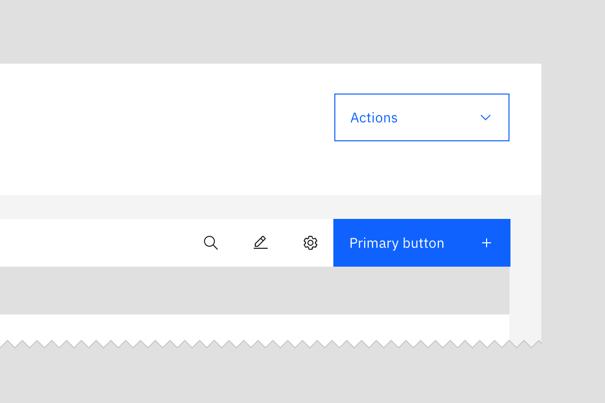

  </Column>
</Row>

### In button groups
In button groups, where there is one primary and two other actions with shared importance, consider using tertiary buttons. Ghost buttons could not be used in this application due to alignment issues already explained.
<Row>
  <Column colLg={8}>

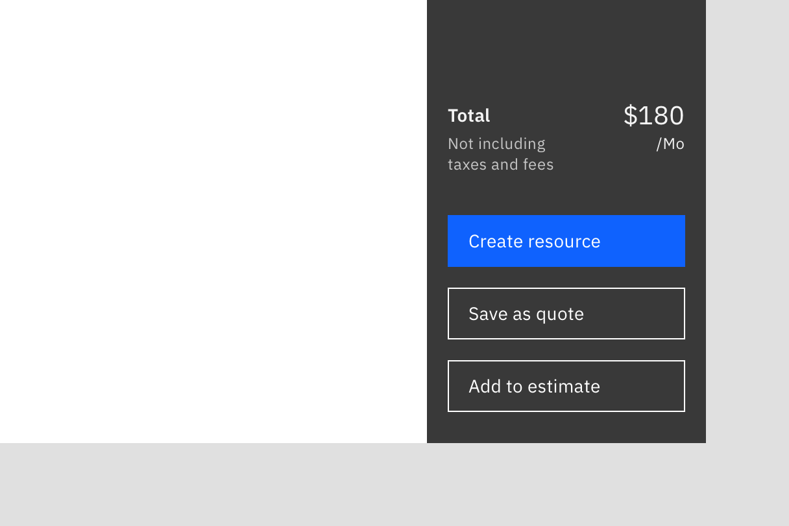

  </Column>
</Row>

### In empty states
For empty states that appear on pages that already have the primary action defined, a tertiary button is the ideal solution to launch a new task flow.
<Row>
  <Column colLg={8}>

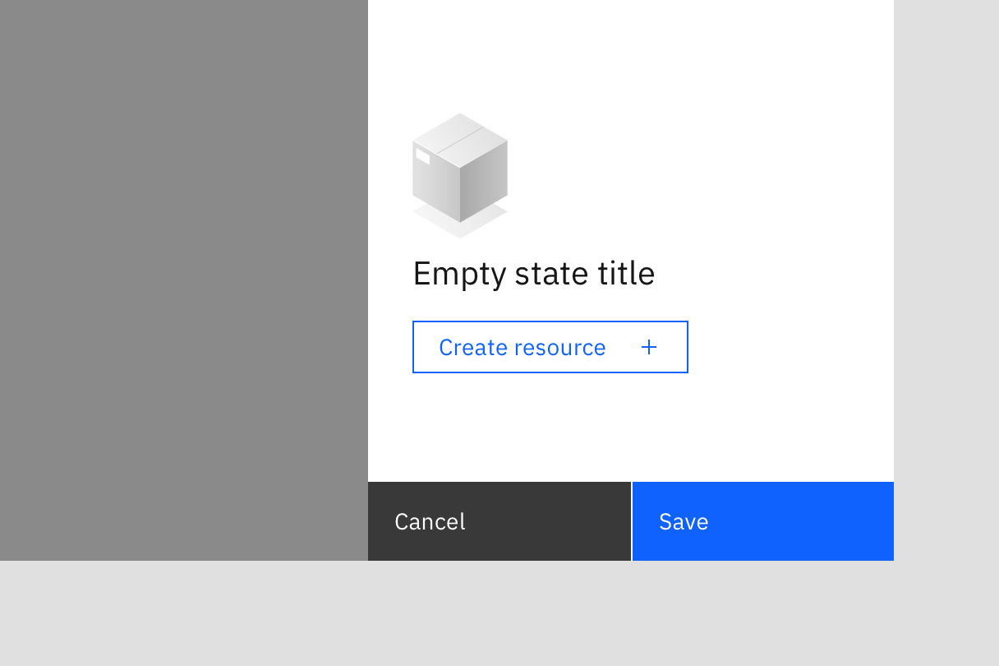

  </Column>
</Row>

## Common uses for ghost buttons

### In productive cards
In dashboards with multiple productive cards, ghost buttons work well as they draw less attention than a tertiary button.

See the [cards component](https://pages.github.ibm.com/cdai-design/pal/components/card/overview) for more details.

<Row>
  <Column colLg={8}>

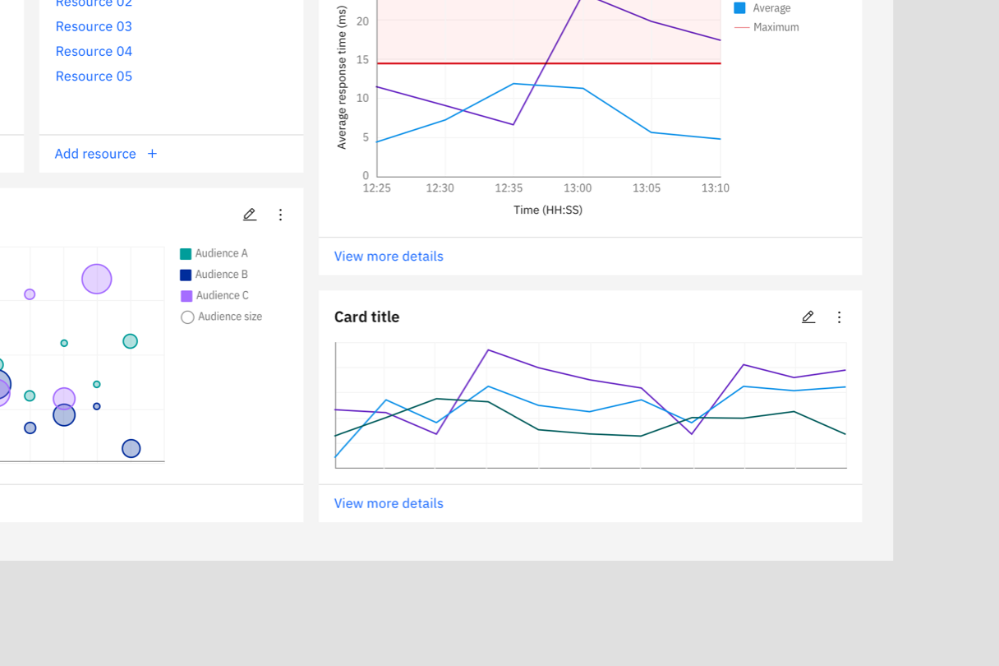

  </Column>
</Row>

### In toolbars
For interfaces with many common actions, ghost buttons and ghost icon buttons are ideal. As ghost buttons work best when flush with the container and other objects, they are very space-efficient, and therefore ideal for toolbar applications. 

See the [toolbars pattern](https://pages.github.ibm.com/cdai-design/pal/patterns/toolbars) for more details.
<Row>
  <Column colLg={8}>

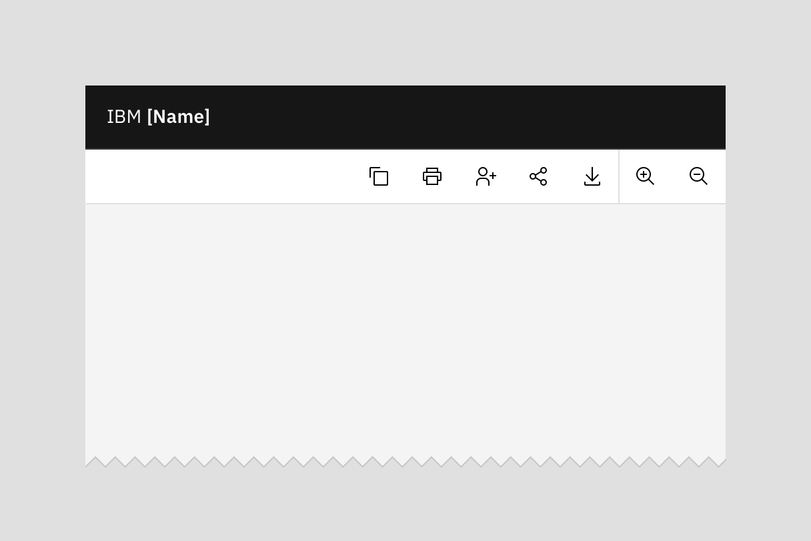

  </Column>
</Row>

### As a cancel button
Ghost buttons work well as a cancel button in progressive flows, as they draw less attention; users have to purposefully find and click it to cancel. In tearsheets, the buttons are fluid which wouldn't be a suitable application for a tertiary button. 

<Row>
  <Column colLg={8}>

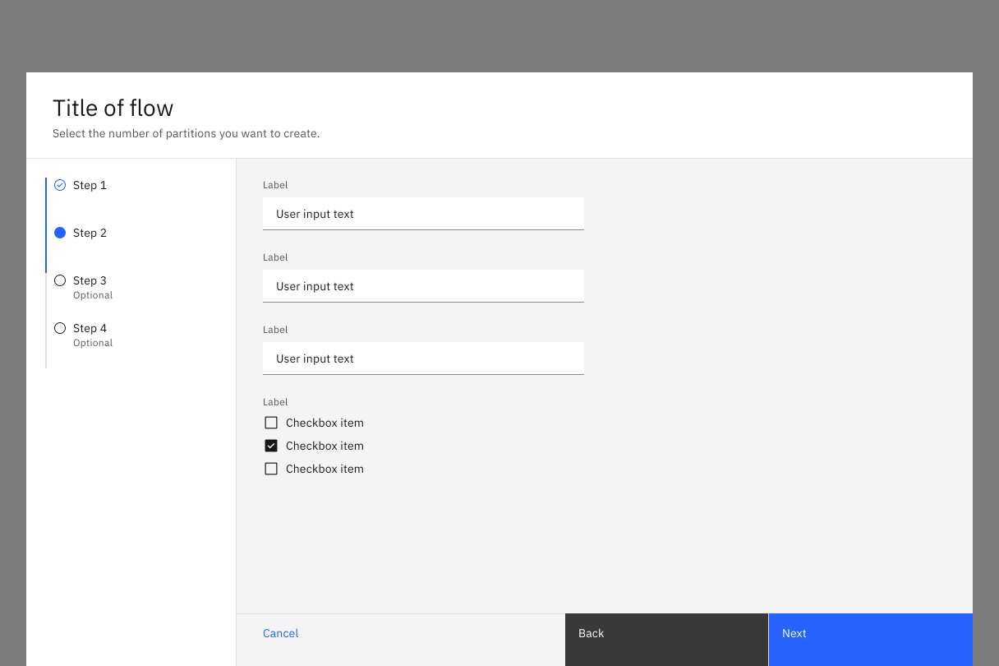

  </Column>
</Row>

## Related
- [Buttons](https://www.carbondesignsystem.com/components/button/usage/)
- [Using primary buttons](https://www.carbondesignsystem.com/components/button-guidance/primary-buttons)

