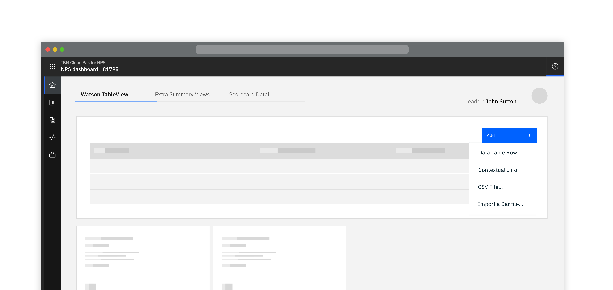
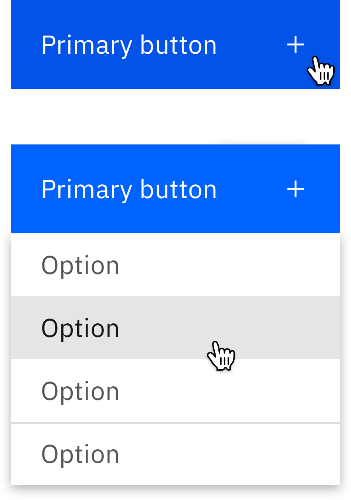

<InlineNotification kind="warning">

  Please note this component is still under review.  
  
</InlineNotification>

<PageDescription>

Combining a standard button with an overflow menu

</PageDescription>

<Row>
  <Column colLg={8}>

  </Column>
</Row>

## Extension

Component created to allow the selection of a button to display a menu of
available options.

<Row>
  <Column colMd={4} colLg={4}>

  </Column>
</Row>

## Linked to

[Downloading](../../common-patterns/downloading)
