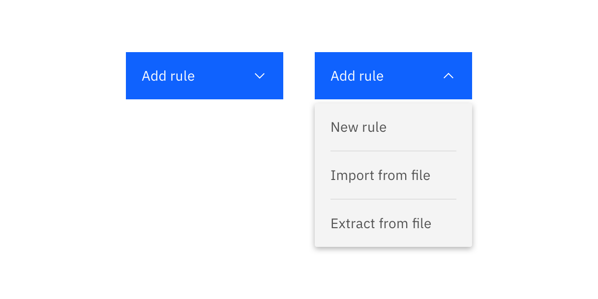

<PageDescription>

  Menu buttons and combo buttons share the same goal, to group multiple actions together meaningfully and to aid discoverability. 
  
</PageDescription>

<AnchorLinks>
  <AnchorLink>Overview</AnchorLink>
  <AnchorLink>Menu button</AnchorLink>
  <AnchorLink>Combo button</AnchorLink>
  <AnchorLink>Styling</AnchorLink>
  <AnchorLink>Modifiers</AnchorLink>
  <AnchorLink>Accessibility</AnchorLink>
  <AnchorLink>Related</AnchorLink>
</AnchorLinks>

## Overview
While both buttons share the same goal, there is a difference when determining when to use each type of button.
<Row>
  <Column colLg={6}>

  </Column>

  <Column colLg={6}>

  </Column>
</Row>

1. **Menu button**: Used to group actions under one menu, where available options share the same rough level of importance. 
2. **Combo button**: Used when one action in a group is determined to be the primary/default choice, and the remaining actions are comparatively lesser used/important. It is composed of two buttons, the primary action paired with a menu housing the remaining options.

The grouping of related actions can decrease the interaction time and cognitive demand for users, enabling them to quickly find and trigger the action that they want.

## Menu button

Menu buttons group actions that share the same level of importance. The icon used within the menu button should always be a chevron in order to visually convey to the user that there are options to select from. There are three main use cases where using a menu button is recommended.

#### Grouping objects with the same common action
Menu buttons work well when there are multiple different objects that are derived/impacted by the same action. Common examples are where users can Create or Add multiple different objects, where all of the objects would be equally-considered options.

<Row>
  <Column colLg={8}>

  </Column>
</Row>

_In this example, the user can add various different objects. These all share the action "add"._

The shared action should not be repeated in the dropdown below. This adds unnecessary clutter and makes each option less distinct.

<Row>
  <Column colLg={4}>

<DoDontExample type="do">

</DoDontExample>
  </Column>

  <Column colLg={4}>

<DoDontExample type="dont">

</DoDontExample>
  </Column>
</Row>

_When using a button menu for this use case, ensure that the objects in the menu are in sentence case. Do not use an ellipsis (...) or a colon (:) in front of the object name to link them to the verb above, this is unnecessary and adds visual clutter._

#### Actions related to a common title
Another common use of a menu button is grouping actions related to a common title. Examples of this are where there are multiple ways in which a user can carry out an action, which are presented as options in the menu button.

<Row>
  <Column colLg={8}>

  </Column>
</Row>

_In this example, a user can add a rule in three different ways. These are presented as the three options in the menu._

#### Distinct actions on the same object / page
In a lot of cases, actions on a page may not share the same verb, or have an appropriate shared label for the menu button. When grouped actions are distinct, label the menu button 'Actions' to encompass all available options. 

<Row>
  <Column colLg={8}>

  </Column>
</Row>

_In this example, all the actions effect the same model, but they are all distinct - there wouldn't be an appropriate verb to describe them all._

Actions buttons are ideal for page headers, where multiple, distinct, actions may impact the page content, and where real-estate is limited. By default, in the page header component, multiple buttons in the header will become an actions button at smaller screen sizes.

<Row>
  <Column colLg={8}>

  </Column>
</Row>

_Example of an action button in the page header._

Actions buttons should only be used when the actions affect a full page or a large object on a page (examples include a canvas UI, diagram or whole data table). When actions affect a smaller proportion of a page, such as a table row or card, use an overflow menu.

### Behavior
The menu button is opened once the user clicks on the menu button. Clicking on any of the actions within the dropdown immediately triggers them. To close the dropdown, the user can click again on the menu button, press escape, or click outside the opened menu. 

### Variations
Menu buttons come in three different heights (default, field and small), and three different button types (primary, tertiary and ghost).

<Row>
  <Column colLg={8}>

  </Column>
</Row>

_The three heights the menu button supports. The height of the menu items reflect the size of the button being used._

<Row>
  <Column colLg={8}>

  </Column>
</Row>
<Row>
  <Column colLg={8}>

  </Column>
</Row>
<Row>
  <Column colLg={8}>

  </Column>
</Row>

_The three types the menu button supports: primary, tertiary and ghost._

Since the Carbon guidelines state "Secondary buttons may only be used in conjunction with a primary action” the menu button is not available as a secondary button. If a primary action is determined to be needed, a combo button should be used rather than a secondary actions button alongside a primary action.

<Row>
  <Column colLg={4}>

<DoDontExample type="do">

</DoDontExample>
  </Column>

  <Column colLg={4}>

<DoDontExample type="dont">

</DoDontExample>
  </Column>
</Row>

_Do not use a menu button as a secondary action. Instead, a combo button should be used when one action is determined to be primary._

## Combo button
A combo button is actually composed of two buttons: the left one is the default option (the most commonly used selection), and the right one (chevron icon) shows the rest of the available options.

<Row>
  <Column colLg={8}>

  </Column>
</Row>

_In this example, the majority of the time, the user will be selecting to save record. However, they do have a few other options, but as these are likely to be chosen a lot less, so need less prominence in the UI._

The combo button is expected to have less use than the menu button, as the additional actions are more hidden than they would be in menu button. However, this button does have particular use where screen real estate is limited and one of the actions has particular importance. 

### Behavior
The behavior of the combo button is very similar to the menu button. The only nuance is that clicking the left hand side of the button (the determined primary action), would cause that action to be immediately triggered. The same behavior applies for items in the dropdown list, clicking on these would immediately trigger that action. 

### Variations
Combo buttons only are available as a primary button. If you need to house multiple actions without the use of the primary button, the menu button should be used. This is because a combo button should only be used when one of the actions is determined to be the primary choice.

Combo buttons also come in the three standard button heights, default, field and small.

<Row>
  <Column colLg={8}>

  </Column>
</Row>

## Styling

### Button width
For both menu and combo buttons, the button width should follow Carbon button guidance: adding 64px padding to the end of the button. This determines the width of the menu.

<Row>
  <Column colLg={8}>

  </Column>
</Row>

However there are a few exceptions to this rule. For menu buttons with short title, this rule could lead to very short menus. For this reason, menu buttons have a fixed minimum width of 160px, to ensure menu items have enough space. Combo buttons are unlikely to need a fixed minimum width, as the addition of the chevron icon button adds additional length.

<Row>
  <Column colLg={4}>

<DoDontExample type="do">

</DoDontExample>
  </Column>

  <Column colLg={4}>

<DoDontExample type="dont">

</DoDontExample>
  </Column>
</Row>

_In this example, the button menu has a short title "Add". If we follow the rule of adding 64px padding, the menu items are limited to a very small size, which is a problem for longer items and translation._

#### Handling particularly long menu items

The guidance above outlines the recommended best practices for menu and combo buttons, where the menu button and the menu are the same width. By following Carbon's button content guidance for all actions, in most cases, the length of the menu should be sufficient for the items below.

In cases where menu items do not fit in the menu with the rules above, and the content cannot be further condensed, the menu width can be extended to fit the content up to a maximum width of 256px (items longer than this will be truncated, with the full text available as a tooltip on hover). When this occurs, make sure the button is following the same rules for width as outlined above, and is not extended to match the width of the menu.

<Row>
  <Column colLg={4}>

<DoDontExample type="do">

</DoDontExample>
  </Column>

  <Column colLg={4}>

<DoDontExample type="dont">

</DoDontExample>
  </Column>
</Row>

_Do not increase the guided length of the button to allow for long items- this makes the button seem unnecessarily long when closed. Instead, increase the width of just the menu to accommodate the longest item, using 16px padding on either side._

The fly out menu can extend to both the left and the right, depending on page placement.

#### Ghost menu button

Ghost buttons follow the same rules as for handling long menu items. This is because increasing the width of the ghost button to match the menu width would make the chevron appear detached from the button it belongs to, especially when the menu button is closed.

<Row>
  <Column colLg={4}>

<DoDontExample type="do">

</DoDontExample>
  </Column>

  <Column colLg={4}>

<DoDontExample type="dont">

</DoDontExample>
  </Column>
</Row>

_For ghost buttons, the Carbon guidance dictates a 36px padding after the text. Use the same minimum (160px) and maximum (256px) for the menu width._

### Ordering content 
To aid discoverability, menu items should be ordered meaningfully based on order of operations. In cases where all items are a shared level of hierarchy with no meaningful order, arrange the items alphabetically. This is particularly helpful when there are a large number of menu items to aid navigation.

Grouping the items into meaningful sections is also advised when there are a large amount of menu items, see the divider lines section for more information.

## Modifiers
Several modifiers can be applied to both the menu and combo button, if needed.

#### Disabled states
Disabled states can be used if an action is not able to be performed at a certain time, but will be possible to be performed by that user, at another point in time. Actions that are permissions based should be hidden if it is never possible for a user to perform that action.

<Row>
  <Column colLg={8}>

  </Column>
</Row>

_In this case, this state is disabled as the user doesn't have any assets, but this option will be available for them once an asset is created._

#### Divider lines
Divider lines can be used to group related actions in suitable sections, as well as to separate actions that could cause a significant change to the user’s data (delete app, delete service, etc.)

When using divider lines, the rules are removed to make sections more prominent. 

<Row>
  <Column colLg={8}>

  </Column>
</Row>

_An example of where it's appropriate to use divider lines to group sections. The first section groups "add" actions, while the second groups actions related to the source object._

#### Danger state
A danger hover state can be applied to actions that could cause significant changes, such as delete.

<Row>
  <Column colLg={8}>

  </Column>
</Row>

_Example of a divider line being used to separate a delete action, using the danger state on hover._

## Accessibility
Both menu and combo buttons are navigable via keyboard. On opening the menu, the focus automatically moves to the first action in the menu. Using the arrow keys, a user can navigate to the additional actions in the menu.

<Row>
  <Column colLg={8}>

  </Column>
</Row>

_Use of focus states for keyboard users._

## Related

- [Buttons](https://www.carbondesignsystem.com/components/button/usage/)
- [Dropdown](https://www.carbondesignsystem.com/components/dropdown/usage/)
- [Overflow menu](https://www.carbondesignsystem.com/components/overflow-menu/usage/)
