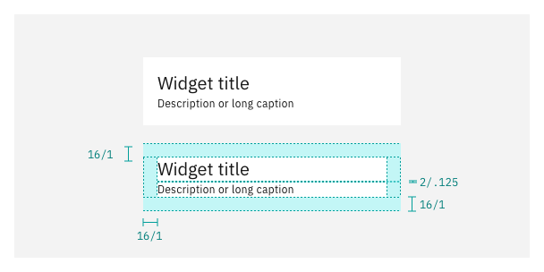
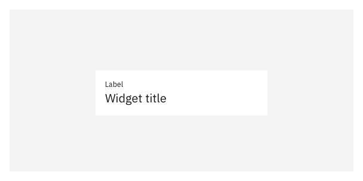
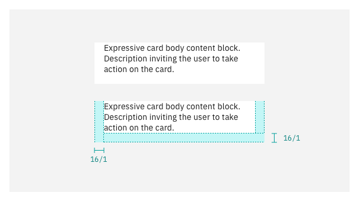
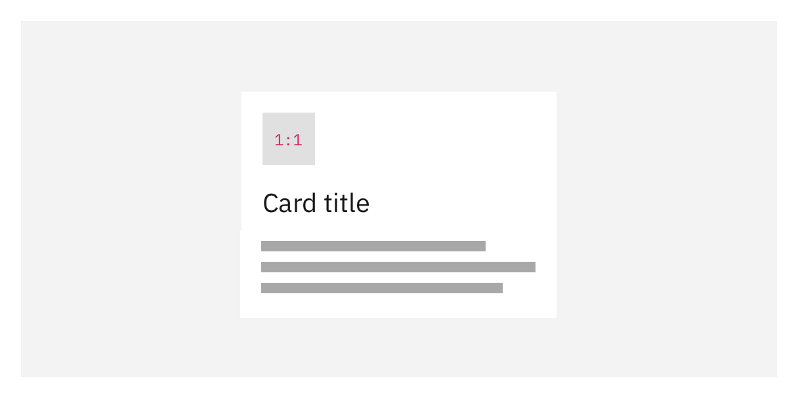
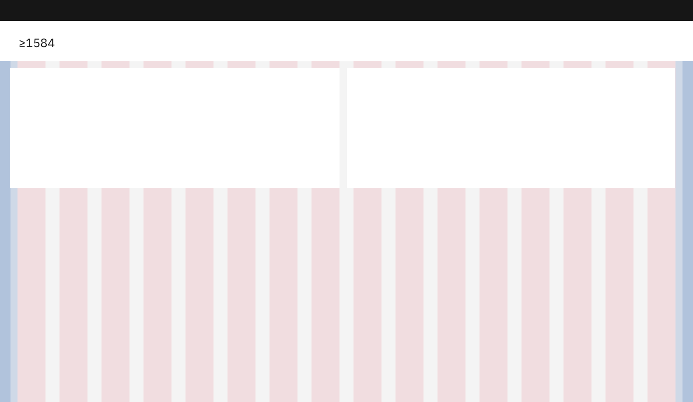
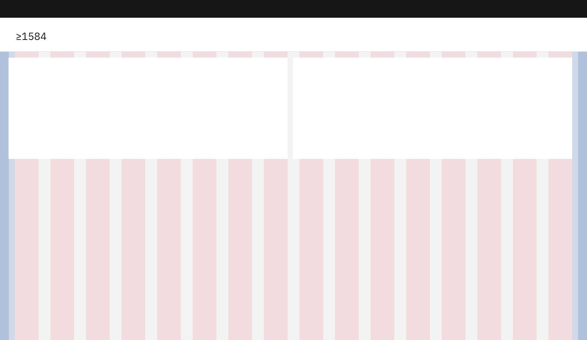
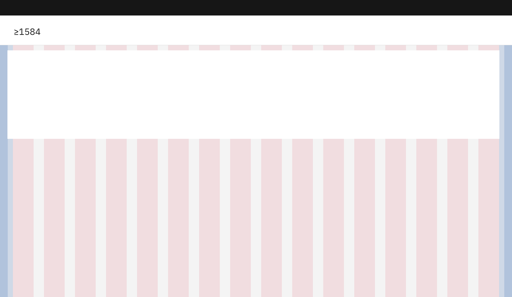

  <AnchorLinks>
    <AnchorLink>Structure</AnchorLink>
    <AnchorLink>Sizing</AnchorLink>
    <AnchorLink>Theming</AnchorLink>
  </AnchorLinks>

## Structure
<Row>
<Column colMd={8} colLg={8}>

<GifPlayer color='dark'>

</GifPlayer>
</Column>
</Row>

### 1. Title block

The title block contains the card’s title, label, or caption. The purpose of this block is to provide a context of the content’s intent. 

<Accordion>
  <AccordionItem title="Spacing">

_Title only_
  
<Row>
<Column colMd={8} colLg={8} noGutterSm>

</Column>
</Row>

  
  

_With label_
  
<Row>
<Column colMd={8} colLg={8} noGutterSm>

</Column>
</Row>

  
  

_With description_
  

<Row>
<Column colMd={8} colLg={8} noGutterSm>

</Column>
</Row>

  
  

_Label only_
  

<Row>
<Column colMd={8} colLg={8} noGutterSm>

To learn more about spacing styles visit Carbon’s [guidelines](https://www.carbondesignsystem.com/guidelines/spacing/overview).

</Column>
</Row>

  </AccordionItem>

  <AccordionItem title="Typography">

By default, the expressive card title should use `$heading-03`. 

Use `$label-01` for title labels and descriptions.
  
  <Row>
  <Column colMd={8} colLg={8} noGutterSm>

  

  To learn more about type styles visit Carbon's [typography guidelines](https://carbondesignsystem.com/guidelines/typography/overview/).

  </Column>
  </Row>

  </AccordionItem>

</Accordion>

### 2. Body content

The type of content can vary depending on the use case, spacing remains the same.   
If the content includes a chart, consider using a [productive card](https://pages.github.ibm.com/cdai-design/pal/components/card/productive/usage) instead.

<Row>
<Column colMd={8} colLg={8} noGutterMdLeft>

</Column>
</Row>

  

### 3. Action bar (optional)
<Row>
<Column colMd={8} colLg={8}>
Use an action bar to include buttons that take the user to the card’s related content. Use action bars only if the card is not clickable and avoid using more than two buttons. 
</Column>
<Column colMd={2} colLg={3} offsetMd={1} offsetLg={1}>
  <Aside>
Use up to two levels of actions hierarchy, do not use tertiary buttons. 
  </Aside>
</Column>
</Row>

<Accordion>
  <AccordionItem title="Button size">

Use medium size buttons in all expressive cards

  

<Row>
<Column colMd={8} colLg={8} noGutterSm>

</Column>
</Row>

  
  

_Button specifications_

  

| Button size | Height (px/rem)   | Use case |
| :---------- | :---------------- | :------------- |
| Medium      | 40 / 2.5            | Use when the card is not clickable or there is more than one CTA. |

  

  </AccordionItem>

  <AccordionItem title="Combinations, spacing & alignment">

<Row>
<Column colMd={8} colLg={8}>

_Singular action_

Alignment of a singular primary or ghost button will always be to the right of the expressive card for all sizes. 

    

  _Button specifications_

| Button kind | Button size   | Use case |
| :---------- | :------------ | :------------- |
| Primary     | Medium        | Use when the card is not clickable and the action needs to be highlighted. Avoid using multiple cards with primary buttons in one layout. |
| Ghost       | Medium        | Use when the card is not clickable and the action needs to be labeled.|

</Column>
</Row>

  
  
  

<Row>
<Column colMd={8} colLg={8}>

_Two actions_

Align both buttons to the right placing them side by side.   
When the card is small, buttons secondary and primary buttons take full width. 

  

_Button widths_

| Variation | Small | Medium | Large |
| :-------- | :---- | :----- | :---- |
| Secondary and primary | 100%  | Maintain button size aligned to the right. | Maintain button size aligned to the right. | 
| Ghost and primary | Maintain button size aligned to the right. | Maintain button size aligned to the right. | Maintain button size aligned to the right. |

</Column>
</Row>

  
  

  </AccordionItem>

</Accordion>

### 3. Media (optional)
<Row>
<Column colMd={8} colLg={8}>
Use pictograms, illustrations, photography, or videos in expressive cards to support the card’s context or highlight a call to action.
</Column>
<Column colMd={2} colLg={3} offsetMd={1} offsetLg={1}>
  <Aside>

Maintain consistency of style, ratio, and placement across cards in a layout.

  </Aside>
</Column>
</Row>

<Accordion>
  <AccordionItem title="Ratio">

Use common aspect ratios, such as 16:9, 4:3, 3:2, 2:1 and 1:1 for photography, illustrations, and videos. The content and intent of the visual determine its ratio and placement in the card.

  

  
  
Use always a 1:1 aspect ratio in the following use cases:
  
  
  

_Category pictograms_
  
Use a 1:1 aspect ratio for all pictograms placed on top of the title used to categorize a card.
  
  

<GifPlayer color='dark'>

</GifPlayer>

  
  
  

_Launch indicators_
  
Use a 1:1 ratio for launch action indicators in the bottom right of card. Only use this variation if there is no action bar and entire card is clickable. 
  
  

<GifPlayer color='dark'>

</GifPlayer>

  

  </AccordionItem>

  <AccordionItem title="Spacing & alignment">
<Row>
<Column colMd={8} colLg={8}>

_Aligment_

Align all media to the **top** or **left** of the card except for lauch indicators which are aligned to the bottom right of the card’s body content.

<GifPlayer color='dark'>

</GifPlayer>

  
  
  
</Column>

</Row>

<Row>
<Column colMd={8} colLg={8}>

_Images with background_

Illustrations with color background, photography, or videos should be full bleed.  

  
</Column>

<Column colMd={8} colLg={8}>

</Column>
</Row>

  
  
  

<Row>
<Column colMd={8} colLg={8}>

_Images without background_

Use `$spacing-05` around illutrations without color background.

</Column>
</Row>

  
  
  

<Row>
<Column colMd={8} colLg={8}>

_Category pictograms_

Align pictograms to the top left of the card above the title block. 

</Column>
</Row>

  
  

<Row>
<Column colMd={8} colLg={8}>

_Launch indicators_

Align launch indicators to the bottom right of the card's body content.

</Column>
</Row>

  
  

To learn more about pictograms and icon and illustration usage see: 

  

[IBM’s design language](https://www.ibm.com/design/language/iconography/ui-icons/library)

[Carbon for IBM Products illustration guidance](https://pages.github.ibm.com/cdai-design/pal/illustrations/library)

[Carbon’s pictogram guidance ](https://www.carbondesignsystem.com/guidelines/pictograms/library)
  

  </AccordionItem>

</Accordion>

## Sizing

The Carbon 2x grid determines card width; the content defines the height. There are four sizes of cards to use according to the use case need and layout.

<Accordion>

  <AccordionItem title="Small">

  Use this size as the standard size for most of the expressive cards.
  
<Row>
<Column colMd={8} colLg={8}>

<GifPlayer color='dark'>

</GifPlayer>
</Column>
</Row>
  

<Row>
<Column colMd={8} colLg={8}>

| Breakpoint | Percentage width | Column span | Padding    | 
| :--------- | :--------------- | :---------- | :--------- | 
| 1584       | 25%              | 4 of 16     | 16px/ 1rem | 
| 1312       | 25%              | 4 of 16     | 16px/ 1rem | 
| 1056       | 25%              | 4 of 16     | 16px/ 1rem | 
| 672        | 50%              | 4 of 8      | 16px/ 1rem | 
| 320        | 100%             | 4 of 4      | 16px/ 1rem | 

</Column>
</Row>

  </AccordionItem>

  <AccordionItem title="Medium">

  Use this size for more essential callouts. Large size works well for expressive cards that require more than two levels of CTA or large media.

  
<Row>
<Column colMd={8} colLg={8}>

<GifPlayer color='dark'>

</GifPlayer>
</Column>
</Row>
  

<Row>
<Column colMd={8} colLg={8}>

| Breakpoint | Percentage width | Column span | Padding    | 
| :--------- | :--------------- | :---------- | :--------- | 
| 1584       | 50%              | 8 of 16     | 16px/ 1rem | 
| 1312       | 50%              | 8 of 16     | 16px/ 1rem | 
| 1056       | 50%              | 8 of 16     | 16px/ 1rem | 
| 672        | 100%             | 8 of 8      | 16px/ 1rem | 
| 320        | 100%             | 4 of 4      | 16px/ 1rem | 

</Column>
</Row>

  </AccordionItem>

  <AccordionItem title="Large">

  Use large cards when there are multiple levels of information hierarchy or larger media.

  

<Row>
<Column colMd={8} colLg={8}>

<GifPlayer color='dark'>

</GifPlayer>
</Column>
</Row>
  

<Row>
<Column colMd={8} colLg={8}>

| Breakpoint | Percentage width | Column span | Padding    | 
| :--------- | :--------------- | :---------- | :--------- | 
| 1584       | 75%              | 12 of 16    | 16px/ 1rem | 
| 1312       | 75%              | 12 of 16    | 16px/ 1rem | 
| 1056       | 75%              | 12 of 16    | 16px/ 1rem | 
| 672        | 100%             | 8 of 8      | 16px/ 1rem | 
| 320        | 100%             | 4 of 4      | 16px/ 1rem | 

</Column>
</Row>

  </AccordionItem>

  <AccordionItem title="Max">

  Use 16 column cards for large calls to action, and avoid using more than one max card in a layout. Consider adapting the card’s content in smaller screen sizes.
  
<Row>
<Column colMd={8} colLg={8}>

<GifPlayer color='dark'>

</GifPlayer>
</Column>
</Row>
  

<Row>
<Column colMd={8} colLg={8}>

| Breakpoint | Percentage width | Column span | Padding    | 
| :--------- | :--------------- | :---------- | :--------- | 
| 1584       | 100%             | 16 of 16    | 16px/ 1rem |  
| 1312       | 100%             | 16 of 16    | 16px/ 1rem | 
| 1056       | 100%             | 16 of 16    | 16px/ 1rem | 
| 672        | 100%             | 8 of 8      | 16px/ 1rem | 
| 320        | 100%             | 4 of 4      | 16px/ 1rem | 

</Column>
</Row>

  </AccordionItem>

</Accordion>

For more information around the 2x grid, visit [Carbon’s guidelines](https://www.carbondesignsystem.com/guidelines/2x-grid/overview).

  

<Row className="resource-card-group">
  <Column colMd={4} colLg={4}>
    <ResourceCard
      subTitle="Sketch file"
      href="https://ibm.box.com/s/zfd8akquqmumk46bjg97yv3fho8wcgzz">
    </ResourceCard>
  </Column>
</Row>
