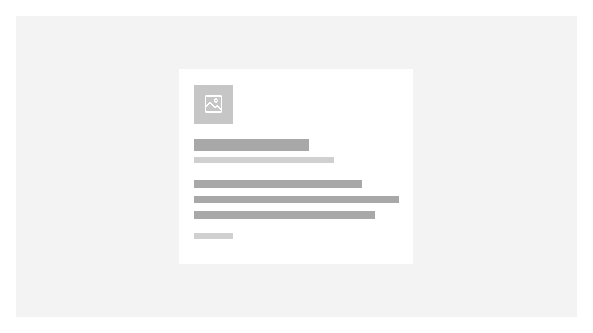

<- [Back to card overview](https://pages.github.ibm.com/cdai-design/pal/components/card/overview) 
<PageDescription>

_Expressive cards_ serve as large call to actions that directs the user to a new page.
</PageDescription>

<AnchorLinks>
  <AnchorLink>Overview</AnchorLink>
  <AnchorLink>Formatting</AnchorLink>
  <AnchorLink>Content</AnchorLink>
  <AnchorLink>Action zones</AnchorLink>
  <AnchorLink>Modifiers</AnchorLink>
  <AnchorLink>Best practices</AnchorLink>
  <AnchorLink>Related</AnchorLink>
</AnchorLinks>

<Row>
<Column colMd={8} colLg={8}>

</Column>
</Row>

## Overview

Expressive cards help users rapidly access a new section or page, enforcing the browsing experience and often expanding relevant information about the system.

### When to use

<Row>
<Column colMd={8} colLg={8}>

Expressive cards highlight information so they should be explicit and can contain visual media such as photography, video or illustrations to enforce its hierarchy on the page. 

</Column>

</Row>

<Row>
<Column colMd={8} colLg={10}>

- Use an Expressive card in getting started experiences.

- Use an Expressive card when the purpose of the content is to direct the user down a path. 

- Use an Expressive card when presenting a browse experience of articles, tutorials, and other editorial content types.

</Column>
</Row>

### When not to use

There are different ways to group information and direct users to relevant content.

<Row>
<Column colMd={8} colLg={10}>

- Do not use Expressive cards to group multiple links. This type of card should maintain a limited number of CTAs.

- Consider using a [tile](https://www.carbondesignsystem.com/components/tile/usage) if extensive information is needed to take action on the content or if the content relates to multiple topics. 

- Consider using an [UI shell left panel](https://www.carbondesignsystem.com/components/UI-shell-left-panel/usage) if the are multiplme CTA actions that belong to the same topic or correspond to the same user flow. 

- Do not use Expressive cards to direct the user to a section of the same page or a dialog window.

</Column>
</Row>

## Formatting
### Anatomy
<Row>
<Column colMd={8} colLg={8}>

</Column>
</Row>
<Row>
<Column colMd={8} colLg={8}>

#### 1. Title block
The title block contains the header text and label or description of the card purpose. 

#### 2. Body content
The body content area displays various elements based on the use-case and type of card. Expressive card content should have clear and minimal content that serves as a single call to action.

#### 3. Primary action bar (optional)
The primary action bar is the set of principal actions the user can perform on the Expressive card. These actions are solely navigational and should be limited in number.

#### 4. Media (optional)
Photos, video or illustrations that provide additional context to the content and call to action. 
</Column>

<Column colMd={2} colLg={3} offsetMd={1} offsetLg={1}>
  
<Aside>
The title block should include at least a label if there is not a title. 
</Aside>

</Column>
</Row>

### Sizing
Both the Expressive and the Productive card have four widths available for use based on the Carbon 16 column grid.
- Use small as the standard size for most of the Expressive cards and Productive cards.
- Use medium for more essential call-outs. Large size works well for Productive cards with bigger charts and for Expressive cards that require more than two levels of CTA or large media.
- User Large and Full With for cards when there is multiple levels of information hierarchy and complex charts.

<Row>
<Column colMd={8} colLg={8}>

</Column>
</Row>

_See style section for layout and sizing specifications._

## Content
### Main elements
**Title**

- The title should clearly describe the purpose of the card content. It should be brief and preferably not more than two lines.

- You can use an optional label above the title to set the context for the card's information or a description bellow to expand on the title.

**Body copy**

- An Expressive card can include content only relevant to the card's topic, giving enough context for the user to take action on it.

- The content type can vary depending on the card's intention. It should be minimal, focusing on the main call to action. Content can be text, lists, or a limited number of links. 

- The content can include links to related information. They should be minimal and never used for the main call to action. 

**Actions**

- Action bar is optional, it can be used when there is more than one call to action or the action needs to be highlighted.  

- Use descriptive words for action labels that specify what the user is going to do. 

**Media**

- The use of media is optional, use it to support the card's context or highlight a call to action. 

- Media can include pictograms, illustration, photography or videos. For information on illustration use see [Carbon for IBM Products guidance](https://pages.github.ibm.com/cdai-design/pal/illustrations/usage).

- Pictograms are recommended to be used on top of the title. See placement and ratio guidelines.

### Further guidance
For further content guidance, see [Carbon’s content guidelines](https://www.carbondesignsystem.com/guidelines/content/overview/) and our own [content guide](../../../content/overview/overview).

## Action zones

### Clickable card
When the card has a single call to action, the entire card can be clickable. If a card has more than one CTA consider using internal links or an action bar instead. 

<Row>
<Column colMd={8} colLg={8}>

<GifPlayer color='dark'>

</GifPlayer>
</Column>
</Row>

### Internal CTAs

<Row>
<Column colMd={8} colLg={8}>
When the card contains internal links or an action bar the card body cannot be clickable. 

  

</Column>
<Column colMd={2} colLg={3} offsetMd={1} offsetLg={1}>

  <Aside>
Recommendation: Use up to 3 internal links in one card.  
</Aside>
</Column>
</Row>

<Row>
<Column colMd={8} colLg={8}>

<GifPlayer color='dark'>

</GifPlayer>
</Column>
</Row>

## Modifiers

### Light & Dark theming
Expressive cards use the same UI tokens for Grey 10 and Grey 100 themes.

 <Row>
 <Column colMd={8} colLg={8}>

</Column>
</Row>

_See style section for theme color token specifications._

## Best practices

### Do's

- When displaying cards in page sections, stick to the same card format per type.

- Use a limited number of primary buttons if there are multiple cards in one layout. 

- Use a 16px or 2px gutter between cards in page layouts.

- Truncate the title text at two lines. 

### Don'ts

- Do not mix and match card formats within the same page section.

- Do not use more than four internal links inside a card. 

- Do not place pictograms at the bottom of the body content. 

- Do not use clickable cards where there is an internal link or an action bar. 

## Related

- [Tile](https://www.carbondesignsystem.com/patterns/dialog-pattern)
- [Illustration](https://pages.github.ibm.com/cdai-design/pal/illustrations/usage)
- [Buttons](https://www.carbondesignsystem.com/components/button/usage)
- [Link](https://www.carbondesignsystem.com/components/link/usage)
