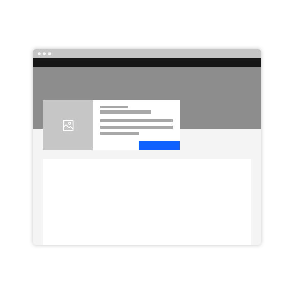

<PageDescription>

_Cards_ act as an entry point to a specific subject or user flow; they provide summaries of information pooled together and presented in a digestible way. 

</PageDescription>

## Overview

Cards group related pieces of information and invite the user to take action on the content. The user should be able to attain a quick overview of relevant and actionable content. Cards have a limited set of actions launched from them; this creates a singular focus for the user. 

There are two types of cards: Expressive & Productive. Each card type is used for different use cases and have corresponding usage and style guidelines to match.

- **_Expressive Cards_** serve as a large call to action that direct the user to a new page. These types of cards should have  explicit, minimal content. You can find Expressive Cards in getting started, navigational or editorial user interfaces.

- **_Productive cards_** provide the user with detailed information often related to their everyday workflow within an application. This type of card includes more content than an expressive card, offering an overview of often dynamic information that the user can manipulate or expand in various ways.

<Row className="image-card-group">

<Column colMd={4} colLg={4} noGutterSm>

<ImageCard
sub-title="Expressive card"
sub-titleColor="dark"
hoverColor="dark"
href="https://pages.github.ibm.com/cdai-design/pal/components/card/expressive/usage">

</ImageCard>

</Column>

<Column colMd={4} colLg={4} noGutterSm>
<ImageCard
sub-title="Productive card"
sub-titleColor="dark"
hoverColor="dark"
href="https://pages.github.ibm.com/cdai-design/pal/components/card/productive/usage">

</ImageCard>

</Column>

</Row>

