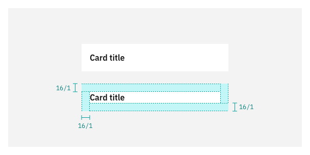
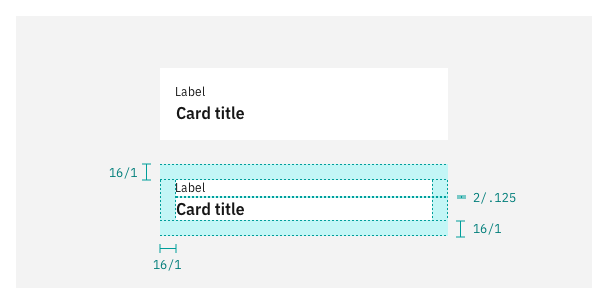
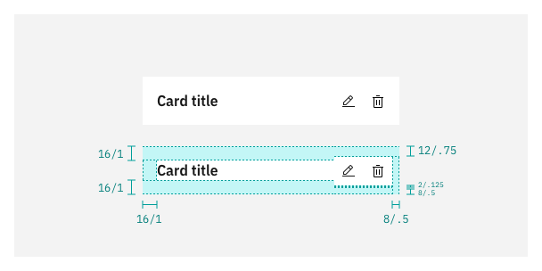
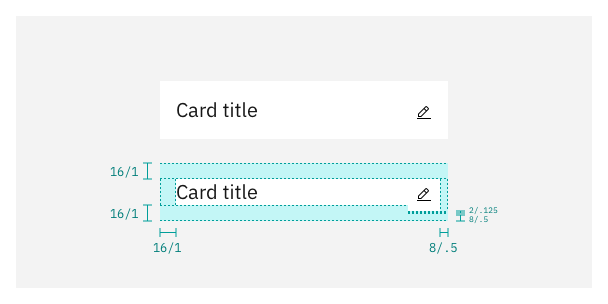
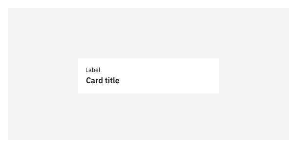
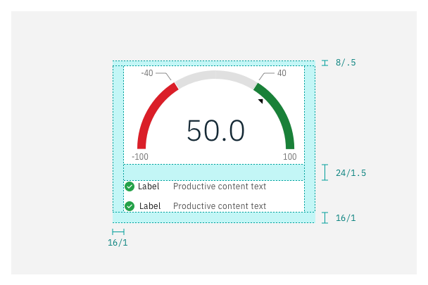
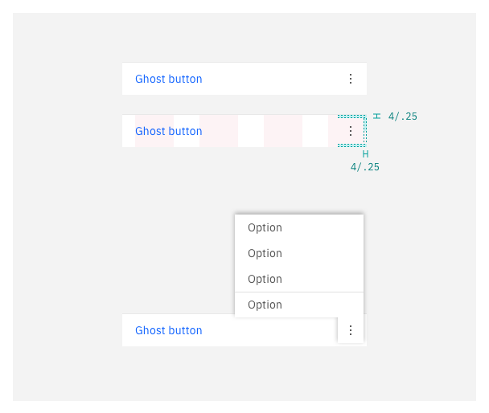
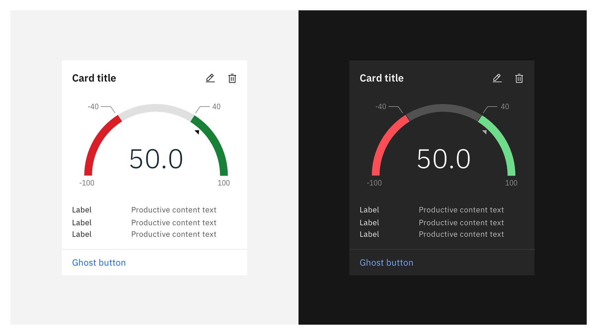

  <AnchorLinks>
    <AnchorLink>Structure</AnchorLink>
    <AnchorLink>Sizing</AnchorLink>
    <AnchorLink>Theming</AnchorLink>
  </AnchorLinks>

## Structure
<Row>
<Column colMd={8} colLg={8}>

<GifPlayer color='dark'>

</GifPlayer>
</Column>
</Row>

### 1. Action title block

Contains the header text and label or description of the card purpose. The block's right side is the primary tool bar for actions that manipulate the card content. 

<Accordion>

<AccordionItem title="Spacing & alignment">

  _Title only_
    
  <Row>
  <Column colMd={8} colLg={8} noGutterSm>

  

  </Column>
  </Row>

    
    

  _With label_
    
  <Row>
  <Column colMd={8} colLg={8} noGutterSm>

  

  </Column>
  </Row>

    
    

  _With description_
    

  <Row>
  <Column colMd={8} colLg={8} noGutterSm>

  

  </Column>
  </Row>

    
    

 _Label only_
    

  <Row>
  <Column colMd={8} colLg={8} noGutterSm>

  

  </Column>
  </Row>

    
    

  _Primary actions_
    

  <Row>
  <Column colMd={8} colLg={8} noGutterSm>

  

  </Column>
  </Row>

    
    

  _Primary actions with large title_

    

  <Row>
  <Column colMd={8} colLg={8} noGutterSm>

  

  </Column>
  </Row>

    
    

  _Title truncation_

    

  <Row>
  <Column colMd={8} colLg={8} noGutterSm>

  

  To learn more about type spacing styles visit Carbon's [guidelines](https://www.carbondesignsystem.com/guidelines/spacing/overview).

  </Column>
  </Row>
</AccordionItem>

<AccordionItem title="Button size">

  Use **small** size buttons for all action in the action title block.
    
  <Row>
  <Column colMd={8} colLg={8} noGutterSm>

  

  </Column>
  </Row>

    

  | Button type       | Button size (px/rem)   | Icon size (px/rem)|
  | :---------------- | :--------------------- | :-----------------|
  | Ghost-icon        | Small:  32 / 2         | 16 / 1            |
  | Ghost             | Small:  32 / 2         | —                 |

    

  To learn more about type button styles visit Carbon's [guidelines](https://www.carbondesignsystem.com/components/button/usage).

</AccordionItem>

<AccordionItem title="Typography">

  _Default_
    

  By default, the Productive card's title should use `$productive-heading-02`.   
  Use `$label-01` for title labels and descriptions.
  
    
  <Row>
  <Column colMd={8} colLg={8} noGutterSm>

  

  </Column>
  </Row>

    
    

  _Large_

    

  Use `$productive-heading-03` for larger titles. Use this style if your product is using larger density across the user interface.
  
    
  <Row>
  <Column colMd={8} colLg={8} noGutterSm>

  

  Reference spacing and aligment specifications, the spacing of buttons in title block using the large type style varies from the default. 

  To learn more about type styles visit Carbon's [typography guidelines](https://www.carbondesignsystem.com/guidelines/typography/productive).

  </Column>
  </Row>

</AccordionItem>

</Accordion>

### 2. Body content

Spacing in the body varies depending on the type of content. In most cases, there should be    `$space-05` between title and content type (spacing included in the title block). There are variations if the content beings with charts, tables, or multiple body content block stacked.

  _Regular content_
  
  <Row>
  <Column colMd={8} colLg={8} noGutterSm>

  
    

  </Column>
  </Row>

  _If content begins with a chart or table_
  
  <Row>
  <Column colMd={8} colLg={8} noGutterSm>

  
    

  </Column>
  </Row>

  _If the card uses stacked body content blocks_
  
  <Row>
  <Column colMd={8} colLg={8} noGutterSm>

  
    

  </Column>
  </Row>

### 3. Supplemental bar (standard)
<Row>
<Column colMd={8} colLg={8}>

  Use a supplemental action bar to take the user to a new page, modal, tearsheet or open a side panel with additional information related with the content of the card.   
  Always use **field** size ghost buttons for supplemental actions and align them to the left.

</Column>

<Column colMd={2} colLg={3} offsetMd={1} offsetLg={1}>
  <Aside>
  Avoid using secondary or terciary buttons in supplemental bars. 
  </Aside>
</Column>
</Row>

<Row>
  <Column colMd={8} colLg={8} noGutterSm>

  

  </Column>
  </Row>

    

  | Button type       | Button size (px/rem)   | Icon size (px/rem)|
  | :---------------- | :--------------------- | :-----------------|
  | Ghost             | Field:  40 / 2.5         | 16 / 1            |

    

### 3. Complex bottom action bar (optional)

Use a complex bottom bar for both primary and supplemental action **only** when: 

- The card uses just a label in the title block.
- The title is longer than two lines and because its relevance it can’t be truncated.
- There are multiple action states.
  
  
Do not use complex bottom action bars for chart actions, neither in combination with the standard primary action bar. If used, keep consistency across the page layout.

<Accordion>

<AccordionItem title="Spacing & alignment">

  _Supplemental and primary my actions_
    
  <Row>
  <Column colMd={8} colLg={8} noGutterSm>

  

  </Column>
  </Row>
    
    

  _Overflow button_
    
  <Row>
  <Column colMd={8} colLg={8} noGutterSm>

  

  </Column>
  </Row>
</AccordionItem>

<AccordionItem title="Button size">

  <Row>
  <Column colMd={8} colLg={8}>

  

  </Column>
  </Row>

    

  | Button type       | Button size (px/rem)   | Icon size (px/rem)|
  | :---------------- | :--------------------- | :-----------------|
  | Ghost-icon        | Field:  40 / 2.5         | 16 / 1            |
  | Ghost             | Field:  40 / 2.5         | —                 |  

</AccordionItem>

</Accordion>

## Sizing

The Carbon's 2x grid determines card width; the content defines the height. There are four sizes of cards to use according to the use case need and layout.

<Accordion>

  <AccordionItem title="Small">

  Use this size as the standard size for most of the Productive cards.
  
<Row>
<Column colMd={8} colLg={8}>

<GifPlayer color='dark'>

</GifPlayer>
</Column>
</Row>
  

<Row>
<Column colMd={8} colLg={8}>

| Breakpoint | Percentage width | Column span | Padding| 
| :---------- | :---------- | :------ | :-------------------- | 
| 1584          | 25%          | 4 of 16           | 16px/ 1rem        | 
| 1312          | 25%           | 4 of 16            | 16px/ 1rem        | 
| 1056          | 25%           | 4 of 16           | 16px/ 1rem        | 
| 672         | 50%           | 4 of 8            | 16px/ 1rem        | 
| 320        | 100%           | 4 of 4           | 16px/ 1rem        | 

</Column>
</Row>

  </AccordionItem>

  <AccordionItem title="Medium">

  Use this size for more essential call-outs. Large size works well for Productive cards that contain charts.

  
<Row>
<Column colMd={8} colLg={8}>

<GifPlayer color='dark'>

</GifPlayer>
</Column>
</Row>
  

<Row>
<Column colMd={8} colLg={8}>

| Breakpoint | Percentage width | Column span | Padding | 
| :---------- | :---------- | :------ | :-------------------- | 
| 1584          | 50%          | 8 of 16           | 16px/ 1rem        | 
| 1312          | 50%           | 8 of 16            | 16px/ 1rem        | 
| 1056          | 50%           | 8 of 16           | 16px/ 1rem        | 
| 672         | 100%           | 8 of 8            | 16px/ 1rem        | 
| 320        | 100%           | 4 of 4           | 16px/ 1rem        | 

</Column>
</Row>

  </AccordionItem>

  <AccordionItem title="Large">

  Use large cards when there is multiple levels of information hierarchy and complex charts.
  
<Row>
<Column colMd={8} colLg={8}>

<GifPlayer color='dark'>

</GifPlayer>
</Column>
</Row>
  

<Row>
<Column colMd={8} colLg={8}>

| Breakpoint | Percentage width | Column span | Padding | 
| :---------- | :---------- | :------ | :-------------------- | 
| 1584          | 75%          | 12 of 16           | 16px/ 1rem        | 
| 1312          | 75%           | 12 of 16            | 16px/ 1rem        | 
| 1056          | 75%           | 12 of 16           | 16px/ 1rem        | 
| 672         | 100%           | 8 of 8            | 16px/ 1rem        | 
| 320        | 100%           | 4 of 4           | 16px/ 1rem        | 

</Column>
</Row>

  </AccordionItem>

  <AccordionItem title="Max">

  Use 16 column cards for larget call to actions, avoid using more than one max card in one layout. Consider adapting the card's content in smaller screen sizes.
  
<Row>
<Column colMd={8} colLg={8}>

<GifPlayer color='dark'>

</GifPlayer>
</Column>
</Row>
  

<Row>
<Column colMd={8} colLg={8}>

| Breakpoint | Percentage width | Column span | Padding | 
| :---------- | :---------- | :------ | :-------------------- | 
| 1584          | 100%          | 16 of 16           | 16px/ 1rem        | 
| 1312          | 100%           | 16 of 16            | 16px/ 1rem        | 
| 1056          | 100%           | 16 of 16           | 16px/ 1rem        | 
| 672         | 100%           | 8 of 8            | 16px/ 1rem        | 
| 320        | 100%           | 4 of 4           | 16px/ 1rem        | 

</Column>
</Row>

  </AccordionItem>

</Accordion>

For more information around the 2x grid visit [Carbon's guidelines](https://www.carbondesignsystem.com/guidelines/2x-grid/overview).

## Theming

Productive cards use the same UI tokens for Grey 10 and Grey 100 themes. 

<Row>
<Column colMd={8} colLg={8}>

  

| BG-color | Hover  | Focus | Dividers | Border|
| :------- | :------------- | :------------ | :------------ | :------------ |
| `$ui-01`   | `$hover-ui` | `$focus` |`$ui-03` |`$ui-03` |

For more guidance around themes visit [Carbon's color guidelines](https://www.carbondesignsystem.com/guidelines/color/usage).

</Column>
</Row>

  

<Row className="resource-card-group">
  <Column colMd={4} colLg={4}>
    <ResourceCard
      subTitle="Sketch file"
      href="https://ibm.box.com/s/zfd8akquqmumk46bjg97yv3fho8wcgzz">
    </ResourceCard>
  </Column>
</Row>
