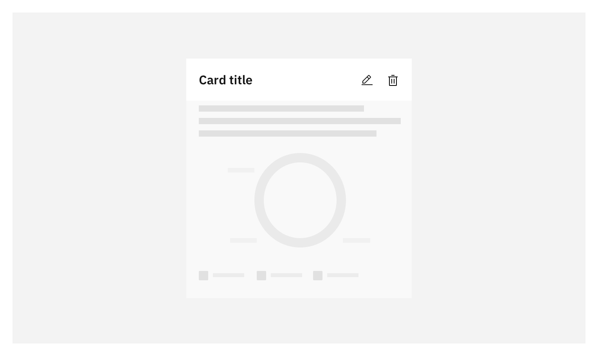
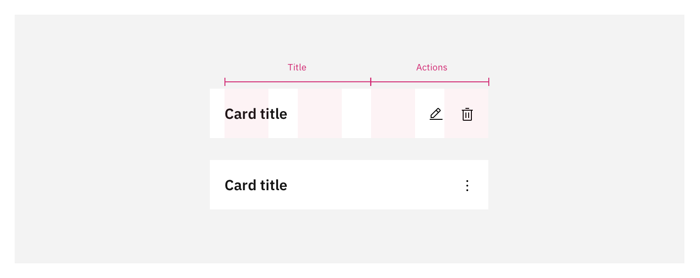

<- [Back to card overview](https://pages.github.ibm.com/cdai-design/pal/components/card/overview) 
<PageDescription>

_Productive cards_ provide the user with detailed information often related to their everyday workflow within an application.
</PageDescription>

<AnchorLinks>
  <AnchorLink>Overview</AnchorLink>
  <AnchorLink>Formatting</AnchorLink>
  <AnchorLink>Content</AnchorLink>
  <AnchorLink>Modifiers</AnchorLink>
  <AnchorLink>Best practices</AnchorLink>
  <AnchorLink>Related</AnchorLink>
</AnchorLinks>

<Row>
<Column colMd={8} colLg={8}>

</Column>
</Row>

## Overview

Productive cards include more content than an expressive card, offering an overview of often dynamic information that the user can manipulate or expand in various ways.

### When to use

<Row>
<Column colMd={8} colLg={8}>

Productive cards are largely interactive grouping of information and often used in homepages, dashboards or reporting interfaces.

</Column>

</Row>

<Row>
<Column colMd={8} colLg={10}>

- Use a Productive Card when the data within needs to be manipulated/filtered.

- Use a Productive Card when the container can resize or re-order.

- Use Productive cards to present digestible summaries of dynamic information.

</Column>
</Row>

### When not to use

<Row>
<Column colMd={8} colLg={10}>

- Do not use productive cards to group multi-step tasks. Use the card to guide the user to a new page, panels, modal or tearsheet to complete a complex task.

- Consider using a [tile](https://www.carbondesignsystem.com/components/tile/usage) if the content cannot be summarized or relate to more than one section or topic. 

- Do not use productive cards for large call to actions. Use an Expressive card instead.  

</Column>
</Row>

## Formatting
### Anatomy
<Row>
<Column colMd={8} colLg={8}>

</Column>
</Row>
<Row>
<Column colMd={8} colLg={8}>

#### 1. Action title block
Contains the header text and label or description of the card purpose. The block's right side is the primary tool bar for actions that manipulate the card content. 

#### 2. Body content
The body content area displays various elements based on the use-case. Productive card content is dynamic and often can be editable.

#### 3. Supplemental action bar (optional)
The secondary action bar provides the user with direct access to a new page that expands the productive card's information. 

</Column>

<Column colMd={2} colLg={3} offsetMd={1} offsetLg={1}>
  
<Aside>
When the card uses a label only instead of a title, the card uses a complex bottom action bar. See action bar section for more guidance.   
</Aside>

</Column>
</Row>

### Sizing
Both the expressive and the productive card have four widths available for use based on the Carbon 16 column grid.
- Use Small as the standard size for most of the expressive cards and productive cards.
- Use Medium for more essential call-outs. Large size works well for Productive Cards with bigger charts.
- User Large and Full With for productive cards when there is multiple levels of information hierarchy and complex charts.

<Row>
<Column colMd={8} colLg={8}>

</Column>
</Row>

### Action bars

<Row>
<Column colMd={8} colLg={8}>

#### Primary action bar (standard)

Use the primary action bar for actions that manipulate the card content, such as filtering, creating or editing. These actions should be always at the right side of the title block as icon or ghost buttons. 
</Column>

<Column colMd={2} colLg={3} offsetMd={1} offsetLg={1}>
  
<Aside>
The primary action bar is part of the title block, this is the standard placement of manipulative actions.
</Aside>
</Column>

</Row>

<Row>
<Column colMd={8} colLg={8}>

</Column>
</Row>
  
  
  
Number of actions allowed per size

<Tabs>
<Tab label="4 columns">

Use overflow if there are more than **two actions** in productive cards of 4 columns.
  

<Column colLg='8' noGutterMdLeft>

</Column>
</Tab>

<Tab label="8 columns">

Use overflow if there are more than **three actions** in productive cards of 8 columns.
  

<Column colLg='8' noGutterMdLeft>

</Column>

</Tab>
<Tab label="12 and 16 columns">

Use overflow if more than **four actions** in productive cards of 12 and 16 columns.
  

<Column colLg='12' noGutterMdLeft> 

</Column>
</Tab>
</Tabs>

<Row>
<Column colMd={8} colLg={8}>

#### Supplemental bar (standard)

Use a supplemental action bar to take the user to a new page, modal, tearsheet or open a side panel with additional information related with the content of the card. 

</Column>

<Column colMd={2} colLg={3} offsetMd={1} offsetLg={1}>
  
<Aside>
Limit this bar to a single ghost button or clickable status icons.
</Aside>
</Column>
</Row>

<Row>
<Column colMd={8} colLg={8}>

</Column>
</Row>

  
  

<Row>
<Column colMd={8} colLg={8}>

#### Complex bottom action bar
Use a complex bottom bar for both primary and supplemental action **only** when: 
- The card doesn't have a title and only uses a label in the title block.
- The title is longer than two lines and because its relevance it can't be truncated.
- There are multiple action states.
  
  
Do not use complex bottom action bars for chart actions, neither in combination with the standard primary action bar. If used, keep consistency across the page layout.

Place all manipulative actions to the right and supplemental actions to the left of the bar. 

</Column>

<Column colMd={2} colLg={3} offsetMd={1} offsetLg={1}>
  
<Aside>
Use the complex bottom bar just as an alternative for when the title block cannot be used to place action buttons. This bar is not the standard use. 
</Aside>
</Column>
</Row>

<Row>
<Column colMd={8} colLg={8}>

</Column>
</Row>

  
  
  
Number of actions allowed per size

<Tabs>
<Tab label="4 columns">

Use overflow if there are more than **three** manipulative actions at the right of 4 columns complex bottom bars
  

<Column colLg='8' noGutterMdLeft>

</Column>
</Tab>

<Tab label="8 to 16 columns">

Use overflow if there are more than **four** manipulative actions in productive cards of 8 columns or more.
  

<Column colLg='8' noGutterMdLeft>

</Column>

</Tab>

</Tabs>

### Action zones
<Accordion>
<AccordionItem title="Single">
The entire card can be clickable when it serves as a navigational point to another page and does not use manipulative or supplemental actions.
  
  

<Row>
<Column colMd={8} colLg={8}>

<GifPlayer color='dark'>

</GifPlayer>
</Column>
</Row>
</AccordionItem>

<AccordionItem title="Two zones">
<Row>
<Column colMd={8} colLg={8}>
If the title block does not include actions and there is a clickable body content and a supplemental bar, the title block should be part of the clickable body content zone. 
  
  
</Column>
</Row>

<Row>
<Column colMd={8} colLg={8}>

<GifPlayer color='dark'>

</GifPlayer>
</Column>
</Row>

</AccordionItem>

<AccordionItem title="Three zones">
<Row>
<Column colMd={8} colLg={8}>
Productive cards can include three action zones: primary and supplemental action bars and a clickable body content. Separate the body's actionable zone from the action bars. 
  
  
</Column>
</Row>

<Row>
<Column colMd={8} colLg={8}>

<GifPlayer color='dark'>

</GifPlayer>
</Column>
</Row>
</AccordionItem>

<AccordionItem title="Stackable body content">
<Row>
<Column colMd={8} colLg={8}>
Use multiple body content sections when the card serves as a list of content that shares the same type of information, format and each item takes the user to a different page. 
Each body content can be clickable independently. A divider must separate the sections, and the interactive states should be the same as a clickable card.
  
  

</Column>

</Row>

<Row>
<Column colMd={8} colLg={8}>

<GifPlayer color='dark'>

</GifPlayer>
</Column>
</Row>
</AccordionItem>

</Accordion>

## Content
### Main elements
**Title (optional)**

- The title should clearly describe the purpose of the card. 

- Title should be brief and truncated after two lines.

- You can use an optional label above the title to set the context for the panel's information or a description below to expand the title's content. 

- Use a label if the card does not have a title.

**Body copy**

- The content type can vary depending on the card's purpuse it often compiles a set of detailed information relevant for the user's workflow .  
 
- Content can include, text, tables, charts, lists or status icons that can be manipulated by the user.

- The content usually has multiple information hierarchy levels, so the composition should respond to the use case.

**Charts**

- Charts are often used within the body content block, specially on dashboard or reporting interfaces. Follow the Carbon guidance on charts.

**Primary and ghost buttons**

- Primary actions can include editing, creating, filtering, removing or deleting, configuration etc.

- Supplemental action takes the user to a new page and communicates what the user will see.

- Keep actions brief and relevant to the use case. If the number of primary actions surpasses the number allowed per card's size, use an overflow menu.

- Use descriptive words for the actions. Avoid vague words.  

- Supplemental actions should be minimal and on a lower hierarchy than the manipulative actions. 

- Card using a primary and supplemental actions should follow the Carbon guidelines for [button usage](https://www.carbondesignsystem.com/components/button/usage) and action labels.

### Further guidance
For further content guidance, see [Carbon’s content guidelines](https://www.carbondesignsystem.com/guidelines/content/overview/) and our own [content guide](../../../content/overview/overview).

## Modifiers

### Light & Dark theming
Productive cards use the same UI tokens for Grey 10 and Grey 100 themes.

 <Row>
 <Column colMd={8} colLg={8}>

</Column>
</Row>

_See style section for theme color token specifications._

## Best practices

### Do's

- Use standard action bars as default unless the card meets the cases to use a complex bottom bar.

- Use a limited number of internal links.

- Use a 16px or 2px gutter between cards in page layouts.

- Truncate the title at two lines. 

### Don'ts

- Do not mix standard action bars with complex bottom bars in the same layout.

- Do not use more than four internal links inside a card. 

- Do not use clickable cards when there is an internal links. 

- Do not use primary buttons in Productive cards. 

## Related

- [Tile](https://www.carbondesignsystem.com/patterns/dialog-pattern)
- [Buttons](https://www.carbondesignsystem.com/components/button/usage)
- [Link](https://www.carbondesignsystem.com/components/link/usage)
- [Edit](https://www.carbondesignsystem.com/community/patterns/edit-pattern/)
- [Create flow](https://www.carbondesignsystem.com/community/patterns/create-flows/)
