## Color

### Headers

| State            | Property                | Color token (v11)       | Color token (v10)       |
| :--              | :--                     | :--                     | :--                     |
| Enabled          | background-color        | `$layer-accent`         | `$ui-03`                |
|                  | text-color              | `$text-primary`         | `$text-01`              |
|                  | svg                     | `$icon-primary`         | `$icon-01`              |
| Hover            | background-color        | `$layer-accent`         | `$hover-selected-ui`    |
|                  | text-color              | `$text-primary`         | `$text-01`              |
| Focus            | border                  | `$focus`                | `$focus`                |
| Selected         | background-color        | `$background-inverse`   | `$ui-05`                |

<Column colMd={8} colLg={8}>

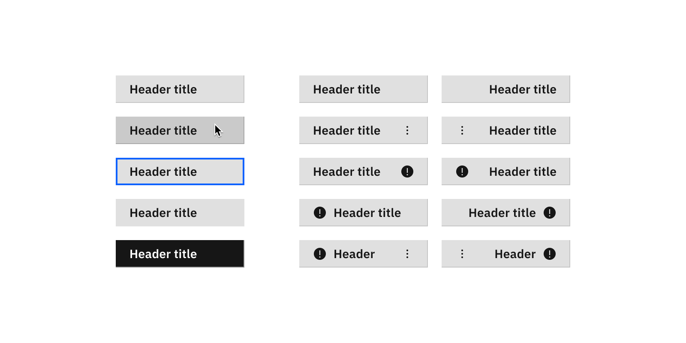

</Column>

### Cells

| State            | Property                | Color token (v11)         | Color token (v10)         |
| :--              | :--                     | :--                       | :--                       |
| Enabled          | background-color        | `$layer-01`               | `$field-01`               |
|                  | text-color              | `$text-secondary`         | `$text-02`                |
|                  | border-bottom           | `$border-subtle`          | `$decorative-01`          |
|                  | border-right            | `$border-subtle`          | `$decorative-01`          |
|                  | svg                     | `$icon-secondary`         | `$icon-02`                |
| Hover            | background-color        | `$layer-01`               | `$field-01`               |
|                  | text-color              | `$text-secondary`         | `$text-02`                |
|                  | svg                     | `$icon-secondary`         | `$icon-02`                |
| Focus            | border                  | `$focus`                  | `$focus`                  |
| Selected         | background-color        | blue20 / cyan70           | blue20 / cyan70           |
|                  | text-color              | `$text-primary`           | `$text-01`                |
|                  | border                  | `$focus`                  | `$focus`                  |
|                  | svg                     | `$icon-primary`           | `$icon-01`                |
| Active           | background-color        | `$layer-01`               | `$field-01`               |
|                  | text-color              | `$text-primary`           | `$text-01`                |
|                  | border                  | `$focus` / cyan70         | `$focus` / cyan70         |
|                  | border-bottom           | blue30 / cyan60           | blue30 / cyan60           |
|                  | border-right            | blue30 / cyan60           | blue30 / cyan60           |
|                  | svg                     | `$icon-primary`           | `$icon-01`                |
| Selected + hover | background-color        | blue20  / cyan70          | blue20 / cyan70           |
| Zebra            | background-color        | `$layer-accent`           | `$layer-02`               |

<Column colMd={8} colLg={8}>

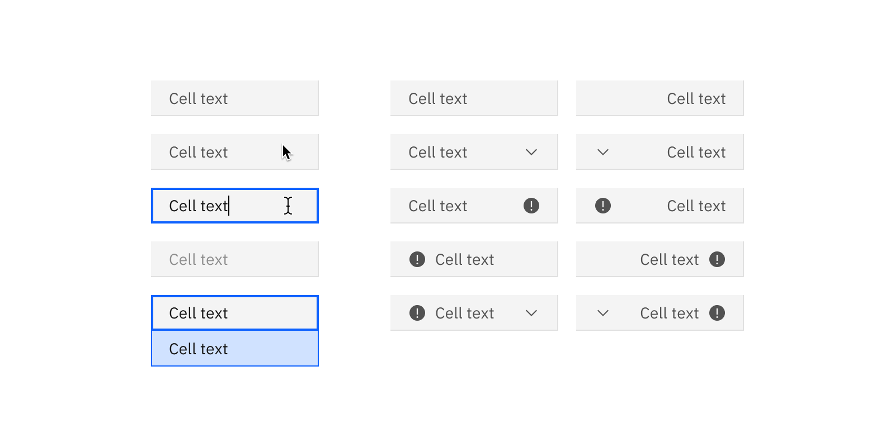

</Column>

## Typography

| Element          | Font-size(px  em)       | Font-weight               | Type token (v11)          | Type token (v10)             |
| :--              | :--                     | :--                       | :--                       | :--                          |
| Column header    | 14 / 0.875              | SemiBold / 600            | `$heading-01`             | `$productive-heading-01`     |
| Row header       | 14 / 0.875              | SemiBold / 600            | `$heading-01`             | `$productive-heading-01`     |
| Cell             | 14 / 0.875              | Regular / 400             | `$text-secondary`         | `$productive-body-short-01`  |

## Structure

### Headers

**Column** headers can change height independantly if designed. For example, if a 64px tall header height is required for 2 (two) lines of text (title and caption), then the rows may be any height desired. The default is to match both heights.

**Row** headers must match the row height.

<Column colMd={8} colLg={8}>

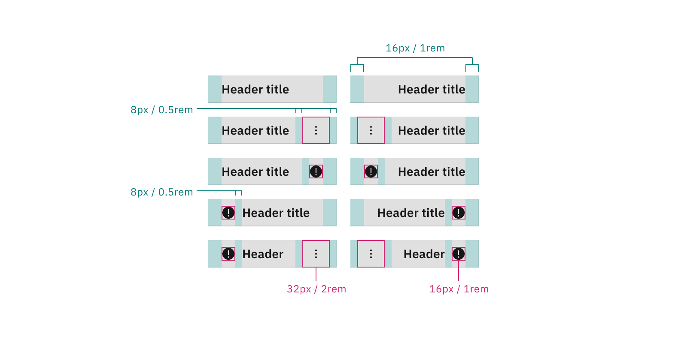
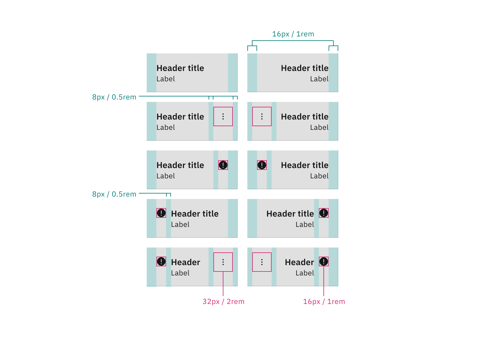

</Column>

### Cells

Cells share similar structure as headers except it is discouraged to use buttons in cells. There can be exceptions, but a rule of thumb will be to avoid buttons in cells because it does not fit for extra small (24px) tall cells.

<Column colMd={8} colLg={8}>

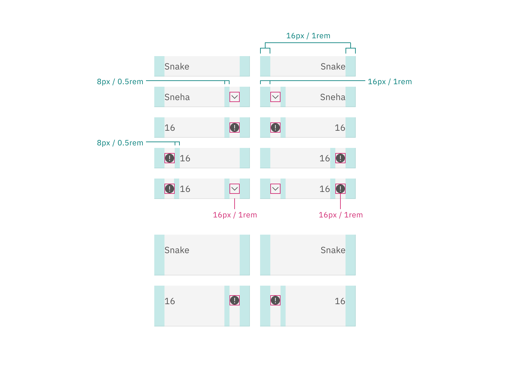

</Column>

### Columns

To lead the eye down a spreadsheet column with ease, do not add visual obstacles unless intended to disrupt the flow. Keep all content aligned as much as possible.

| Spacing between       | Property                | px / rem                  | Spacing token         |
| :--                   | :--                     | :--                       | :--                   |
| Columns               | Padding                 | 16 / 1                    | `$spacing-05`         |

<Column colMd={8} colLg={8}>

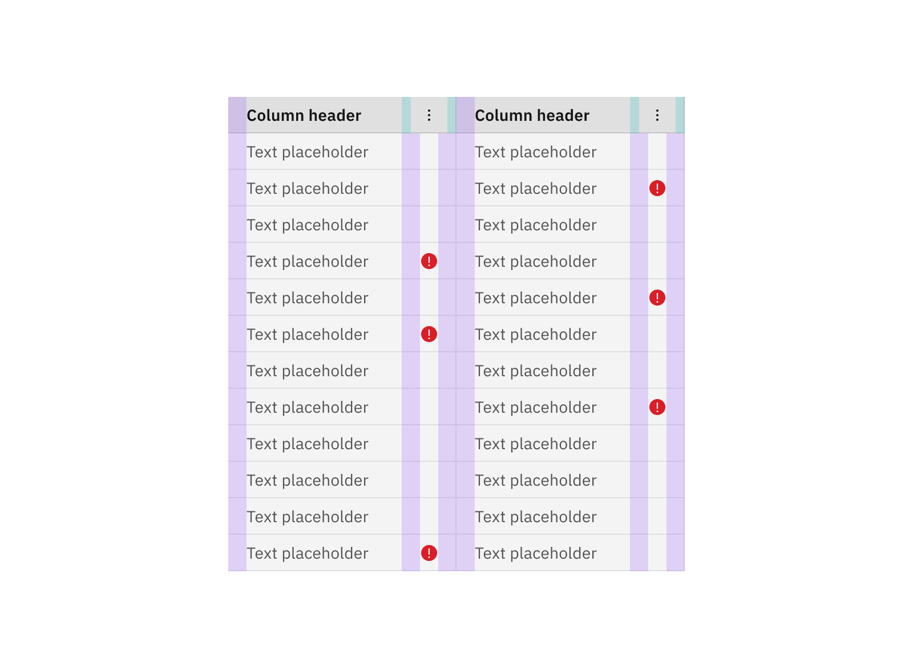

</Column>

### Rows

Rows can expand to the height of its contents. They truncate text by default but may be emabled to wrap.

<Column colMd={8} colLg={8}>

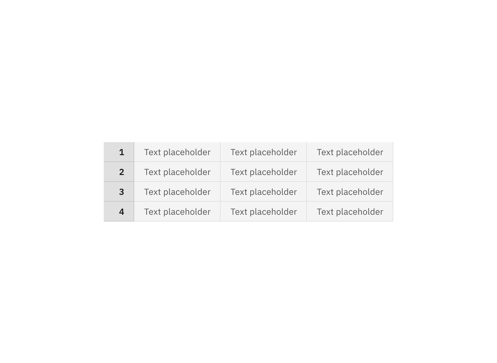

</Column>

### Sizes

| Size                  | Height (px / rem)       |
| :--                   | :--                     |
| Extra small (xs)      | 24 / 1.5                |
| Small (sm)            | 32 / 2                  |
| Medium (md)           | 40 / 2.5                |
| Large (lg)            | 48 / 3                  |
| Extra large (xg)      | 64 / 4                  |

<Column colMd={8} colLg={8}>

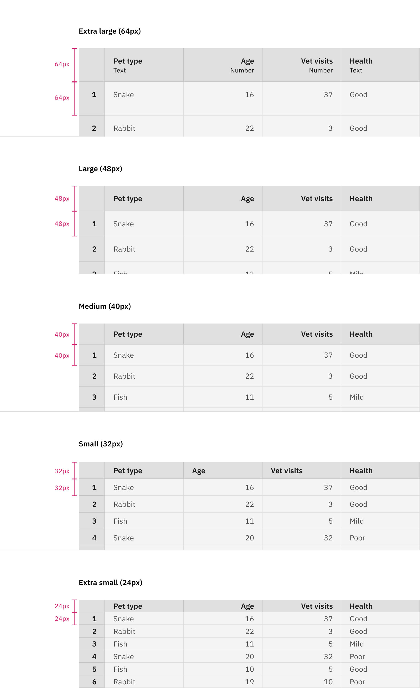

</Column>

### Enhancements

Most enhancements live in headers but some may be adapted to live inside cells, such as icons.

| Elenment                    | Property                   | px / rem     | Placement         |
| :--                         | :--                        | :--          | :--               |
| Checkbox                    | height, width              | 20 / 1.25    | Header            |
| Radio button                | height, width              | 20 / 1.25    | Header            |
| Overflow menu               | height                     | 40 / 2.5     | Header            |
| Icon                        | svg                        | 16 / 1       | Header, cell      |

## Content

### Cells

<Accordion>

<AccordionItem title="Currency">
<Row>
<Column colMd={16} colLg={16}>

Alignment: right

- Use 8px spacing between numeric value and currency acronym. The value should be right aligned.

<Column colMd={16} colLg={16}>

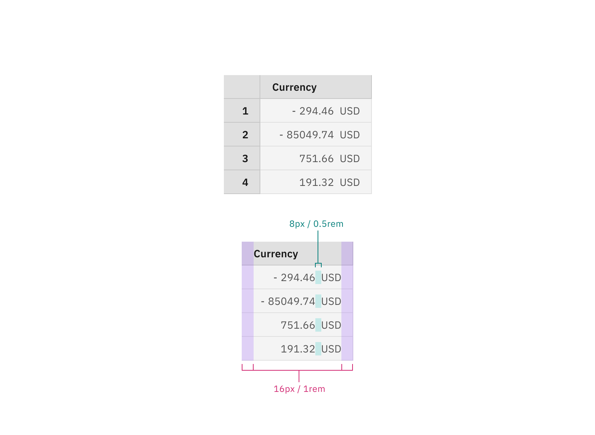

</Column>

</Column>
</Row>
</AccordionItem>

<AccordionItem title="Dates and timestamps">
<Row>
<Column colMd={16} colLg={16}>

Alignment: left (can be right aligned as well)

- Combination of alpha-numeric can be left aligned.
- Abbreviated numeric can be left or right aligned (select the alignment that is most used in your spreadsheet).

<Column colMd={16} colLg={16}>

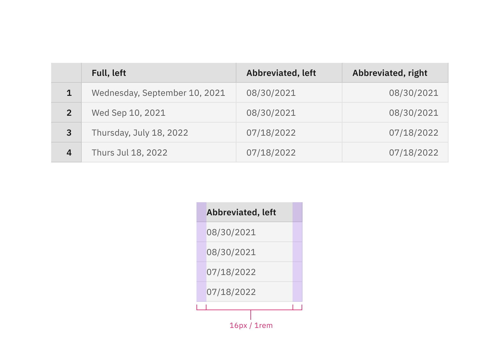

</Column>

</Column>
</Row>
</AccordionItem>

<AccordionItem title="Icons">
<Row>
<Column colMd={16} colLg={16}>

Alignment: left and right

- If icons are left aligned, use 8px spacing between icon and text.
- If icons are right aligned, use 8px spacing between icon and text.

<Column colMd={16} colLg={16}>

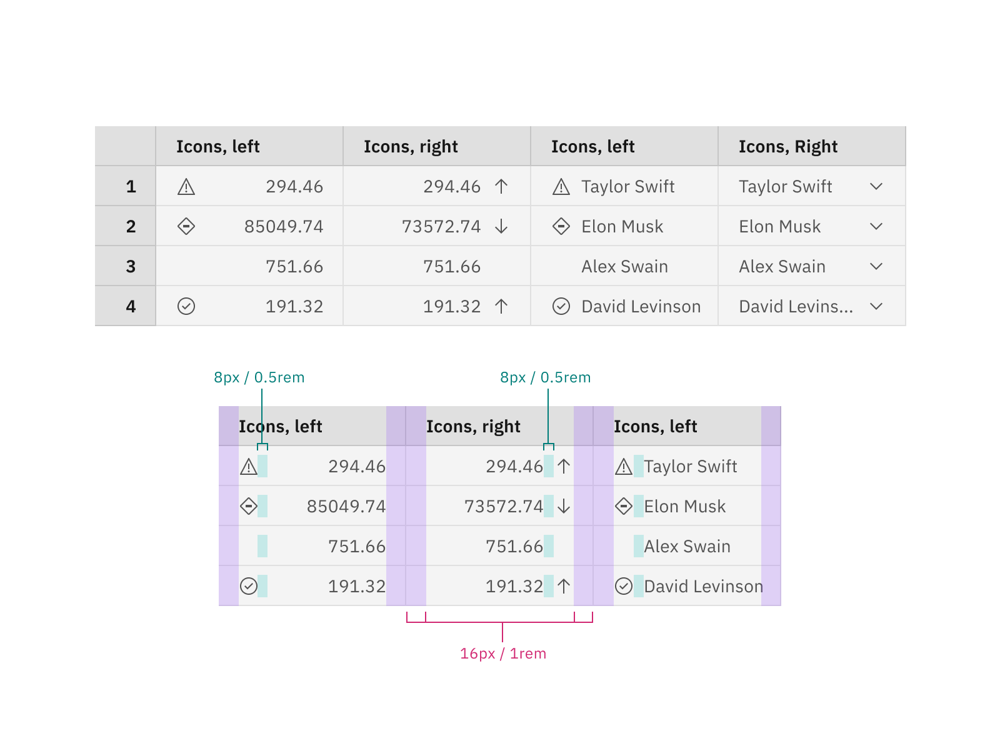

</Column>

</Column>
</Row>
</AccordionItem>

<AccordionItem title="Negative values">
<Row>
<Column colMd={16} colLg={16}>

Alignment: right (right to text)

- Place minus (-) left to the value with a space character separator.

<Column colMd={16} colLg={16}>

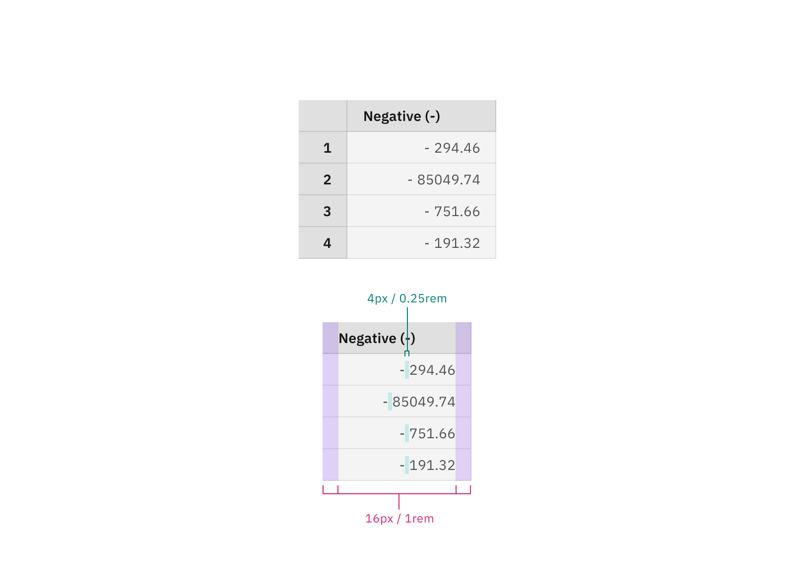

</Column>

</Column>
</Row>
</AccordionItem>

<AccordionItem title="Numerical values">
<Row>
<Column colMd={16} colLg={16}>

Alignment: right

- Decimals are centered aligned.

<Column colMd={16} colLg={16}>

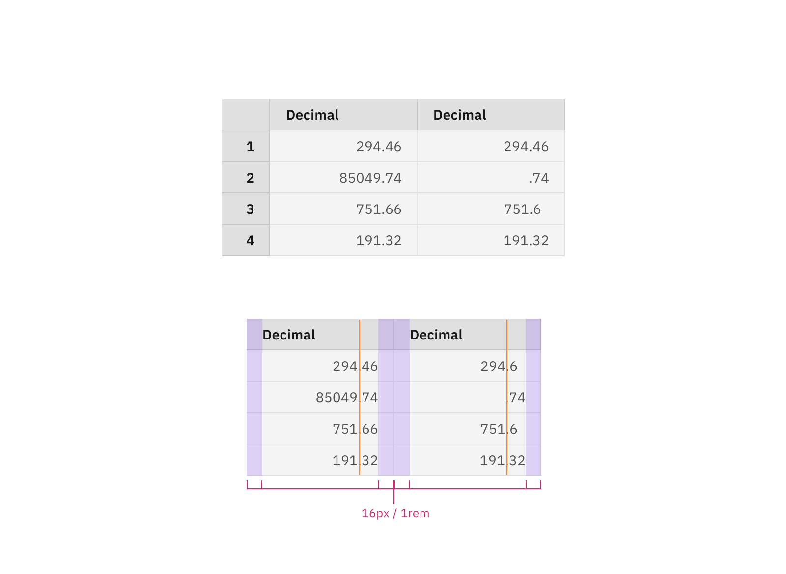

</Column>

</Column>
</Row>
</AccordionItem>

<AccordionItem title="Symbols">
<Row>
<Column colMd={16} colLg={16}>

Alignment: left and right

- If symbols are left aligned, use 8px spacing between icon and text.
- If symbols are right aligned, place symbol left to the value with a space character separator.

<Column colMd={16} colLg={16}>

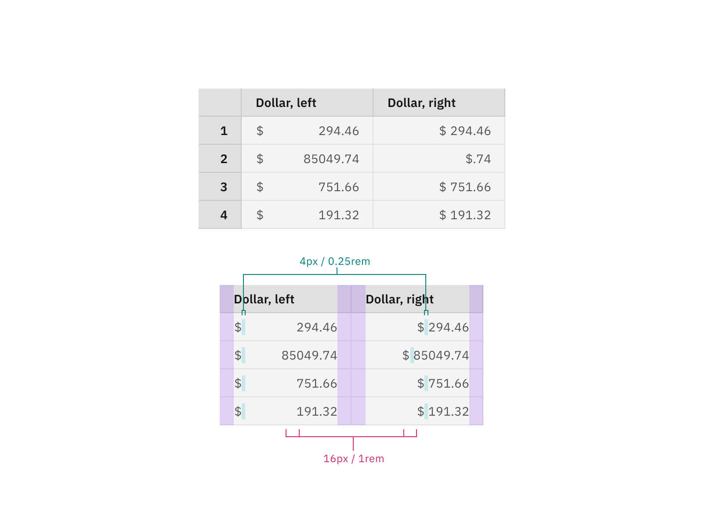

</Column>

</Column>
</Row>
</AccordionItem>

<AccordionItem title="Text and strings">
<Row>
<Column colMd={16} colLg={16}>

Alignment: Left 

- Default is left, but can be made to right aligned.

<Column colMd={16} colLg={16}>

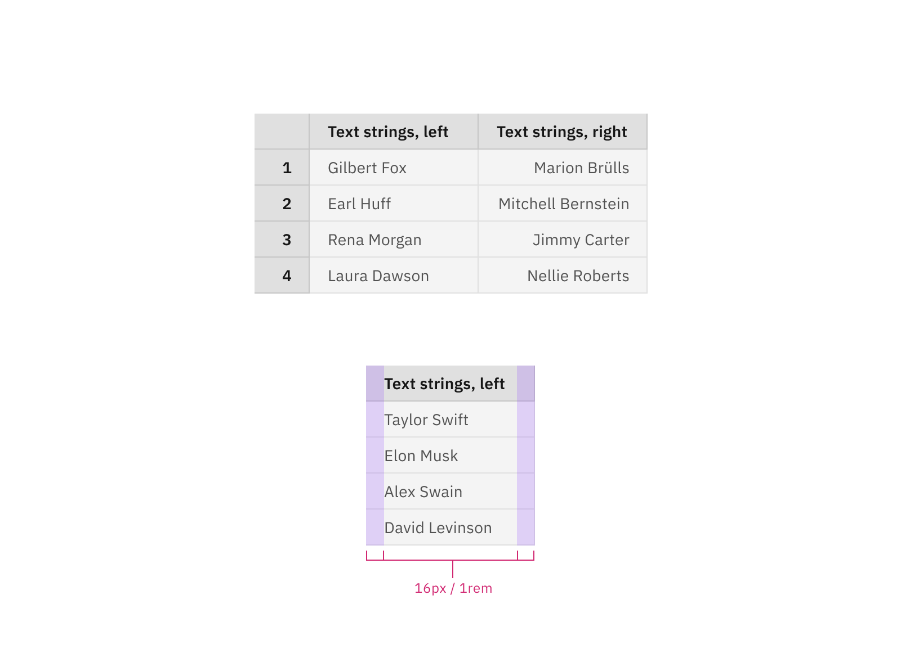

</Column>

</Column>
</Row>

</AccordionItem>

</Accordion>

### Headers

<Accordion>

<AccordionItem title="Buttons">
<Row>
<Column colMd={8} colLg={8}>

Alignment: right (columns), left (rows)

- Overflow menu buttons are typically the ones used in headers. These are right aligned.
- Using the same location for buttons in the headers (i.e keeping the button right aligned) helps navigating the headers, making it expected to where a user should click.
- In the event that a header requires an icon or symbol to be right aligned, make the button left aligned (rare).
- Use 8px spacing between the button and the text.
- Overflow menu buttons should be persistently visible.
- Rarely are they used in rows, but may be placed if necessary.

<Column colMd={16} colLg={16}>

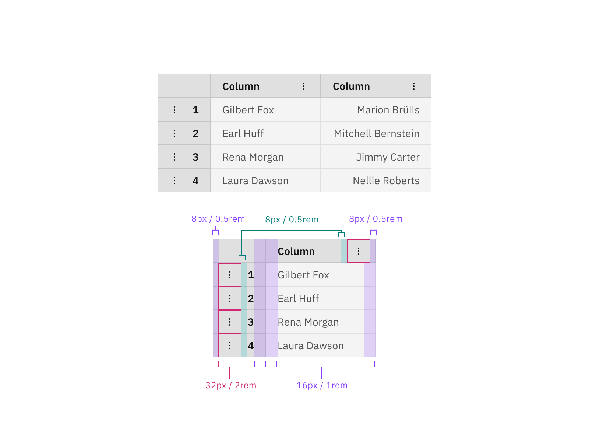

</Column>

</Column>
</Row>
</AccordionItem>

<AccordionItem title="Expandable">
<Row>
<Column colMd={8} colLg={8}>

Alignment: Left

- By default, headers use left alignment for the chevron when expandable. There may be opportunity to move it to the right where applicable.
- Headers should remain default size until at least 1 header is expanded, then all closed headers should stretch to fit the height or width to become visually in-sync.

<Column colMd={16} colLg={16}>

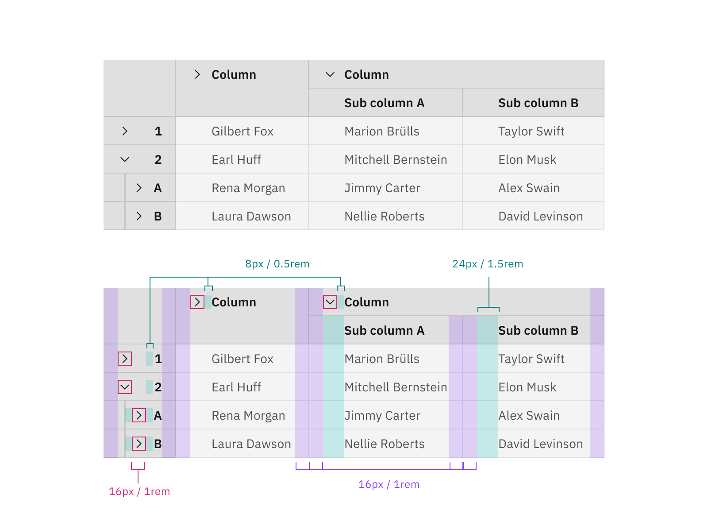

</Column>

</Column>
</Row>
</AccordionItem>

<AccordionItem title="Icons">
<Row>
<Column colMd={8} colLg={8}>

Alignment: left and right

- If icons are left aligned, use 8px spacing between icon and text.
- If icons are right aligned, use 8px spacing between icon and text.
- Text in cells does not have to align to text in the header if an icon is present in the header.

<Column colMd={16} colLg={16}>

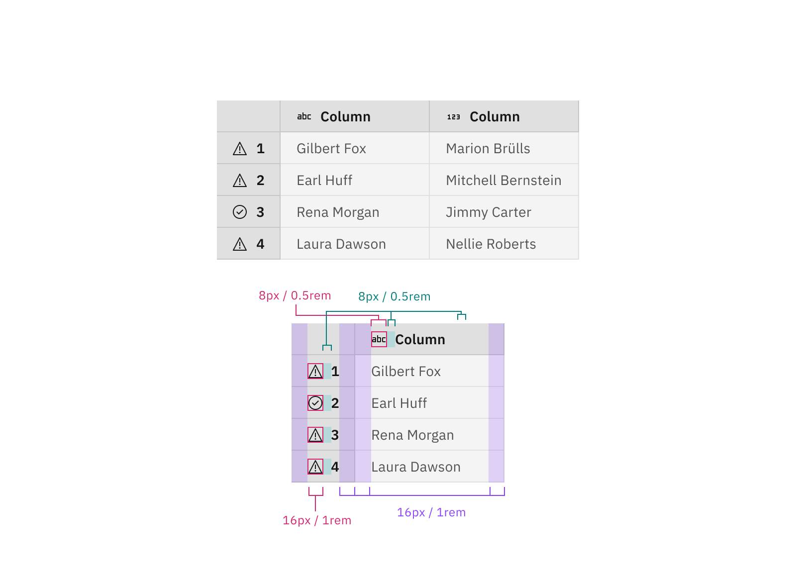

</Column>

</Column>
</Row>
</AccordionItem>

<AccordionItem title="Numeric values">
<Row>
<Column colMd={8} colLg={8}>

Alignment: right (rows), left (columns)

- By default, row headers are right aligned.
- Column headers will use left alignment unless specified otherwise.

<Column colMd={16} colLg={16}>

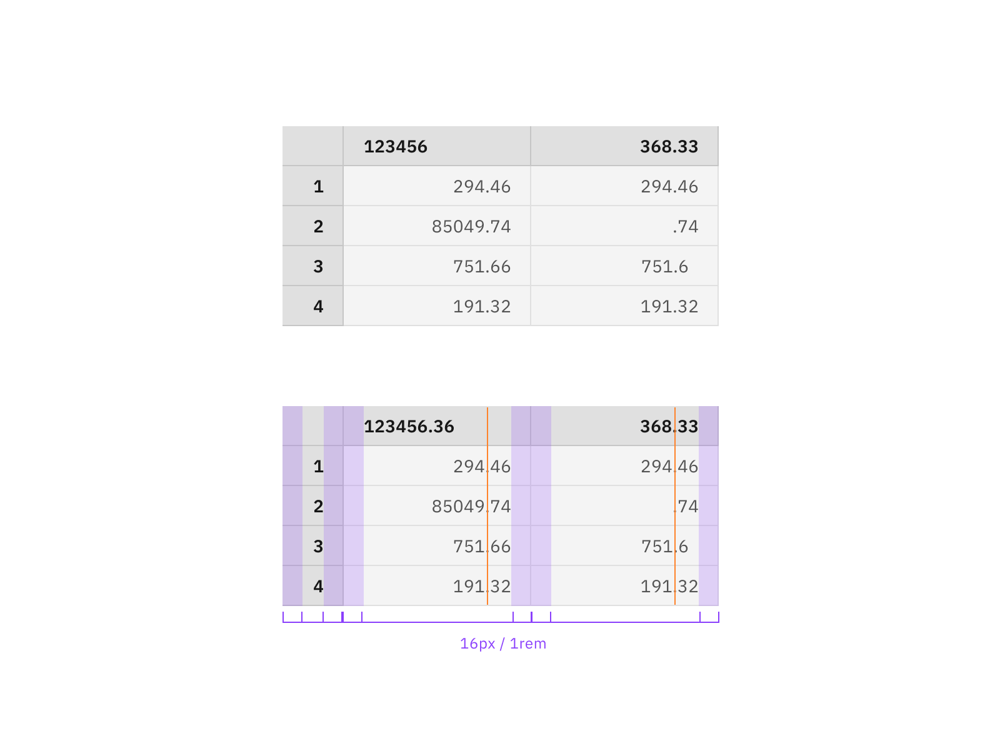

</Column>

</Column>
</Row>
</AccordionItem>

<AccordionItem title="Text and strings">
<Row>
<Column colMd={8} colLg={8}>

Alignment: Left 

- Default is left, but can be made to right aligned.

<Column colMd={16} colLg={16}>

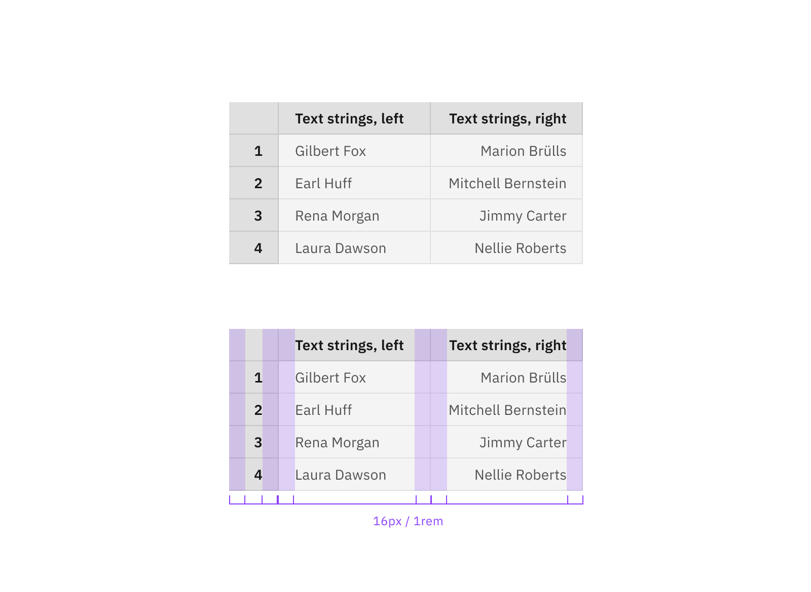

</Column>

</Column>
</Row>

</AccordionItem>

</Accordion>