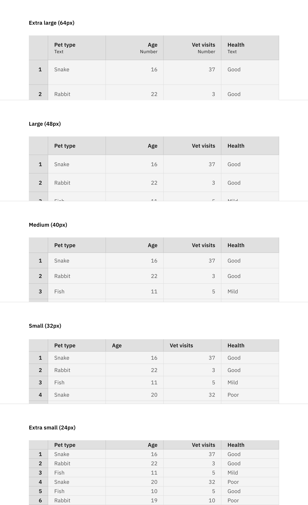

<PageDescription>

Data spreadsheets are used to organize and display large amounts of structured data, separated by columns and rows in a grid-like format.

</PageDescription>

<AnchorLinks>
    <AnchorLink>Overview</AnchorLink>
    <AnchorLink>Formatting</AnchorLink>
    <AnchorLink>Content</AnchorLink>
    <AnchorLink>Behaviors</AnchorLink>
    <AnchorLink>Modifers</AnchorLink>
    <AnchorLink>Best practices</AnchorLink>
    <AnchorLink>Related</AnchorLink>
    <AnchorLink>Feedback</AnchorLink>
</AnchorLinks>

# Overview

<Row>
<Column colMd={8} colLg={8}>

</Column>
</Row>

Data spreadsheets are best used for viewing data that span many columns and potentially hundreds or even thousands of rows. Users are able to easily scroll right, left, up, and down to view content. These spreadsheets typically are derived from tables in databases and data assets such as CSVs. Their main use is for editing and understanding data before data analysis.

## When to use

<ul>
    <li>Use to display content with little-to-no intrinsic relationships.</li>
    <li>Use to organize and display excessive amounts of (usually) structured data such as content from a CSV or table from a database.</li>
    <li>Use to preform complex mathematical operations or analysis with content.</li>
    <li>Use to preform actions (manipulations) on the content displayed such as creating a new column, reorganizing columns, renaming columns, etc.</li>
    <li>Use to modify content in a free-form, less restricted experience—able to edit and modify content placement or specify locations within the grid to apply mathematical operations.</li>
    <li>Use to customize presentation of content displayed such as cells' color, size, etc.</li>
    <li>Use to display content that can have absence of value—`empty`, beyond `null`, `NA`, `––`. etc.</li>
</ul>

## When not to use

<ul>
    <li>Do not use to display or manipulate statuses on running activities. Use a data table instead.</li>
    <li>Do not use when content is not from a CSV-like or table from a database.</li>
    <li>Do not use for simple lists or content that cannot be divisible by columns and/or rows.</li>
    <li>Do not use to optionally replace data tables without consideration of the behaviors or functionality such as ability to reorder or modify content.</li>
    <li>Do not use if row actions are required (i.e overlfow menu to delete or pause items).</li>
</ul>

# Formatting

## Anatomy

<Row>
<Column colMd={8} colLg={8}>

</Column>
</Row>

1. **Cells:** A cell holds data and is formed by the intersection of a column and row, forming a rectangle along a grid pf other cells.

2. **Headers:** A special type of cell. They are usually the top or left most cell in a column or row that acts as an identifier of that column or row. These typically act as `sticky` in that they stay stuck to the top of the component when scrolling.

3. **Columns:** Vertical stacks of cells and a header.

4. **Rows:** Horizontal stacks of cells and a header.

## Sizing

The data spreadsheet is available in five different row sizes:

- Extra large (64px)
- Large (48px)
- Medium (40px)
- Small (32px)
- Extra small (24px)

Data spreadsheets typically use the same column and row headers as the hight of the cells. However, the headers' heights may also act independently of the rows' heights and cells' heights. 

<Row>
<Column colMd={8} colLg={8}>

</Column>
</Row>

## General alignment

Alignment of content can be viewed below. It bases the spacing off of Carbon's default scales and the 2px grid and typical 16px insets. More general alignment guidelines can be viewed at the styles page of this component and alignment of content in the cells and headers can be viewed in our data content pattern.

A general rule of thumb is that 16px padding exists on the left and right of each cell.

## Columns

Attempt to keep the same alignment throughout the entire column. This makes it easier to scan vertically. Content is by default tyop aligned, but can be altered for specific cases.

<Row>
<Column colMd={8} colLg={8}>

</Column>
</Row>

## Rows

Rows do not have to maintain the same alignment through each cell (via left or right), but if there are no specific cases of altering a single cell, content is top aligned in the cell.

<Row>
<Column colMd={8} colLg={8}>

</Column>
</Row>

# Content

## Cells

Cells may contain a variety of content including:

- Currency
- Dates and timestamps
- Icons
- Negative values
- Numerical values
- Symbols
- Text and strings

Do not attempt to include too much in a cell. Too much variety of content (i.e string + icon + symbol + button + accordian + emoji + divider) will cause discomfort to viewers when scanning down columns.

<Row>
<Column colMd={8} colLg={8}>

</Column>
</Row>

Attempt to keep action-oriented icons opposite alignment of text to increase visibility and breathing room, increasing distinction of what it is.

## Headers

Headers main content include text, but may also include buttons and icons.

<Row>
<Column colMd={8} colLg={8}>

</Column>
</Row>

# Behaviors

## Actions

### Hover

When hovering over a cell, the corresponding column and row header will darken to help make it clear what is active. There is no color or state change on cells with a cursor hovering.

<Row>
<Column colMd={8} colLg={8}>

</Column>
</Row>

### Selection & focus

User can select single or multiple cells, single or multiple columns, single or multiple rows, or a combination of any of the three. Some tools may dictate how selection behaves. For example, tools that cannot currently edit individual cells restrict selection to whole columns only. For read-only usecases, selection can be used to copy content or reveal insights to selections through context panels.

Selection uses 2 types of focus borders thickness: a 1px and 2px.

When selecting a single cell, the 2px focus border appears and the corresponding column and row headers become selected.

<Row>
<Column colMd={8} colLg={8}>

</Column>
</Row>

When multiple cells are selected, the first one to be clicked-down by the cursor will use a 2px focus border but the remaining will retain a 1px focus border. This helps create heirarchy of which cell is being edited and which is only selected. The corresponding column and row headers will become selected.

<Row>
<Column colMd={8} colLg={8}>

</Column>
</Row>

When selecting a column or row, the first cell in the sequence becomes the active cell while the remaining are only selected. The header changes to a active state.

<Row>
<Column colMd={8} colLg={8}>

</Column>
</Row>

<Row>
<Column colMd={8} colLg={8}>

</Column>
</Row>

When selecting multiple columns or rows, the last column or row's first cell in the sequence becomes the active cell. The headers change to a active state.

<Row>
<Column colMd={8} colLg={8}>

</Column>
</Row>

<Row>
<Column colMd={8} colLg={8}>

</Column>
</Row>

<Row>
<Column colMd={8} colLg={8}>

</Column>
</Row>

<Row>
<Column colMd={8} colLg={8}>

</Column>
</Row>

When selecting all cells (by clicking the top-left column box), the very first available cell in the spreadsheet becomes active. The headers change to a selected state.

<Row>
<Column colMd={8} colLg={8}>

</Column>
</Row>

### Editing

When using an editable spreadsheet, if the tool allows, there may be multiple behaviors for how to edit the data contents (per the tool's abilities). 

If editing is disabled or restricted, do not let users override content in the spreadsheet.

If editing is enabled, only the focused cell(s) may be edited (unless specified by the tool in an action flow).

If a user edits a cell that has a lot of content, refer to the in-line editing for how to handle overflowing content. The content in the popover editable input should face the same direction as the content when enabled.

<Row>
<Column colMd={8} colLg={8}>

</Column>
</Row>

### Deleting

Content in a column or row, or columns or rows themselves can be removed from the spreadsheet using multiple methods. Selecting a cell or group of cells can be deleted (emptied) by clicking the "delete" keyboard key or using a context menu item to delete contents.

Cells being deleted would only remove their contents. Depending on the tool, the contents may be left empty or replaced with a default value.

Rows being deleted would shift remaining rows up. No need to display a warning, but giving users the ability to undo or reset values to original status is then required. 

Columns being deleted would shift remaining columns left. No need to display a warning, but giving users the ability to undo or reset values to original status is then required.

Alternately, an optional warning modal may be presented if the action of deleting is non-reversable.

You may be able to delete columns and rows at the same time.

### Moving content

A user can select and move contents from cells, columns, or rows depending if the tool can allow for such behavior.

To move a single column or row, select the column and drag it to the desired location. A blue line will appear in the location the column will be placed.

To move multiple columns or rows, select them via holding shift and clicking, down and dragging, or command clicking and selecting, then select and hold one column to move all the selected columns to the desired location.

You may not move columns and rows as the same time. 

<Row>
<Column colMd={8} colLg={8}>

</Column>
</Row>

## Scrolling

Vertical and horizontal scroll are always available in spreadsheet unless otherwise specified. The content dictates length of scrollbar and scroll-area. When there is no data, limit the number of columns and rows that users can see by scrolling.

<Row>
<Column colMd={8} colLg={8}>

</Column>
</Row>

When data is not loaded, the default would be to use a lazy load (using skeleton loading rows) to indicate to users the service is fetching data.

<Row>
<Column colMd={8} colLg={8}>

</Column>
</Row>

While a user scrolls in a spreadsheet, the column headers will stay put to the top of the spreadsheet and the row headers will stay put to the left of the spreadsheet. Optionally, some headers and cells can be pinned to not scroll.

## Empty

Empty state for spreadsheets can fall under two contexts: traditional empty state or visible cells.

### Traditional empty state

This acts as what is expected, an image or call-to-action in the cells content area. Scenarios that include this traditional empty state are:

- No data to display
- Error loading data
- Data with special loading visualizations
- Selecting data

<Row>
<Column colMd={8} colLg={8}>

</Column>
</Row>

### Visible cells

This is reserved for tools that allow users to start from empty spreadsheets. Scenarios that include visible cells are: 

- Spreadsheets that allow users to start "from nothing".
- Loading a data set that is expected to show data
- Column title text is optional depending on the tool's requirements.

<Row>
<Column colMd={8} colLg={8}>

</Column>
</Row>

# Modifers

## Light & Dark theming

Spreadsheets use the same UI tokens for Grey 10 and Grey 100 themes.

For the color, we use the `Blue hue` in Carbon for Light theme and `Cyan hue` for Dark theme. You can see more of this is the styles section.

<Row>
<Column colMd={8} colLg={8}>

</Column>
</Row>

## Overflow menu (optional)

Hovering on a column or row can reveal an overflow menu. Most products will not need a row overflow menu.

A column overflow menu usually affects contents in that column. Occasionally when a user selects something such as "sorting" options from a column, it may rearrange the contents of the spreadsheet according to that column. Otherwise, all actions should affect the selected column only.

When multiple columns or rows are selected, the overflow menu selected on any of those selected will apply to all selected columns or rows.

See more in the menus pattern.

<Row>
<Column colMd={8} colLg={8}>

</Column>
</Row>

## Context menu (optional)

Users can trigger an optional context menu by right-clicking on a cell or header (column or row).

Use the top section of a context menu for common actions, the middle section for context specific actions, and the bottom section for destructive actions.

<Row>
<Column colMd={8} colLg={8}>

</Column>
</Row>

## Context panels (optional)

Double clicking a column header should trigger a context panel. Controls within typically include insights or properties to manipulate the selection.

See more guidance in the context panel sub-pattern on what content can appear in the context panel.

<Row>
<Column colMd={8} colLg={8}>

</Column>
</Row>

## Loading

When a spreadsheet is initializing, use the skeleton "lazy" load on column and row headers only. Do not showcase a loading element in every visible cell, which would be overwhelming to users if the content takes a long time to fetch.

<Row>
<Column colMd={8} colLg={8}>

</Column>
</Row>

When a user scrolls and there is no pagination, use lazy load to add more data to the memory of the browser. In this case, a user may see the skeleton loader inside the cells to differentiate between empty cells and loading cells. Amount of content loaded per fetching of data is up to the product. Once data is available, quickly fade out the lazy loader and fade in the content from top to bottom.

<Row>
<Column colMd={8} colLg={8}>

</Column>
</Row>

## Errors

### Big errors

If an error prevents data from being displayed for the entire data spreadsheet, use a similar pattern to the empty state.

<Row>
<Column colMd={8} colLg={8}>

</Column>
</Row>

# Best practices

- Use the first row of a data source's table as the column headers. Typically, our tools do not display the letter number of the order.
- Do not overload cells with varied content, making it hard to scan.
- Use top-left as default alignmet placement.
- Context menus and overflow menus should use a different color layer than the cell's per theme. For example, If cells are using a gray10, the overflow menu should be colored white.
- Do not use buttons inside cells. Use the entire cell as the clickable area for an action.
- If a type of action (button, dropdown, etc.) exist in the header, the minimum height of the header should be 32px.

## Other use cases

<!-- ### Accessibility -->

### Keyboard shortcuts

| Keyboard (macOS)          | Keyboard (Windows)          | Description                                                                                 |
| :--                       | :--                         | :--                                                                                         |
| ↑                         | ↑                           | Shift focus up.                                                                             |
| →                         | →                           | Shift focus right.                                                                          |
| ↓                         | ↓                           | Shift focus down.                                                                           |
| ←                         | ←                           | Shift focus left.                                                                           |
| ⇧ + Arrow key             | ⇧ + Arrow key               | Update size of current selection area.                                                      |
| ⌘ + `A`                   | `control` + `A`             | Select all.                                                                                 |
| `control` + Space         | `control` + Space           | Select current column.                                                                      |
| ⇧ + Space                 | ⇧ + Space                   | Select current row.                                                                         |
| ⌘ + `home`                | `control` + `home`          | Select first cell in first row.                                                             |
| ⌘ + `end`                 | `control` + `end`           | Select last cell in last row.                                                               |
| `home`                    | `home`                      | Select first cell in current row.                                                           |
| `end`                     | `end`                       | Select last cell in current row.                                                            |
| `↩`                       | `↩`                         | Move placement of active cell vertically.                                                   |
| `tab`                     | `tab`                       | Move placement of active cell horizontally.                                                 |
| `↩` (With area selected)  | `↩` (With area selected)    | Move placement of active cell within selection areas vertically.                            |
| `tab` (With area selected)| `tab` (With area selected)  | Move placement of active cell within selection areas horizontally.                          |

# Related

- [Data tables](https://carbondesignsystem.com/components/data-table/usage/)
- [Data table extensions](https://pages.github.ibm.com/cdai-design/pal/components/data-table/overview)
- [Drag and drop](https://pages.github.ibm.com/cdai-design/pal/patterns/drag-and-drop/usage)
- [Overflow menu](https://carbondesignsystem.com/components/overflow-menu/usage/)
- [Side panels](https://pages.github.ibm.com/cdai-design/pal/components/side-panel/usage)
- [Text input](https://carbondesignsystem.com/components/text-input/usage/)

# Feedback

- [Component code](https://carbon-for-ibm-products.netlify.app/?path=/story/ibm-products-components-dataspreadsheet-dataspreadsheet-canary--data-spreadsheet)
