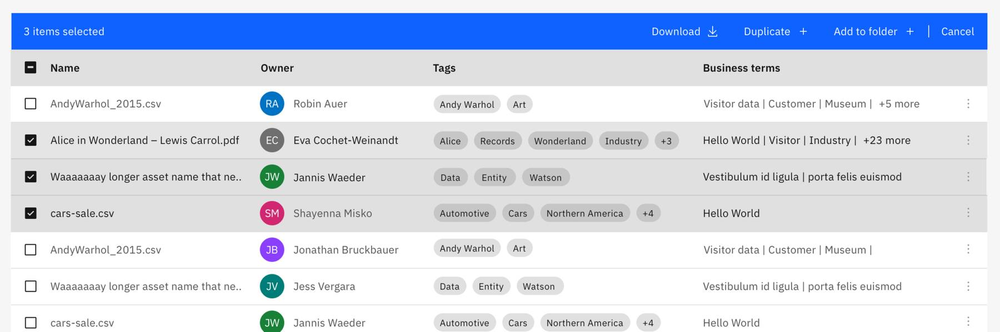
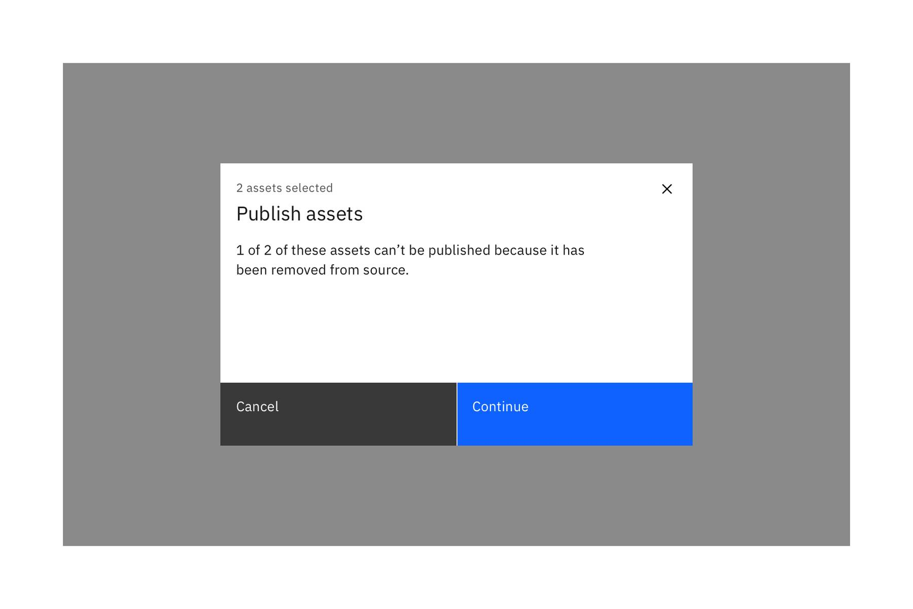

import { Link } from "gatsby";

<- [Back to data table overview](https://pages.github.ibm.com/cdai-design/pal/components/data-table/overview) 

<PageDescription>

Multi-select & batch action are functions that may be performed on multiple items within a table. By using batch actions users can save time and be more productive instead of performing repetitive single actions.

</PageDescription>

<AnchorLinks>
  <AnchorLink>Overview</AnchorLink>
  <AnchorLink>Behaviors</AnchorLink>
</AnchorLinks>

## Overview

Once the user selects at least one checkbox from a row, the batch action bar appears at the top of the table, presenting the user with actions they can take. To exit or escape “batch action mode”, the user can cancel out or deselect the items. See [Carbon guidelines](https://www.carbondesignsystem.com/components/data-table/usage#multi-select-and-batch-action). 

When batch mode is active, single action icons and overflow menus on the row will be disabled. 

## Behaviors

### More than 4 actions

When more than 4 actions are needed for multi-select, the “More” overflow menu holds additional actions. Options listed in the dropdown work like the typical [overflow menu](https://www.carbondesignsystem.com/components/overflow-menu/usage/) items.

If there is limited space or on smaller screensizes, we recommend to use only an overflow menu that lists all possible actions.

### Actions across multiple pages
By default batch actions always select the current view of items on the first page. When users deal with large amount of data and want to perform batch actions, it can become time consuming to select items only from the current page and perform the same action mutliple times for all other pages. Therefore users should be able to select all items across multiple pages for related objects in a table.

When a table has a large amount of items (+100 rows) we recommend to use a Select all button next to the indicator, that shows how many items currently are selected. 

After the user clicks on Select all, all items in this table are selected (across all pages). When the user performs an action now, all pages are affected. 

To exit or escape batch action mode, the user can cancel out or deselect the items with the checkbox in the column header.

### Not all actions apply to the selection

There might be use cases where not all actions can be performed for all selected items. If that’s the case let the user go through the action, but acknowledge that not all selections will be affected. Make sure to provide some reasoning to the user.

### Delete actions
Delete actions cannot be easily undone and are typically permanent. If a batch action triggers an action with  negative consequences, use a danger modal to warn and confirm those actions. Make sure to ask for confirmation of the delete, with guidance about what will occur if they delete and warn the user of any negative consequences. 

#### When to use

- When an action cannot be undone, and it would be very expensive or time-consuming to re-create data. 
- If the action deletes a large amount of data
- If other important items would be deleted as a result of the action

Follow also the guidance of the [delete pattern](https://www.carbondesignsystem.com/patterns/common-actions/#delete).

