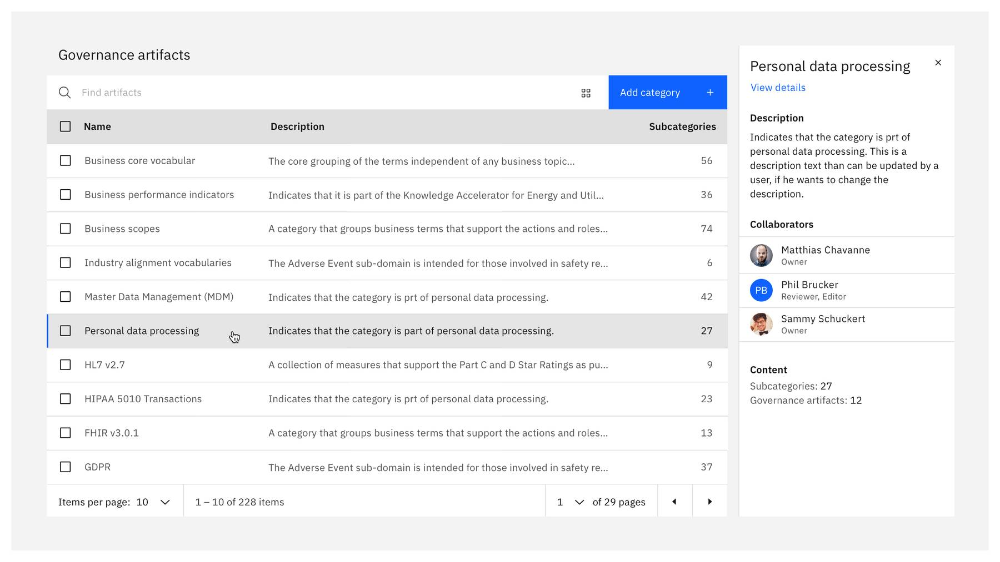
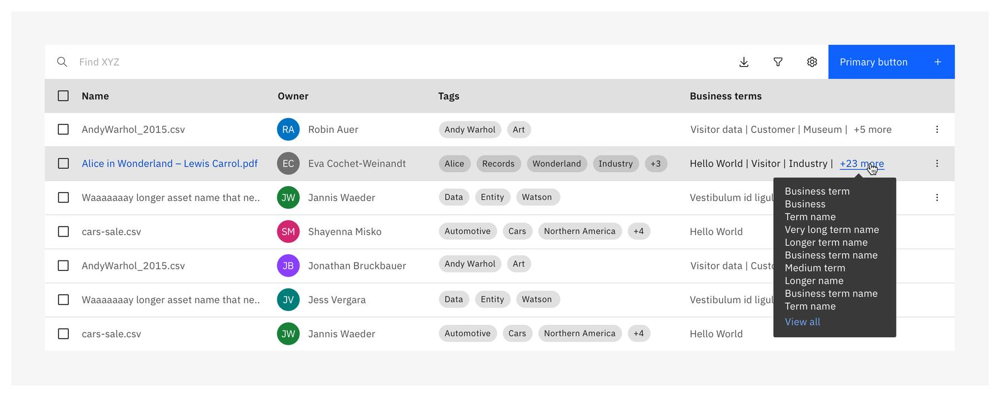
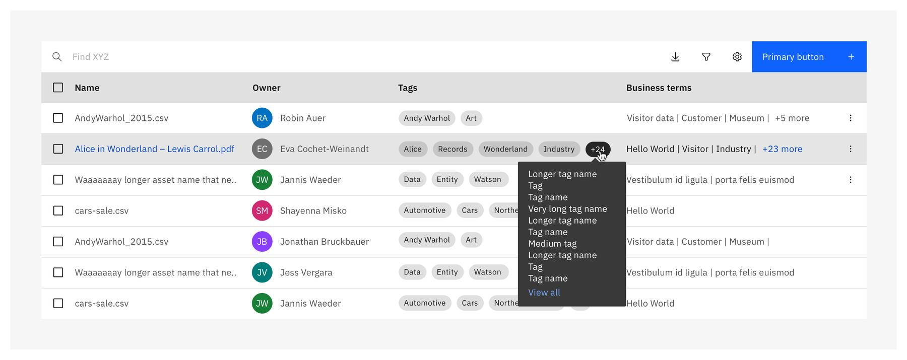

<- [Back to data table overview](https://pages.github.ibm.com/cdai-design/pal/components/data-table/overview) 

<PageDescription>

Data table rows can contain one or multiple interactive components. Users need to distinguish which items in a data table are plain static content, and which are actionable.

</PageDescription>

#### We distinguish the following interactions in data table rows:

1. Clickable links - Drilldown into new page
2. Clickable rows - Data preview in context of the page
3. Select checkbox - Muti-select + batch actions
4. Tooltips, tags and secondary links

## Clickable links - Drilldown into new page

Clickable links are used for navigational purposes (drilling down into details on a new page). To indicate clickable items in a table row we use the [Carbon link component](https://www.carbondesignsystem.com/components/link/usage/). By default links should be shown on hover in data table rows. Too many clickable blue links on a page can distract the user from the actual task, add cognitive load and the ability to consume information. Especially in data heavy tables or large data sets too many clickable links on a page can distract and mislead the user from the actual task.

<DoDontRow>

<DoDont aspectRatio="1:1" caption="Show blue links on hovering a table row">

</DoDont>

<DoDont type="dont" aspectRatio="1:1" caption="Persistent blue links get too much attention. Too many clickable links on a page can distract and mislead the user from the actual task.">

</DoDont>

</DoDontRow>

### Interactions

Clicking on a link is reserved for drilling down into a new page. Clicking on the row launches a preview of data in context of the page.

<Row>

<Column colMd={6} colLg={6}>

**Click on link**

Click on a link navigates to a new page, indicate blue links on hover only.

</Column>

<Column colMd={6} colLg={6}>

**Click on row**

Click on a row won’t navigate to a new page. When users require a preview of data on the same page, click on a row will trigger a side panel with further data (if appropriate). See: Clickable rows.

</Column>

</Row>

### Limit interactive links

There might be tables that require multiple interactive links. It is highly recommended to limit the amount of clickable elements as much as possible to avoid cognitive overload and distraction from the actual data. We recommend to keep always the first column clickable only.

<DoDontRow>

<DoDont aspectRatio="1:1" caption="Limit the amount of interactive links. The main drill-down link should be on the first column only (usually Name). ">

</DoDont>

<DoDont type="dont" aspectRatio="1:1" caption="Avoid having multiple interactive links in tables as much as possible. If there are too many blue links in a table there is no clear focus on the main action anymore. ">

</DoDont>

</DoDontRow>

#### Designing for touch devices

If your experience is for both mobile and desktop – hover will transform into the double tap behavior on touch screens. If you are designing for mobile devices only, consider to display links persistently.

## Clickable rows – Data preview in context of the page

When the main intent is to keep users in the context of a page – and navigating to a different page should be intentionally avoided, users can click a row which triggers a preview of further information in a side panel. This is not required for all products and use cases. Evaluate if this functionality is applicable in your use case and if it will provide benefit to your users.

#### When to use clickable rows:

- To trigger data in a preview panel, that won’t fit in the regular table view, but should be displayed in context of the page (e.g. description, relationships,...)
- When users require a preview of further meta data in context of the page in order to understand details of a row item better and make an informed decision
- To avoid navigating to a different page and not pulling users out of their current work context, which might slow down accomplishing their task

### Interactions

Click on a row is reserved for launching a side panel in context of the page only. Click on the row will not trigger any other actions such as drill down into a new page or batch editing.

#### Single click on row

Launches side panel with details in context of the page. To indicate the user which row is selected in the table and to which item the meta data in the panel relate to we require an indicator line in addition (blue indicator line,  2 px on the far left of the row).

<Row>

<Column colLg={8}>

</Column>

</Row>

#### Row action buttons

Action icons in single table rows should also contain the action “_View details_”. If the user selects the action the side panel is launched. See guidance: [Row action buttons](https://pages.github.ibm.com/cdai-design/pal/components/data-table/row-action-buttons/)

<Row>
<Column colLg={8}>

</Column>

</Row>

#### Sidepanel preview

- Call out the name of the asset in the header to give the user enough context to what item on the page the meta data relate to.
- Limit the amount of displayed data to a minimum. The preview shouldn’t replace an actual details place. Display the essence that is required for the user to understand the data in the table better and to make a decision.
- Add a link to details page, so the user can drill down, if edits or more information are needed

<Row>

<Column colLg={8}>

</Column>

</Row>

<DoDontRow>

<DoDont aspectRatio="1:1">

</DoDont>

<DoDont type="dont" aspectRatio="1:1">

</DoDont>

</DoDontRow>

## Multi-select & batch action

Batch actions are functions that may be performed on multiple items within a table. Once the user selects at least one checkbox from a row, the batch action bar appears at the top of the table, presenting the user with actions they can take. To exit or escape “batch action mode”, the user can cancel out or deselect the items. See [Carbon guidelines](https://www.carbondesignsystem.com/components/data-table/usage/#multi-select-and-batch-action).

### Interactions

To enable batch actions users can click the checkbox in front of the row. When batch mode is active, single action icons and overflow menus on the row will be disabled.

<Row>
<Column colLg={8}>

</Column>

</Row>

## Tooltips, tags and secondary links

If content doesn’t fit into a column we use tooltips to display further information. We can have additional content for listed items or also for tags.

#### Listed items

For listed items we indicate a “+”-link and show more items listed in a tooltip on click.
When the user clicks on the link “View all” it opens a modal with all listed items in a focused view.

- When users hovers over the link, it gets underlined
- If there are more than 10 additional items, the tooltip includes link text in Blue 50.
- When the user hovers over this link text in the tooltip, an underline appears on the text
- When the user clicks on the “View all” link, a modal appears with a list of all the items

#### Tags

For tags we indicate more items in “+” tag. Follow guidelines for Additional tag feature

- When users hovers over the “+” tag, it changes to a gray 90 tag color
- When clicks on the tag, a tooltip list will appear underneath the tag
- If there are more than 10 additional labels, the tooltip includes link text in Blue 50.
- When the user hovers over this link text in the tooltip, an underline appears on the text
- When the user clicks on the “view all labels” link, a modal appears with a list of all the labels

## Style

### Light mode (Gray 10)

| Token                | Role               | Hex value |
| -------------------- | ------------------ | --------- |
| `$ui-01`             | Row-background     | `#fffff`  |
| `$text-02`           | Link               | `#525252` |
| `$hover-row`         | Row-hover          | `#e5e5e5` |
| `$active-ui`         | Row-active state   | `#c6c6c6` |
| `$text-01`           | Row-Text           | `#161616` |
| `$interactive-04`    | Indicator line     | `#0f62fe` |
| `$selected-ui`       | Selected row       | `#e0e0e0` |
| `$link-02`           | Selected link      | `#0043ce` |
| `$hover-selected-ui` | Row-Selected hover | `#cacaca` |
| `$focus`             | Row-Selected hover | `#0f62fe` |

### Dark mode (Gray 100)

| Token                | Role               | Hex value |
| -------------------- | ------------------ | --------- |
| `$ui-01`             | Row-background     | `#262626` |
| `$text-02`           | Row-text           | `#c6c6c6` |
| `$hover-row`         | Row-hover          | `#353535` |
| `$active-ui`         | Row-active state   | `#525252` |
| `$text-01`           | Row-selected Text  | `#f4f4f4` |
| `$interactive-04`    | Indicator line     | `#4589ff` |
| `$selected-ui`       | Selected row       | `#393939` |
| `$link-02`           | Row-text hover     | `#a6c8ff` |
| `$hover-selected-ui` | Row-Selected hover | `#4c4c4c` |
| `$focus`             | Row-Focus state    | `#ffffff` |

## Accessibility  

The link color for selected rows and rows with hover need to have enough visual contrast between text and background of the table row. Therefore we use for both the default and the hover state the following color tokens for the link component:

- Light mode (Gray 10): `$link-02` #0043CE
- Dark mode (Gray 100): `$link-02` #A6C8FF

**Mouse and keyboard interactions**

|                      | Drilldown in new page       | Launching meta datain context | Interactive tooltip  | Definition tooltip | Row Multi-selection\*   | Row Range selection\*   |
| -------------------- | --------------------------- | ----------------------------- | -------------------- | ------------------ | ----------------------- | ----------------------- |
| Mouse interaction    | Single click on item (link) | Single click on row           | Single click on item | Hover on item      | Click on row checkboxes | Click on row checkboxes |
| Keyboard interaction | Keyboard interaction        | Tab row                       | Tab item             | Tab item           | Cmd+click               | Shift+click             |

## Related

- [Carbon links](https://www.carbondesignsystem.com/components/link/usage/)
- [Carbon data table](https://www.carbondesignsystem.com/components/data-table/usage/)
- [Carbon data table storybook](https://react.carbondesignsystem.com/?path=/story/datatable--playground)
- [Carbon for IBM Products Table row action buttons](https://pages.github.ibm.com/cdai-design/pal/components/data-table/row-action-buttons/)
- [Carbon for IBM Products Tag set](https://pages.github.ibm.com/cdai-design/pal/components/tag-set/)
